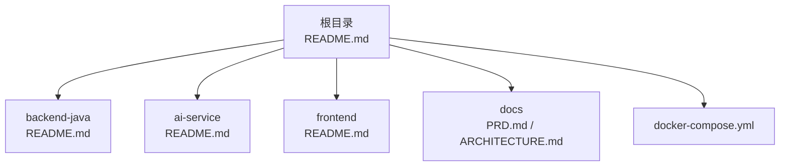
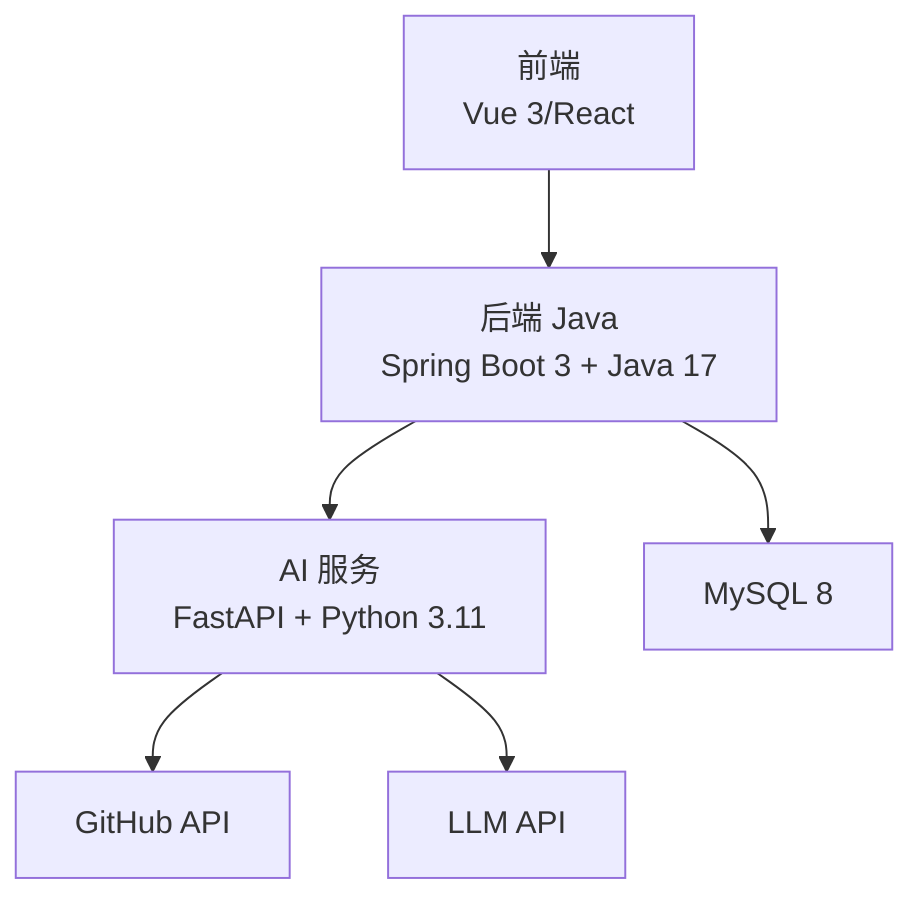
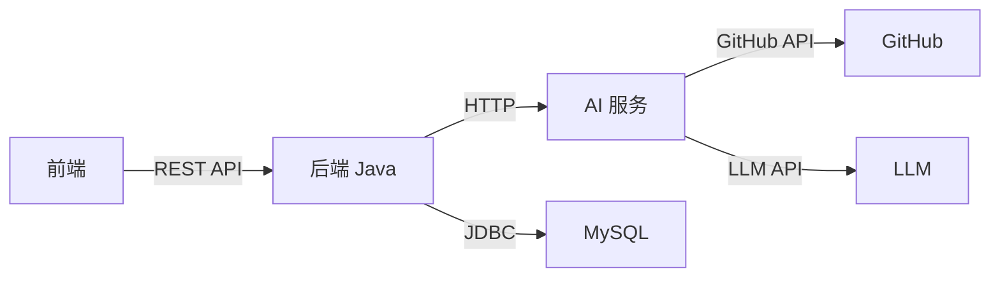

# 开发环境配置

<cite>
**本文引用的文件**
- [README.md](file://README.md)
- [docker-compose.yml](file://docker-compose.yml)
- [backend-java/README.md](file://backend-java/README.md)
- [frontend/README.md](file://frontend/README.md)
- [ai-service/README.md](file://ai-service/README.md)
- [docs/PRD.md](file://docs/PRD.md)
- [docs/ARCHITECTURE.md](file://docs/ARCHITECTURE.md)
</cite>

## 目录
1. [简介](#简介)
2. [项目结构](#项目结构)
3. [核心组件](#核心组件)
4. [架构总览](#架构总览)
5. [详细组件分析](#详细组件分析)
6. [依赖分析](#依赖分析)
7. [性能考虑](#性能考虑)
8. [故障排查指南](#故障排查指南)
9. [结论](#结论)
10. [附录](#附录)

## 简介
本指南面向 CodeReviewX 项目的开发环境搭建，涵盖必需的软件依赖（Java 17、Python 3.11、Node.js）、IDE 配置建议、环境变量与数据库连接设置、API 密钥管理、Docker 容器化开发方案，以及常见问题排查与解决方案。内容基于仓库中的技术规划文档与占位说明，确保读者能在 Round 01 基础上快速完成本地开发准备。

## 项目结构
- 仓库采用多模块结构，包含后端 Java、AI 服务（Python）、前端、文档与 CI 配置。
- Round 01 为工程骨架与文档阶段，实际业务代码将在后续轮次逐步实现。
- Docker Compose 为后续轮次的容器化部署预留了服务定义占位。

图表来源
- [README.md:58-82](file://README.md#L58-L82)
- [docker-compose.yml:1-14](file://docker-compose.yml#L1-L14)
- [backend-java/README.md:1-74](file://backend-java/README.md#L1-L74)
- [ai-service/README.md:1-86](file://ai-service/README.md#L1-L86)
- [frontend/README.md:1-63](file://frontend/README.md#L1-L63)
- [docs/PRD.md:1-218](file://docs/PRD.md#L1-L218)
- [docs/ARCHITECTURE.md:1-417](file://docs/ARCHITECTURE.md#L1-L417)

章节来源
- [README.md:58-82](file://README.md#L58-L82)
- [docker-compose.yml:1-14](file://docker-compose.yml#L1-L14)

## 核心组件
- 后端 Java（Spring Boot 3 + Java 17）：负责 ReviewTask 生命周期编排、REST API、MySQL 持久化、调用 ai-service。
- AI 服务（Python + FastAPI）：负责拉取 GitHub PR diff、标准化文件变更、执行 Semgrep、调用 mock/真实 LLM、返回结构化 Review JSON。
- 前端（Vue 3/React，TypeScript）：负责任务创建表单、任务列表与详情展示，仅与 backend-java 通信。
- 数据库（MySQL 8）：存储 ReviewTask、ReviewFileChange、ReviewIssue 等业务数据。

章节来源
- [README.md:47-56](file://README.md#L47-L56)
- [backend-java/README.md:28-39](file://backend-java/README.md#L28-L39)
- [ai-service/README.md:29-40](file://ai-service/README.md#L29-L40)
- [frontend/README.md:19-31](file://frontend/README.md#L19-L31)

## 架构总览
系统采用“前端 → 后端 Java → AI 服务 → GitHub API/LLM”的调用链路，数据库仅承载业务数据。各模块职责清晰，禁止越界调用。

图表来源
- [docs/ARCHITECTURE.md:19-52](file://docs/ARCHITECTURE.md#L19-L52)
- [docs/ARCHITECTURE.md:137-180](file://docs/ARCHITECTURE.md#L137-L180)

章节来源
- [docs/ARCHITECTURE.md:7-16](file://docs/ARCHITECTURE.md#L7-L16)
- [docs/ARCHITECTURE.md:19-52](file://docs/ARCHITECTURE.md#L19-L52)

## 详细组件分析

### 后端 Java（Spring Boot 3 + Java 17）
- 技术栈与版本
  - Java 17
  - Spring Boot 3.x
  - MyBatis-Plus 3.5.x
  - MySQL Connector 8.x
  - Spring WebClient
  - JUnit 5
  - Maven 3.8+
- 模块职责
  - ReviewTask 管理与状态流转（PENDING → RUNNING → SUCCESS/FAILED）
  - 对外提供 REST API（创建、查询任务）
  - MySQL 持久化（ReviewTask、ReviewFileChange、ReviewIssue）
  - 调用 ai-service 并落库结果
- IDE 配置建议
  - IntelliJ IDEA：启用 Lombok 插件（若使用）、Spring Assistant、MyBatisX、Database Tools
  - 代码风格：遵循 Spring Boot 默认规范，统一使用 UTF-8
  - 运行配置：为 Spring Boot 主类创建运行配置，设置 JVM 参数（如必要）
- 环境变量与数据库连接
  - 数据源 URL、用户名、密码
  - ai-service 基础地址（容器网络域名）
- Docker 开发要点
  - 服务端口：8080
  - 与 mysql、ai-service 通过服务名互联

章节来源
- [backend-java/README.md:28-39](file://backend-java/README.md#L28-L39)
- [backend-java/README.md:42-46](file://backend-java/README.md#L42-L46)
- [docs/ARCHITECTURE.md:347-354](file://docs/ARCHITECTURE.md#L347-L354)

### AI 服务（Python + FastAPI）
- 技术栈与版本
  - Python 3.11
  - FastAPI 0.100+
  - Pydantic v2
  - httpx
  - Semgrep（最新版）
  - pytest
  - uvicorn
- 模块职责
  - 拉取 GitHub PR diff 与变更文件列表
  - 标准化文件变更
  - 执行 Semgrep 并转换为 ReviewIssue
  - 调用 mock 或真实 LLM
  - 返回结构化 AnalyzeResponse
- API 密钥与配置
  - GitHub Token（用于访问公共/私有仓库）
  - LLM Provider（mock 或真实提供商）
  - LLM API Key（当使用真实提供商时）
  - Semgrep 超时秒数
- IDE 配置建议
  - VS Code：Python 扩展、Pylance、Black/Isort、flake8、Jupyter、Docker
  - PyCharm：专业版可选，便于调试与测试
- Docker 开发要点
  - 服务端口：8000
  - 与 GitHub API、LLM API 交互需配置网络与密钥

章节来源
- [ai-service/README.md:29-40](file://ai-service/README.md#L29-L40)
- [ai-service/README.md:19-26](file://ai-service/README.md#L19-L26)
- [docs/ARCHITECTURE.md:356-363](file://docs/ARCHITECTURE.md#L356-L363)

### 前端（Vue 3/React，TypeScript）
- 框架选择
  - Vue 3 或 React（TypeScript），最终以架构评审为准
- 模块职责
  - 任务创建表单（仓库 URL + PR 编号）
  - 任务列表与详情页
  - 渲染 Review 报告（summary、riskLevel、files、issues）
- 环境变量
  - VITE_API_BASE_URL：指向 backend-java 的后端基地址
- IDE 配置建议
  - VS Code：Vue/React 扩展、ESLint、Prettier、TypeScript TSServer、Docker
  - IntelliJ IDEA：Vue/React 插件、Node.js 支持
- Docker 开发要点
  - 服务端口：3000
  - 通过代理或 CORS 配置与 backend-java 通信

章节来源
- [frontend/README.md:19-31](file://frontend/README.md#L19-L31)
- [frontend/README.md:52-62](file://frontend/README.md#L52-L62)
- [docs/ARCHITECTURE.md:365-369](file://docs/ARCHITECTURE.md#L365-L369)

### 数据库（MySQL 8）
- 存储实体
  - ReviewTask：任务元数据与状态
  - ReviewFileChange：变更文件明细
  - ReviewIssue：问题条目（含类型、严重程度、来源）
- 连接配置
  - JDBC URL、用户名、密码
  - 与后端 Java 的连接字符串
- Docker 开发要点
  - 服务端口：3306
  - 初始化脚本与迁移（后续轮次）

章节来源
- [docs/PRD.md:125-169](file://docs/PRD.md#L125-L169)
- [docs/ARCHITECTURE.md:347-354](file://docs/ARCHITECTURE.md#L347-L354)

### Docker Compose（容器化开发）
- 当前状态
  - Round 01 为占位文件，未定义真实服务
- 预计服务与端口
  - frontend：3000
  - backend-java：8080
  - ai-service：8000
  - mysql：3306
- 开发建议
  - 使用独立网络，服务间通过服务名互联
  - 将敏感配置放入环境文件或 secrets（后续轮次）
  - 为各服务挂载必要的卷（日志、缓存、代码热更新）

章节来源
- [docker-compose.yml:1-14](file://docker-compose.yml#L1-L14)
- [docs/ARCHITECTURE.md:373-381](file://docs/ARCHITECTURE.md#L373-L381)

## 依赖分析
- 版本约束
  - Java：17
  - Python：3.11
  - Node.js：用于前端构建与开发（版本由前端框架决定）
- 组件耦合
  - 前端仅与后端 Java 通信
  - 后端 Java 仅调用 ai-service
  - ai-service 仅调用 GitHub API 与 LLM API
  - 数据库仅被后端 Java 使用
- 外部依赖
  - GitHub API（需要有效 Token）
  - LLM API（可 mock 替代）
  - Semgrep（本地安装或容器内执行）

图表来源
- [docs/ARCHITECTURE.md:137-180](file://docs/ARCHITECTURE.md#L137-L180)
- [docs/ARCHITECTURE.md:347-369](file://docs/ARCHITECTURE.md#L347-L369)

章节来源
- [docs/ARCHITECTURE.md:7-16](file://docs/ARCHITECTURE.md#L7-L16)
- [docs/ARCHITECTURE.md:347-369](file://docs/ARCHITECTURE.md#L347-L369)

## 性能考虑
- 本地开发优先保证可运行与可调试，避免引入复杂中间件。
- 任务状态流转为单向，减少回溯逻辑带来的开销。
- mock LLM 优先，降低真实 API 调用延迟与配额限制影响。
- 前端与后端分离，避免单体应用带来的冷启动与热更新成本。

## 故障排查指南
- 端口占用
  - 前端：确认 3000 端口可用；如冲突，调整前端端口或释放占用进程。
  - 后端：确认 8080 端口可用；如冲突，调整端口或释放占用进程。
  - AI 服务：确认 8000 端口可用。
  - 数据库：确认 3306 端口可用。
- 网络连通性
  - 后端无法访问 AI 服务：检查服务名与端口；确认容器网络或主机网络可达。
  - AI 服务无法访问 GitHub：检查 GITHUB_TOKEN 是否正确配置。
  - AI 服务无法访问 LLM：检查 LLM_PROVIDER 与 LLM_API_KEY；若使用 mock，确认开关正确。
- 数据库连接
  - 检查 JDBC URL、用户名、密码；确认数据库已启动且网络可达。
- 环境变量
  - 后端：SPRING_DATASOURCE_URL、SPRING_DATASOURCE_USERNAME、SPRING_DATASOURCE_PASSWORD、AI_SERVICE_BASE_URL。
  - AI 服务：GITHUB_TOKEN、LLM_PROVIDER、LLM_API_KEY、SEMGREP_TIMEOUT_SECONDS。
  - 前端：VITE_API_BASE_URL。
- Docker 相关
  - 服务未启动：检查 docker-compose.yml 中服务定义与镜像拉取状态。
  - 卷挂载问题：确认宿主机路径与容器内路径映射正确。
  - 网络隔离：确认服务在同一网络下可通过服务名互访。

章节来源
- [docs/ARCHITECTURE.md:345-370](file://docs/ARCHITECTURE.md#L345-L370)
- [docker-compose.yml:1-14](file://docker-compose.yml#L1-L14)

## 结论
本指南基于 Round 01 的技术规划，明确了 Java 17、Python 3.11、Node.js 的版本要求与 IDE 推荐，给出了环境变量、数据库连接与 API 密钥管理的配置要点，并提供了 Docker 容器化开发的实施建议与常见问题排查方法。随着后续轮次推进，各模块将逐步完善，建议持续关注文档更新并按阶段迭代开发环境。

## 附录
- 快速核对清单
  - 安装 Java 17、Python 3.11、Node.js（前端所需）
  - 配置后端 Java 环境变量（数据源、ai-service 基址）
  - 配置 AI 服务环境变量（GitHub Token、LLM Provider、Semgrep 超时）
  - 配置前端环境变量（VITE_API_BASE_URL）
  - 准备 MySQL 8 实例并确保连通
  - 使用 Docker Compose 启动服务（按端口与网络规划）
  - 如遇问题，对照故障排查章节逐项检查