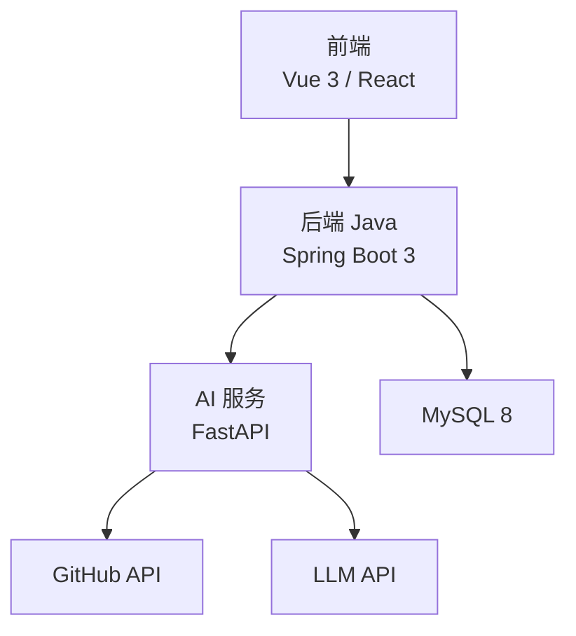
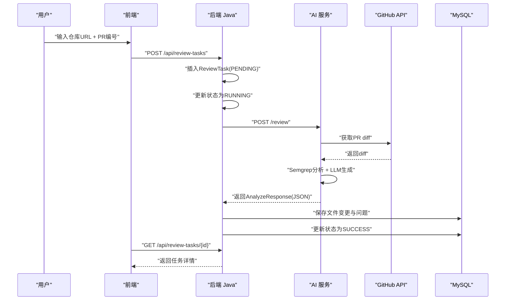
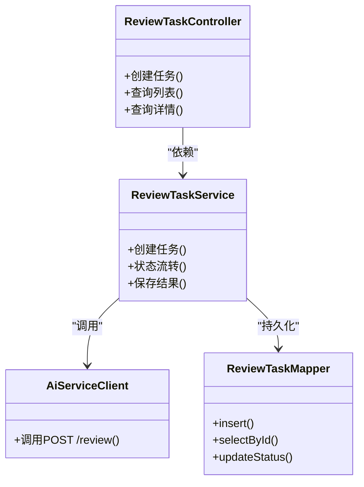
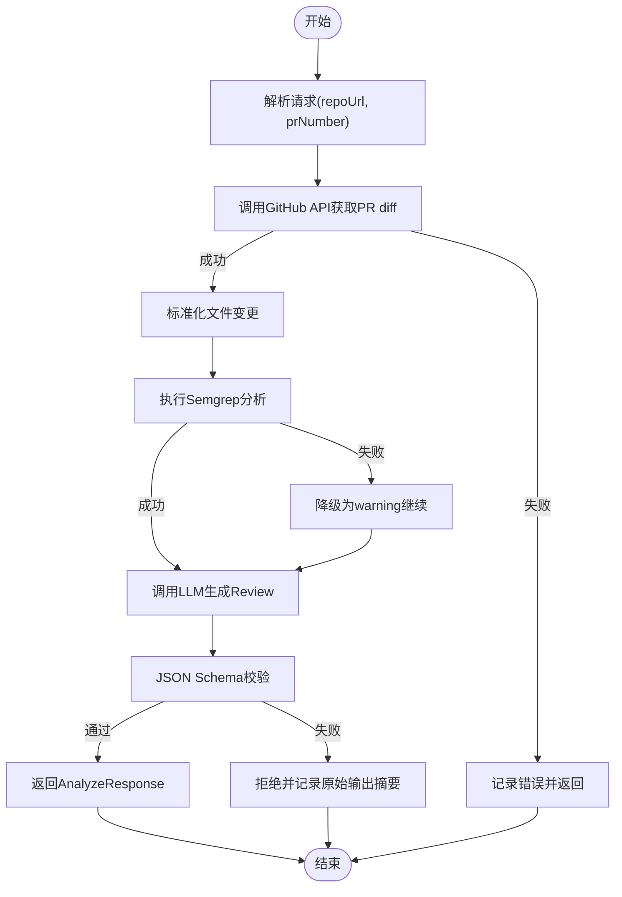
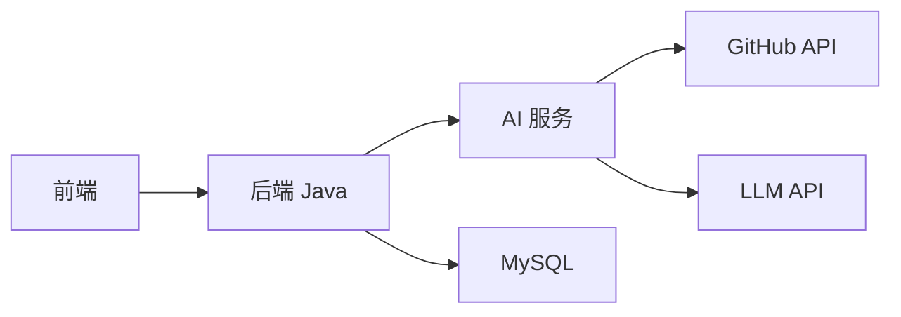

# 调试技巧与性能优化

<cite>
**本文引用的文件**
- [README.md](file://README.md)
- [ARCHITECTURE.md](file://docs/ARCHITECTURE.md)
- [API.md](file://docs/API.md)
- [DATABASE.md](file://docs/DATABASE.md)
- [docker-compose.yml](file://docker-compose.yml)
- [backend-java/README.md](file://backend-java/README.md)
- [ai-service/README.md](file://ai-service/README.md)
- [frontend/README.md](file://frontend/README.md)
</cite>

## 目录
1. [简介](#简介)
2. [项目结构](#项目结构)
3. [核心组件](#核心组件)
4. [架构总览](#架构总览)
5. [详细组件分析](#详细组件分析)
6. [依赖关系分析](#依赖关系分析)
7. [性能考量](#性能考量)
8. [故障排查指南](#故障排查指南)
9. [结论](#结论)
10. [附录](#附录)

## 简介
本指南面向 CodeReviewX 项目在 Round 01 阶段的调试与性能优化实践，聚焦后端服务（Spring Boot）、AI 服务（FastAPI）与前端三部分的调试方法、性能监控指标、内存泄漏检测与 API 性能分析，并提供常见问题诊断与生产环境应急响应流程。由于当前 Round 01 仍为工程骨架与文档阶段，本指南以“可调试性设计”和“未来实现”的最佳实践为主，便于后续 Round 逐步落地。

## 项目结构
- 后端 Java（Spring Boot 3 + Java 17）：负责 ReviewTask 生命周期编排、REST API、MySQL 持久化、调用 AI 服务。
- AI 服务（Python + FastAPI）：负责拉取 GitHub PR diff、执行 Semgrep、调用 LLM（mock/真实）、返回结构化 Review JSON。
- 前端（Vue 3 / React）：负责任务创建、任务列表、任务详情展示，仅与后端交互。
- 数据库（MySQL 8）：存储 ReviewTask、ReviewFileChange、ReviewIssue。

图表来源
- [ARCHITECTURE.md:19-52](file://docs/ARCHITECTURE.md#L19-L52)
- [backend-java/README.md:19-25](file://backend-java/README.md#L19-L25)
- [ai-service/README.md:19-26](file://ai-service/README.md#L19-L26)
- [frontend/README.md:25-31](file://frontend/README.md#L25-L31)

章节来源
- [README.md:58-82](file://README.md#L58-L82)
- [ARCHITECTURE.md:19-52](file://docs/ARCHITECTURE.md#L19-L52)

## 核心组件
- 后端 Java（backend-java）
  - 职责：ReviewTask 管理、REST API、MySQL 持久化、调用 AI 服务。
  - 技术栈：Java 17、Spring Boot 3、MyBatis-Plus、WebClient、JUnit 5、Maven。
- AI 服务（ai-service）
  - 职责：拉取 GitHub PR diff、标准化文件变更、执行 Semgrep、调用 LLM（mock/真实）、返回结构化 Review JSON。
  - 技术栈：Python 3.11、FastAPI、Pydantic、httpx、Semgrep、pytest、uvicorn。
- 前端（frontend）
  - 职责：任务创建、任务列表、任务详情展示，仅与后端交互。
  - 技术栈：Vue 3 / React（待定）、TypeScript（待定）、Vite（待定）。
- 数据库（MySQL 8）
  - 表：review_task、review_file_change、review_issue，支持状态、风险等级、问题分类与来源。

章节来源
- [backend-java/README.md:19-39](file://backend-java/README.md#L19-L39)
- [ai-service/README.md:19-40](file://ai-service/README.md#L19-L40)
- [frontend/README.md:19-38](file://frontend/README.md#L19-L38)
- [DATABASE.md:20-134](file://docs/DATABASE.md#L20-L134)

## 架构总览
系统采用“前端 -> 后端 -> AI 服务 -> GitHub API/LLM API -> MySQL”的调用链路。后端负责编排与持久化，AI 服务负责分析与聚合，前端负责展示。

图表来源
- [ARCHITECTURE.md:137-168](file://docs/ARCHITECTURE.md#L137-L168)
- [API.md:54-241](file://docs/API.md#L54-L241)
- [API.md:243-332](file://docs/API.md#L243-L332)

章节来源
- [ARCHITECTURE.md:137-181](file://docs/ARCHITECTURE.md#L137-L181)
- [API.md:54-332](file://docs/API.md#L54-L332)

## 详细组件分析

### 后端 Java 调试与性能优化
- 日志与可观测性
  - 使用统一错误响应格式，便于前端与日志检索。
  - 建议开启请求链路追踪（TraceId）与关键步骤日志（创建任务、调用 AI 服务、保存结果）。
- Spring Boot Actuator（建议）
  - 暴露健康检查、指标、线程池、HTTP 客户端统计等端点，辅助定位慢调用与资源瓶颈。
  - 配置端点暴露与鉴权，确保仅内部访问。
- 数据库与事务
  - 使用 MyBatis-Plus，注意批量写入与索引命中情况；对高频查询建立必要索引。
  - 控制单事务时长，避免长时间锁表。
- HTTP 客户端与超时
  - 使用 WebClient 配置连接池、超时与重试策略，避免阻塞与堆积。
- 并发与限流
  - 对外部调用（AI 服务、GitHub API）进行并发限制与熔断保护，防止雪崩。
- 内存与 GC
  - 关注大对象（diff patch）序列化/反序列化与临时缓冲区，避免频繁 Full GC。
- 单元测试与集成测试
  - 使用 JUnit 5 编写控制器、服务与客户端测试，模拟外部依赖。

图表来源
- [ARCHITECTURE.md:183-220](file://docs/ARCHITECTURE.md#L183-L220)
- [backend-java/README.md:19-25](file://backend-java/README.md#L19-L25)

章节来源
- [backend-java/README.md:19-39](file://backend-java/README.md#L19-L39)
- [ARCHITECTURE.md:183-231](file://docs/ARCHITECTURE.md#L183-L231)
- [API.md:41-51](file://docs/API.md#L41-L51)

### AI 服务调试与性能优化
- 日志与指标
  - 记录 GitHub 拉取耗时、Semgrep 执行耗时、LLM 调用耗时与 JSON 校验耗时。
  - 使用统一错误码与 recoverable 标识，区分可恢复与不可恢复错误。
- Mock 模式
  - 在 Round 03 引入 LLM_PROVIDER=mock，先验证端到端链路，再替换为真实 LLM。
- 资源与超时
  - 为 Semgrep 设置超时阈值，避免长时间阻塞；对 LLM 调用设置合理超时与重试。
- 并发与批处理
  - 对多文件 diff 的分析进行并发控制，避免 CPU/IO 抖动。
- 内存与 GC
  - 大 diff 的 patch 字段可能占用较多内存，建议分片处理或压缩存储（后续演进）。

图表来源
- [ARCHITECTURE.md:233-266](file://docs/ARCHITECTURE.md#L233-L266)
- [API.md:243-332](file://docs/API.md#L243-L332)

章节来源
- [ai-service/README.md:19-40](file://ai-service/README.md#L19-L40)
- [ARCHITECTURE.md:233-266](file://docs/ARCHITECTURE.md#L233-L266)
- [API.md:243-332](file://docs/API.md#L243-L332)

### 前端调试工具与性能优化
- 开发工具
  - 使用浏览器 DevTools 的 Network/Performance/Memory 面板定位慢请求、渲染卡顿与内存泄漏。
- API 调试
  - 使用 Postman 或 curl 直连后端 Java API，验证统一错误响应与数据结构。
- 环境变量
  - VITE_API_BASE_URL 控制后端基地址，确保本地与容器网络一致。
- 渲染优化
  - 列表虚拟滚动、图片懒加载、按需渲染；减少不必要的重渲染。
- 缓存与离线
  - 对任务列表与详情进行缓存，提升二次打开体验。

章节来源
- [frontend/README.md:52-63](file://frontend/README.md#L52-L63)
- [API.md:54-241](file://docs/API.md#L54-L241)

## 依赖关系分析
- 后端依赖 AI 服务（内部 API），不直接依赖 GitHub API 或 LLM。
- AI 服务依赖 GitHub API 与 LLM API，不直接写数据库。
- 前端仅依赖后端 Java 的 REST API。
- 数据库为共享存储，遵循 MyBatis-Plus 映射规则。

图表来源
- [ARCHITECTURE.md:19-52](file://docs/ARCHITECTURE.md#L19-L52)
- [API.md:54-241](file://docs/API.md#L54-L241)
- [API.md:243-332](file://docs/API.md#L243-L332)

章节来源
- [ARCHITECTURE.md:56-107](file://docs/ARCHITECTURE.md#L56-L107)
- [API.md:54-332](file://docs/API.md#L54-L332)

## 性能考量
- 指标建议
  - 后端：请求延迟、吞吐、错误率、Active Connections、GC 次数与停顿时间、线程池排队长度。
  - AI 服务：GitHub 拉取耗时、Semgrep 执行耗时、LLM 调用耗时、JSON 校验耗时、CPU/内存使用。
  - 前端：首屏渲染时间、交互响应时间、内存峰值、FPS。
- 内存泄漏检测
  - 使用浏览器 Memory 面板抓取堆快照对比，定位未释放的对象引用。
  - 后端使用 JVM 堆分析工具（如 JFR/JProfiler）观察对象存活与回收行为。
- API 性能分析
  - 使用压测工具（如 k6/JMeter）对关键端点（创建任务、查询详情）施压，识别瓶颈。
  - 关注慢查询与慢外部调用，优化索引与超时策略。
- 存储与 IO
  - 大量 patch 文本写入时关注磁盘 IO 与索引写入开销，必要时调整字段类型或分表策略。

章节来源
- [API.md:41-51](file://docs/API.md#L41-L51)
- [DATABASE.md:288-294](file://docs/DATABASE.md#L288-L294)

## 故障排查指南
- 常见问题与诊断
  - GitHub API 失败：检查凭据与网络连通性，确认 PR 是否存在与可见性。
  - Semgrep 失败：查看执行日志与超时配置，必要时降级为 warning。
  - LLM 失败：启用 mock fallback，记录原始输出摘要，避免返回未校验结构。
  - 数据库写入失败：检查连接、权限与事务一致性，定位慢事务。
  - AI 服务超时：增加超时阈值与重试次数，必要时扩容或限流。
- 统一错误响应
  - 后端 Java：INVALID_REQUEST、TASK_NOT_FOUND、AI_SERVICE_ERROR、GITHUB_FETCH_FAILED、DATABASE_ERROR、INTERNAL_ERROR。
  - AI 服务：GITHUB_FETCH_FAILED、PR_NOT_FOUND、SEMGREP_FAILED、LLM_FAILED、INVALID_REQUEST。
- 生产应急流程（建议）
  - 快速隔离：对失败率高的端点/上游服务进行熔断与限流。
  - 降级策略：启用 mock LLM、关闭非关键分析、返回简化响应。
  - 回滚与灰度：回滚到上一个稳定版本，灰度发布新版本。
  - 事后复盘：输出根因分析与改进措施，完善监控与告警。

章节来源
- [ARCHITECTURE.md:170-180](file://docs/ARCHITECTURE.md#L170-L180)
- [API.md:41-51](file://docs/API.md#L41-L51)
- [API.md:323-332](file://docs/API.md#L323-L332)

## 结论
在 Round 01 阶段，项目以“可调试性优先”为核心设计原则。建议尽快在各模块引入统一日志、指标与错误响应，完善 Mock 流水线与压测方案，为后续 Round 的真实集成打下坚实基础。随着业务推进，逐步引入 Spring Boot Actuator、Prometheus/Grafana、JVM 分析工具与前端性能分析平台，持续优化端到端性能与稳定性。

## 附录
- 环境与部署
  - 本地开发与容器化：基于 docker-compose.yml 定义的服务与端口，确保服务间网络互通。
- API 参考
  - 前端 -> 后端：POST /api/review-tasks、GET /api/review-tasks、GET /api/review-tasks/{id}。
  - 后端 -> AI：POST /review。
- 数据库参考
  - review_task、review_file_change、review_issue 的字段与索引设计。

章节来源
- [docker-compose.yml:7-13](file://docker-compose.yml#L7-L13)
- [API.md:54-241](file://docs/API.md#L54-L241)
- [API.md:243-332](file://docs/API.md#L243-L332)
- [DATABASE.md:20-134](file://docs/DATABASE.md#L20-L134)