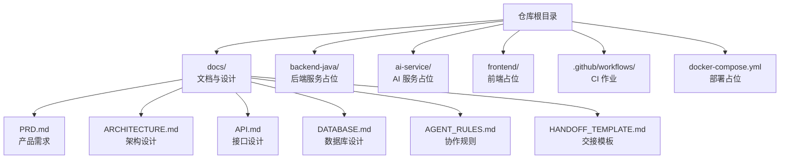
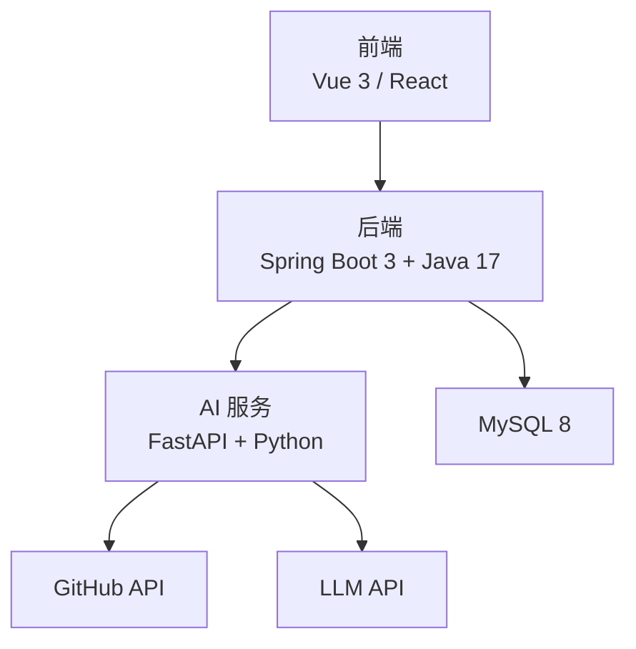
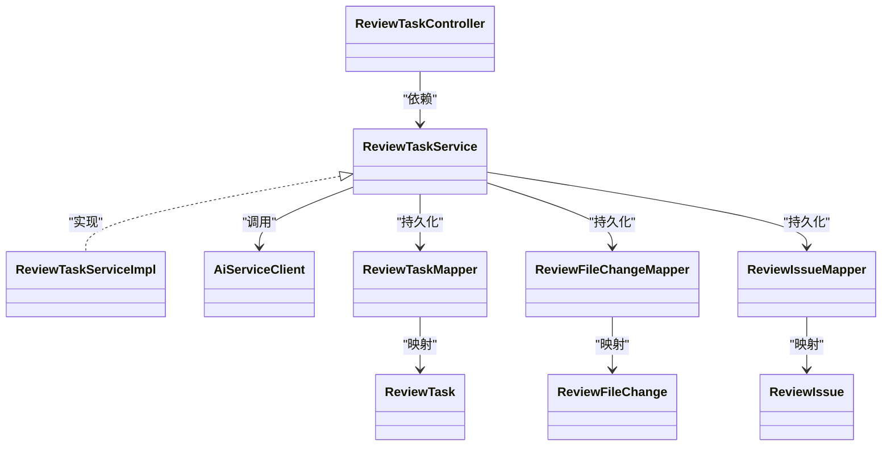
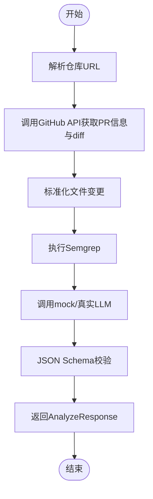
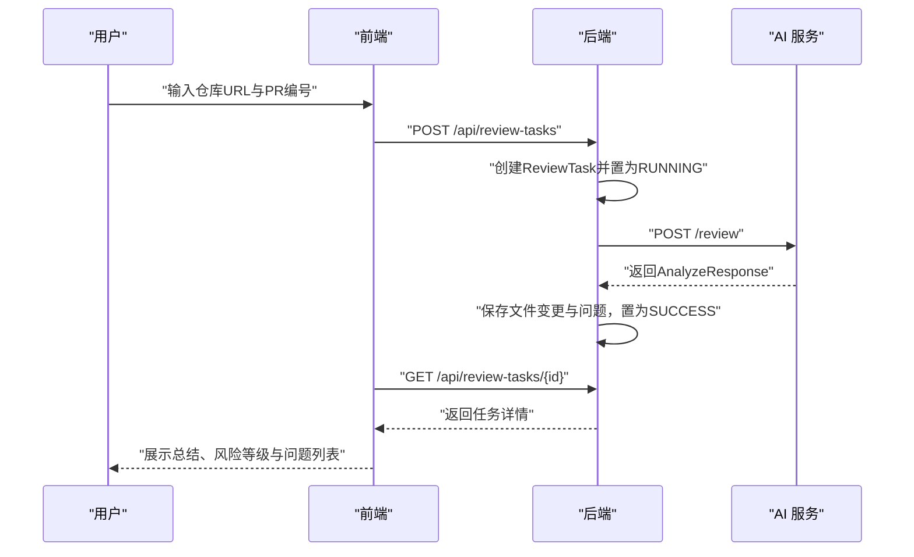
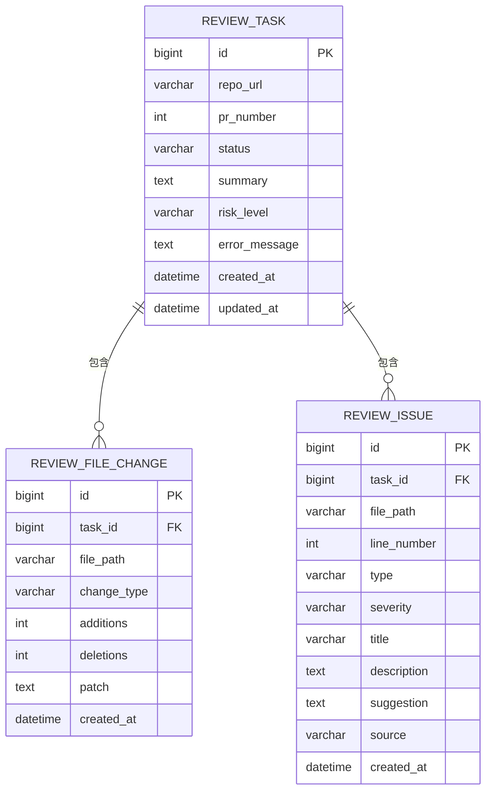
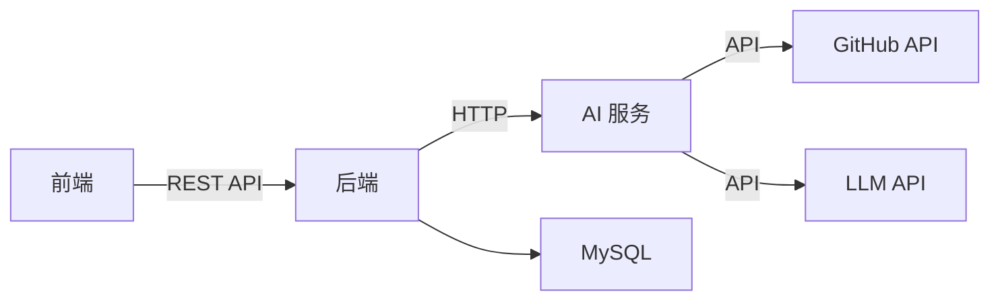

# 贡献指南

<cite>
**本文引用的文件**
- [README.md](file://README.md)
- [.github/workflows/ci.yml](file://.github/workflows/ci.yml)
- [docs/PRD.md](file://docs/PRD.md)
- [docs/ARCHITECTURE.md](file://docs/ARCHITECTURE.md)
- [docs/API.md](file://docs/API.md)
- [docs/DATABASE.md](file://docs/DATABASE.md)
- [docs/AGENT_RULES.md](file://docs/AGENT_RULES.md)
- [docs/HANDOFF_TEMPLATE.md](file://docs/HANDOFF_TEMPLATE.md)
- [docker-compose.yml](file://docker-compose.yml)
- [backend-java/README.md](file://backend-java/README.md)
- [ai-service/README.md](file://ai-service/README.md)
- [frontend/README.md](file://frontend/README.md)
</cite>

## 目录
1. [简介](#简介)
2. [项目结构](#项目结构)
3. [核心组件](#核心组件)
4. [架构总览](#架构总览)
5. [详细组件分析](#详细组件分析)
6. [依赖关系分析](#依赖关系分析)
7. [性能考量](#性能考量)
8. [故障排查指南](#故障排查指南)
9. [结论](#结论)
10. [附录](#附录)

## 简介
本指南面向希望参与 CodeReviewX 项目的贡献者，系统阐述如何参与开源贡献、代码提交流程与 Pull Request 规范，以及 Issue 报告模板、功能请求流程与 Bug 报告标准。同时提供新贡献者的入门指导、开发环境搭建建议与首次贡献建议，并明确社区行为准则、沟通渠道与维护者联系方式。

## 项目结构
CodeReviewX 采用多模块分层架构，围绕 GitHub Pull Request 的智能代码审查与修复建议展开。当前 Round 01 重点在于建立工程骨架、文档体系与协作规则，业务代码尚未实现，CI 作业仅进行仓库结构验证。

图表来源
- [README.md:58-82](file://README.md#L58-L82)
- [docs/PRD.md:1-218](file://docs/PRD.md#L1-L218)
- [docs/ARCHITECTURE.md:19-52](file://docs/ARCHITECTURE.md#L19-L52)
- [.github/workflows/ci.yml:1-58](file://.github/workflows/ci.yml#L1-L58)
- [docker-compose.yml:1-14](file://docker-compose.yml#L1-L14)

章节来源
- [README.md:58-120](file://README.md#L58-L120)
- [docs/PRD.md:1-218](file://docs/PRD.md#L1-L218)
- [.github/workflows/ci.yml:1-58](file://.github/workflows/ci.yml#L1-L58)
- [docker-compose.yml:1-14](file://docker-compose.yml#L1-L14)

## 核心组件
- 后端服务（backend-java）：Spring Boot 3 + Java 17，负责 ReviewTask 生命周期管理、REST API、MySQL 持久化与调用 ai-service。
- AI 服务（ai-service）：Python + FastAPI，负责 GitHub diff 拉取、Semgrep 执行、LLM 分析与结构化 JSON 输出。
- 前端（frontend）：Vue 3 或 React，负责任务创建、列表与详情展示。
- 数据库（MySQL 8）：存储任务、文件变更与问题记录。
- CI（GitHub Actions）：Round 01 的 CI 仅验证仓库结构与禁止业务代码混入。

章节来源
- [backend-java/README.md:1-74](file://backend-java/README.md#L1-L74)
- [ai-service/README.md:1-86](file://ai-service/README.md#L1-L86)
- [frontend/README.md:1-63](file://frontend/README.md#L1-L63)
- [docs/ARCHITECTURE.md:19-52](file://docs/ARCHITECTURE.md#L19-L52)
- [.github/workflows/ci.yml:14-58](file://.github/workflows/ci.yml#L14-L58)

## 架构总览
系统遵循“后端编排 + AI 分析 + 前端展示”的分层设计，严格限制各模块职责边界，确保第一阶段的可运行性与可演示性。

图表来源
- [docs/ARCHITECTURE.md:19-52](file://docs/ARCHITECTURE.md#L19-L52)
- [docs/ARCHITECTURE.md:345-381](file://docs/ARCHITECTURE.md#L345-L381)

章节来源
- [docs/ARCHITECTURE.md:7-16](file://docs/ARCHITECTURE.md#L7-L16)
- [docs/ARCHITECTURE.md:56-107](file://docs/ARCHITECTURE.md#L56-L107)

## 详细组件分析

### 后端服务（backend-java）
- 职责边界：仅负责业务编排、数据持久化与对外 API，不直接执行 Semgrep、编写 LLM Prompt 或解析复杂 diff。
- 技术栈：Java 17、Spring Boot 3、MyBatis-Plus、MySQL Connector、JUnit 5、Maven。
- 目录结构（未来）：controller、service、client、mapper、entity、dto、enums、exception、config。
- 状态机：PENDING → RUNNING → SUCCESS 或 FAILED，失败时记录可读错误信息。

图表来源
- [docs/ARCHITECTURE.md:183-230](file://docs/ARCHITECTURE.md#L183-L230)
- [docs/ARCHITECTURE.md:233-266](file://docs/ARCHITECTURE.md#L233-L266)

章节来源
- [backend-java/README.md:19-46](file://backend-java/README.md#L19-L46)
- [docs/ARCHITECTURE.md:73-90](file://docs/ARCHITECTURE.md#L73-L90)

### AI 服务（ai-service）
- 职责边界：仅负责 GitHub 数据获取、Semgrep 执行与 LLM 分析，不直接写数据库、不管理任务状态。
- 技术栈：Python 3.11、FastAPI、Pydantic、httpx、pytest、uvicorn。
- 目录结构（未来）：api、core、schemas、services、prompts、validators、utils。
- Mock 模式：在 Round 03 使用 mock LLM，随后再接入真实 LLM。

图表来源
- [ai-service/README.md:19-26](file://ai-service/README.md#L19-L26)
- [docs/ARCHITECTURE.md:90-107](file://docs/ARCHITECTURE.md#L90-L107)

章节来源
- [ai-service/README.md:19-47](file://ai-service/README.md#L19-L47)
- [docs/ARCHITECTURE.md:90-107](file://docs/ARCHITECTURE.md#L90-L107)

### 前端（frontend）
- 职责边界：仅调用后端 API，不直接调用 ai-service、GitHub API 或 LLM。
- 页面规划：任务创建、任务列表、任务详情。
- API 通信：POST /api/review-tasks、GET /api/review-tasks、GET /api/review-tasks/{id}。

图表来源
- [docs/API.md:54-241](file://docs/API.md#L54-L241)
- [docs/ARCHITECTURE.md:137-181](file://docs/ARCHITECTURE.md#L137-L181)

章节来源
- [frontend/README.md:25-39](file://frontend/README.md#L25-L39)
- [docs/API.md:54-241](file://docs/API.md#L54-L241)

### 数据库（MySQL 8）
- 表结构：review_task、review_file_change、review_issue。
- 约束与索引：主键、外键、状态与时间索引。
- 实体映射：MyBatis-Plus 使用 snake_case 与 camelCase 映射。

图表来源
- [docs/DATABASE.md:20-134](file://docs/DATABASE.md#L20-L134)

章节来源
- [docs/DATABASE.md:20-134](file://docs/DATABASE.md#L20-L134)

## 依赖关系分析
- 模块耦合：前端仅依赖后端；后端仅依赖 AI 服务与数据库；AI 服务仅依赖 GitHub API 与 LLM API。
- 外部依赖：GitHub API、LLM API、Semgrep CLI、MySQL。
- CI 依赖：GitHub Actions、Docker Compose（占位）。

图表来源
- [docs/ARCHITECTURE.md:19-52](file://docs/ARCHITECTURE.md#L19-L52)
- [docs/ARCHITECTURE.md:345-381](file://docs/ARCHITECTURE.md#L345-L381)

章节来源
- [docs/ARCHITECTURE.md:19-52](file://docs/ARCHITECTURE.md#L19-L52)

## 性能考量
- Round 01 不引入复杂架构（Redis、消息队列、Kubernetes、向量数据库），确保本地可运行、可调试、可演示。
- Mock 首先、真实 LLM 后接入，降低外部依赖带来的性能波动。
- 数据库层面使用索引优化常见查询（状态、创建时间、严重程度、类型）。

章节来源
- [docs/ARCHITECTURE.md:407-417](file://docs/ARCHITECTURE.md#L407-L417)
- [docs/DATABASE.md:137-199](file://docs/DATABASE.md#L137-L199)

## 故障排查指南
- CI 结构检查失败：确认必需文件存在且 Round 01 未包含业务源代码。
- 环境变量与端口：根据文档配置 .env.example 并核对 docker-compose 端口映射。
- API 错误码：对照统一错误响应格式与错误码定义定位问题。

章节来源
- [.github/workflows/ci.yml:14-58](file://.github/workflows/ci.yml#L14-L58)
- [docs/API.md:31-51](file://docs/API.md#L31-L51)
- [docs/ARCHITECTURE.md:312-342](file://docs/ARCHITECTURE.md#L312-L342)

## 结论
本指南基于 Round 01 的工程骨架与协作规则，明确了贡献流程、职责边界与质量标准。随着后续轮次推进，业务代码与 CI 将逐步完善，贡献者可在既定文档与规则下高效协作。

## 附录

### 一、贡献者入门与首次贡献建议
- 阅读并理解项目定位、PRD、架构设计与协作规则。
- 选择合适的 Agent 角色与任务范围（Cursor/Codex/Qoder），遵循“文档先行、MVP 优先、Mock 先行”原则。
- 遵循文件命名与格式约定（Markdown），严格控制作用域，避免引入未批准的技术或依赖。
- 提交前完成必要的安全检查与合规性核验。

章节来源
- [docs/PRD.md:1-218](file://docs/PRD.md#L1-L218)
- [docs/AGENT_RULES.md:1-160](file://docs/AGENT_RULES.md#L1-L160)
- [docs/HANDOFF_TEMPLATE.md:1-128](file://docs/HANDOFF_TEMPLATE.md#L1-L128)

### 二、开发环境搭建（建议）
- 准备本地开发环境：安装 Git、Docker、Docker Compose、JDK 17、Python 3.11、Node.js（前端）。
- 克隆仓库并查看占位文件，按模块 README 了解未来目录结构与技术栈。
- 参考 docker-compose.yml 的占位注释，准备后续服务定义。
- 配置 .env.example 中的占位变量，确保不提交敏感信息。

章节来源
- [backend-java/README.md:28-39](file://backend-java/README.md#L28-L39)
- [ai-service/README.md:29-40](file://ai-service/README.md#L29-L40)
- [frontend/README.md:19-22](file://frontend/README.md#L19-L22)
- [docker-compose.yml:1-14](file://docker-compose.yml#L1-L14)

### 三、代码提交流程与 Pull Request 规范
- 分支策略：基于 main 分支创建特性分支，遵循任务命名规范。
- 提交信息：简明扼要描述变更内容，引用相关 Issue 或任务。
- PR 要求：附上变更说明、影响范围与测试要点；确保 CI 结构检查通过。
- 合并与发布：由维护者审核，遵循 ChatGPT Architect 的最终决策。

章节来源
- [docs/AGENT_RULES.md:35-58](file://docs/AGENT_RULES.md#L35-L58)
- [.github/workflows/ci.yml:14-41](file://.github/workflows/ci.yml#L14-L41)

### 四、Issue 报告模板与流程
- Bug 报告模板（建议）
  - 标题：简洁描述问题
  - 复现步骤：最小可复现步骤
  - 期望行为：预期结果
  - 实际行为：实际结果
  - 环境信息：操作系统、浏览器、后端/前端版本
  - 日志与截图：便于复现与定位
- 功能请求流程
  - 在 PRD 与架构文档范围内提出，经 ChatGPT Architect 评估后更新文档再实现。
- Bug 报告标准
  - 提供清晰的复现路径与上下文
  - 附带日志片段与错误码
  - 明确影响范围与严重程度

章节来源
- [docs/PRD.md:210-218](file://docs/PRD.md#L210-L218)
- [docs/ARCHITECTURE.md:312-342](file://docs/ARCHITECTURE.md#L312-L342)

### 五、社区行为准则与沟通渠道
- 行为准则
  - 尊重他人，保持开放与包容
  - 遵守安全规则：不提交凭据、不泄露令牌
  - 严格遵守 Agent 协作边界与文件格式约定
- 沟通渠道
  - GitHub Issues：功能请求与 Bug 报告
  - ChatGPT Architect：需求变更与架构决策
  - 交接与评审：通过 Handoff Report 与 Review Report 流转
- 维护者联系方式
  - 项目负责人与架构负责人详见 PRD 文档信息

章节来源
- [docs/AGENT_RULES.md:152-160](file://docs/AGENT_RULES.md#L152-L160)
- [docs/PRD.md:11-23](file://docs/PRD.md#L11-L23)