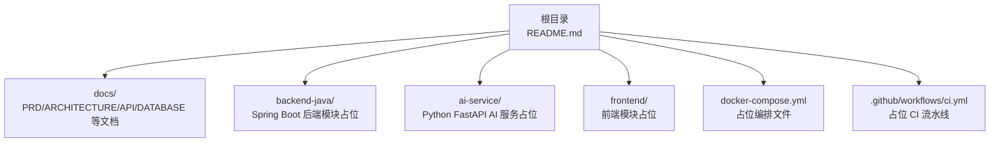
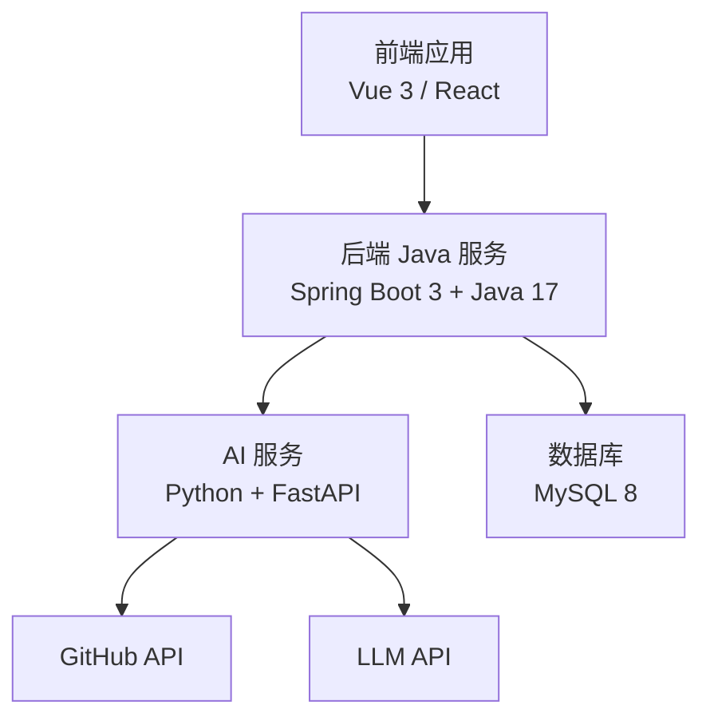
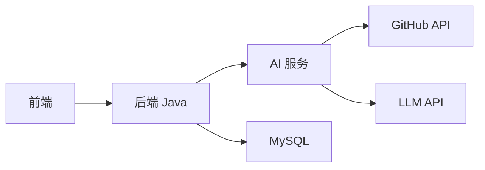

# 快速开始

<cite>
**本文引用的文件**
- [README.md](file://README.md)
- [docker-compose.yml](file://docker-compose.yml)
- [backend-java/README.md](file://backend-java/README.md)
- [ai-service/README.md](file://ai-service/README.md)
- [frontend/README.md](file://frontend/README.md)
- [docs/ARCHITECTURE.md](file://docs/ARCHITECTURE.md)
- [docs/API.md](file://docs/API.md)
- [docs/DATABASE.md](file://docs/DATABASE.md)
- [.github/workflows/ci.yml](file://.github/workflows/ci.yml)
- [tasks/round-01/01-cursor-repository-foundation.md](file://tasks/round-01/01-cursor-repository-foundation.md)
- [tasks/round-01/02-codex-repository-validation.md](file://tasks/round-01/02-codex-repository-validation.md)
</cite>

## 目录
1. [简介](#简介)
2. [项目结构](#项目结构)
3. [核心组件](#核心组件)
4. [架构总览](#架构总览)
5. [详细组件分析](#详细组件分析)
6. [依赖关系分析](#依赖关系分析)
7. [性能注意事项](#性能注意事项)
8. [故障排查指南](#故障排查指南)
9. [结论](#结论)
10. [附录](#附录)

## 简介
本指南面向新手开发者，帮助你在约 30 分钟内完成 CodeReviewX 项目的本地环境准备与基础验证。由于 Round 01 仍处于“工程骨架与文档”阶段，当前仓库不包含任何业务代码，但已提供完整的模块结构、文档、占位配置与部署说明，便于你理解系统设计并在后续轮次中快速落地。

## 项目结构
仓库采用多模块组织方式，围绕“后端 Java 服务 + AI 服务 + 前端应用 + 数据库”的分层设计展开。各模块职责清晰，通过统一的文档与接口契约进行协作。

图表来源
- [README.md:58-82](file://README.md#L58-L82)
- [docker-compose.yml:1-14](file://docker-compose.yml#L1-L14)
- [.github/workflows/ci.yml:1-58](file://.github/workflows/ci.yml#L1-L58)

章节来源
- [README.md:58-82](file://README.md#L58-L82)
- [docker-compose.yml:1-14](file://docker-compose.yml#L1-L14)
- [.github/workflows/ci.yml:1-58](file://.github/workflows/ci.yml#L1-L58)

## 核心组件
- 后端 Java 服务（Spring Boot 3 + Java 17）：负责任务生命周期管理、REST API、MySQL 持久化、调用 AI 服务。
- AI 服务（Python + FastAPI）：负责拉取 GitHub PR diff、执行 Semgrep、调用 LLM、返回结构化 Review JSON。
- 前端应用（Vue 3 / React）：负责任务创建、任务列表与详情展示。
- 数据库（MySQL 8）：存储任务、文件变更与问题记录。

章节来源
- [backend-java/README.md:19-39](file://backend-java/README.md#L19-L39)
- [ai-service/README.md:19-39](file://ai-service/README.md#L19-L39)
- [frontend/README.md:25-39](file://frontend/README.md#L25-L39)
- [docs/ARCHITECTURE.md:19-52](file://docs/ARCHITECTURE.md#L19-L52)

## 架构总览
系统采用“前端 -> 后端 -> AI 服务 -> GitHub API/LLM”的调用链路，数据库仅承担业务数据存储职责。第一阶段严格限制复杂度，优先保证本地可运行、可调试、可演示。

图表来源
- [docs/ARCHITECTURE.md:19-52](file://docs/ARCHITECTURE.md#L19-L52)

章节来源
- [docs/ARCHITECTURE.md:7-16](file://docs/ARCHITECTURE.md#L7-L16)
- [docs/ARCHITECTURE.md:19-52](file://docs/ARCHITECTURE.md#L19-L52)

## 详细组件分析

### 后端 Java 服务（backend-java）
- 职责边界：任务生命周期编排、REST API、MySQL 持久化、调用 AI 服务。
- 技术栈：Java 17、Spring Boot 3、MyBatis-Plus、MySQL Connector、WebClient、JUnit 5、Maven。
- 目录结构（未来轮次）：src/main/java/com/codereviewx/backend 下按 controller/service/client/mapper/entity/dto/enums/exception/config 分层组织。

章节来源
- [backend-java/README.md:19-74](file://backend-java/README.md#L19-L74)
- [docs/ARCHITECTURE.md:156-203](file://docs/ARCHITECTURE.md#L156-L203)

### AI 服务（ai-service）
- 职责边界：拉取 GitHub PR diff、标准化文件变更、执行 Semgrep、调用 mock/真实 LLM、返回结构化 Review JSON。
- 技术栈：Python 3.11、FastAPI、Pydantic、httpx、Semgrep、pytest、uvicorn。
- 目录结构（未来轮次）：app/main.py、app/api、app/core、app/schemas、app/services、app/prompts、app/validators、app/utils。

章节来源
- [ai-service/README.md:19-86](file://ai-service/README.md#L19-L86)
- [docs/ARCHITECTURE.md:206-240](file://docs/ARCHITECTURE.md#L206-L240)

### 前端应用（frontend）
- 职责边界：任务创建表单、任务列表、任务详情与报告展示；仅与后端 Java 通信。
- 页面规划：/（创建任务）、/tasks（任务列表）、/tasks/:id（任务详情）。
- API 交互：POST /api/review-tasks、GET /api/review-tasks、GET /api/review-tasks/{id}。

章节来源
- [frontend/README.md:25-63](file://frontend/README.md#L25-L63)
- [docs/API.md:54-241](file://docs/API.md#L54-L241)

### 数据库设计（MySQL 8）
- 表结构：review_task、review_file_change、review_issue。
- 约束与枚举：TaskStatus、RiskLevel、IssueType、IssueSeverity、ChangeType、IssueSource。
- ORM 映射：MyBatis-Plus，数据库 snake_case 与 Java camelCase 映射。

章节来源
- [docs/DATABASE.md:20-135](file://docs/DATABASE.md#L20-L135)
- [docs/DATABASE.md:203-254](file://docs/DATABASE.md#L203-L254)
- [docs/DATABASE.md:257-284](file://docs/DATABASE.md#L257-L284)

### 环境准备与本地开发流程

#### 1) 环境准备
- Java 17
  - 下载与安装：从官方 JDK 网站获取对应平台的 Java 17 安装包并完成安装。
  - 验证：打开终端执行命令以确认版本。
- Python 3.11
  - 下载与安装：从 Python 官网获取对应平台的 Python 3.11 安装包并完成安装。
  - 验证：打开终端执行命令以确认版本。
- Node.js（用于前端本地开发）
  - 下载与安装：从 Node.js 官网获取 LTS 版本并完成安装。
  - 验证：打开终端执行命令以确认版本。
- Docker（用于容器化本地开发）
  - 下载与安装：从 Docker 官网获取对应平台的 Docker Desktop 并完成安装。
  - 验证：打开终端执行命令以确认 Docker 服务可用。

章节来源
- [backend-java/README.md:32](file://backend-java/README.md#L32)
- [ai-service/README.md:33](file://ai-service/README.md#L33)
- [frontend/README.md:21](file://frontend/README.md#L21)
- [docker-compose.yml:7-11](file://docker-compose.yml#L7-L11)

#### 2) 项目克隆与依赖安装
- 项目克隆
  - 使用 Git 将仓库克隆到本地，然后进入项目根目录。
- 依赖安装（按模块）
  - 后端 Java：使用 Maven 构建工具（如需构建，可在后续轮次中添加 pom.xml）。
  - AI 服务：使用 Python 3.11，安装依赖（如需安装，可在后续轮次中添加 requirements.txt）。
  - 前端：使用 Node.js，安装依赖（如需安装，可在后续轮次中添加 package.json）。
- 环境变量配置
  - 复制示例环境文件并根据需要填写占位变量（如数据库连接、AI 服务地址、GitHub Token 等）。

章节来源
- [README.md:15-25](file://README.md#L15-L25)
- [docs/ARCHITECTURE.md:318-343](file://docs/ARCHITECTURE.md#L318-L343)

#### 3) 本地开发环境搭建（基于占位配置）
- Docker Compose 占位
  - 当前 docker-compose.yml 为空服务定义，后续轮次将逐步添加后端、AI 服务、前端与数据库服务。
- 本地启动顺序（概念性说明）
  - 数据库：启动 MySQL 8（可使用 Docker Compose 在后续轮次中定义服务）。
  - AI 服务：启动 Python FastAPI 服务（端口由占位文档定义）。
  - 后端 Java：启动 Spring Boot 应用（端口由占位文档定义）。
  - 前端：启动 Vue/React 应用（端口由占位文档定义）。
- 服务端口（占位）
  - 前端：3000
  - 后端 Java：8080
  - AI 服务：8000
  - 数据库：3306

章节来源
- [docker-compose.yml:1-14](file://docker-compose.yml#L1-L14)
- [docs/ARCHITECTURE.md:346-354](file://docs/ARCHITECTURE.md#L346-L354)

#### 4) 基本使用示例：创建第一个代码审查任务
- 前端交互（概念性说明）
  - 在前端页面输入 GitHub 仓库地址与 PR 编号，提交后触发后端创建任务。
- 后端处理（概念性说明）
  - 后端接收请求，创建 ReviewTask，状态置为 PENDING -> RUNNING，随后调用 AI 服务。
- AI 服务处理（概念性说明）
  - AI 服务拉取 PR diff、执行 Semgrep、调用 LLM，返回结构化 Review JSON。
- 数据持久化（概念性说明）
  - 后端保存文件变更与问题记录，更新任务状态为 SUCCESS，并提供查询接口。
- 查询结果（概念性说明）
  - 前端调用后端接口获取任务详情，展示总结、风险等级与问题列表。

章节来源
- [docs/ARCHITECTURE.md:110-142](file://docs/ARCHITECTURE.md#L110-L142)
- [docs/API.md:54-241](file://docs/API.md#L54-L241)

## 依赖关系分析
- 模块耦合
  - 前端仅与后端 Java 通信，后端仅与 AI 服务通信，AI 服务仅与 GitHub API/LLM 通信，数据库仅承载业务数据。
- 外部依赖
  - Java 生态：Spring Boot、MyBatis-Plus、MySQL Connector。
  - Python 生态：FastAPI、Pydantic、httpx、Semgrep、pytest、uvicorn。
  - 前端生态：Vue 3 或 React（框架选择将在后续轮次确定）。
- 环境依赖
  - Docker（容器化部署与本地开发）。
  - GitHub API（用于拉取 PR diff）。
  - LLM API（用于生成结构化 Review）。

图表来源
- [docs/ARCHITECTURE.md:19-52](file://docs/ARCHITECTURE.md#L19-L52)

章节来源
- [docs/ARCHITECTURE.md:7-16](file://docs/ARCHITECTURE.md#L7-L16)
- [backend-java/README.md:32-39](file://backend-java/README.md#L32-L39)
- [ai-service/README.md:33-40](file://ai-service/README.md#L33-L40)
- [frontend/README.md:21](file://frontend/README.md#L21)

## 性能注意事项
- Round 01 为文档与骨架阶段，暂无性能优化实现。
- 后续轮次中，建议关注：
  - AI 服务超时控制与降级策略（Semgrep/Llm 失败时的降级处理）。
  - 数据库索引与查询优化（按状态、创建时间等字段建立索引）。
  - 前端懒加载与缓存策略（减少重复渲染与网络请求）。

## 故障排查指南
- CI 占位校验
  - 当前 CI 仅进行仓库结构与占位文件存在性校验，不执行真实构建或测试。
- 业务代码范围检查
  - Round 01 不允许引入业务代码、依赖或真实服务定义，需确保无 *.java、*.py、前端页面等业务文件。
- 环境变量与密钥
  - .env.example 仅包含占位变量，严禁提交真实密钥；.gitignore 已保护 .env.* 文件。
- Docker Compose 占位
  - docker-compose.yml 当前为空服务定义，后续轮次再添加真实服务。

章节来源
- [.github/workflows/ci.yml:1-58](file://.github/workflows/ci.yml#L1-L58)
- [tasks/round-01/01-cursor-repository-foundation.md:144-162](file://tasks/round-01/01-cursor-repository-foundation.md#L144-L162)
- [tasks/round-01/02-codex-repository-validation.md:173-194](file://tasks/round-01/02-codex-repository-validation.md#L173-L194)
- [docker-compose.yml:1-14](file://docker-compose.yml#L1-L14)

## 结论
通过本快速开始指南，你已完成 CodeReviewX 的环境准备与基础验证。由于 Round 01 为“工程骨架与文档”阶段，当前仓库不包含业务代码，但已具备清晰的模块边界、接口契约与部署占位。建议在后续轮次中逐步实现各模块的业务逻辑，并在每次迭代后进行架构评审与质量把关。

## 附录

### A. 环境准备清单
- Java 17：安装并验证版本。
- Python 3.11：安装并验证版本。
- Node.js：安装并验证版本。
- Docker：安装并验证服务可用。

章节来源
- [backend-java/README.md:32](file://backend-java/README.md#L32)
- [ai-service/README.md:33](file://ai-service/README.md#L33)
- [frontend/README.md:21](file://frontend/README.md#L21)
- [docker-compose.yml:7-11](file://docker-compose.yml#L7-L11)

### B. 本地启动顺序（概念性）
- 数据库：启动 MySQL 8。
- AI 服务：启动 Python FastAPI 服务。
- 后端 Java：启动 Spring Boot 应用。
- 前端：启动 Vue/React 应用。

章节来源
- [docs/ARCHITECTURE.md:346-354](file://docs/ARCHITECTURE.md#L346-L354)

### C. 基本使用流程（概念性）
- 前端输入仓库地址与 PR 编号，提交后端创建任务。
- 后端调用 AI 服务，AI 服务返回结构化 Review JSON。
- 后端保存结果并提供查询接口。
- 前端展示总结、风险等级与问题列表。

章节来源
- [docs/ARCHITECTURE.md:110-142](file://docs/ARCHITECTURE.md#L110-L142)
- [docs/API.md:54-241](file://docs/API.md#L54-L241)