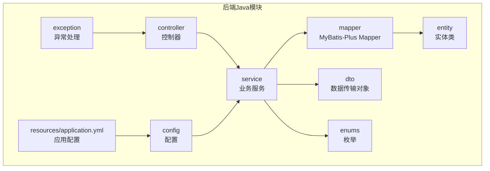
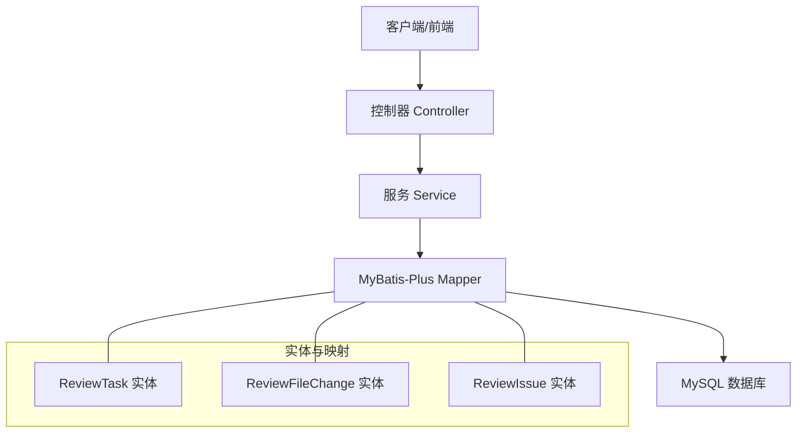
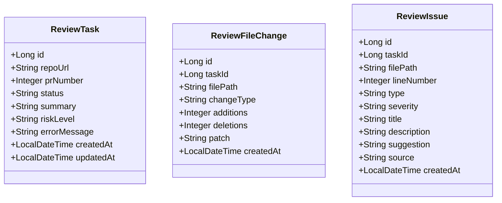
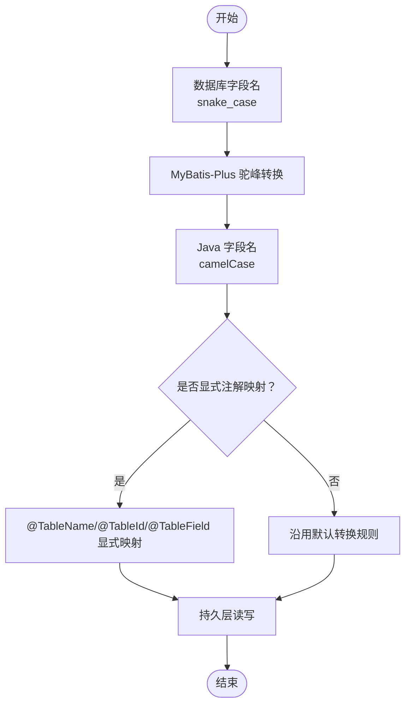
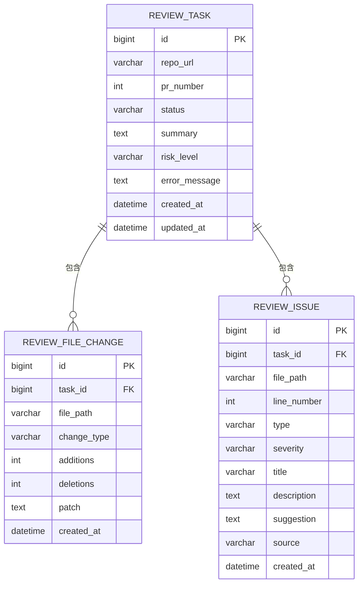
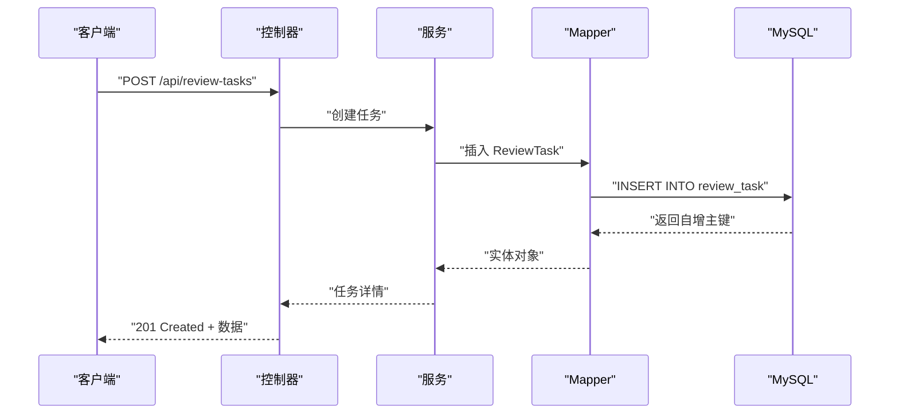
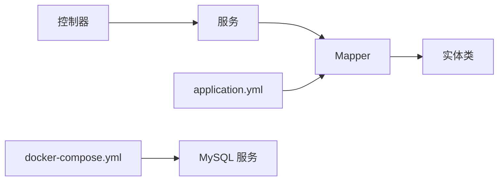

# ORM映射与命名规范

<cite>
**本文引用的文件**
- [DATABASE.md](file://docs/DATABASE.md)
- [backend-java/README.md](file://backend-java/README.md)
- [docker-compose.yml](file://docker-compose.yml)
- [ARCHITECTURE.md](file://docs/ARCHITECTURE.md)
</cite>

## 目录
1. [简介](#简介)
2. [项目结构](#项目结构)
3. [核心组件](#核心组件)
4. [架构总览](#架构总览)
5. [详细组件分析](#详细组件分析)
6. [依赖关系分析](#依赖关系分析)
7. [性能考量](#性能考量)
8. [故障排查指南](#故障排查指南)
9. [结论](#结论)
10. [附录](#附录)

## 简介
本文件面向 CodeReviewX 后端 Java 模块（Spring Boot + MyBatis-Plus）的数据库 ORM 映射与命名规范，系统性说明：
- MyBatis-Plus 注解配置与实体类映射规则
- 数据库 snake_case 到 Java camelCase 的映射机制与驼峰转换策略
- 实体类设计原则、注解使用规范与代码生成策略
- 常见问题与最佳实践、性能优化建议

当前仓库处于 Round 01 基础设施阶段，业务代码尚未实现，但数据库设计与 ORM 规范已在文档中明确，便于后续开发遵循统一标准。

## 项目结构
后端 Java 模块采用分层架构，围绕 MyBatis-Plus 的实体-映射关系组织代码。根据规划，模块目录结构如下（未来 Round 02 将落地）：
- entity：对应数据库表的实体类
- mapper：MyBatis-Plus Mapper 接口
- service：业务服务与实现
- controller：HTTP 控制器
- dto：请求/响应数据传输对象
- enums：状态、类型、严重程度等枚举
- config：WebClient 等配置
- exception：全局异常处理
- resources/application.yml：应用配置（含数据库连接与 MyBatis-Plus 相关设置）

**章节来源**
- [backend-java/README.md:49-74](file://backend-java/README.md#L49-L74)
- [ARCHITECTURE.md:183-232](file://docs/ARCHITECTURE.md#L183-L232)

## 核心组件
- 实体类（Entity）：与数据库表一一对应，使用 MyBatis-Plus 注解声明表名、主键与字段映射
- Mapper 接口：继承 MyBatis-Plus 提供的基础 CRUD 能力，无需手写 SQL 即可完成常用操作
- 服务层（Service/Impl）：编排业务流程、事务控制与跨表协作
- 控制器（Controller）：参数接收、校验与响应封装
- DTO：API 输入输出的数据载体
- 枚举：集中管理状态、类型、严重程度等取值域
- 配置：application.yml 中的数据库连接、MyBatis-Plus 驼峰转换等

**章节来源**
- [ARCHITECTURE.md:183-232](file://docs/ARCHITECTURE.md#L183-L232)
- [DATABASE.md:257-286](file://docs/DATABASE.md#L257-L286)

## 架构总览
下图展示后端模块与数据库的交互关系，强调实体类通过 MyBatis-Plus 注解与数据库表建立稳定映射，服务层通过 Mapper 访问持久层，控制器对外暴露 REST API。

**图表来源**
- [ARCHITECTURE.md:183-232](file://docs/ARCHITECTURE.md#L183-L232)
- [DATABASE.md:257-286](file://docs/DATABASE.md#L257-L286)

## 详细组件分析

### 实体类与注解规范
- 表名映射：使用 @TableName 显式声明数据库表名，避免默认复数或下划线转换带来的不确定性
- 主键映射：使用 @TableId 指定主键字段与自增策略（如 IdType.AUTO）
- 字段映射：使用 @TableField 映射非默认列名，或标注忽略字段
- 时间字段：统一使用 Java 8 时间类型（如 LocalDateTime），由 MyBatis-Plus 自动处理时区与格式
- 枚举字段：将数据库字符串枚举映射为 Java 枚举，结合类型处理器进行序列化/反序列化

**图表来源**
- [DATABASE.md:266-284](file://docs/DATABASE.md#L266-L284)

**章节来源**
- [DATABASE.md:257-286](file://docs/DATABASE.md#L257-L286)
- [DATABASE.md:203-254](file://docs/DATABASE.md#L203-L254)

### 命名转换与映射策略
- 数据库命名：snake_case（如 task_id、created_at）
- Java 命名：camelCase（如 taskId、createdAt）
- 显式映射：通过 @TableName、@TableId、@TableField 明确声明，确保即使默认策略变化也能保持兼容
- 驼峰转换：MyBatis-Plus 默认开启数据库下划线与 Java 驼峰的自动转换，配合注解可覆盖特殊场景

**图表来源**
- [DATABASE.md:261-265](file://docs/DATABASE.md#L261-L265)

**章节来源**
- [DATABASE.md:261-265](file://docs/DATABASE.md#L261-L265)

### 代码生成策略
- 建议使用 MyBatis-Plus Generator 或其扩展工具，基于数据库表结构生成实体类、Mapper、Service 层骨架代码
- 生成后统一应用注解规范：@TableName、@TableId、@TableField
- 对于枚举字段，生成后手动添加类型处理器或使用数据库枚举类型映射策略
- 生成代码后进行二次校验：字段命名一致性、时间类型统一、主键策略、索引字段映射

**章节来源**
- [DATABASE.md:257-286](file://docs/DATABASE.md#L257-L286)

### 数据库设计与实体映射对照
- review_task：主表，包含任务元信息、状态与摘要
- review_file_change：文件变更明细，外键关联 review_task
- review_issue：问题明细，外键关联 review_task

**图表来源**
- [DATABASE.md:22-198](file://docs/DATABASE.md#L22-L198)

**章节来源**
- [DATABASE.md:22-198](file://docs/DATABASE.md#L22-L198)

### API 工作流（概念示意）

[此图为概念流程图，不直接映射具体源码文件，故无图表来源]

## 依赖关系分析
- 控制器依赖服务层接口
- 服务层依赖 Mapper 接口
- Mapper 依赖实体类与 MyBatis-Plus 配置
- 应用配置（application.yml）提供数据库连接与 MyBatis-Plus 相关属性
- Docker Compose 提供 MySQL 服务占位，确保环境一致

**图表来源**
- [ARCHITECTURE.md:183-232](file://docs/ARCHITECTURE.md#L183-L232)
- [docker-compose.yml:1-14](file://docker-compose.yml#L1-L14)

**章节来源**
- [ARCHITECTURE.md:183-232](file://docs/ARCHITECTURE.md#L183-L232)
- [docker-compose.yml:1-14](file://docker-compose.yml#L1-L14)

## 性能考量
- 索引设计：依据查询模式在 status、created_at、task_id 等字段建立索引，减少全表扫描
- 字段类型：大文本字段（如 patch、description、suggestion）优先考虑 MEDIUMTEXT，避免 TEXT 截断
- 枚举存储：使用短字符串枚举（如 10~20 字符）并配合数据库枚举或类型处理器，降低存储与比较成本
- 时间字段：统一使用数据库服务器时区，避免频繁转换导致的性能损耗
- 查询优化：优先使用主键与索引字段查询；批量操作使用批处理与事务合并
- 连接池：合理配置连接池大小与超时，避免长事务占用资源

**章节来源**
- [DATABASE.md:288-294](file://docs/DATABASE.md#L288-L294)
- [DATABASE.md:137-199](file://docs/DATABASE.md#L137-L199)

## 故障排查指南
- 字段映射错误
  - 症状：查询结果字段为空或类型不匹配
  - 排查：确认 @TableField 是否正确映射非默认列名；检查数据库字段类型与 Java 类型兼容性
- 主键自增异常
  - 症状：插入后主键为 null 或重复
  - 排查：确认 @TableId 的 IdType 设置为 AUTO；检查数据库自增策略与表引擎
- 枚举映射异常
  - 症状：数据库字符串无法正确解析为 Java 枚举
  - 排查：为枚举字段配置类型处理器或使用数据库 ENUM；确保枚举值与数据库枚举一致
- 时间字段时区问题
  - 症状：时间显示与预期不符
  - 排查：统一数据库与应用时区；在 docker-compose 中统一时区配置；避免在应用层做重复转换
- 大字段截断
  - 症状：diff 内容丢失
  - 排查：将 TEXT 改为 MEDIUMTEXT 或 LONGTEXT；或对输入内容进行分片存储与拼接

**章节来源**
- [DATABASE.md:288-294](file://docs/DATABASE.md#L288-L294)
- [docker-compose.yml:1-14](file://docker-compose.yml#L1-L14)

## 结论
本规范明确了 CodeReviewX 后端 Java 模块的 ORM 映射与命名策略：以显式注解为核心，结合 MyBatis-Plus 的默认驼峰转换，确保数据库与 Java 层的一致性与可维护性。配合合理的索引、字段类型与枚举策略，可在 MVP 阶段获得稳定可靠的持久层能力。后续实现应严格遵循本文档的注解规范与设计原则，保证代码生成与手工实现的一致性。

## 附录
- 数据库设计与枚举约束详见数据库文档
- 后端模块分层与目录结构规划详见架构文档
- Docker Compose 作为 MySQL 服务占位，确保环境一致性

**章节来源**
- [DATABASE.md:203-254](file://docs/DATABASE.md#L203-L254)
- [ARCHITECTURE.md:183-232](file://docs/ARCHITECTURE.md#L183-L232)
- [docker-compose.yml:1-14](file://docker-compose.yml#L1-L14)