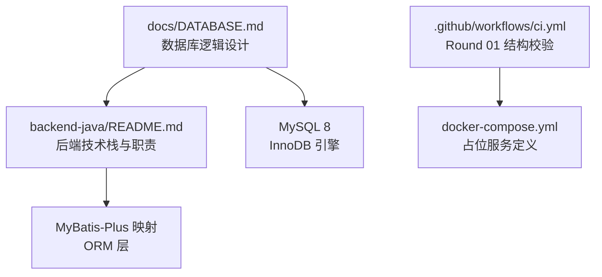
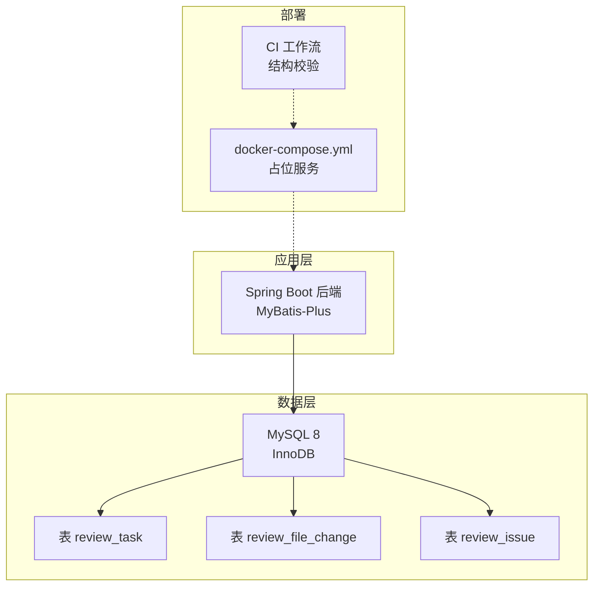
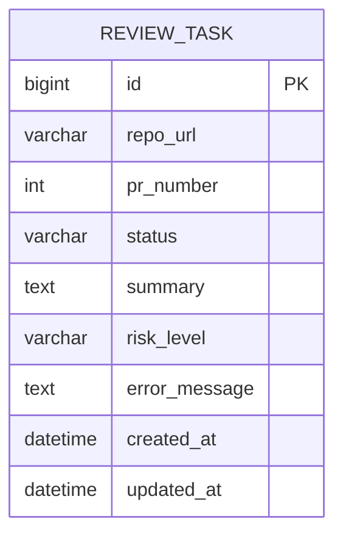
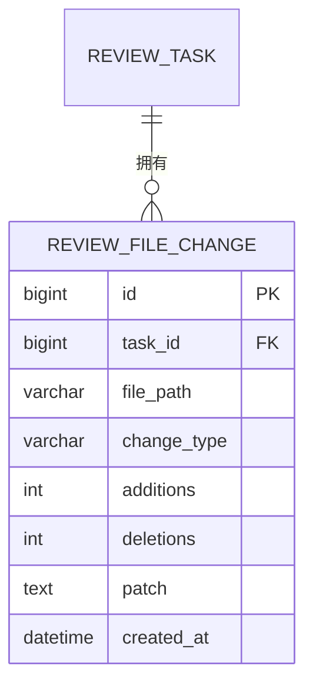
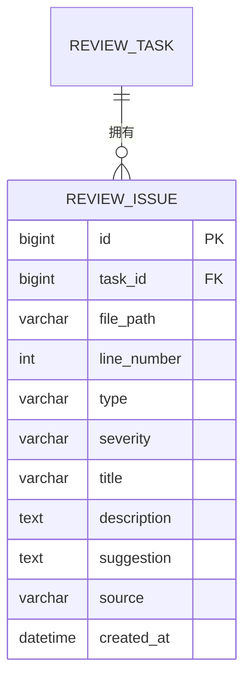
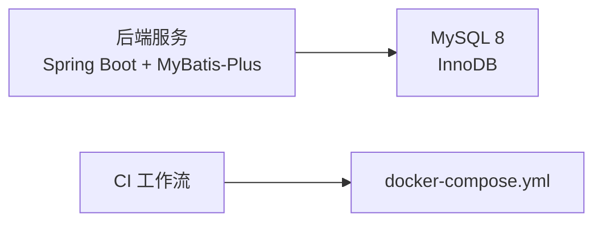

# 性能优化与注意事项

<cite>
**本文引用的文件**
- [DATABASE.md](file://docs/DATABASE.md)
- [docker-compose.yml](file://docker-compose.yml)
- [backend-java/README.md](file://backend-java/README.md)
- [.github/workflows/ci.yml](file://.github/workflows/ci.yml)
</cite>

## 目录
1. [简介](#简介)
2. [项目结构](#项目结构)
3. [核心组件](#核心组件)
4. [架构总览](#架构总览)
5. [详细组件分析](#详细组件分析)
6. [依赖关系分析](#依赖关系分析)
7. [性能考量](#性能考量)
8. [故障排查指南](#故障排查指南)
9. [结论](#结论)
10. [附录](#附录)

## 简介
本指南面向 CodeReviewX 在 MVP 阶段的数据库性能优化与运维注意事项，结合当前 Round 01 的数据库逻辑设计与后端技术栈规划，系统阐述索引设计策略、查询优化技巧、性能监控方法、字段长度与存储优化、大数据量处理方案、连接池与事务管理、并发控制机制，并提供性能瓶颈识别、慢查询优化与扩展性规划建议。由于 Round 01 尚未实现业务代码与数据库迁移，本指南以“设计即规范”的方式给出落地实施要点，便于 Round 02 开发阶段直接遵循。

## 项目结构
- 数据库设计文档集中于 docs/DATABASE.md，定义了 review_task、review_file_change、review_issue 三张核心表的字段、索引、外键与枚举约束。
- 后端服务采用 Spring Boot 3 + MyBatis-Plus 技术栈，数据库访问通过 ORM 映射实现。
- CI 工作流在 Round 01 仅进行仓库结构校验，不包含数据库构建与迁移步骤。

**图示来源**
- [DATABASE.md](file://docs/DATABASE.md)
- [backend-java/README.md](file://backend-java/README.md)
- [.github/workflows/ci.yml](file://.github/workflows/ci.yml)
- [docker-compose.yml](file://docker-compose.yml)

**章节来源**
- [DATABASE.md](file://docs/DATABASE.md)
- [backend-java/README.md](file://backend-java/README.md)
- [.github/workflows/ci.yml](file://.github/workflows/ci.yml)
- [docker-compose.yml](file://docker-compose.yml)

## 核心组件
- review_task：任务主表，记录任务元信息、状态与摘要，具备按状态与创建时间的二级索引，支持高频的状态筛选与时间排序。
- review_file_change：文件变更明细表，按 task_id 建立索引并建立外键约束，支撑按任务聚合文件变更。
- review_issue：问题明细表，按 task_id、severity、type 建立索引并建立外键约束，支撑按任务、严重程度与类型过滤。
- MyBatis-Plus 映射：数据库字段 snake_case 与 Java 驼峰命名的显式映射，确保 ORM 层与数据库设计一致。

**章节来源**
- [DATABASE.md](file://docs/DATABASE.md)
- [backend-java/README.md](file://backend-java/README.md)

## 架构总览
下图展示数据库与后端服务在 MVP 阶段的交互关系：后端通过 MyBatis-Plus 访问 MySQL，数据模型由 DATABASE.md 中的逻辑设计驱动。

**图示来源**
- [DATABASE.md](file://docs/DATABASE.md)
- [backend-java/README.md](file://backend-java/README.md)
- [docker-compose.yml](file://docker-compose.yml)
- [.github/workflows/ci.yml](file://.github/workflows/ci.yml)

## 详细组件分析

### review_task 表
- 设计要点
  - 主键 id，自增主键适合写多读少的任务流水场景。
  - 状态字段 status 与创建时间 created_at 建有二级索引，满足按状态筛选与时间排序的常见查询模式。
  - 摘要与风险等级等字段在任务完成后填充，减少空洞列对查询的影响。
- 查询优化建议
  - 对 status 进行等值过滤时优先命中 idx_status。
  - 对 created_at 的范围查询配合 ORDER BY created_at DESC，利用 idx_created_at 提升排序效率。
- 存储与字段长度
  - repo_url 使用较长长度以容纳完整的仓库地址，避免截断导致的唯一性与关联异常。
- 并发与事务
  - 写入密集场景建议批量提交，减少锁竞争；读多写少场景可考虑只读副本分流。

**图示来源**
- [DATABASE.md](file://docs/DATABASE.md)

**章节来源**
- [DATABASE.md](file://docs/DATABASE.md)

### review_file_change 表
- 设计要点
  - 外键 task_id 指向 review_task，按 task_id 建有索引，支持按任务聚合文件变更。
  - patch 字段在 MVP 阶段使用 TEXT，注意其上限与超大 diff 的处理策略。
- 查询优化建议
  - 按任务查询文件变更时优先命中 idx_task_id。
  - 若 patch 字段频繁参与查询，建议评估是否拆分或压缩存储。
- 存储与字段长度
  - patch 使用 TEXT（最大约 64KB），若出现超大 diff，应考虑截断或改用 MEDIUMTEXT，并在业务侧做分片或外部化存储。

**图示来源**
- [DATABASE.md](file://docs/DATABASE.md)

**章节来源**
- [DATABASE.md](file://docs/DATABASE.md)

### review_issue 表
- 设计要点
  - 外键 task_id 指向 review_task，同时为 severity 与 type 建有索引，支持按严重程度与类型过滤。
  - 支持 LLM 与 Semgrep 的问题来源标识，便于后续统计与报表。
- 查询优化建议
  - 按任务查询问题时命中 idx_task_id。
  - 按 severity/type 组合过滤时，建议评估复合索引策略，避免回表成本过高。
- 存储与字段长度
  - description 与 suggestion 使用 TEXT，注意长文本对 IO 的影响，必要时进行分页或延迟加载。

**图示来源**
- [DATABASE.md](file://docs/DATABASE.md)

**章节来源**
- [DATABASE.md](file://docs/DATABASE.md)

### 索引设计策略
- 唯一性与选择性
  - 优先为高选择性的列建立索引，如 status、severity、type，降低回表概率。
  - 对于低选择性枚举值（如状态、来源），结合业务过滤条件设计复合索引。
- 复合索引
  - 常见查询模式：按 task_id + severity、按 task_id + type，可考虑分别建立复合索引以提升过滤效率。
- 索引维护
  - 定期分析表统计信息，重建碎片化索引，避免索引失效导致的性能回退。

**章节来源**
- [DATABASE.md](file://docs/DATABASE.md)

### 查询优化技巧
- LIMIT 与分页
  - 大结果集分页时使用基于游标的分页（如 id > lastId），避免 deep pagination 导致的扫描开销。
- 聚合与去重
  - 使用 GROUP BY 时尽量减少不必要的列，避免使用 SELECT *。
- 连接顺序
  - 小表驱动大表，优先过滤可显著缩小连接规模。
- EXPLAIN 分析
  - 使用执行计划核对索引使用情况，关注 key、rows、Extra 等关键指标。

**章节来源**
- [DATABASE.md](file://docs/DATABASE.md)

### 性能监控方法
- 慢查询日志
  - 开启慢查询日志，设置阈值（如 1s），定期巡检并优化热点 SQL。
- 指标采集
  - 关注 QPS、TP99、连接数、锁等待、缓冲池命中率等核心指标。
- 压力测试
  - 使用基准测试工具模拟峰值流量，验证系统在不同负载下的稳定性与吞吐。

**章节来源**
- [DATABASE.md](file://docs/DATABASE.md)

### 字段长度限制与存储优化
- TEXT 字段
  - patch 使用 TEXT（约 64KB），建议在业务侧对超大 diff 截断或外部化存储，避免单行过大影响 IO。
- 长度设计
  - repo_url、file_path 使用较长长度，确保兼容性；title 控制在合理长度以内，减少索引体积。
- 字符集与排序规则
  - utf8mb4 与排序规则统一，避免跨库联接时的排序开销。

**章节来源**
- [DATABASE.md](file://docs/DATABASE.md)

### 大数据量处理方案
- 分批处理
  - 对写入密集的任务，采用批量插入与事务分片，降低锁竞争。
- 归档策略
  - 对历史任务与问题进行归档或冷热分离，减少在线表膨胀。
- 读写分离
  - 读多写少场景下，将查询流量导向只读副本，减轻主库压力。

**章节来源**
- [DATABASE.md](file://docs/DATABASE.md)

### 数据库连接池配置与事务管理
- 连接池
  - 合理设置最大连接数、空闲超时与获取超时，避免连接泄漏与资源枯竭。
- 事务策略
  - 采用短事务与细粒度锁，避免长时间持有锁；对批量写入使用批量提交。
- 并发控制
  - 使用乐观锁或版本号控制并发更新冲突，必要时引入分布式锁。

**章节来源**
- [backend-java/README.md](file://backend-java/README.md)

## 依赖关系分析
- 后端依赖
  - Spring Boot 3 + MyBatis-Plus 作为 ORM 框架，负责数据库访问与对象映射。
- 数据库依赖
  - MySQL 8 + InnoDB 引擎，遵循 DATABASE.md 中的表结构与索引设计。
- 部署与 CI
  - docker-compose.yml 为占位定义，CI 工作流在 Round 01 仅进行结构校验。

**图示来源**
- [backend-java/README.md](file://backend-java/README.md)
- [DATABASE.md](file://docs/DATABASE.md)
- [.github/workflows/ci.yml](file://.github/workflows/ci.yml)
- [docker-compose.yml](file://docker-compose.yml)

**章节来源**
- [backend-java/README.md](file://backend-java/README.md)
- [DATABASE.md](file://docs/DATABASE.md)
- [.github/workflows/ci.yml](file://.github/workflows/ci.yml)
- [docker-compose.yml](file://docker-compose.yml)

## 性能考量
- 索引与查询
  - 依据常见查询模式（按任务、按状态、按严重程度/类型）优化索引组合，避免全表扫描。
- 存储与 TEXT 字段
  - 对 patch 等大字段采取截断或外部化策略，减少单行体积与 IO 压力。
- 连接池与事务
  - 合理配置连接池参数，短事务与批量提交降低锁等待与上下文切换。
- 监控与压测
  - 建立慢查询与关键指标监控，定期进行压力测试，提前发现瓶颈。

**章节来源**
- [DATABASE.md](file://docs/DATABASE.md)
- [backend-java/README.md](file://backend-java/README.md)

## 故障排查指南
- 常见问题
  - 索引未命中：通过 EXPLAIN 分析执行计划，确认 WHERE 条件与索引匹配。
  - TEXT 字段超限：检查 patch 截断策略或改用更大类型，避免插入失败。
  - 连接池耗尽：核查最大连接数、空闲超时与事务时长，优化批量操作。
- 排查流程
  - 采集慢查询日志与执行计划 → 分析热点 SQL 与索引使用 → 优化索引与查询 → 回归压测验证。

**章节来源**
- [DATABASE.md](file://docs/DATABASE.md)

## 结论
本指南基于 DATABASE.md 的逻辑设计与后端技术栈规划，给出了索引设计、查询优化、存储与 TEXT 字段处理、连接池与事务管理、并发控制以及性能监控的系统性建议。由于 Round 01 未实现业务代码与数据库迁移，建议在 Round 02 开发阶段严格遵循本文的设计规范与优化策略，确保系统在 MVP 阶段即具备良好的性能基线与可扩展性。

## 附录
- 枚举与约束
  - 任务状态、风险等级、问题类型、严重程度、变更类型、问题来源等枚举值在 DATABASE.md 中明确，开发阶段应保持一致性。
- 时区与部署
  - 时间字段统一时区，docker-compose.yml 中需统一数据库时区配置，避免跨时区引发的时间错乱。

**章节来源**
- [DATABASE.md](file://docs/DATABASE.md)
- [docker-compose.yml](file://docker-compose.yml)