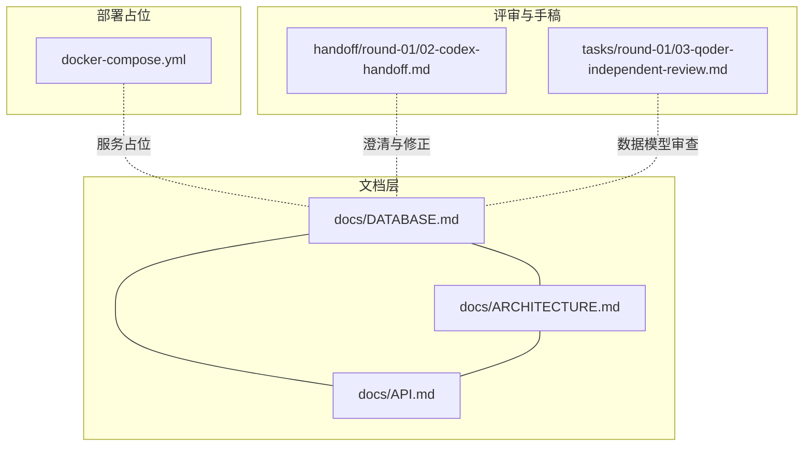
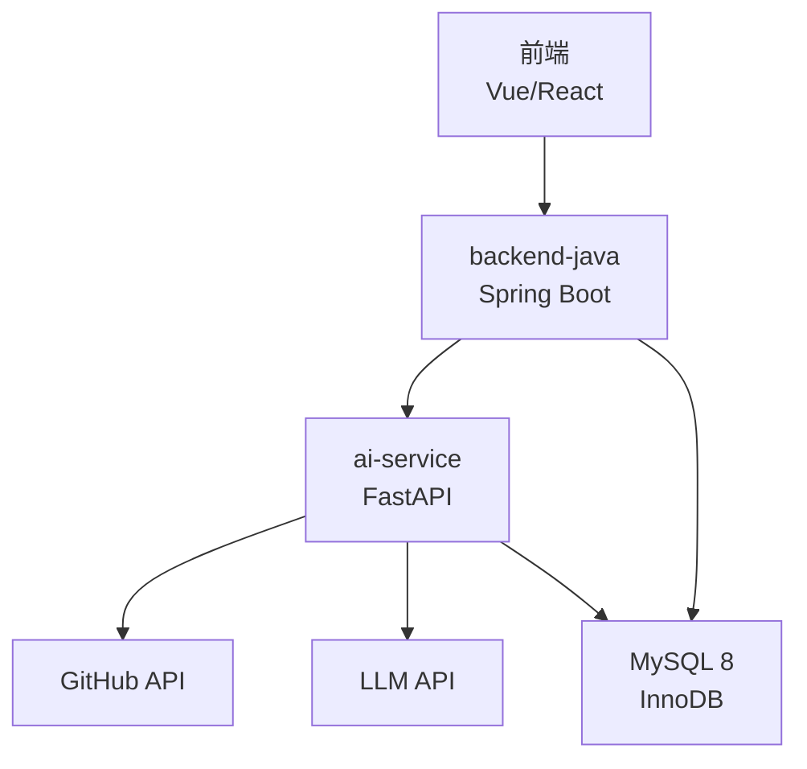
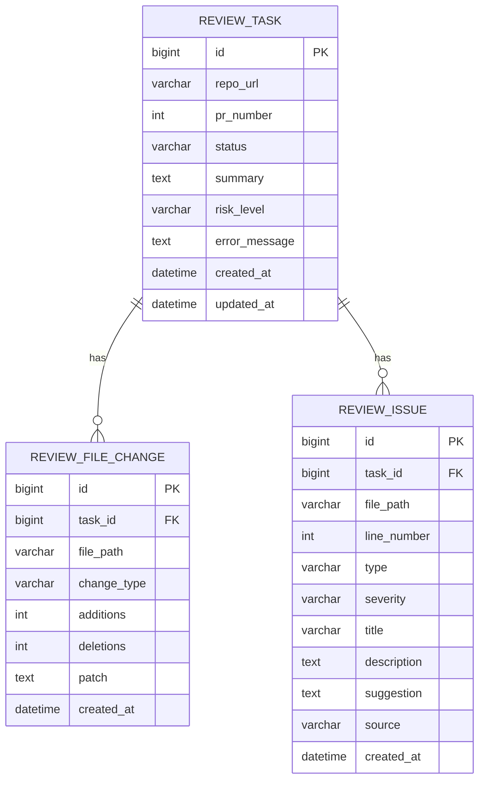
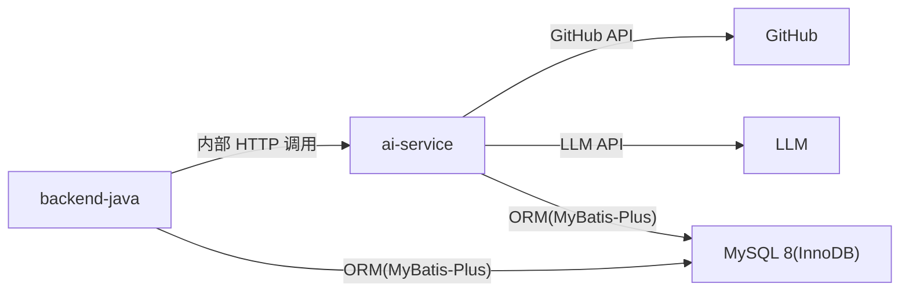

# 数据库设计

<cite>
**本文引用的文件**
- [docs/DATABASE.md](file://docs/DATABASE.md)
- [docs/ARCHITECTURE.md](file://docs/ARCHITECTURE.md)
- [docs/API.md](file://docs/API.md)
- [docker-compose.yml](file://docker-compose.yml)
- [handoff/round-01/02-codex-handoff.md](file://handoff/round-01/02-codex-handoff.md)
- [tasks/round-01/03-qoder-independent-review.md](file://tasks/round-01/03-qoder-independent-review.md)
</cite>

## 目录
1. [简介](#简介)
2. [项目结构](#项目结构)
3. [核心组件](#核心组件)
4. [架构总览](#架构总览)
5. [详细组件分析](#详细组件分析)
6. [依赖分析](#依赖分析)
7. [性能考量](#性能考量)
8. [故障排查指南](#故障排查指南)
9. [结论](#结论)
10. [附录](#附录)

## 简介
本文件面向 CodeReviewX MVP 阶段的数据库设计，围绕核心实体 ReviewTask、ReviewFileChange、ReviewIssue 的设计理念、表结构、索引与约束、数据访问模式、缓存策略与性能优化进行系统化说明，并给出数据生命周期、备份与迁移建议。文档内容完全基于仓库现有资料整理，确保设计的完整性与可维护性。

## 项目结构
数据库相关设计集中在文档中，配合架构与 API 文档共同定义了数据模型与调用边界。数据库服务在部署层面由 docker-compose 预留占位，实际实现将在后续轮次落地。

图表来源
- [docs/DATABASE.md:1-294](file://docs/DATABASE.md#L1-L294)
- [docs/ARCHITECTURE.md:1-417](file://docs/ARCHITECTURE.md#L1-L417)
- [docs/API.md:1-378](file://docs/API.md#L1-L378)
- [docker-compose.yml:1-14](file://docker-compose.yml#L1-L14)
- [handoff/round-01/02-codex-handoff.md:100-138](file://handoff/round-01/02-codex-handoff.md#L100-L138)
- [tasks/round-01/03-qoder-independent-review.md:335-372](file://tasks/round-01/03-qoder-independent-review.md#L335-L372)

章节来源
- [docs/DATABASE.md:1-294](file://docs/DATABASE.md#L1-L294)
- [docs/ARCHITECTURE.md:1-417](file://docs/ARCHITECTURE.md#L1-L417)
- [docs/API.md:1-378](file://docs/API.md#L1-L378)
- [docker-compose.yml:1-14](file://docker-compose.yml#L1-L14)
- [handoff/round-01/02-codex-handoff.md:100-138](file://handoff/round-01/02-codex-handoff.md#L100-L138)
- [tasks/round-01/03-qoder-independent-review.md:335-372](file://tasks/round-01/03-qoder-independent-review.md#L335-L372)

## 核心组件
本节聚焦三个核心实体及其业务含义与约束：
- ReviewTask：任务主表，承载任务元信息、状态与 Review 结果摘要
- ReviewFileChange：PR 变更文件表，记录每个任务涉及的文件变更信息
- ReviewIssue：Review 问题表，保存 LLM 与 Semgrep 分析出的问题

章节来源
- [docs/DATABASE.md:22-134](file://docs/DATABASE.md#L22-L134)
- [docs/DATABASE.md:203-254](file://docs/DATABASE.md#L203-L254)

## 架构总览
数据库作为业务数据存储，遵循“第一阶段不引入复杂中间件”的原则，采用 MySQL 8 + InnoDB 存储引擎，字符集为 utf8mb4，排序规则为 utf8mb4_unicode_ci。backend-java 负责业务编排与持久化，ai-service 负责外部数据拉取与分析，二者通过内部 HTTP 接口交互，前端仅与 backend-java 交互。

图表来源
- [docs/ARCHITECTURE.md:19-52](file://docs/ARCHITECTURE.md#L19-L52)
- [docs/ARCHITECTURE.md:345-381](file://docs/ARCHITECTURE.md#L345-L381)

章节来源
- [docs/ARCHITECTURE.md:1-417](file://docs/ARCHITECTURE.md#L1-L417)

## 详细组件分析

### 实体关系与 ER 图
三张表构成清晰的一对多关系：一个 ReviewTask 可对应多个 ReviewFileChange 与 ReviewIssue。外键约束确保引用完整性，索引覆盖常见查询路径。

图表来源
- [docs/DATABASE.md:27-116](file://docs/DATABASE.md#L27-L116)

章节来源
- [docs/DATABASE.md:22-134](file://docs/DATABASE.md#L22-L134)

### ReviewTask（任务主表）
- 设计理念：集中存储任务元信息、状态与结果摘要，支持按状态与创建时间检索
- 关键字段：id、repo_url、pr_number、status、summary、risk_level、error_message、created_at、updated_at
- 约束与索引：主键 id；索引 idx_status(status)、idx_created_at(created_at)
- 业务含义：作为任务生命周期的唯一入口，承载状态机流转与汇总信息

章节来源
- [docs/DATABASE.md:22-56](file://docs/DATABASE.md#L22-L56)
- [docs/DATABASE.md:205-213](file://docs/DATABASE.md#L205-L213)

### ReviewFileChange（文件变更表）
- 设计理念：记录 PR 涉及的文件变更，包括新增/修改/删除，以及行数统计与 diff 片段
- 关键字段：id、task_id、file_path、change_type、additions、deletions、patch、created_at
- 约束与索引：主键 id；外键 task_id → review_task(id)；索引 idx_task_id(task_id)
- 业务含义：为前端展示变更概览与问题定位提供基础数据

章节来源
- [docs/DATABASE.md:59-91](file://docs/DATABASE.md#L59-L91)
- [docs/DATABASE.md:240-247](file://docs/DATABASE.md#L240-L247)

### ReviewIssue（问题表）
- 设计理念：统一存储 LLM 与 Semgrep 的分析结果，支持按类型与严重程度过滤
- 关键字段：id、task_id、file_path、line_number、type、severity、title、description、suggestion、source、created_at
- 约束与索引：主键 id；外键 task_id → review_task(id)；索引 idx_task_id(task_id)、idx_severity(severity)、idx_type(type)
- 业务含义：支撑问题分类、筛选与修复建议展示

章节来源
- [docs/DATABASE.md:94-134](file://docs/DATABASE.md#L94-L134)
- [docs/DATABASE.md:222-254](file://docs/DATABASE.md#L222-L254)

### 数据访问模式与缓存策略
- 访问模式
  - 列表查询：按 ReviewTask.status 与 created_at 排序分页
  - 详情查询：按 task_id 聚合 ReviewFileChange 与 ReviewIssue
  - 问题筛选：按 severity/type/source 过滤
- 缓存策略
  - MVP 阶段不引入 Redis 等中间件，优先通过数据库索引与查询优化满足性能
  - 对高频查询（如按状态统计）可在应用层进行轻量聚合缓存，避免重复扫描

章节来源
- [docs/DATABASE.md:38-40](file://docs/DATABASE.md#L38-L40)
- [docs/DATABASE.md:74-76](file://docs/DATABASE.md#L74-L76)
- [docs/DATABASE.md:112-116](file://docs/DATABASE.md#L112-L116)
- [docs/ARCHITECTURE.md:407-417](file://docs/ARCHITECTURE.md#L407-L417)

### 数据生命周期管理
- 状态机：PENDING → RUNNING → {SUCCESS, FAILED}，单向流转，失败时记录 error_message
- 清理策略：未启用分区或分表，建议通过归档或定期清理历史任务（在后续版本中规划）
- 一致性：外键约束使用级联检查，不启用 ON DELETE CASCADE，避免误删

章节来源
- [docs/ARCHITECTURE.md:110-134](file://docs/ARCHITECTURE.md#L110-L134)
- [docs/DATABASE.md:288-294](file://docs/DATABASE.md#L288-L294)

### 备份策略与迁移方案
- 备份策略：MySQL 8 建议采用逻辑备份（mysqldump）与物理备份结合，保留增量与全量周期
- 迁移方案：当前 Round 01 为逻辑 schema 设计，SQL 片段仅作参考，不执行迁移；后续实现应基于 MyBatis-Plus 的实体映射与数据库变更管理工具进行版本化迁移

章节来源
- [docs/DATABASE.md:137-199](file://docs/DATABASE.md#L137-L199)
- [docs/DATABASE.md:257-287](file://docs/DATABASE.md#L257-L287)

### API 与数据模型一致性
- API 文档明确了 ReviewTask 与 Review JSON 的字段，与数据库模型保持一致
- 数据模型审查确认了 review_task、review_file_change、review_issue 的字段完备性

章节来源
- [docs/API.md:54-241](file://docs/API.md#L54-L241)
- [tasks/round-01/03-qoder-independent-review.md:335-372](file://tasks/round-01/03-qoder-independent-review.md#L335-L372)

## 依赖分析
- 外部依赖：GitHub API、LLM API
- 内部依赖：backend-java 与 ai-service 的内部接口契约
- 数据库依赖：MySQL 8，InnoDB，utf8mb4 字符集

图表来源
- [docs/ARCHITECTURE.md:19-52](file://docs/ARCHITECTURE.md#L19-L52)
- [docs/ARCHITECTURE.md:345-381](file://docs/ARCHITECTURE.md#L345-L381)

章节来源
- [docs/ARCHITECTURE.md:1-417](file://docs/ARCHITECTURE.md#L1-L417)

## 性能考量
- 索引策略：针对高频查询建立必要索引，避免全表扫描
- 字段长度与类型：VARCHAR/TEXT 选择符合业务范围，注意 TEXT 的大小限制与潜在截断
- 时区与时间字段：统一数据库服务器时区，避免跨时区带来的查询偏差
- 架构简化：MVP 阶段不引入分区/分表与中间件，降低运维复杂度

章节来源
- [docs/DATABASE.md:38-40](file://docs/DATABASE.md#L38-L40)
- [docs/DATABASE.md:112-116](file://docs/DATABASE.md#L112-L116)
- [docs/DATABASE.md:288-294](file://docs/DATABASE.md#L288-L294)
- [docs/ARCHITECTURE.md:407-417](file://docs/ARCHITECTURE.md#L407-L417)

## 故障排查指南
- 常见问题
  - GitHub 拉取失败：任务置为 FAILED，记录 error_message
  - Semgrep 失败：降级为 warning，不影响任务整体状态
  - LLM 失败：优先使用 mock fallback，fallback 失败则任务 FAILED
  - 数据库写入失败：任务 FAILED
- 排查步骤
  - 检查 ai-service 返回的错误码与 recoverable 标记
  - 核对 backend-java 的统一错误响应格式
  - 审视数据库连接与时区配置

章节来源
- [docs/ARCHITECTURE.md:170-180](file://docs/ARCHITECTURE.md#L170-L180)
- [docs/API.md:41-51](file://docs/API.md#L41-L51)
- [docs/API.md:313-332](file://docs/API.md#L313-L332)

## 结论
本数据库设计以 MVP 为目标，围绕 ReviewTask、ReviewFileChange、ReviewIssue 三张表构建清晰的实体关系，配合合理的索引与约束，满足任务状态管理、文件变更与问题分析的核心业务诉求。文档层面明确了 MyBatis-Plus 映射规则、枚举值约束与部署占位，为后续实现提供了完整蓝图。建议在后续版本中逐步完善备份、迁移与缓存策略，持续提升可维护性与稳定性。

## 附录

### 数据字典
- review_task
  - 字段：id、repo_url、pr_number、status、summary、risk_level、error_message、created_at、updated_at
  - 索引：idx_status、idx_created_at
- review_file_change
  - 字段：id、task_id、file_path、change_type、additions、deletions、patch、created_at
  - 索引：idx_task_id
  - 外键：task_id → review_task(id)
- review_issue
  - 字段：id、task_id、file_path、line_number、type、severity、title、description、suggestion、source、created_at
  - 索引：idx_task_id、idx_severity、idx_type
  - 外键：task_id → review_task(id)

章节来源
- [docs/DATABASE.md:22-134](file://docs/DATABASE.md#L22-L134)

### 枚举值定义
- TaskStatus：PENDING、RUNNING、SUCCESS、FAILED
- RiskLevel：LOW、MEDIUM、HIGH
- IssueType：BUG、SECURITY、PERFORMANCE、TEST、STYLE
- IssueSeverity：LOW、MEDIUM、HIGH
- ChangeType：added、modified、deleted
- IssueSource：LLM、SEMGREP

章节来源
- [docs/DATABASE.md:203-254](file://docs/DATABASE.md#L203-L254)

### MyBatis-Plus 映射说明
- 命名规则：数据库 snake_case → Java camelCase
- 注解映射：@TableName、@TableId、@TableField
- 示例：ReviewTask 实体字段与数据库字段一一对应

章节来源
- [docs/DATABASE.md:257-287](file://docs/DATABASE.md#L257-L287)