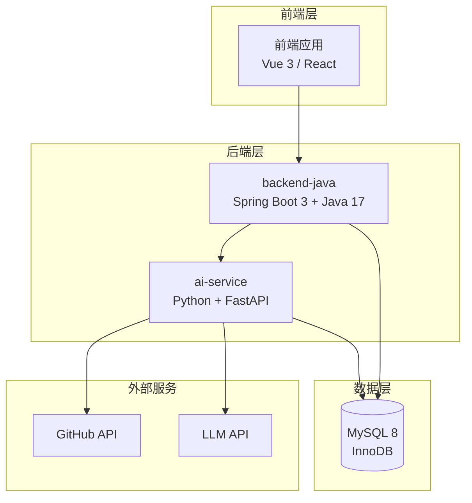
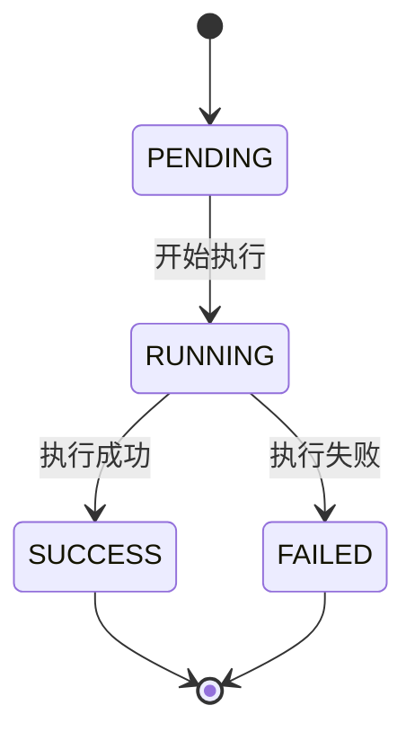
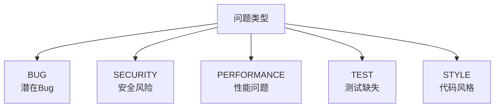
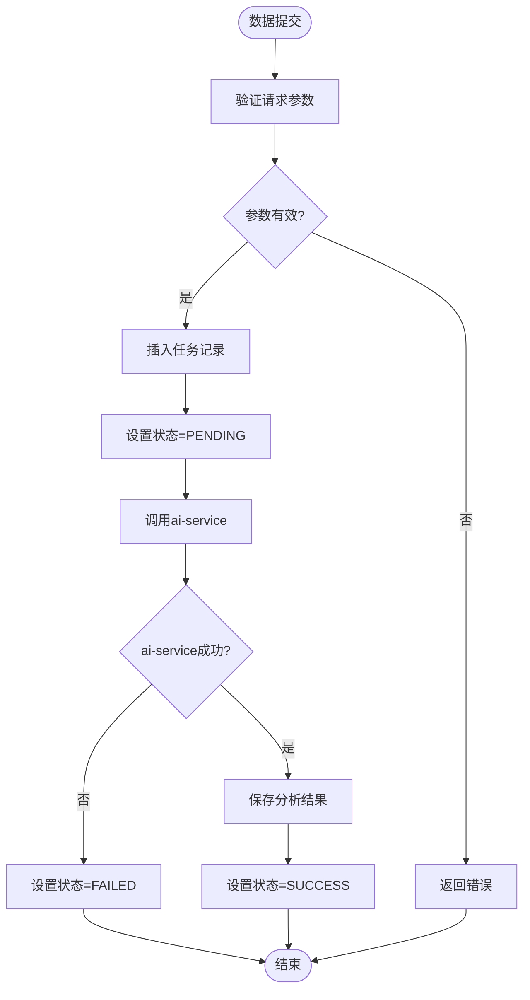
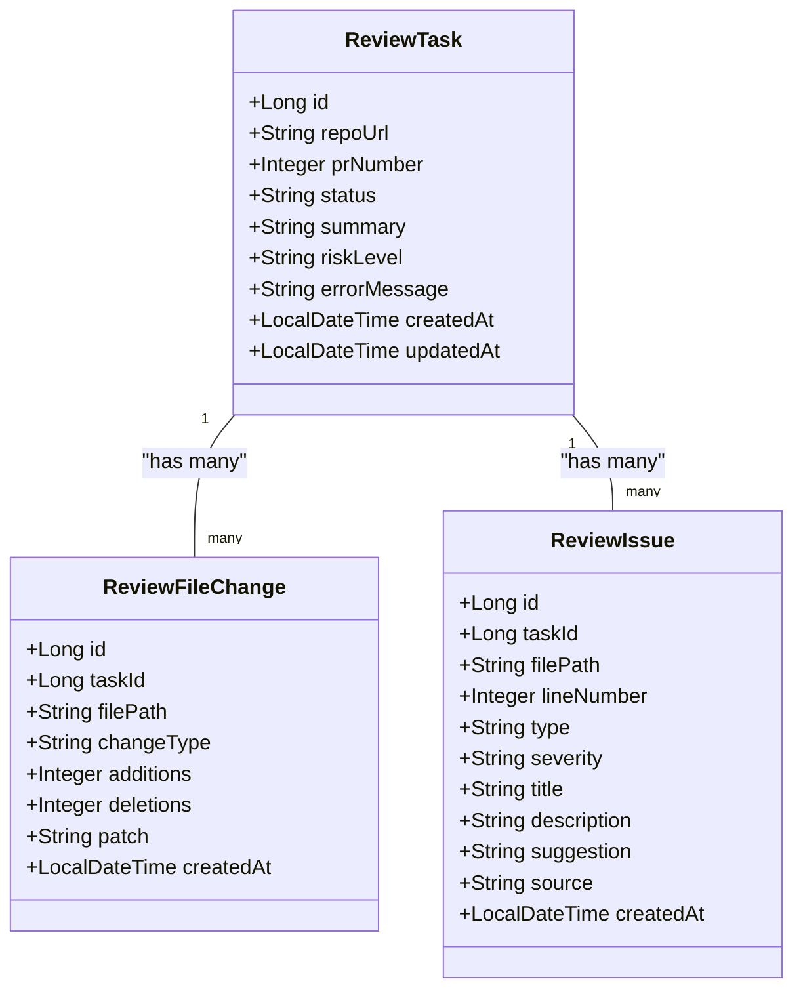
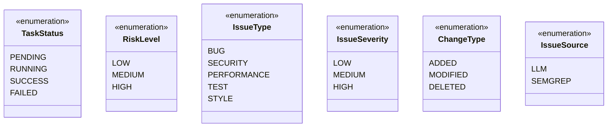
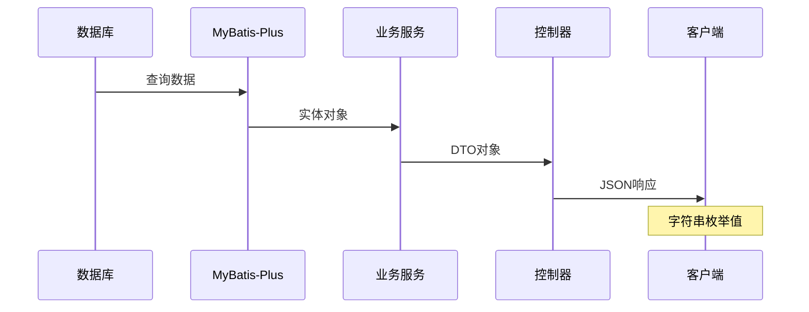

# 数据类型与枚举

<cite>
**本文档引用的文件**
- [DATABASE.md](file://docs/DATABASE.md)
- [API.md](file://docs/API.md)
- [ARCHITECTURE.md](file://docs/ARCHITECTURE.md)
- [docker-compose.yml](file://docker-compose.yml)
- [README.md](file://README.md)
</cite>

## 目录
1. [简介](#简介)
2. [数据库概览](#数据库概览)
3. [核心数据类型分析](#核心数据类型分析)
4. [枚举类型详解](#枚举类型详解)
5. [字符串编码与字符集](#字符串编码与字符集)
6. [时间字段处理](#时间字段处理)
7. [数值精度考虑](#数值精度考虑)
8. [数据验证规则](#数据验证规则)
9. [边界条件处理](#边界条件处理)
10. [兼容性考虑](#兼容性考虑)
11. [类型转换示例](#类型转换示例)
12. [性能优化建议](#性能优化建议)
13. [故障排除指南](#故障排除指南)
14. [结论](#结论)

## 简介

CodeReviewX是一个智能代码审查系统，专门针对GitHub Pull Request进行自动化分析。本文件专注于系统的数据库数据类型设计和枚举值定义，为开发者提供完整的技术参考。

根据项目文档，系统采用MySQL 8作为数据库引擎，使用utf8mb4字符集，支持完整的UTF-8字符集包括emoji表情符号。整个设计遵循MVP（最小可行产品）原则，重点关注核心功能的实现。

## 数据库概览

### 数据库配置

| 配置项 | 值 | 说明 |
|--------|-----|------|
| 数据库名称 | `codereviewx` | 主数据库名称 |
| 字符集 | `utf8mb4` | 支持emoji和完整Unicode |
| 排序规则 | `utf8mb4_unicode_ci` | Unicode排序规则 |
| 存储引擎 | InnoDB | 事务性存储引擎 |
| 默认字符集 | utf8mb4 | 数据库默认字符集 |

### 服务架构

**图表来源**
- [ARCHITECTURE.md:19-52](file://docs/ARCHITECTURE.md#L19-L52)

## 核心数据类型分析

### review_task 表

review_task是系统的核心任务表，存储PR审查任务的元信息和状态。

| 字段名 | 类型 | 长度限制 | 存储开销 | 用途说明 |
|--------|------|----------|----------|----------|
| `id` | BIGINT | - | 8字节 | 主键，自增标识符 |
| `repo_url` | VARCHAR(500) | 500字符 | 1-500字节 | GitHub仓库URL，支持完整路径 |
| `pr_number` | INT | - | 4字节 | PR编号，正整数 |
| `status` | VARCHAR(20) | 20字符 | 1-20字节 | 任务状态，枚举值 |
| `summary` | TEXT | ~65KB | 可变 | 审查总结，任务成功后填充 |
| `risk_level` | VARCHAR(10) | 10字符 | 1-10字节 | 风险等级，枚举值 |
| `error_message` | TEXT | ~65KB | 可变 | 失败原因，FAILED状态时填充 |
| `created_at` | DATETIME | - | 8字节 | 创建时间，自动填充 |
| `updated_at` | DATETIME | - | 8字节 | 更新时间，自动维护 |

**字段来源**
- [DATABASE.md:27-41](file://docs/DATABASE.md#L27-L41)
- [DATABASE.md:45-56](file://docs/DATABASE.md#L45-L56)

### review_file_change 表

存储PR变更文件的信息。

| 字段名 | 类型 | 长度限制 | 存储开销 | 用途说明 |
|--------|------|----------|----------|----------|
| `id` | BIGINT | - | 8字节 | 主键，自增标识符 |
| `task_id` | BIGINT | - | 8字节 | 外键，关联review_task |
| `file_path` | VARCHAR(500) | 500字符 | 1-500字节 | 文件绝对路径 |
| `change_type` | VARCHAR(20) | 20字符 | 1-20字节 | 变更类型，枚举值 |
| `additions` | INT | - | 4字节 | 新增行数，默认0 |
| `deletions` | INT | - | 4字节 | 删除行数，默认0 |
| `patch` | TEXT | ~65KB | 可变 | diff片段，MVP阶段使用 |
| `created_at` | DATETIME | - | 8字节 | 创建时间 |

**字段来源**
- [DATABASE.md:64-77](file://docs/DATABASE.md#L64-L77)
- [DATABASE.md:81-91](file://docs/DATABASE.md#L81-L91)

### review_issue 表

存储分析发现的问题信息。

| 字段名 | 类型 | 长度限制 | 存储开销 | 用途说明 |
|--------|------|----------|----------|----------|
| `id` | BIGINT | - | 8字节 | 主键，自增标识符 |
| `task_id` | BIGINT | - | 8字节 | 外键，关联review_task |
| `file_path` | VARCHAR(500) | 500字符 | 1-500字节 | 问题文件路径 |
| `line_number` | INT | - | 4字节 | 问题行号，可能为空 |
| `type` | VARCHAR(20) | 20字符 | 1-20字节 | 问题类型，枚举值 |
| `severity` | VARCHAR(10) | 10字符 | 1-10字节 | 严重程度，枚举值 |
| `title` | VARCHAR(255) | 255字符 | 1-255字节 | 问题标题 |
| `description` | TEXT | ~65KB | 可变 | 问题详细描述 |
| `suggestion` | TEXT | ~65KB | 可变 | 修复建议 |
| `source` | VARCHAR(20) | 20字符 | 1-20字节 | 数据来源，枚举值 |
| `created_at` | DATETIME | - | 8字节 | 创建时间 |

**字段来源**
- [DATABASE.md:99-117](file://docs/DATABASE.md#L99-L117)
- [DATABASE.md:121-134](file://docs/DATABASE.md#L121-L134)

## 枚举类型详解

### TaskStatus 任务状态枚举

任务状态机定义了PR审查任务的生命周期状态转换。

**图表来源**
- [ARCHITECTURE.md:110-134](file://docs/ARCHITECTURE.md#L110-L134)

| 状态值 | 描述 | 业务含义 | 使用场景 |
|--------|------|----------|----------|
| `PENDING` | 任务已创建，尚未执行 | 初始状态，等待执行 | 任务创建后立即设置 |
| `RUNNING` | 任务执行中 | 正在调用ai-service进行分析 | 调用ai-service前设置 |
| `SUCCESS` | 任务执行成功 | 分析完成，结果已保存 | ai-service返回成功后设置 |
| `FAILED` | 任务执行失败 | 任何关键步骤失败 | 发生错误时设置 |

**状态转换规则**
- 状态只能单向流转，不可回退
- `FAILED`状态必须同时保存`error_message`字段
- Semgrep失败不强制导致任务失败
- LLM失败优先使用mock fallback

**状态来源**
- [DATABASE.md:205-213](file://docs/DATABASE.md#L205-L213)
- [ARCHITECTURE.md:119-134](file://docs/ARCHITECTURE.md#L119-L134)

### RiskLevel 风险等级枚举

风险评估用于量化PR的整体风险水平。

| 等级值 | 描述 | 业务含义 | 风险特征 |
|--------|------|----------|----------|
| `LOW` | 低风险 | 影响较小，无需紧急处理 | 小型代码风格问题 |
| `MEDIUM` | 中风险 | 需要关注，建议尽快处理 | 中等复杂度问题 |
| `HIGH` | 高风险 | 紧急处理，影响较大 | 严重安全或性能问题 |

**风险来源**
- [DATABASE.md:214-221](file://docs/DATABASE.md#L214-L221)

### IssueType 问题类型枚举

问题分类系统，帮助用户快速识别和处理不同类型的问题。

**图表来源**
- [DATABASE.md:222-231](file://docs/DATABASE.md#L222-L231)

| 类型值 | 描述 | 业务含义 | 处理优先级 |
|--------|------|----------|------------|
| `BUG` | 潜在Bug | 代码逻辑错误，可能导致运行时异常 | 高 |
| `SECURITY` | 安全风险 | 安全漏洞或不当的安全实践 | 高 |
| `PERFORMANCE` | 性能问题 | 影响系统性能的代码模式 | 中 |
| `TEST` | 测试缺失 | 缺少必要的单元测试或集成测试 | 中 |
| `STYLE` | 代码风格 | 代码风格或最佳实践问题 | 低 |

**类型来源**
- [DATABASE.md:222-231](file://docs/DATABASE.md#L222-L231)

### IssueSeverity 严重程度枚举

问题严重程度分级，用于指导修复优先级。

| 严重程度 | 描述 | 业务含义 | 处理建议 |
|----------|------|----------|----------|
| `LOW` | 低严重程度 | 对系统影响很小 | 可稍后处理 |
| `MEDIUM` | 中严重程度 | 对系统有一定影响 | 建议尽快处理 |
| `HIGH` | 高严重程度 | 对系统有重大影响 | 立即处理 |

**严重程度来源**
- [DATABASE.md:232-239](file://docs/DATABASE.md#L232-L239)

### ChangeType 变更类型枚举

文件变更类型标识，反映PR中文件的具体变化。

| 变更类型 | 描述 | 业务含义 | 处理方式 |
|----------|------|----------|----------|
| `added` | 新增文件 | 完全新的文件 | 需要全面审查 |
| `modified` | 修改文件 | 已存在文件的修改 | 重点审查变更部分 |
| `deleted` | 删除文件 | 文件被移除 | 需要确认删除影响 |

**变更类型来源**
- [DATABASE.md:240-247](file://docs/DATABASE.md#L240-L247)

### IssueSource 问题来源枚举

问题数据来源标识，区分不同分析工具的结果。

| 来源 | 描述 | 技术特点 | 适用场景 |
|------|------|----------|----------|
| `LLM` | 来自LLM分析 | 自然语言理解能力强 | 代码逻辑和架构问题 |
| `SEMGREP` | 来自Semgrep静态分析 | 规则匹配精确 | 安全漏洞和编码规范 |

**来源类型来源**
- [DATABASE.md:248-254](file://docs/DATABASE.md#L248-L254)

## 字符串编码与字符集

### 字符集选择

系统采用`utf8mb4`字符集，这是MySQL推荐的UTF-8实现，支持完整的Unicode字符集，包括：

- **基本多文种平面**：所有常见字符
- **补充多文种平面**：包括emoji表情符号
- **特殊符号**：数学符号、标点符号等

### 排序规则

使用`utf8mb4_unicode_ci`排序规则，具有以下特点：

- **Unicode排序**：按照Unicode标准进行排序
- **不区分重音符号**：`é`和`e`被视为相同
- **大小写不敏感**：`A`和`a`被视为相同
- **支持多语言**：适用于国际化应用

### 字段长度设计

| 字段类型 | 设计长度 | 实际存储 | 用途说明 |
|----------|----------|----------|----------|
| `VARCHAR(500)` | 500字符 | 1-500字节 | 仓库URL、文件路径等长文本 |
| `VARCHAR(255)` | 255字符 | 1-255字节 | 标题、短描述等中等长度文本 |
| `VARCHAR(100)` | 100字符 | 1-100字节 | 中等长度文本 |
| `VARCHAR(50)` | 50字符 | 1-50字节 | 短文本标识符 |
| `VARCHAR(20)` | 20字符 | 1-20字节 | 枚举值、状态码等短标识 |

**字符集来源**
- [DATABASE.md:14](file://docs/DATABASE.md#L14)
- [DATABASE.md:15](file://docs/DATABASE.md#L15)

## 时间字段处理

### 时间字段设计

系统使用`DATETIME`类型存储时间戳，具有以下特点：

- **精度**：秒级精度，无微秒支持
- **时区**：存储数据库服务器时区
- **自动维护**：`created_at`自动设置，`updated_at`自动更新

### 时间字段行为

| 字段 | 默认值 | 自动更新 | 业务用途 |
|------|--------|----------|----------|
| `created_at` | `CURRENT_TIMESTAMP` | 否 | 记录创建时间 |
| `updated_at` | `CURRENT_TIMESTAMP` | `ON UPDATE CURRENT_TIMESTAMP` | 记录最后修改时间 |

### 时区考虑

根据项目文档，需要确保所有服务使用统一的时区设置：

- **时区一致性**：前端、后端、数据库使用相同时区
- **Docker配置**：通过`docker-compose.yml`统一时区设置
- **显示处理**：前端负责用户本地时区转换

**时区来源**
- [DATABASE.md:292](file://docs/DATABASE.md#L292)
- [docker-compose.yml:1-14](file://docker-compose.yml#L1-L14)

## 数值精度考虑

### 整数类型选择

系统主要使用以下整数类型：

| 类型 | 存储空间 | 范围 | 使用场景 |
|------|----------|------|----------|
| `BIGINT` | 8字节 | -9,223,372,036,854,775,808 到 9,223,372,036,854,775,807 | 主键、外键、计数器 |
| `INT` | 4字节 | -2,147,483,648 到 2,147,483,647 | PR编号、行数统计 |
| `SMALLINT` | 2字节 | -32,768 到 32,767 | 小范围计数器 |

### 浮点数处理

系统未使用浮点数类型，避免精度问题：

- **避免使用**：`FLOAT`、`DOUBLE`
- **替代方案**：使用`DECIMAL`或整数存储（如cent表示分）

### 数值精度来源

- [DATABASE.md:68](file://docs/DATABASE.md#L68)
- [DATABASE.md:87](file://docs/DATABASE.md#L87)

## 数据验证规则

### 必填字段验证

系统采用严格的必填字段控制：

**图表来源**
- [ARCHITECTURE.md:139-180](file://docs/ARCHITECTURE.md#L139-L180)

### 参数验证规则

| 字段 | 验证规则 | 错误码 | 说明 |
|------|----------|--------|------|
| `repoUrl` | 必填且符合GitHub URL格式 | `INVALID_REQUEST` | 验证URL格式正确性 |
| `prNumber` | 必填且为正整数 | `INVALID_REQUEST` | 确保PR编号有效性 |
| `status` | 必须为TaskStatus枚举值 | `INVALID_REQUEST` | 状态值必须在允许范围内 |
| `riskLevel` | 必须为RiskLevel枚举值 | `INVALID_REQUEST` | 风险等级必须有效 |
| `type` | 必须为IssueType枚举值 | `INVALID_REQUEST` | 问题类型必须有效 |
| `severity` | 必须为IssueSeverity枚举值 | `INVALID_REQUEST` | 严重程度必须有效 |

### 数据完整性约束

- **外键约束**：`review_file_change.task_id`引用`review_task.id`
- **唯一性约束**：PR组合唯一性（仓库URL+PR编号）
- **检查约束**：状态单向流转，行数非负

**验证规则来源**
- [API.md:73-77](file://docs/API.md#L73-L77)
- [API.md:134-141](file://docs/API.md#L134-L141)

## 边界条件处理

### 文本长度边界

| 字段 | 最大长度 | 处理策略 | 存储限制 |
|------|----------|----------|----------|
| `repo_url` | 500字符 | 截断或拒绝 | 500字符 |
| `file_path` | 500字符 | 截断或拒绝 | 500字符 |
| `title` | 255字符 | 截断或拒绝 | 255字符 |
| `summary` | ~65KB | 截断或使用MEDIUMTEXT | 65,535字节 |
| `error_message` | ~65KB | 截断或使用MEDIUMTEXT | 65,535字节 |
| `description` | ~65KB | 截断或使用MEDIUMTEXT | 65,535字节 |
| `suggestion` | ~65KB | 截断或使用MEDIUMTEXT | 65,535字节 |

### 大文本字段处理

MVP阶段对大文本字段采用以下策略：

- **TEXT类型**：最大65,535字节
- **超大差异**：考虑使用`MEDIUMTEXT`（最大16MB）
- **性能考虑**：避免在WHERE子句中使用大文本字段
- **索引限制**：大文本字段不能建立普通索引

**边界处理来源**
- [DATABASE.md:290](file://docs/DATABASE.md#L290)

### 数值边界处理

| 字段 | 存储范围 | 处理策略 | 验证规则 |
|------|----------|----------|----------|
| `pr_number` | 1-2,147,483,647 | 正整数验证 | 必须为正数 |
| `additions` | 0-2,147,483,647 | 非负数验证 | 默认0，不允许负数 |
| `deletions` | 0-2,147,483,647 | 非负数验证 | 默认0，不允许负数 |
| `line_number` | 可为空 | 可选字段 | 允许NULL值 |

## 兼容性考虑

### 数据库兼容性

- **MySQL版本**：MySQL 8.x，支持最新特性
- **字符集兼容**：utf8mb4完全兼容utf8
- **索引兼容**：支持全文索引和复合索引
- **事务兼容**：支持ACID事务特性

### 应用兼容性

- **ORM兼容**：MyBatis-Plus映射规则
- **Java兼容**：Java 17+，Spring Boot 3+
- **前端兼容**：Vue 3或React，ES6+语法
- **API兼容**：RESTful API，JSON格式

### 外部服务兼容

- **GitHub API**：支持OAuth认证和速率限制
- **LLM API**：支持多种LLM提供商
- **Semgrep**：支持自定义规则集
- **Docker Compose**：多服务容器编排

**兼容性来源**
- [ARCHITECTURE.md:345-381](file://docs/ARCHITECTURE.md#L345-L381)

## 类型转换示例

### Java实体类映射

系统采用MyBatis-Plus进行数据库映射，遵循命名约定：

**图表来源**
- [DATABASE.md:268-284](file://docs/DATABASE.md#L268-L284)

### 枚举类型转换

系统使用Java枚举类型进行类型安全的值管理：

**图表来源**
- [DATABASE.md:205-254](file://docs/DATABASE.md#L205-L254)

### 数据库到API的转换

**图表来源**
- [DATABASE.md:257-284](file://docs/DATABASE.md#L257-L284)

## 性能优化建议

### 索引优化策略

| 表名 | 索引类型 | 字段 | 用途 | 性能收益 |
|------|----------|------|------|----------|
| `review_task` | 主键 | `id` | 主键查找 | O(log n) |
| `review_task` | 普通索引 | `status` | 状态过滤 | O(log n) |
| `review_task` | 普通索引 | `created_at` | 时间排序 | O(log n) |
| `review_file_change` | 主键 | `id` | 主键查找 | O(log n) |
| `review_file_change` | 外键索引 | `task_id` | 关联查询 | O(log n) |
| `review_issue` | 主键 | `id` | 主键查找 | O(log n) |
| `review_issue` | 外键索引 | `task_id` | 关联查询 | O(log n) |
| `review_issue` | 普通索引 | `severity` | 严重程度过滤 | O(log n) |
| `review_issue` | 普通索引 | `type` | 类型过滤 | O(log n) |

### 查询优化建议

1. **避免SELECT ***：只查询必要字段
2. **合理使用LIMIT**：控制结果集大小
3. **索引覆盖查询**：确保查询字段包含在索引中
4. **批量操作**：使用批量插入和更新
5. **连接优化**：使用INNER JOIN替代子查询

### 存储优化策略

1. **压缩大文本**：对重复内容进行压缩存储
2. **归档历史数据**：定期清理过期任务数据
3. **分区表设计**：按时间分区存储历史数据
4. **缓存策略**：热点数据缓存到Redis
5. **读写分离**：主库写入，从库查询

### 连接池优化

- **连接池大小**：根据并发需求调整
- **超时设置**：合理设置连接超时和查询超时
- **健康检查**：定期检测连接可用性
- **连接复用**：避免频繁创建和销毁连接

## 故障排除指南

### 常见错误类型

| 错误码 | HTTP状态 | 描述 | 处理建议 |
|--------|----------|------|----------|
| `INVALID_REQUEST` | 400 | 请求参数错误或校验失败 | 检查输入参数格式和范围 |
| `TASK_NOT_FOUND` | 404 | 任务不存在 | 验证任务ID有效性 |
| `AI_SERVICE_ERROR` | 502 | ai-service调用失败 | 检查服务可用性和网络连接 |
| `GITHUB_FETCH_FAILED` | 502 | GitHub数据获取失败 | 验证GitHub API凭据和网络 |
| `DATABASE_ERROR` | 500 | 数据库操作失败 | 检查数据库连接和SQL语句 |
| `INTERNAL_ERROR` | 500 | 未知系统错误 | 查看日志文件定位问题 |

### 数据库连接问题

**问题症状**：
- 连接超时
- 连接拒绝
- 查询超时

**排查步骤**：
1. 检查MySQL服务状态
2. 验证连接参数配置
3. 查看连接池使用情况
4. 检查防火墙设置
5. 验证用户权限

### 性能问题诊断

**性能监控指标**：
- 查询响应时间
- 连接池使用率
- 磁盘I/O
- CPU使用率
- 内存使用情况

**优化建议**：
1. 分析慢查询日志
2. 添加必要的索引
3. 优化SQL语句
4. 调整数据库参数
5. 考虑读写分离

### 数据一致性问题

**问题类型**：
- 并发更新冲突
- 外键约束违反
- 事务回滚
- 数据丢失

**解决方案**：
1. 使用乐观锁机制
2. 实施事务隔离级别
3. 添加数据验证规则
4. 实现补偿机制
5. 建立数据备份策略

**故障排除来源**
- [API.md:41-51](file://docs/API.md#L41-L51)
- [ARCHITECTURE.md:312-341](file://docs/ARCHITECTURE.md#L312-L341)

## 结论

CodeReviewX的数据库设计体现了MVP阶段的核心理念：简洁、实用、可扩展。通过精心设计的数据类型和枚举值，系统能够有效支持PR代码审查的核心功能。

### 设计优势

1. **类型安全**：通过枚举类型确保数据完整性
2. **性能优化**：合理的索引设计和查询策略
3. **扩展性**：清晰的表结构便于功能扩展
4. **兼容性**：遵循行业标准和最佳实践
5. **可维护性**：清晰的命名约定和文档说明

### 未来改进方向

1. **索引优化**：根据实际查询模式调整索引策略
2. **分区策略**：实现按时间的数据分区
3. **缓存机制**：引入Redis缓存热点数据
4. **监控告警**：建立完善的性能监控体系
5. **备份恢复**：实现自动化的数据备份和恢复

该数据库设计方案为CodeReviewX的后续开发奠定了坚实的基础，既满足了当前MVP的需求，也为未来的功能扩展预留了足够的空间。