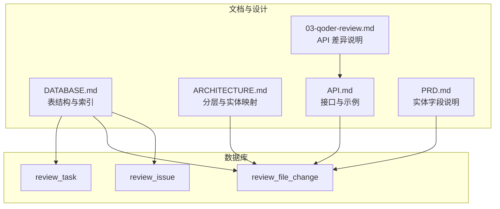
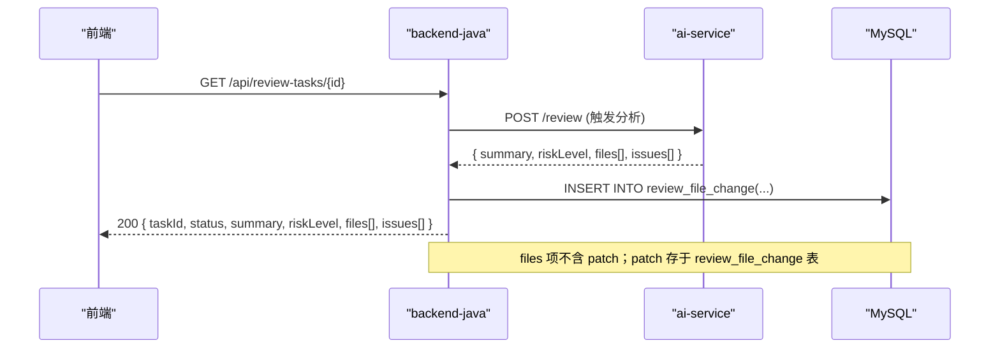
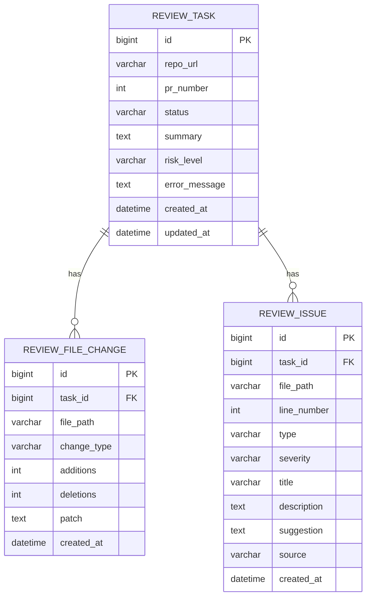
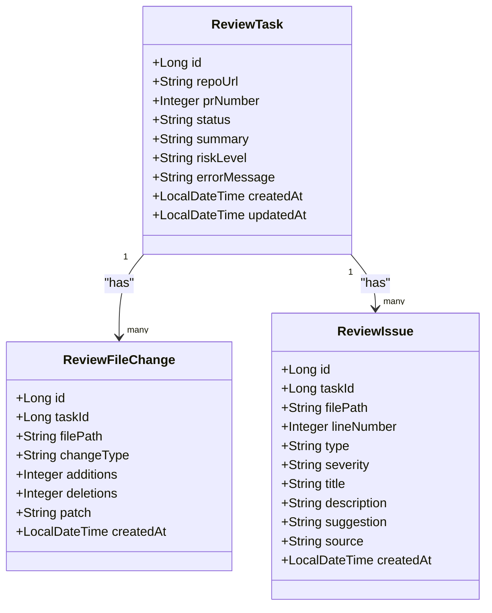

# ReviewFileChange 文件变更实体

<cite>
**本文引用的文件**
- [DATABASE.md](file://docs/DATABASE.md)
- [ARCHITECTURE.md](file://docs/ARCHITECTURE.md)
- [API.md](file://docs/API.md)
- [PRD.md](file://docs/PRD.md)
- [03-qoder-review.md](file://handoff/round-01/03-qoder-review.md)
</cite>

## 目录
1. [简介](#简介)
2. [项目结构](#项目结构)
3. [核心组件](#核心组件)
4. [架构总览](#架构总览)
5. [详细组件分析](#详细组件分析)
6. [依赖关系分析](#依赖关系分析)
7. [性能考量](#性能考量)
8. [故障排查指南](#故障排查指南)
9. [结论](#结论)
10. [附录](#附录)

## 简介
ReviewFileChange 是 CodeReviewX MVP 阶段用于记录单个 PR 变更文件信息的核心数据实体。其设计目标是在任务维度下，完整保留每个被分析文件的变更类型、新增/删除行数以及 diff 片段，从而支撑前端展示、统计分析与问题定位。

该实体与 ReviewTask 保持“一对多”关系：一个任务可包含多个文件变更记录；同时，ReviewIssue 也以任务为纽带关联到具体文件路径，形成“任务-文件变更-问题”的三层数据视图。

## 项目结构
围绕 ReviewFileChange 的相关文档与设计分布在如下位置：
- 数据库设计：docs/DATABASE.md
- 架构与分层：docs/ARCHITECTURE.md
- API 规范与示例：docs/API.md
- PRD 与实体说明：docs/PRD.md
- 设计走查与差异说明：handoff/round-01/03-qoder-review.md

图表来源
- [DATABASE.md:63-76](file://docs/DATABASE.md#L63-L76)
- [ARCHITECTURE.md:190-220](file://docs/ARCHITECTURE.md#L190-L220)
- [API.md:145-240](file://docs/API.md#L145-L240)
- [PRD.md:141-153](file://docs/PRD.md#L141-L153)
- [03-qoder-review.md:170-180](file://handoff/round-01/03-qoder-review.md#L170-L180)

章节来源
- [DATABASE.md:59-92](file://docs/DATABASE.md#L59-L92)
- [ARCHITECTURE.md:190-220](file://docs/ARCHITECTURE.md#L190-L220)
- [API.md:145-240](file://docs/API.md#L145-L240)
- [PRD.md:141-153](file://docs/PRD.md#L141-L153)
- [03-qoder-review.md:170-180](file://handoff/round-01/03-qoder-review.md#L170-L180)

## 核心组件
ReviewFileChange 作为 PR 变更文件表，承载以下关键职责：
- 记录每个文件的变更类型，支持 added/modified/deleted 三类语义
- 统计每文件的新增与删除行数，便于快速评估改动规模
- 在 MVP 阶段存储 diff 片段，支撑后续展示与回溯

字段定义与业务意义（基于 DATABASE.md 与 PRD.md）：
- id：主键，唯一标识文件变更记录
- task_id：外键关联 review_task.id，建立任务与文件变更的归属关系
- file_path：文件绝对路径，用于问题定位与前端展示
- change_type：变更类型，区分新增、修改、删除
- additions/deletions：新增/删除行数，用于统计与排序
- patch：diff 片段，MVP 阶段采用 TEXT 类型
- created_at：创建时间，用于排序与审计

章节来源
- [DATABASE.md:63-76](file://docs/DATABASE.md#L63-L76)
- [DATABASE.md:79-90](file://docs/DATABASE.md#L79-L90)
- [PRD.md:141-153](file://docs/PRD.md#L141-L153)

## 架构总览
ReviewFileChange 在整体系统中的位置如下：
- 由 ai-service 返回的分析结果中包含 files 列表，其中每项包含 filePath、changeType、additions、deletions 与 patch
- backend-java 将这些数据持久化至 review_file_change 表
- 前端在任务详情接口中消费 files 列表（注意：API.md 中任务详情响应不包含 patch 字段，patch 存于数据库表）

图表来源
- [API.md:145-240](file://docs/API.md#L145-L240)
- [API.md:243-332](file://docs/API.md#L243-L332)
- [DATABASE.md:63-76](file://docs/DATABASE.md#L63-L76)
- [03-qoder-review.md:170-180](file://handoff/round-01/03-qoder-review.md#L170-L180)

章节来源
- [API.md:145-240](file://docs/API.md#L145-L240)
- [API.md:243-332](file://docs/API.md#L243-L332)
- [03-qoder-review.md:170-180](file://handoff/round-01/03-qoder-review.md#L170-L180)

## 详细组件分析

### 数据模型定义
ReviewFileChange 的表结构与约束如下：
- 主键：id
- 外键：task_id 引用 review_task(id)
- 索引：idx_task_id(task_id)，加速按任务查询
- 字段：file_path、change_type、additions、deletions、patch、created_at

图表来源
- [DATABASE.md:27-41](file://docs/DATABASE.md#L27-L41)
- [DATABASE.md:64-76](file://docs/DATABASE.md#L64-L76)
- [DATABASE.md:99-116](file://docs/DATABASE.md#L99-L116)

章节来源
- [DATABASE.md:27-41](file://docs/DATABASE.md#L27-L41)
- [DATABASE.md:64-76](file://docs/DATABASE.md#L64-L76)
- [DATABASE.md:99-116](file://docs/DATABASE.md#L99-L116)

### 字段说明与业务规则
- id：自增主键，唯一标识每条文件变更记录
- task_id：外键，指向 review_task.id，确保变更归属明确
- file_path：文件路径，用于前端展示与问题定位
- change_type：变更类型枚举，added/modified/deleted
- additions/deletions：整型计数，表示新增/删除行数，用于统计与排序
- patch：diff 片段，MVP 阶段使用 TEXT 类型
- created_at：默认当前时间，用于排序与审计

章节来源
- [DATABASE.md:79-90](file://docs/DATABASE.md#L79-L90)
- [PRD.md:141-153](file://docs/PRD.md#L141-L153)

### 变更类型枚举与使用场景
- added：新增文件，通常出现在首次引入新模块或新功能文件时
- modified：修改文件，最常见，体现对既有代码的改动
- deleted：删除文件，当 PR 中移除文件时出现

使用场景举例：
- added：新特性模块首次提交，便于快速识别新增范围
- modified：重构或修复缺陷，关注新增/删除行数以评估影响面
- deleted：废弃模块清理，需配合删除行数进行影响评估

章节来源
- [DATABASE.md:240-247](file://docs/DATABASE.md#L240-L247)
- [API.md:280-308](file://docs/API.md#L280-L308)

### additions 与 deletions 的统计逻辑与业务意义
- 统计逻辑：由 ai-service 在解析 PR diff 时计算每文件的新增与删除行数
- 业务意义：
  - 影响面评估：additions + deletions 可粗略估计改动体量
  - 优先级排序：按行数排序筛选高风险文件
  - 质量监控：异常高的新增/删除行数提示需要更严格审查

章节来源
- [API.md:280-308](file://docs/API.md#L280-L308)
- [API.md:172-179](file://docs/API.md#L172-L179)

### patch 字段设计考虑与性能影响
- 设计考虑：MVP 阶段直接存储 diff 片段，简化前端渲染与回溯逻辑
- 类型选择：TEXT（最大约 64KB），适合大多数 PR diff
- 潜在影响：
  - 存储压力：大 PR 可能导致单条记录体积较大
  - 查询开销：SELECT * 时会携带 patch，增加网络与序列化成本
  - 索引策略：建议按需查询 patch，避免频繁读取
- 建议演进：若未来 diff 过大，可考虑改为 MEDIUMTEXT 或将 patch 独立存储并以文件名/哈希引用

章节来源
- [DATABASE.md:288-294](file://docs/DATABASE.md#L288-L294)
- [API.md:280-308](file://docs/API.md#L280-L308)

### 实际数据示例
- ai-service 返回的 files 项包含 filePath、changeType、additions、deletions 与 patch
- 前端任务详情响应 files 项不含 patch，patch 存于 review_file_change 表

章节来源
- [API.md:280-308](file://docs/API.md#L280-L308)
- [API.md:172-179](file://docs/API.md#L172-L179)
- [03-qoder-review.md:170-180](file://handoff/round-01/03-qoder-review.md#L170-L180)

### 文件变更分析场景
- 场景一：按任务聚合文件变更
  - 查询：SELECT task_id, change_type, SUM(additions), SUM(deletions) FROM review_file_change WHERE task_id = ? GROUP BY task_id, change_type
  - 用途：生成任务级改动统计
- 场景二：按文件路径检索变更
  - 查询：SELECT * FROM review_file_change WHERE task_id = ? AND file_path = ?
  - 用途：定位特定文件的变更详情
- 场景三：按任务与变更类型过滤
  - 查询：SELECT * FROM review_file_change WHERE task_id = ? AND change_type IN ('added','modified')
  - 用途：筛选新增与修改文件，优先审查

章节来源
- [DATABASE.md:63-76](file://docs/DATABASE.md#L63-L76)

## 依赖关系分析
ReviewFileChange 与 ReviewTask、ReviewIssue 的依赖关系如下：

图表来源
- [DATABASE.md:27-41](file://docs/DATABASE.md#L27-L41)
- [DATABASE.md:64-76](file://docs/DATABASE.md#L64-L76)
- [DATABASE.md:99-116](file://docs/DATABASE.md#L99-L116)

章节来源
- [DATABASE.md:27-41](file://docs/DATABASE.md#L27-L41)
- [DATABASE.md:64-76](file://docs/DATABASE.md#L64-L76)
- [DATABASE.md:99-116](file://docs/DATABASE.md#L99-L116)

## 性能考量
- 存储与索引
  - idx_task_id(task_id)：按任务查询文件变更必备
  - patch 字段 TEXT：建议按需查询，避免 SELECT * 导致传输与反序列化开销
- 查询模式
  - 常见：按 task_id 聚合统计（change_type、additions、deletions）
  - 辅助：按 file_path 精确匹配定位
- 扩展建议
  - 若 diff 过大，考虑 MEDIUMTEXT 或拆表存储
  - 对高频查询字段建立复合索引（如 task_id + change_type）

章节来源
- [DATABASE.md:63-76](file://docs/DATABASE.md#L63-L76)
- [DATABASE.md:288-294](file://docs/DATABASE.md#L288-L294)

## 故障排查指南
- 常见问题
  - 任务详情 files 不包含 patch：这是预期行为，patch 存于 review_file_change 表
  - 大 diff 导致存储/传输问题：TEXT 约 64KB，建议评估是否升级为 MEDIUMTEXT
  - 外键约束导致删除失败：MVP 阶段未启用 ON DELETE CASCADE，需先清理子表
- 排查步骤
  - 确认 task_id 是否正确
  - 检查 change_type 是否符合 added/modified/deleted
  - 核对 file_path 是否一致
  - 如需查看 patch，单独查询 review_file_change 表

章节来源
- [03-qoder-review.md:170-180](file://handoff/round-01/03-qoder-review.md#L170-L180)
- [DATABASE.md:288-294](file://docs/DATABASE.md#L288-L294)

## 结论
ReviewFileChange 以简洁明确的字段设计，完整覆盖了 PR 文件变更的核心要素。通过与 ReviewTask 的外键关联与索引优化，可在 MVP 阶段高效支撑任务级统计与文件级定位。随着业务发展，可按需扩展 patch 存储策略与索引组合，持续提升性能与可维护性。

## 附录
- 变更类型枚举值对照
  - added：新增文件
  - modified：修改文件
  - deleted：删除文件

章节来源
- [DATABASE.md:240-247](file://docs/DATABASE.md#L240-L247)