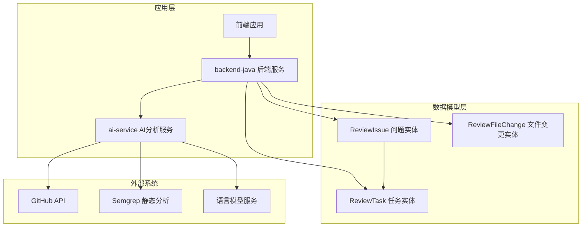
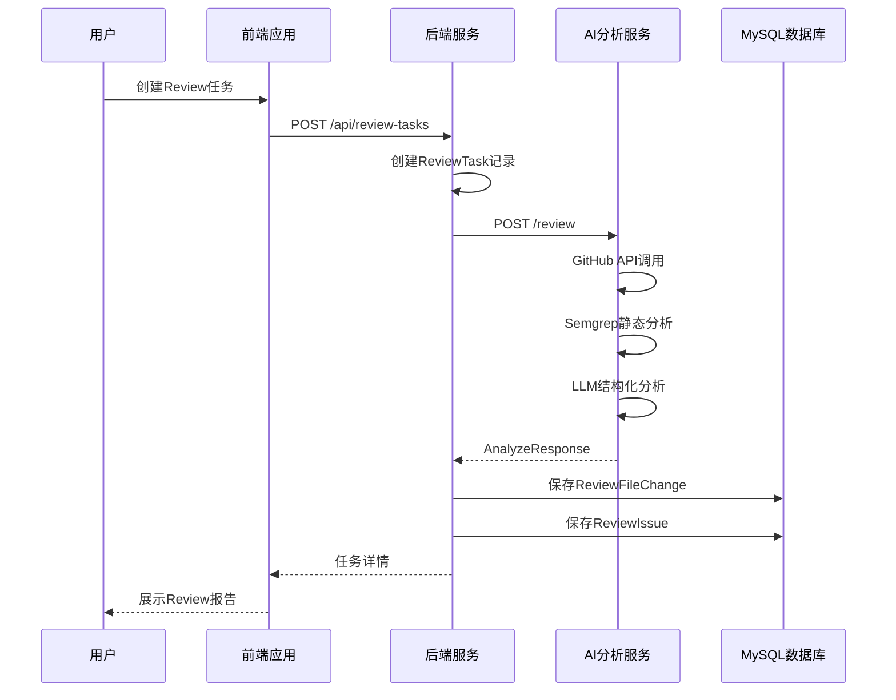
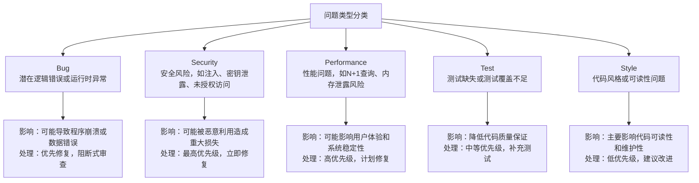
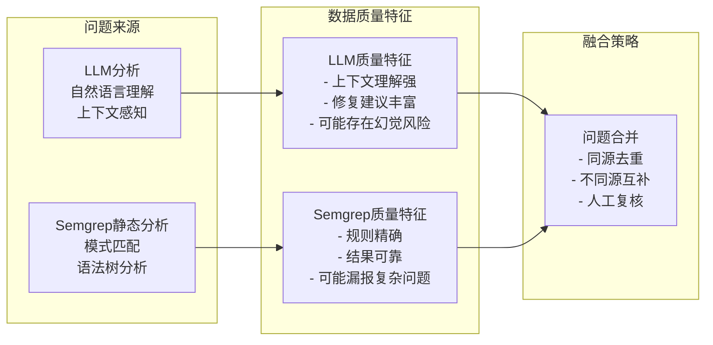
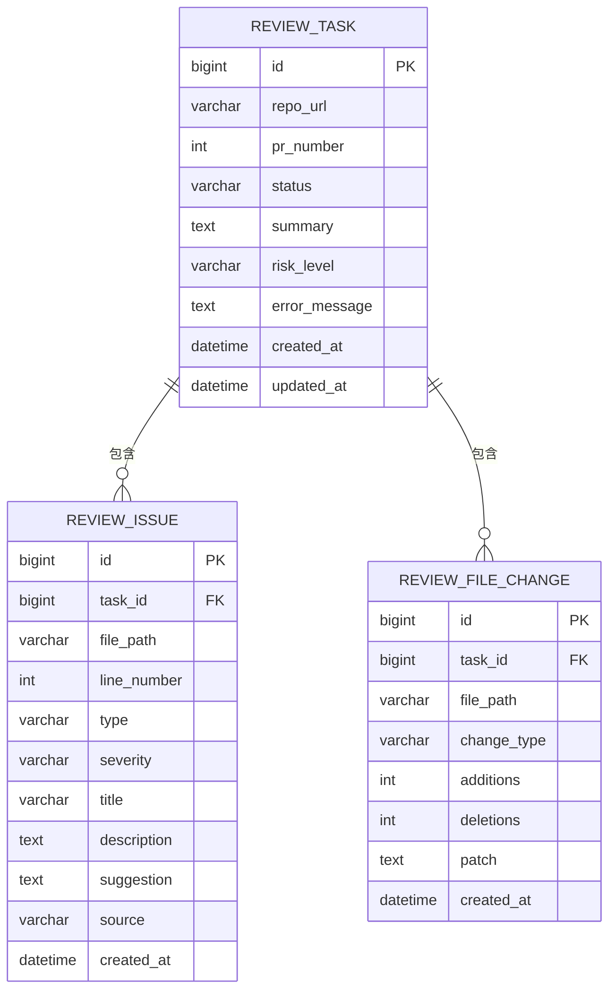
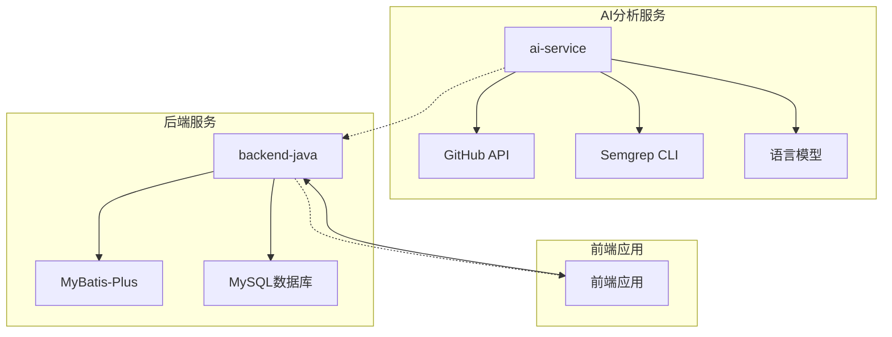
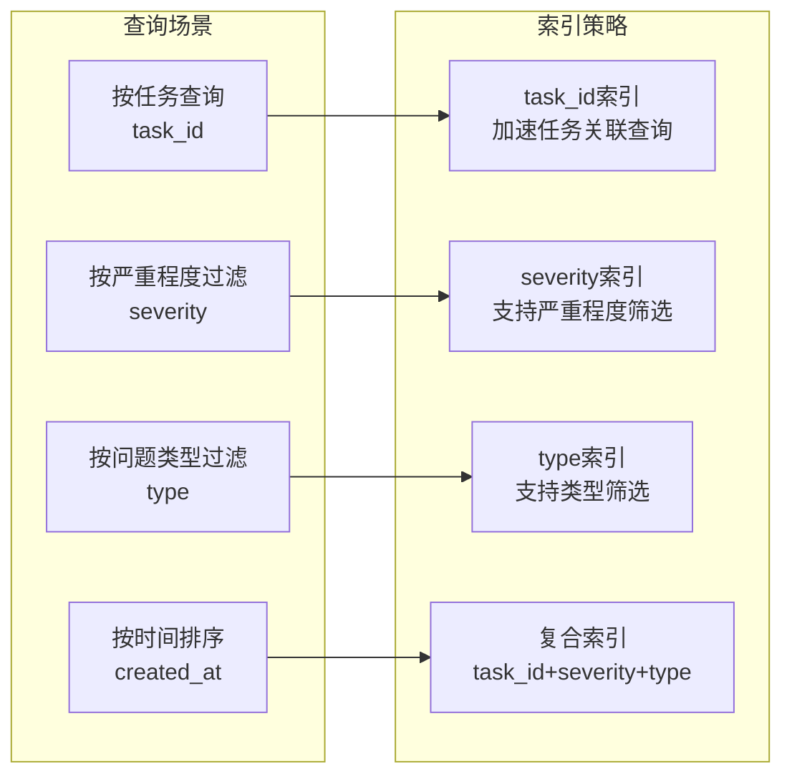
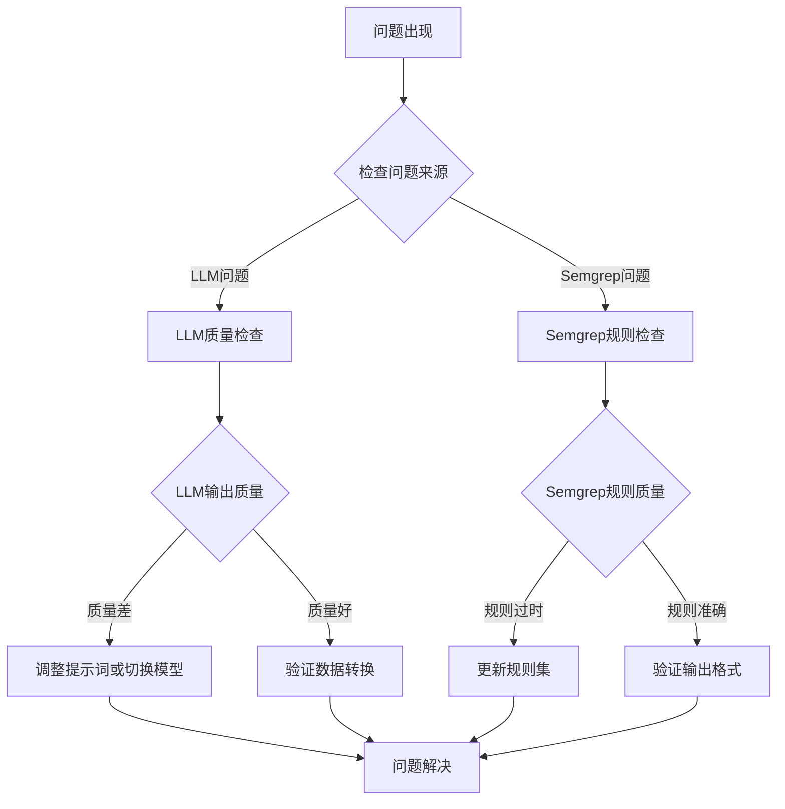

# ReviewIssue 问题实体

<cite>
**本文档引用的文件**
- [DATABASE.md](file://docs/DATABASE.md)
- [PRD.md](file://docs/PRD.md)
- [API.md](file://docs/API.md)
- [ARCHITECTURE.md](file://docs/ARCHITECTURE.md)
- [ai-service/README.md](file://ai-service/README.md)
- [frontend/README.md](file://frontend/README.md)
</cite>

## 目录
1. [简介](#简介)
2. [项目结构](#项目结构)
3. [核心组件](#核心组件)
4. [架构概览](#架构概览)
5. [详细组件分析](#详细组件分析)
6. [依赖关系分析](#依赖关系分析)
7. [性能考虑](#性能考虑)
8. [故障排除指南](#故障排除指南)
9. [结论](#结论)

## 简介

ReviewIssue 问题是 CodeReviewX 智能代码审查系统的核心数据实体，用于存储和管理从 GitHub Pull Request 分析中发现的各种代码问题。该实体设计遵循结构化数据建模原则，支持多种问题类型和严重程度级别的分类，为开发者提供全面的代码质量分析报告。

该实体不仅记录了技术层面的问题信息，更重要的是提供了问题来源的追踪机制，使得开发者能够区分 LLM 分析生成的问题和 Semgrep 静态分析发现的问题，从而更好地理解问题的性质和可信度。

## 项目结构

CodeReviewX 采用分层架构设计，ReviewIssue 实体作为数据持久化层的重要组成部分，与任务管理和文件变更实体形成完整的数据模型体系。

**图表来源**
- [ARCHITECTURE.md: 19-52:19-52](file://docs/ARCHITECTURE.md#L19-L52)
- [DATABASE.md: 94-117:94-117](file://docs/DATABASE.md#L94-L117)

**章节来源**
- [ARCHITECTURE.md: 19-52:19-52](file://docs/ARCHITECTURE.md#L19-L52)
- [DATABASE.md: 94-117:94-117](file://docs/DATABASE.md#L94-L117)

## 核心组件

ReviewIssue 实体作为 Review 问题表，承载着系统的核心业务数据。该实体的设计体现了以下设计理念：

### 数据完整性保障
- **主键约束**：使用自增 BIGINT 类型确保每条问题记录的唯一性
- **外键关联**：与 ReviewTask 实体建立严格的父子关系，保证数据一致性
- **时间戳管理**：自动记录创建和更新时间，便于审计和排序

### 语义化字段设计
- **问题标识**：通过 type 和 severity 字段提供清晰的问题分类和严重程度
- **定位信息**：file_path 和 line_number 支持精确的问题定位
- **内容描述**：title、description 和 suggestion 提供完整的问题描述和修复指导
- **来源追踪**：source 字段记录问题发现的具体来源

**章节来源**
- [DATABASE.md: 94-134:94-134](file://docs/DATABASE.md#L94-L134)
- [PRD.md: 154-168:154-168](file://docs/PRD.md#L154-L168)

## 架构概览

ReviewIssue 实体在整个系统架构中扮演着关键角色，连接着前端展示、后端业务逻辑、AI 分析服务和数据库存储。

**图表来源**
- [ARCHITECTURE.md: 139-168:139-168](file://docs/ARCHITECTURE.md#L139-L168)
- [API.md: 247-302:247-302](file://docs/API.md#L247-L302)

**章节来源**
- [ARCHITECTURE.md: 139-168:139-168](file://docs/ARCHITECTURE.md#L139-L168)
- [API.md: 247-302:247-302](file://docs/API.md#L247-L302)

## 详细组件分析

### 字段定义与约束

ReviewIssue 实体包含以下核心字段，每个字段都有明确的业务含义和约束条件：

| 字段名 | 类型 | 必填 | 默认值 | 约束 | 描述 |
|--------|------|------|--------|------|------|
| id | BIGINT | 是 | 自增 | 主键 | 问题记录唯一标识符 |
| task_id | BIGINT | 是 | - | 外键 | 关联的ReviewTask记录ID |
| file_path | VARCHAR(500) | 是 | - | 非空 | 发现问题的文件绝对路径 |
| line_number | INT | 否 | NULL | - | 问题在文件中的行号 |
| type | VARCHAR(20) | 是 | - | 枚举值 | 问题类型分类 |
| severity | VARCHAR(10) | 是 | - | 枚举值 | 问题严重程度级别 |
| title | VARCHAR(255) | 是 | - | 非空 | 问题简要描述标题 |
| description | TEXT | 是 | - | 非空 | 问题详细描述内容 |
| suggestion | TEXT | 否 | NULL | - | 具体的修复建议和指导 |
| source | VARCHAR(20) | 是 | - | 枚举值 | 问题来源标识 |
| created_at | DATETIME | 是 | CURRENT_TIMESTAMP | - | 记录创建时间戳 |

**章节来源**
- [DATABASE.md: 94-134:94-134](file://docs/DATABASE.md#L94-L134)
- [PRD.md: 154-168:154-168](file://docs/PRD.md#L154-L168)

### 问题类型分类体系

ReviewIssue 实体支持五种主要的问题类型，每种类型都有明确的定义和处理策略：

**图表来源**
- [PRD.md: 104-122:104-122](file://docs/PRD.md#L104-L122)
- [API.md: 354-362:354-362](file://docs/API.md#L354-L362)

### 严重程度评估体系

严重程度等级为问题处理提供了明确的优先级指导：

| 严重程度 | 数值权重 | 业务影响 | 处理优先级 | 典型场景 |
|----------|----------|----------|------------|----------|
| LOW | 1 | 影响较小，可忽略 | 低优先级 | 代码风格问题、小的可读性问题 |
| MEDIUM | 2 | 中等影响，需要关注 | 中等优先级 | 逻辑优化、小的安全隐患 |
| HIGH | 3 | 严重影响，必须修复 | 最高优先级 | 运行时错误、安全漏洞、性能瓶颈 |

**章节来源**
- [PRD.md: 232-239:232-239](file://docs/PRD.md#L232-L239)
- [API.md: 364-370:364-370](file://docs/API.md#L364-L370)

### 问题来源追踪机制

ReviewIssue 实体通过 source 字段实现了问题来源的精确追踪：

**图表来源**
- [PRD.md: 116-122:116-122](file://docs/PRD.md#L116-L122)
- [API.md: 372-378:372-378](file://docs/API.md#L372-L378)

**章节来源**
- [PRD.md: 116-122:116-122](file://docs/PRD.md#L116-L122)
- [API.md: 372-378:372-378](file://docs/API.md#L372-L378)

### 数据模型关系图

**图表来源**
- [DATABASE.md: 27-40:27-40](file://docs/DATABASE.md#L27-L40)
- [DATABASE.md: 99-117:99-117](file://docs/DATABASE.md#L99-L117)
- [DATABASE.md: 166-178:166-178](file://docs/DATABASE.md#L166-L178)

**章节来源**
- [DATABASE.md: 27-40:27-40](file://docs/DATABASE.md#L27-L40)
- [DATABASE.md: 99-117:99-117](file://docs/DATABASE.md#L99-L117)
- [DATABASE.md: 166-178:166-178](file://docs/DATABASE.md#L166-L178)

## 依赖关系分析

ReviewIssue 实体与其他系统组件之间存在紧密的依赖关系：

### 外部依赖

**图表来源**
- [ARCHITECTURE.md: 37-46:37-46](file://docs/ARCHITECTURE.md#L37-L46)
- [ARCHITECTURE.md: 183-220:183-220](file://docs/ARCHITECTURE.md#L183-L220)

### 内部耦合关系

ReviewIssue 实体与相关组件的交互关系体现了清晰的职责分离：

| 组件 | 职责 | 与ReviewIssue的关系 |
|------|------|-------------------|
| ReviewTask | 任务生命周期管理 | 父实体，提供任务上下文 |
| ReviewFileChange | 文件变更跟踪 | 同属任务域，提供文件上下文 |
| ai-service | 问题发现和生成 | 数据来源，提供标准化问题 |
| backend-java | 数据持久化 | 存储和查询操作 |
| frontend | 数据展示 | 查询和展示问题列表 |

**章节来源**
- [ARCHITECTURE.md: 73-107:73-107](file://docs/ARCHITECTURE.md#L73-L107)
- [DATABASE.md: 112-116:112-116](file://docs/DATABASE.md#L112-L116)

## 性能考虑

### 索引设计策略

ReviewIssue 实体的索引设计针对常见的查询模式进行了优化：

**图表来源**
- [DATABASE.md: 112-116:112-116](file://docs/DATABASE.md#L112-L116)

### 查询优化建议

1. **批量查询优化**：对于任务详情查询，建议使用 JOIN 操作一次性获取所有相关问题
2. **分页策略**：实现基于 created_at 的游标分页，避免 OFFSET 查询的性能问题
3. **缓存策略**：对热门任务的问题列表实施适当的缓存机制
4. **索引维护**：定期分析和重建索引，保持查询性能稳定

**章节来源**
- [DATABASE.md: 112-116:112-116](file://docs/DATABASE.md#L112-L116)

## 故障排除指南

### 常见问题诊断

### 数据一致性检查

1. **外键约束验证**：定期检查 task_id 是否指向有效的 ReviewTask 记录
2. **枚举值校验**：验证 type、severity、source 字段是否符合预定义枚举值
3. **路径有效性**：检查 file_path 是否指向实际存在的文件
4. **时间戳一致性**：验证 created_at 和 updated_at 字段的时间逻辑

**章节来源**
- [ARCHITECTURE.md: 170-180:170-180](file://docs/ARCHITECTURE.md#L170-L180)
- [DATABASE.md: 112-116:112-116](file://docs/DATABASE.md#L112-L116)

## 结论

ReviewIssue 问题实体作为 CodeReviewX 系统的核心数据模型，体现了现代代码审查系统的最佳实践。其设计充分考虑了数据完整性、查询性能和扩展性需求，为构建高质量的智能代码审查平台奠定了坚实的基础。

该实体的成功实施将带来以下价值：
- **提升代码质量**：通过结构化的问题分类和严重程度评估，帮助开发者识别和修复关键问题
- **增强开发效率**：自动化的问题发现和修复建议减少手动审查的工作量
- **改善协作体验**：清晰的问题来源追踪促进团队间的有效沟通和协作
- **支持持续改进**：完善的指标体系为代码质量的持续改进提供数据支撑

随着系统的发展，ReviewIssue 实体还可以进一步扩展以支持更复杂的分析场景，如多语言支持、自定义规则集成和智能化的优先级排序等功能。