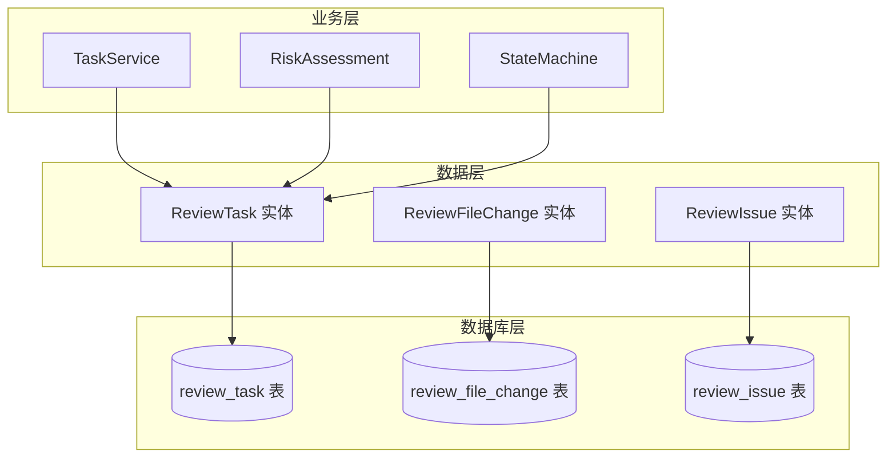
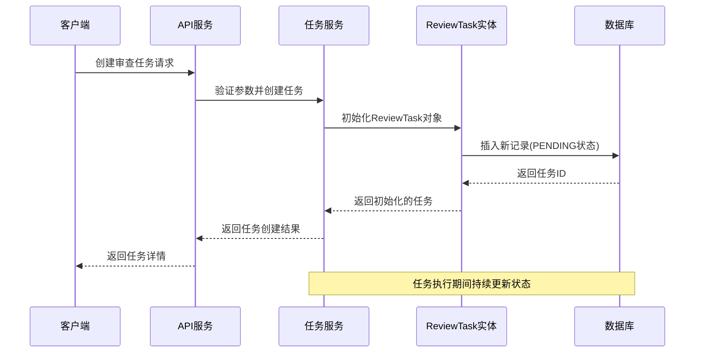
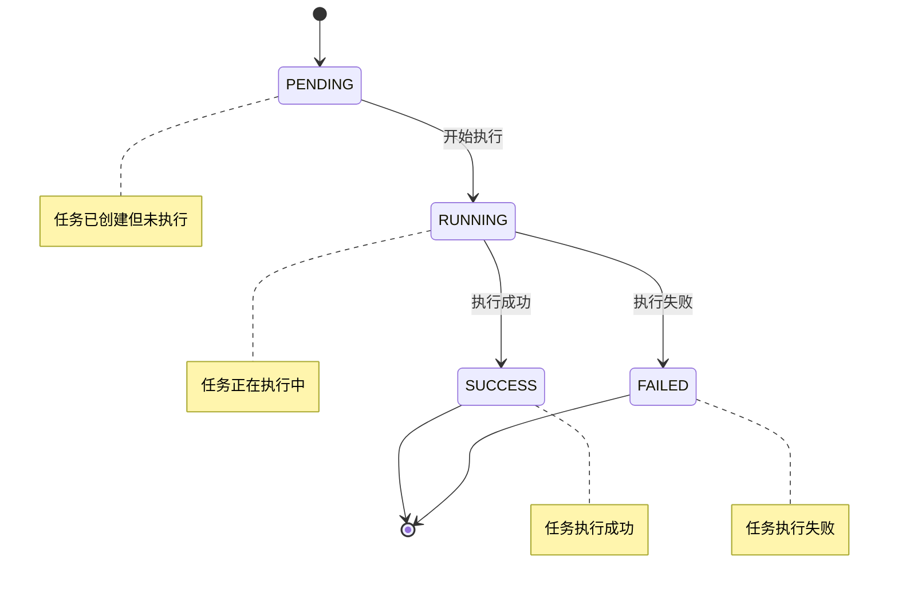
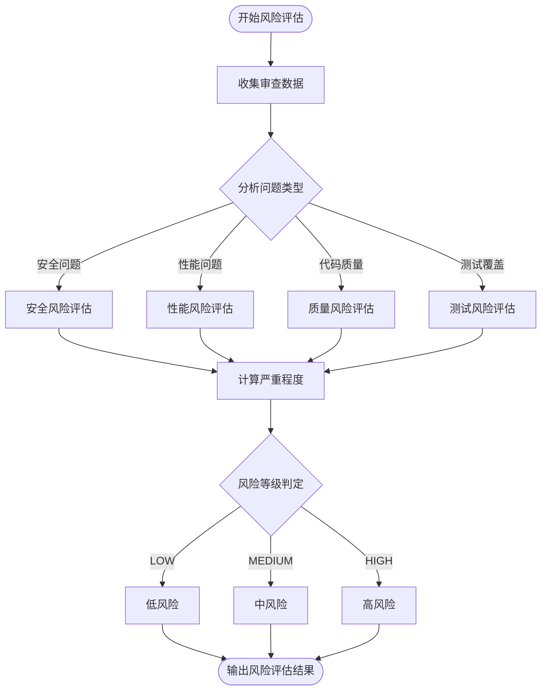
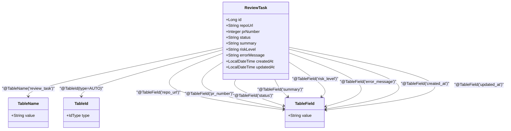
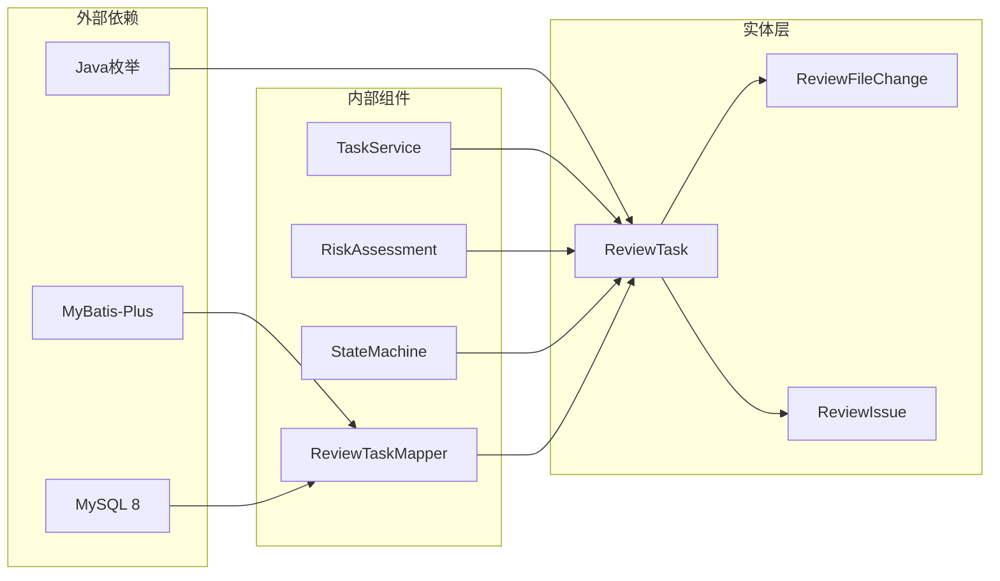

# ReviewTask 任务实体

<cite>
**本文档引用的文件**
- [DATABASE.md](file://docs/DATABASE.md)
</cite>

## 目录
1. [简介](#简介)
2. [项目结构](#项目结构)
3. [核心组件](#核心组件)
4. [架构概览](#架构概览)
5. [详细组件分析](#详细组件分析)
6. [依赖关系分析](#依赖关系分析)
7. [性能考虑](#性能考虑)
8. [故障排除指南](#故障排除指南)
9. [结论](#结论)

## 简介

ReviewTask是CodeReviewX系统的核心任务实体，作为任务主表负责存储代码审查任务的元信息、执行状态和结果摘要。该实体采用MyBatis-Plus框架进行ORM映射，支持完整的生命周期管理，从任务创建到执行完成的全过程跟踪。

本实体设计遵循数据库规范化原则，通过明确的状态管理和风险评估机制，为代码审查流程提供了可靠的数据支撑。系统通过状态机模式确保任务执行的有序性和可追踪性。

## 项目结构

ReviewTask实体位于系统的数据层，与数据库表结构保持严格对应关系：

**图表来源**
- [DATABASE.md:22-41](file://docs/DATABASE.md#L22-L41)
- [DATABASE.md:59-77](file://docs/DATABASE.md#L59-L77)
- [DATABASE.md:94-117](file://docs/DATABASE.md#L94-L117)

**章节来源**
- [DATABASE.md:1-294](file://docs/DATABASE.md#L1-L294)

## 核心组件

### ReviewTask 实体概述

ReviewTask作为任务主表，承担着以下核心职责：
- 存储任务的基本元信息（仓库URL、PR编号）
- 维护任务执行状态的完整生命周期
- 记录审查结果的摘要信息
- 提供风险评估和错误处理机制

### 字段定义与约束

ReviewTask实体包含以下关键字段：

| 字段名 | 类型 | 长度限制 | 必填 | 默认值 | 描述 |
|--------|------|----------|------|--------|------|
| id | BIGINT | - | 是 | 自增 | 主键标识符 |
| repo_url | VARCHAR | 500 | 是 | - | GitHub仓库地址 |
| pr_number | INT | - | 是 | - | Pull Request编号 |
| status | VARCHAR | 20 | 是 | PENDING | 任务执行状态 |
| summary | TEXT | - | 否 | - | 审查结果摘要 |
| risk_level | VARCHAR | 10 | 否 | - | 风险评估等级 |
| error_message | TEXT | - | 否 | - | 错误原因说明 |
| created_at | DATETIME | - | 是 | 当前时间 | 记录创建时间 |
| updated_at | DATETIME | - | 是 | 当前时间 | 记录更新时间 |

**章节来源**
- [DATABASE.md:26-56](file://docs/DATABASE.md#L26-L56)

## 架构概览

ReviewTask实体在整个系统架构中扮演着核心协调者的角色：

**图表来源**
- [DATABASE.md:269-284](file://docs/DATABASE.md#L269-L284)

## 详细组件分析

### 状态管理系统

ReviewTask实现了完整的状态机模式，支持四种核心状态：

**图表来源**
- [DATABASE.md:205-213](file://docs/DATABASE.md#L205-L213)

#### 状态流转规则

| 当前状态 | 触发条件 | 下一状态 | 业务含义 |
|----------|----------|----------|----------|
| PENDING | 任务创建成功 | RUNNING | 开始执行审查流程 |
| RUNNING | 审查过程进行中 | SUCCESS/FAILED | 执行完成，进入最终状态 |
| SUCCESS | 所有检查通过 | [*] | 任务正常结束 |
| FAILED | 发生错误或检查失败 | [*] | 任务异常结束 |

### 风险评估体系

ReviewTask引入了多维度的风险评估机制：

**图表来源**
- [DATABASE.md:214-221](file://docs/DATABASE.md#L214-L221)

#### 风险等级评估标准

| 风险等级 | 评估标准 | 应用场景 |
|----------|----------|----------|
| LOW | 少量轻微问题，无安全漏洞，性能影响可忽略 | 普通功能开发，常规代码审查 |
| MEDIUM | 中等数量的问题，存在潜在安全风险或性能问题 | 核心功能模块，重要接口 |
| HIGH | 大量严重问题，包含安全漏洞或重大性能缺陷 | 关键系统组件，生产环境代码 |

### MyBatis-Plus 映射配置

ReviewTask实体采用MyBatis-Plus提供的注解驱动映射：

**图表来源**
- [DATABASE.md:269-284](file://docs/DATABASE.md#L269-L284)

**章节来源**
- [DATABASE.md:257-284](file://docs/DATABASE.md#L257-L284)

## 依赖关系分析

ReviewTask实体与其他组件的依赖关系：

**图表来源**
- [DATABASE.md:259-264](file://docs/DATABASE.md#L259-L264)

**章节来源**
- [DATABASE.md:257-294](file://docs/DATABASE.md#L257-L294)

## 性能考虑

### 查询优化策略

ReviewTask实体的查询性能优化主要体现在索引设计上：

| 索引类型 | 字段 | 用途 | 性能收益 |
|----------|------|------|----------|
| 主键索引 | id | 唯一标识 | O(log n)查找 |
| 普通索引 | status | 状态过滤 | 快速筛选特定状态任务 |
| 普通索引 | created_at | 时间排序 | 快速获取最新任务 |

### 数据库设计最佳实践

1. **字段长度控制**：合理设置VARCHAR长度，避免过度占用存储空间
2. **索引策略**：为高频查询字段建立适当索引
3. **时间字段**：使用DATETIME类型支持自动时间戳管理
4. **字符集选择**：采用utf8mb4支持完整的Unicode字符

## 故障排除指南

### 常见问题及解决方案

| 问题类型 | 症状 | 可能原因 | 解决方案 |
|----------|------|----------|----------|
| 状态异常 | 任务卡在PENDING状态 | 任务调度器故障 | 检查任务队列和调度服务 |
| 风险评估错误 | 风险等级不准确 | 问题分类错误 | 验证问题类型映射 |
| 数据库连接 | 连接超时或失败 | 连接池配置不当 | 调整连接池参数 |
| 性能问题 | 查询响应慢 | 缺少必要索引 | 添加或优化现有索引 |

### 调试建议

1. **日志监控**：启用详细的实体操作日志
2. **状态检查**：定期检查任务状态一致性
3. **性能监控**：监控数据库查询性能指标
4. **错误追踪**：建立完善的错误报告机制

**章节来源**
- [DATABASE.md:288-294](file://docs/DATABASE.md#L288-L294)

## 结论

ReviewTask实体作为CodeReviewX系统的核心数据模型，通过精心设计的状态管理和风险评估机制，为代码审查流程提供了可靠的基础设施。其采用的MyBatis-Plus ORM映射方案确保了与数据库的良好兼容性，同时保持了代码的简洁性和可维护性。

该实体设计充分考虑了扩展性需求，在保证当前功能完整性的同时，为未来的功能增强预留了充足的空间。通过明确的业务规则和严格的约束条件，ReviewTask实体为整个代码审查系统奠定了坚实的数据基础。