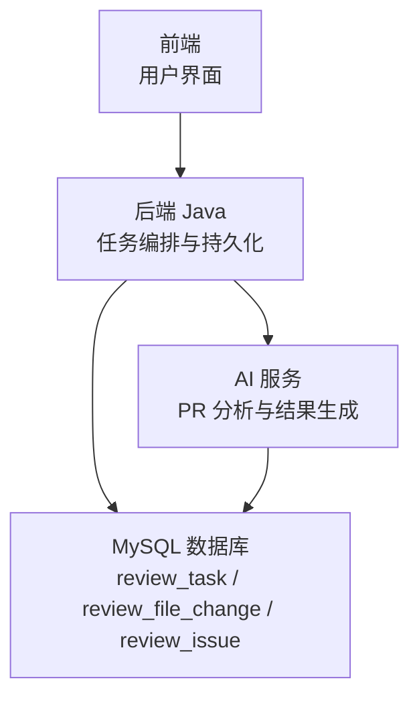
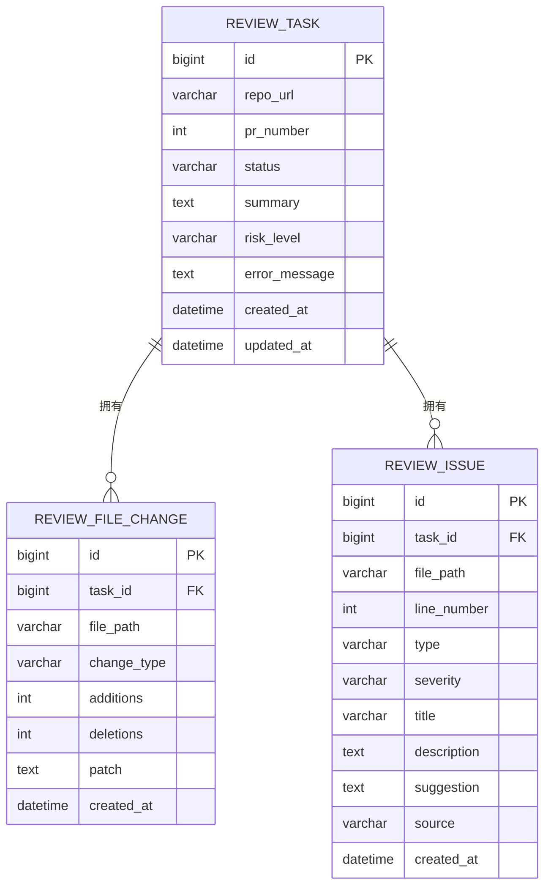
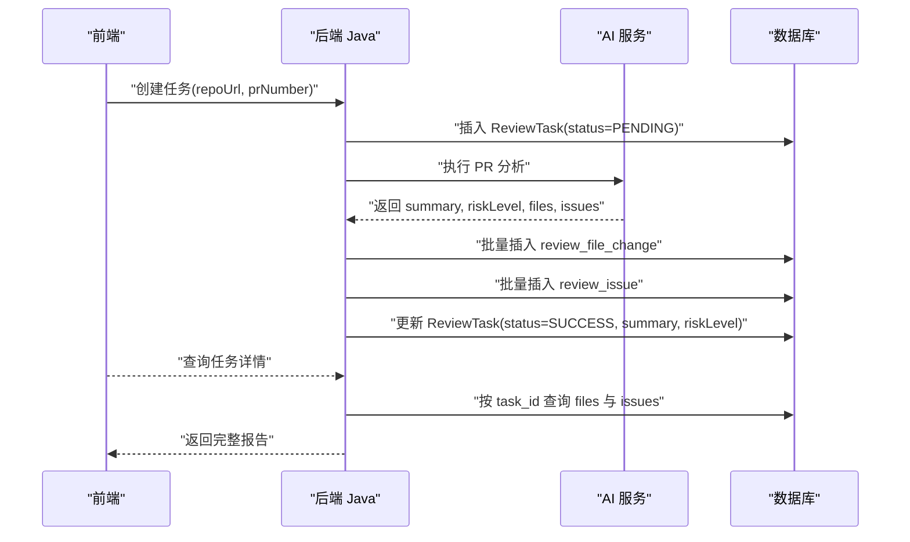
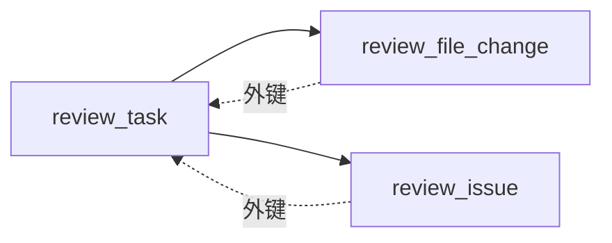

# 核心实体模型

<cite>
**本文引用的文件**
- [数据库设计文档](file://docs/DATABASE.md)
- [产品需求文档](file://docs/PRD.md)
- [API 设计文档](file://docs/API.md)
</cite>

## 目录
1. [简介](#简介)
2. [项目结构](#项目结构)
3. [核心组件](#核心组件)
4. [架构总览](#架构总览)
5. [详细组件分析](#详细组件分析)
6. [依赖分析](#依赖分析)
7. [性能考量](#性能考量)
8. [故障排查指南](#故障排查指南)
9. [结论](#结论)
10. [附录](#附录)

## 简介
本文件围绕 CodeReviewX 的核心实体模型，系统化梳理 ReviewTask、ReviewFileChange、ReviewIssue 三张表的设计理念、业务含义、字段定义、约束条件、默认值与业务规则，并阐明实体间的关联关系与外键约束设计。文档同时覆盖实体生命周期管理、数据完整性保障与关键业务逻辑约束，并提供字段说明表与典型业务场景示例，帮助读者快速理解与落地实现。

## 项目结构
- 本项目采用“前后端分离 + AI 服务”的三层架构：
  - 前端：用户交互入口，展示 Review 报告。
  - 后端 Java（backend-java）：接收前端请求，编排任务，调用 AI 服务，持久化结果。
  - AI 服务（ai-service）：拉取 GitHub PR、解析变更、调用 Semgrep 与 LLM，生成结构化结果。
- 数据层采用 MySQL 8，字符集为 utf8mb4，引擎为 InnoDB。

## 核心组件
本节对三大核心实体进行总体说明，涵盖业务职责、关键字段与约束。

- ReviewTask（任务主表）
  - 职责：记录一次代码审查任务的元信息、状态与结果摘要。
  - 关键字段：repo_url、pr_number、status、summary、risk_level、error_message、created_at、updated_at。
  - 约束与默认值：status 默认 PENDING；时间字段自动维护。
- ReviewFileChange（文件变更表）
  - 职责：记录 PR 涉及的每个文件的变更信息（新增/修改/删除）。
  - 关键字段：task_id（外键）、file_path、change_type、additions、deletions、patch、created_at。
  - 约束与默认值：additions/deletions 默认 0；外键引用 review_task。
- ReviewIssue（问题表）
  - 职责：记录 LLM 与 Semgrep 分析出的问题清单。
  - 关键字段：task_id（外键）、file_path、line_number、type、severity、title、description、suggestion、source、created_at。
  - 约束与默认值：外键引用 review_task；type/severity/source 为枚举限定。

**章节来源**
- [数据库设计文档: 2.1 review_task:22-41](file://docs/DATABASE.md#L22-L41)
- [数据库设计文档: 2.2 review_file_change:59-77](file://docs/DATABASE.md#L59-L77)
- [数据库设计文档: 2.3 review_issue:94-117](file://docs/DATABASE.md#L94-L117)

## 架构总览
下图展示了三张核心表之间的关系与外键约束，以及典型的数据流向。

**图表来源**
- [数据库设计文档: 2.1 review_task:27-40](file://docs/DATABASE.md#L27-L40)
- [数据库设计文档: 2.2 review_file_change:64-76](file://docs/DATABASE.md#L64-L76)
- [数据库设计文档: 2.3 review_issue:99-116](file://docs/DATABASE.md#L99-L116)

## 详细组件分析

### ReviewTask 实体
- 设计理念
  - 将一次代码审查抽象为一个独立任务，贯穿“创建—执行—落库—展示”的完整生命周期。
  - 通过状态字段驱动任务流程控制，成功后补充总结与风险等级，失败时记录错误原因。
- 字段定义与约束
  - id：主键，自增。
  - repo_url：必填，存储 GitHub 仓库地址。
  - pr_number：必填，PR 编号。
  - status：必填，默认 PENDING，支持枚举值：PENDING、RUNNING、SUCCESS、FAILED。
  - summary：可空，任务成功后填充。
  - risk_level：可空，任务成功后填充，枚举值：LOW、MEDIUM、HIGH。
  - error_message：可空，FAILED 状态时填充。
  - created_at/updated_at：时间戳，created_at 默认当前时间，updated_at 自动更新。
- 业务规则
  - 状态机：PENDING → RUNNING → SUCCESS 或 FAILED。
  - 成功后才填充 summary 与 risk_level；失败时才填充 error_message。
  - 任务唯一性：由 repo_url + pr_number 共同决定（业务层面建议建立唯一索引以避免重复任务）。
- 生命周期管理
  - 创建：前端或外部系统提交 repoUrl + prNumber，后端创建 PENDING 任务。
  - 执行：后端调用 AI 服务，AI 服务完成后回写结果。
  - 落库：后端将文件变更与问题写入对应表，最后更新 ReviewTask 的状态与摘要。
- 数据完整性
  - 外键：ReviewFileChange 与 ReviewIssue 均通过 task_id 引用 ReviewTask。
  - 级联策略：文档明确当前阶段不启用 ON DELETE CASCADE，避免误删。
- 性能与扩展
  - 为 status 与 created_at 建立索引，便于按状态筛选与排序。
  - 若存在大量历史任务，可考虑按时间分区或分表（MVP 阶段暂不启用）。

**章节来源**
- [数据库设计文档: 2.1 review_task:22-41](file://docs/DATABASE.md#L22-L41)
- [数据库设计文档: 4. 枚举值约束:203-254](file://docs/DATABASE.md#L203-L254)
- [产品需求文档: 9. 任务状态流转:172-177](file://docs/PRD.md#L172-L177)
- [数据库设计文档: 6. 注意事项:288-294](file://docs/DATABASE.md#L288-L294)

### ReviewFileChange 实体
- 设计理念
  - 以文件维度记录 PR 的变更情况，支持新增/修改/删除三类变更类型，统计新增与删除行数，并保留 diff 片段以便回溯。
- 字段定义与约束
  - id：主键，自增。
  - task_id：必填，外键引用 review_task.id。
  - file_path：必填，文件绝对路径。
  - change_type：必填，枚举值：added、modified、deleted。
  - additions/deletions：必填，默认 0。
  - patch：可空，diff 片段（MVP 阶段使用 TEXT，注意大小限制）。
  - created_at：必填，默认当前时间。
- 业务规则
  - 一个任务可包含多个文件变更，每个文件变更独立一条记录。
  - additions/deletions 用于统计代码规模与影响面。
  - patch 用于回溯与可视化展示，需关注 TEXT 大小限制（必要时考虑 MEDIUMTEXT）。
- 关系与索引
  - 外键约束：fk_file_change_task。
  - 索引：idx_task_id 支持按任务查询文件变更。
- 数据完整性
  - 通过外键确保文件变更归属有效任务。
  - 通过 change_type 枚举约束变更类型。

**章节来源**
- [数据库设计文档: 2.2 review_file_change:59-77](file://docs/DATABASE.md#L59-L77)
- [数据库设计文档: 4. 枚举值约束:240-247](file://docs/DATABASE.md#L240-L247)
- [数据库设计文档: 6. 注意事项:288-294](file://docs/DATABASE.md#L288-L294)

### ReviewIssue 实体
- 设计理念
  - 将 AI 服务产出的问题统一建模，支持 LLM 与 Semgrep 的混合来源，覆盖缺陷、安全、性能、测试与风格等多类问题。
- 字段定义与约束
  - id：主键，自增。
  - task_id：必填，外键引用 review_task.id。
  - file_path：必填，问题所在文件路径。
  - line_number：可空，问题行号（Semgrep 通常有，LLM 可能无）。
  - type：必填，枚举值：BUG、SECURITY、PERFORMANCE、TEST、STYLE。
  - severity：必填，枚举值：LOW、MEDIUM、HIGH。
  - title：必填，问题标题。
  - description：必填，问题描述。
  - suggestion：可空，修复建议。
  - source：必填，枚举值：LLM、SEMGREP。
  - created_at：必填，默认当前时间。
- 业务规则
  - 一个问题可无行号（如 STYLE 类问题），但应尽量提供行号以提升定位效率。
  - 不同来源的问题可叠加展示，便于交叉验证。
  - severity 与 type 用于前端筛选与排序。
- 关系与索引
  - 外键约束：fk_issue_task。
  - 索引：idx_task_id、idx_severity、idx_type，分别支持按任务、严重程度与类型检索。
- 数据完整性
  - 通过外键确保问题归属有效任务。
  - 通过枚举约束保证 type、severity、source 的取值合法。

**章节来源**
- [数据库设计文档: 2.3 review_issue:94-117](file://docs/DATABASE.md#L94-L117)
- [数据库设计文档: 4. 枚举值约束:222-254](file://docs/DATABASE.md#L222-L254)
- [产品需求文档: 7. Review 问题类别:104-122](file://docs/PRD.md#L104-L122)

### 字段说明表

- ReviewTask 字段说明
  - 字段：id、repo_url、pr_number、status、summary、risk_level、error_message、created_at、updated_at
  - 类型：bigint、varchar、int、varchar、text、varchar、text、datetime、datetime
  - 约束：id 主键；repo_url/pr_number 必填；status 默认 PENDING；时间字段默认值与自动维护
  - 业务规则：状态机流转；成功/失败时填充对应字段

- ReviewFileChange 字段说明
  - 字段：id、task_id、file_path、change_type、additions、deletions、patch、created_at
  - 类型：bigint、bigint、varchar、varchar、int、int、text、datetime
  - 约束：id 主键；task_id 外键；additions/deletions 默认 0；change_type 枚举
  - 业务规则：一个任务可有多条文件变更；additions/deletions 统计代码规模

- ReviewIssue 字段说明
  - 字段：id、task_id、file_path、line_number、type、severity、title、description、suggestion、source、created_at
  - 类型：bigint、bigint、varchar、int、varchar、varchar、varchar、text、text、varchar、datetime
  - 约束：id 主键；task_id 外键；type/severity/source 枚举；line_number 可空
  - 业务规则：问题来源可为 LLM/SEMGREP；可无行号；severity/type 用于筛选

**章节来源**
- [数据库设计文档: 2.1 review_task:43-56](file://docs/DATABASE.md#L43-L56)
- [数据库设计文档: 2.2 review_file_change:79-91](file://docs/DATABASE.md#L79-L91)
- [数据库设计文档: 2.3 review_issue:119-134](file://docs/DATABASE.md#L119-L134)

### 业务场景示例

- 示例一：创建并完成一次代码审查任务
  - 步骤：
    1) 前端提交 repoUrl 与 prNumber，后端创建 ReviewTask（status=PENDING）。
    2) 后端调用 AI 服务，AI 服务拉取 PR diff 并分析。
    3) AI 服务返回 files 与 issues 列表。
    4) 后端批量写入 review_file_change 与 review_issue，随后更新 ReviewTask 的 status=SUCCESS、summary、risk_level。
  - 关键点：files 与 issues 的写入必须在 ReviewTask 成功后进行，确保数据一致性。

- 示例二：任务执行失败
  - 步骤：
    1) ReviewTask 创建为 PENDING。
    2) 执行过程中发生错误（如 GitHub 拉取失败或 AI 服务异常）。
    3) 后端捕获异常，回滚相关变更，更新 ReviewTask 的 status=FAILED 与 error_message。
  - 关键点：失败时不应写入文件变更与问题记录，仅更新任务状态与错误信息。

- 示例三：展示任务详情
  - 步骤：
    1) 前端调用后端接口查询任务详情。
    2) 后端查询 ReviewTask 获取基本信息。
    3) 通过 task_id 查询 review_file_change 与 review_issue，组装 files 与 issues。
    4) 返回给前端渲染报告。
  - 关键点：files 与 issues 的查询需按 task_id 过滤，确保只返回该任务的数据。

**图表来源**
- [API 设计文档: 2.1 创建 Review 任务:56-96](file://docs/API.md#L56-L96)
- [API 设计文档: 2.3 查询任务详情:145-241](file://docs/API.md#L145-L241)
- [API 设计文档: 3.1 执行 PR 分析:247-332](file://docs/API.md#L247-L332)
- [数据库设计文档: 2.1 review_task:27-40](file://docs/DATABASE.md#L27-L40)
- [数据库设计文档: 2.2 review_file_change:64-76](file://docs/DATABASE.md#L64-L76)
- [数据库设计文档: 2.3 review_issue:99-116](file://docs/DATABASE.md#L99-L116)

## 依赖分析
- 外键依赖
  - review_file_change.task_id → review_task.id
  - review_issue.task_id → review_task.id
- 索引依赖
  - review_task.status、review_task.created_at
  - review_file_change.task_id
  - review_issue.task_id、severity、type
- 级联策略
  - 文档明确当前阶段不启用 ON DELETE CASCADE，避免误删；仅进行级联检查。

**图表来源**
- [数据库设计文档: 2.1 review_task:37-40](file://docs/DATABASE.md#L37-L40)
- [数据库设计文档: 2.2 review_file_change:75-76](file://docs/DATABASE.md#L75-L76)
- [数据库设计文档: 2.3 review_issue:115-116](file://docs/DATABASE.md#L115-L116)

**章节来源**
- [数据库设计文档: 6. 注意事项:288-294](file://docs/DATABASE.md#L288-L294)

## 性能考量
- 索引策略
  - review_task：按 status 与 created_at 建立索引，支持状态筛选与分页。
  - review_file_change：按 task_id 建立索引，加速按任务查询文件变更。
  - review_issue：按 task_id、severity、type 建立索引，支持多维筛选。
- 字段大小
  - patch 字段使用 TEXT（最大约 65535 字节），若 diff 过大，建议考虑 MEDIUMTEXT 或分片存储。
- 时间字段与时区
  - 统一使用数据库服务器时区，避免跨时区导致的时间错乱。
- 扩展性
  - MVP 阶段不启用分区或分表；随着数据增长可评估水平拆分与只读副本。

**章节来源**
- [数据库设计文档: 6. 注意事项:288-294](file://docs/DATABASE.md#L288-L294)

## 故障排查指南
- 常见问题与处理
  - 任务状态异常：检查状态机是否符合 PENDING → RUNNING → SUCCESS/FAILED。
  - 外键约束失败：确认 review_task 是否存在，或是否存在重复 task_id 导致冲突。
  - 问题来源缺失：确保 source 字段为 LLM 或 SEMGREP，type/severity 在允许范围内。
  - patch 存储失败：确认 patch 大小是否超过 TEXT 上限，必要时调整为 MEDIUMTEXT。
- 错误码参考（后端对外暴露）
  - INVALID_REQUEST、TASK_NOT_FOUND、AI_SERVICE_ERROR、GITHUB_FETCH_FAILED、DATABASE_ERROR、INTERNAL_ERROR
- 日志与监控
  - 建议在后端记录任务创建、执行、落库的关键节点日志，便于定位问题。

**章节来源**
- [API 设计文档: 41-51:41-51](file://docs/API.md#L41-L51)
- [数据库设计文档: 6. 注意事项:288-294](file://docs/DATABASE.md#L288-L294)

## 结论
ReviewTask、ReviewFileChange、ReviewIssue 三张表构成了 CodeReviewX 的核心数据骨架，分别承担任务生命周期管理、文件变更记录与问题清单沉淀的职责。通过明确的枚举约束、外键关系与索引策略，系统在 MVP 阶段即可实现稳定的数据完整性与良好的查询性能。后续可在保证数据一致性的前提下，逐步引入分区、只读副本与异步落库等优化手段，以支撑更大规模的并发与数据体量。

## 附录
- 枚举值速览
  - TaskStatus：PENDING、RUNNING、SUCCESS、FAILED
  - RiskLevel：LOW、MEDIUM、HIGH
  - IssueType：BUG、SECURITY、PERFORMANCE、TEST、STYLE
  - IssueSeverity：LOW、MEDIUM、HIGH
  - ChangeType：added、modified、deleted
  - IssueSource：LLM、SEMGREP

**章节来源**
- [数据库设计文档: 4. 枚举值约束:203-254](file://docs/DATABASE.md#L203-L254)