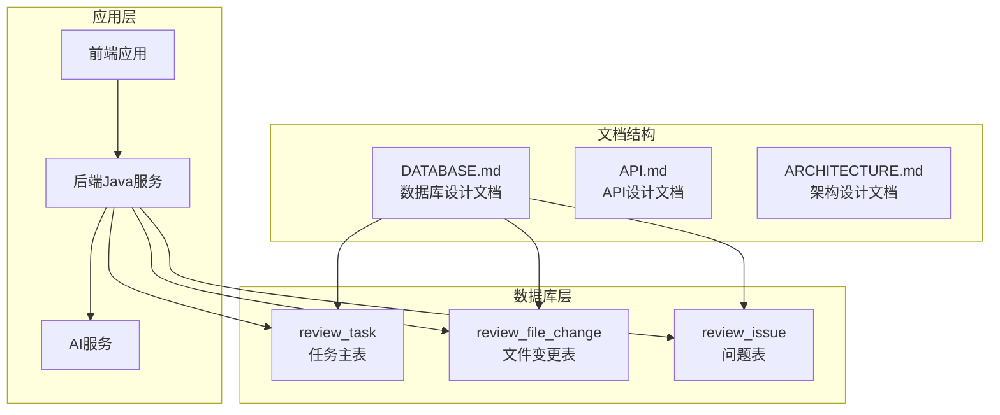
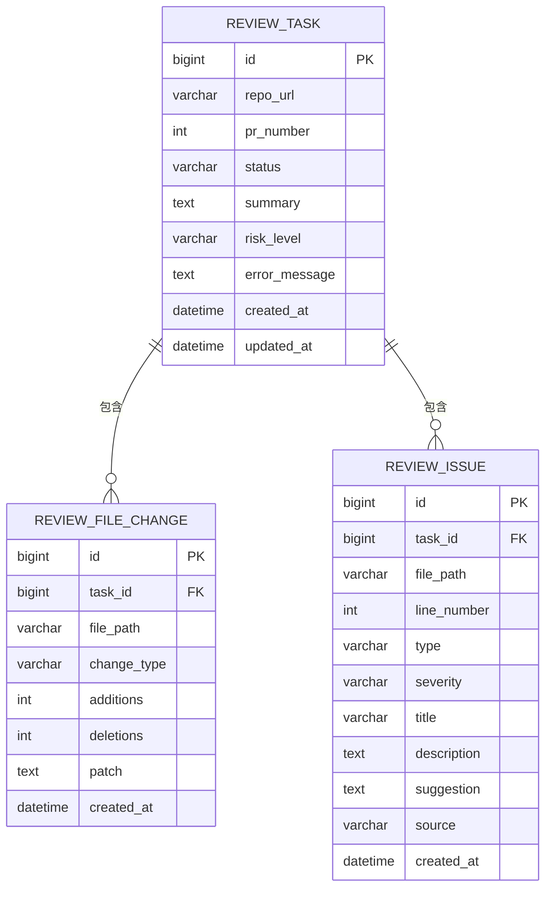
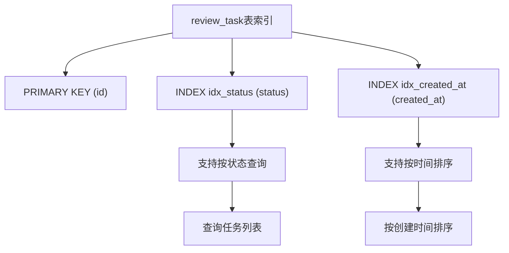
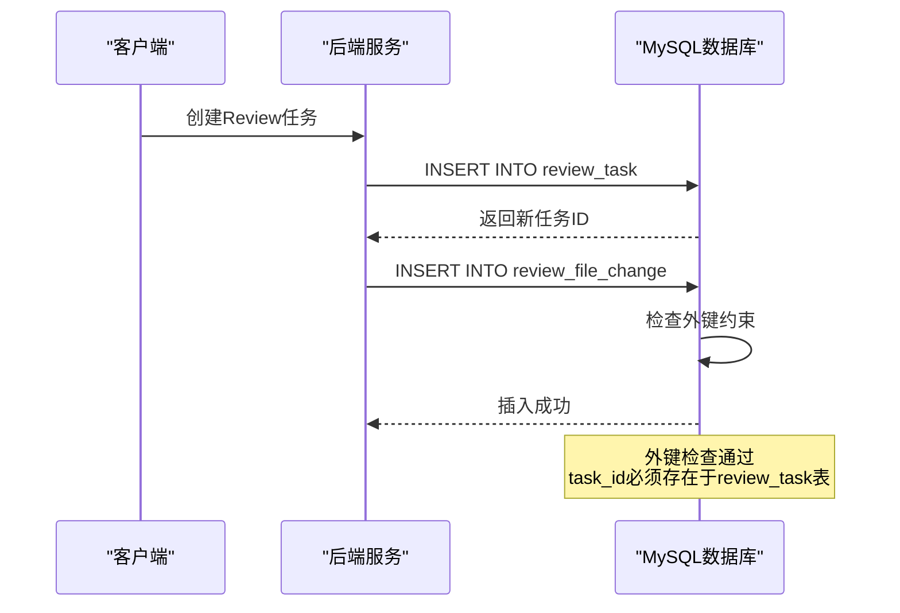
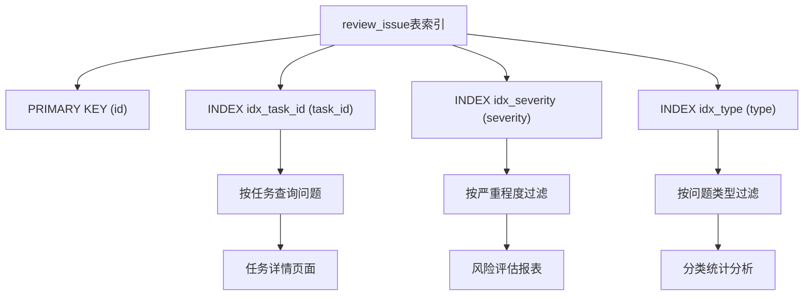
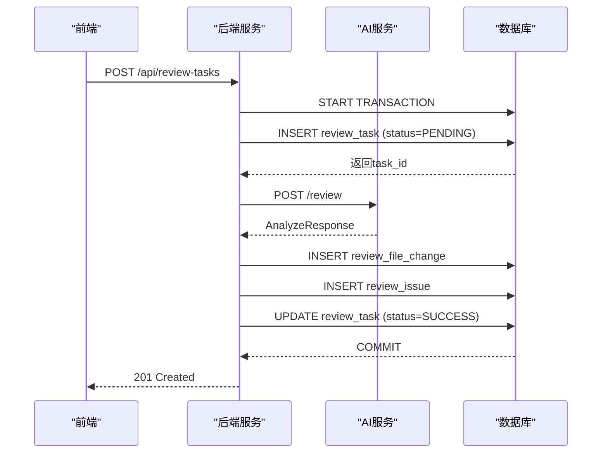
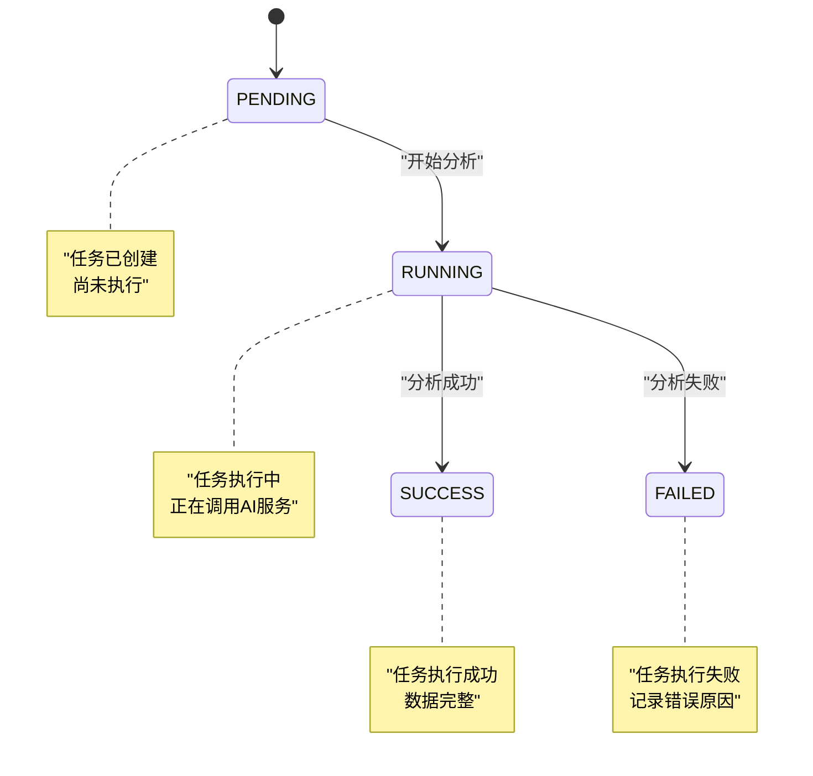
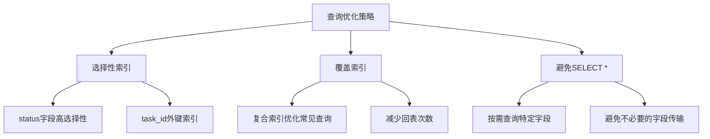

# 表关系与约束

<cite>
**本文档引用的文件**
- [DATABASE.md](file://docs/DATABASE.md)
- [API.md](file://docs/API.md)
- [ARCHITECTURE.md](file://docs/ARCHITECTURE.md)
- [docker-compose.yml](file://docker-compose.yml)
- [backend-java/README.md](file://backend-java/README.md)
</cite>

## 目录
1. [简介](#简介)
2. [项目结构](#项目结构)
3. [核心组件](#核心组件)
4. [架构概览](#架构概览)
5. [详细组件分析](#详细组件分析)
6. [依赖关系分析](#依赖关系分析)
7. [性能考量](#性能考量)
8. [故障排查指南](#故障排查指南)
9. [结论](#结论)
10. [附录](#附录)

## 简介

CodeReviewX是一个基于MVP（最小可行产品）理念的代码审查自动化系统。本文件专注于系统的数据库层设计，特别是三张核心表之间的关系与约束。该系统采用MySQL 8作为数据存储，使用MyBatis-Plus作为ORM框架，实现了清晰的三层架构分离：前端通过REST API调用后端Java服务，后端服务再调用AI服务进行代码分析，最终将结果持久化到MySQL数据库。

## 项目结构

根据项目文档，数据库设计位于docs目录下的DATABASE.md文件中，该文件定义了完整的数据库设计方案，包括表结构、索引策略和约束条件。



**图表来源**
- [DATABASE.md:20-134](file://docs/DATABASE.md#L20-L134)
- [API.md:54-241](file://docs/API.md#L54-L241)
- [ARCHITECTURE.md:19-52](file://docs/ARCHITECTURE.md#L19-L52)

**章节来源**
- [DATABASE.md:1-294](file://docs/DATABASE.md#L1-L294)
- [API.md:1-378](file://docs/API.md#L1-L378)
- [ARCHITECTURE.md:1-417](file://docs/ARCHITECTURE.md#L1-L417)

## 核心组件

### 数据库基本信息

系统采用MySQL 8作为数据库引擎，配置如下：
- 数据库名：`codereviewx`
- 字符集：`utf8mb4`
- 排序规则：`utf8mb4_unicode_ci`
- 存储引擎：InnoDB
- 默认字符集：`utf8mb4`

这些配置确保了系统能够正确处理多语言字符，特别是中文等Unicode字符的存储和排序。

**章节来源**
- [DATABASE.md:9-17](file://docs/DATABASE.md#L9-L17)

### 三张核心表概述

系统包含三张核心表，形成典型的层次化数据结构：

1. **review_task** - 任务主表，存储任务元信息和状态
2. **review_file_change** - 文件变更表，存储每个任务涉及的文件变更信息  
3. **review_issue** - 问题表，存储分析出的问题详情

这种设计遵循了数据库规范化原则，通过外键关系建立了清晰的数据依赖关系。

**章节来源**
- [DATABASE.md:22-134](file://docs/DATABASE.md#L22-L134)

## 架构概览



**图表来源**
- [DATABASE.md:27-116](file://docs/DATABASE.md#L27-L116)

### 外键关系设计

三个表之间建立了明确的外键关系：

- **review_task → review_file_change**：一对多关系，一个任务可以包含多个文件变更
- **review_task → review_issue**：一对多关系，一个任务可以包含多个问题
- **review_file_change → review_issue**：无直接外键关系，但通过task_id间接关联

这种设计确保了数据的引用完整性，防止出现孤立的数据记录。

**章节来源**
- [DATABASE.md:75](file://docs/DATABASE.md#L75)
- [DATABASE.md:115](file://docs/DATABASE.md#L115)

## 详细组件分析

### review_task 表（任务主表）

review_task表是整个系统的核心，存储了任务的基本信息和状态。

#### 字段设计分析

| 字段名 | 类型 | 约束 | 说明 |
|--------|------|------|------|
| id | BIGINT AUTO_INCREMENT | PRIMARY KEY | 主键，自增ID |
| repo_url | VARCHAR(500) | NOT NULL | GitHub仓库地址 |
| pr_number | INT | NOT NULL | Pull Request编号 |
| status | VARCHAR(20) | NOT NULL DEFAULT 'PENDING' | 任务状态，枚举值 |
| summary | TEXT | NULL | Review总结，任务成功后填充 |
| risk_level | VARCHAR(10) | NULL | 风险等级，任务成功后填充 |
| error_message | TEXT | NULL | 失败原因，FAILED状态时填充 |
| created_at | DATETIME | NOT NULL DEFAULT CURRENT_TIMESTAMP | 创建时间 |
| updated_at | DATETIME | NOT NULL DEFAULT CURRENT_TIMESTAMP ON UPDATE CURRENT_TIMESTAMP | 更新时间 |

#### 索引策略



**图表来源**
- [DATABASE.md:37-40](file://docs/DATABASE.md#L37-L40)

**章节来源**
- [DATABASE.md:22-56](file://docs/DATABASE.md#L22-L56)

### review_file_change 表（文件变更表）

review_file_change表记录了每个任务涉及的文件变更信息。

#### 字段设计分析

| 字段名 | 类型 | 约束 | 说明 |
|--------|------|------|------|
| id | BIGINT AUTO_INCREMENT | PRIMARY KEY | 主键，自增ID |
| task_id | BIGINT | NOT NULL | 外键，关联review_task.id |
| file_path | VARCHAR(500) | NOT NULL | 文件路径 |
| change_type | VARCHAR(20) | NOT NULL | 变更类型：added/modified/deleted |
| additions | INT | NOT NULL DEFAULT 0 | 新增行数 |
| deletions | INT | NOT NULL DEFAULT 0 | 删除行数 |
| patch | TEXT | NULL | diff片段，MVP阶段使用TEXT |
| created_at | DATETIME | NOT NULL DEFAULT CURRENT_TIMESTAMP | 创建时间 |

#### 外键约束



**图表来源**
- [DATABASE.md:64-76](file://docs/DATABASE.md#L64-L76)

**章节来源**
- [DATABASE.md:59-91](file://docs/DATABASE.md#L59-L91)

### review_issue 表（问题表）

review_issue表存储了LLM和Semgrep分析出的所有问题。

#### 字段设计分析

| 字段名 | 类型 | 约束 | 说明 |
|--------|------|------|------|
| id | BIGINT AUTO_INCREMENT | PRIMARY KEY | 主键，自增ID |
| task_id | BIGINT | NOT NULL | 外键，关联review_task.id |
| file_path | VARCHAR(500) | NOT NULL | 问题所在文件路径 |
| line_number | INT | NULL | 问题行号（Semgrep通常有，LLM可能没有） |
| type | VARCHAR(20) | NOT NULL | 问题类型：BUG/SECURITY/PERFORMANCE/TEST/STYLE |
| severity | VARCHAR(10) | NOT NULL | 严重程度：LOW/MEDIUM/HIGH |
| title | VARCHAR(255) | NOT NULL | 问题标题 |
| description | TEXT | NOT NULL | 问题描述 |
| suggestion | TEXT | NULL | 修复建议 |
| source | VARCHAR(20) | NOT NULL | 来源：LLM/SEMGREP |
| created_at | DATETIME | NOT NULL DEFAULT CURRENT_TIMESTAMP | 创建时间 |

#### 多重索引策略



**图表来源**
- [DATABASE.md:112-116](file://docs/DATABASE.md#L112-L116)

**章节来源**
- [DATABASE.md:94-134](file://docs/DATABASE.md#L94-L134)

## 依赖关系分析

### 数据库事务处理

基于表关系设计，系统在数据一致性方面采用了以下策略：



**图表来源**
- [ARCHITECTURE.md:139-168](file://docs/ARCHITECTURE.md#L139-L168)

### 并发控制机制

系统通过以下机制保证并发安全性：

1. **外键约束检查**：所有外键插入都会进行约束检查，防止脏数据
2. **事务边界**：批量插入文件变更和问题时使用事务保证原子性
3. **状态机设计**：任务状态单向流转，避免并发状态冲突
4. **时间戳字段**：自动维护的created_at和updated_at确保数据版本控制

### 数据一致性保证



**图表来源**
- [ARCHITECTURE.md:110-134](file://docs/ARCHITECTURE.md#L110-L134)

**章节来源**
- [ARCHITECTURE.md:110-180](file://docs/ARCHITECTURE.md#L110-L180)

## 性能考量

### 索引优化策略

#### 主表索引设计

review_task表的关键索引设计：
- `idx_status(status)`：支持按状态快速筛选任务
- `idx_created_at(created_at)`：支持按时间排序和分页查询

#### 二级表索引设计

review_file_change和review_issue表都包含：
- `idx_task_id(task_id)`：支持按任务ID查询所有相关记录
- review_issue额外包含：`idx_severity(severity)`和`idx_type(type)`用于问题分类查询

### 查询优化考虑



### 性能影响分析

1. **写入性能**：外键检查会增加INSERT操作的开销，但确保了数据完整性
2. **查询性能**：合理的索引设计支持高频查询场景
3. **存储开销**：TEXT类型的patch字段在MVP阶段使用，需要注意存储空间管理

**章节来源**
- [DATABASE.md:288-294](file://docs/DATABASE.md#L288-L294)

## 故障排查指南

### 常见约束错误

#### 外键约束错误

当尝试插入无效的task_id时，会出现外键约束错误。解决方案：
1. 确保先创建review_task记录
2. 验证task_id的有效性
3. 检查事务边界，确保数据一致性

#### 状态机错误

当尝试将任务状态回退时，会违反状态机规则。解决方案：
1. 检查当前任务状态
2. 遵循单向状态流转规则
3. 使用正确的状态转换逻辑

### 数据库连接问题

根据docker-compose配置，数据库连接信息如下：
- 数据库URL：jdbc:mysql://mysql:3306/codereviewx
- 用户名：codereviewx
- 密码：codereviewx

**章节来源**
- [ARCHITECTURE.md:345-354](file://docs/ARCHITECTURE.md#L345-L354)
- [docker-compose.yml:1-14](file://docker-compose.yml#L1-L14)

## 结论

CodeReviewX的数据库设计体现了良好的工程实践，通过三张核心表建立了清晰的数据层次结构。外键关系确保了数据的引用完整性，合理的索引策略支持了高频查询需求，事务处理机制保证了数据一致性。

该设计具有以下优势：
1. **清晰的层次结构**：任务-文件变更-问题的三层关系设计直观易懂
2. **完善的约束机制**：外键约束和状态机设计确保数据质量
3. **优化的查询性能**：针对常见查询场景的索引设计
4. **良好的扩展性**：支持未来功能扩展和性能优化

## 附录

### 实际查询示例

基于表结构设计，以下是典型查询场景的SQL模式：

#### 查询任务详情（包含文件变更和问题）
```sql
-- 查询指定任务的所有相关信息
SELECT t.*, f.*, i.*
FROM review_task t
LEFT JOIN review_file_change f ON t.id = f.task_id
LEFT JOIN review_issue i ON t.id = i.task_id
WHERE t.id = ?
ORDER BY f.created_at, i.created_at
```

#### 按状态统计任务数量
```sql
-- 统计各状态的任务数量
SELECT status, COUNT(*) as count
FROM review_task
GROUP BY status
ORDER BY FIELD(status, 'PENDING', 'RUNNING', 'SUCCESS', 'FAILED')
```

#### 查询高风险问题
```sql
-- 查询严重程度为HIGH的问题
SELECT i.*, t.repo_url, t.pr_number
FROM review_issue i
JOIN review_task t ON i.task_id = t.id
WHERE i.severity = 'HIGH'
ORDER BY i.created_at DESC
```

### 最佳实践建议

1. **索引维护**：定期分析查询模式，优化索引策略
2. **监控告警**：建立数据库性能监控和异常告警机制
3. **备份策略**：制定定期备份和恢复计划
4. **容量规划**：根据业务增长预测数据库容量需求
5. **安全加固**：实施最小权限原则和数据加密措施