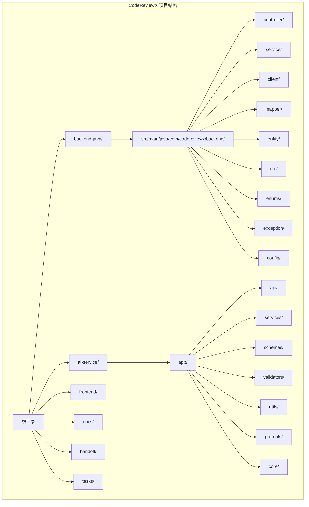
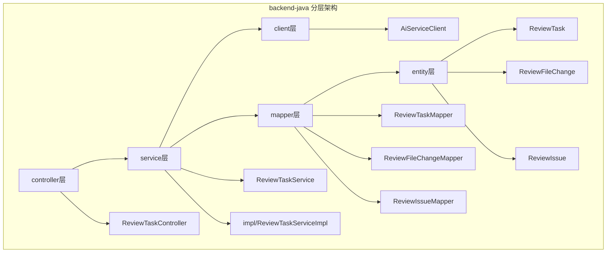
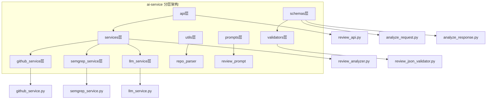
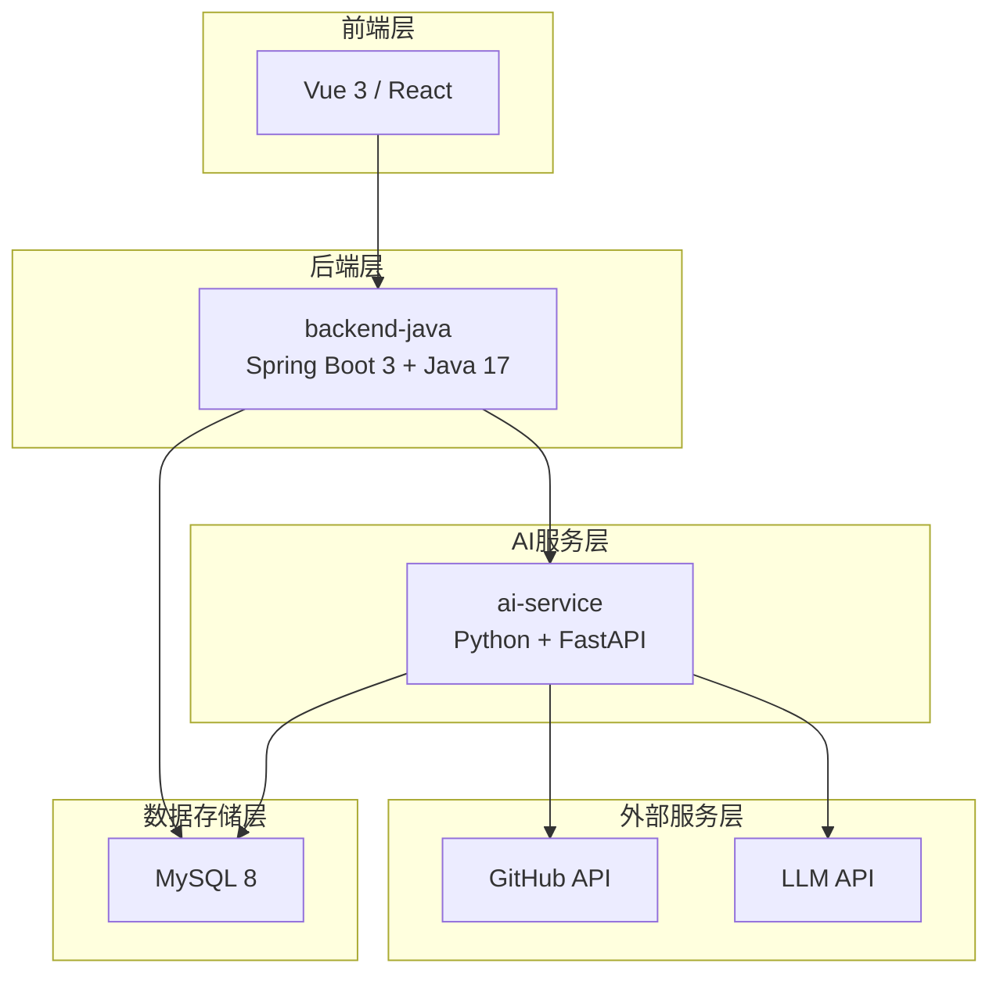
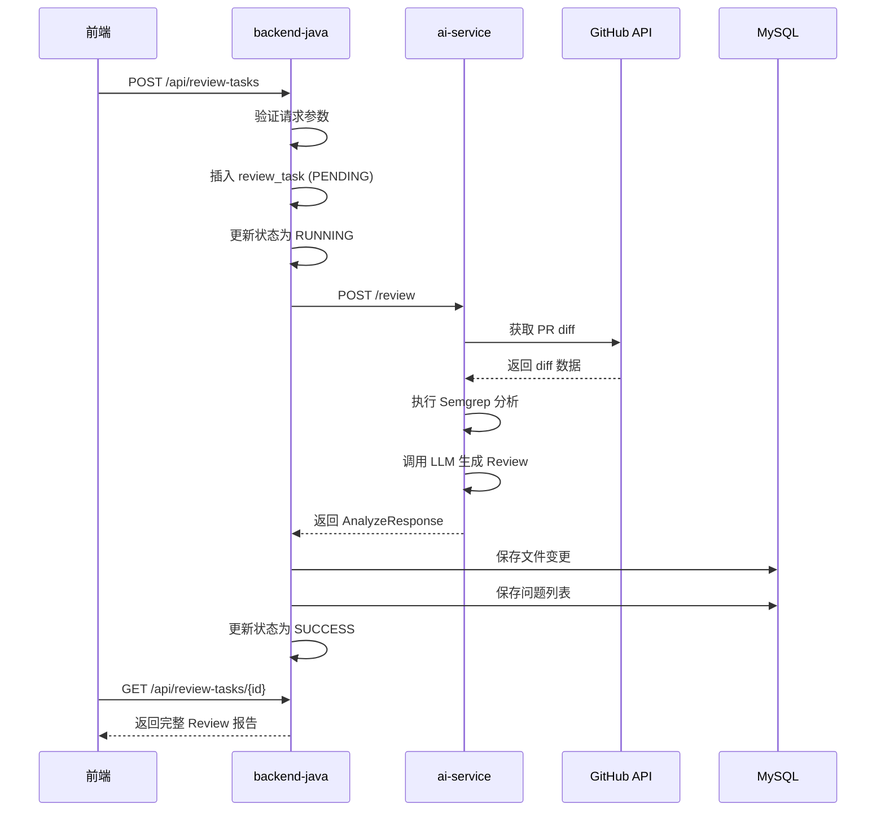
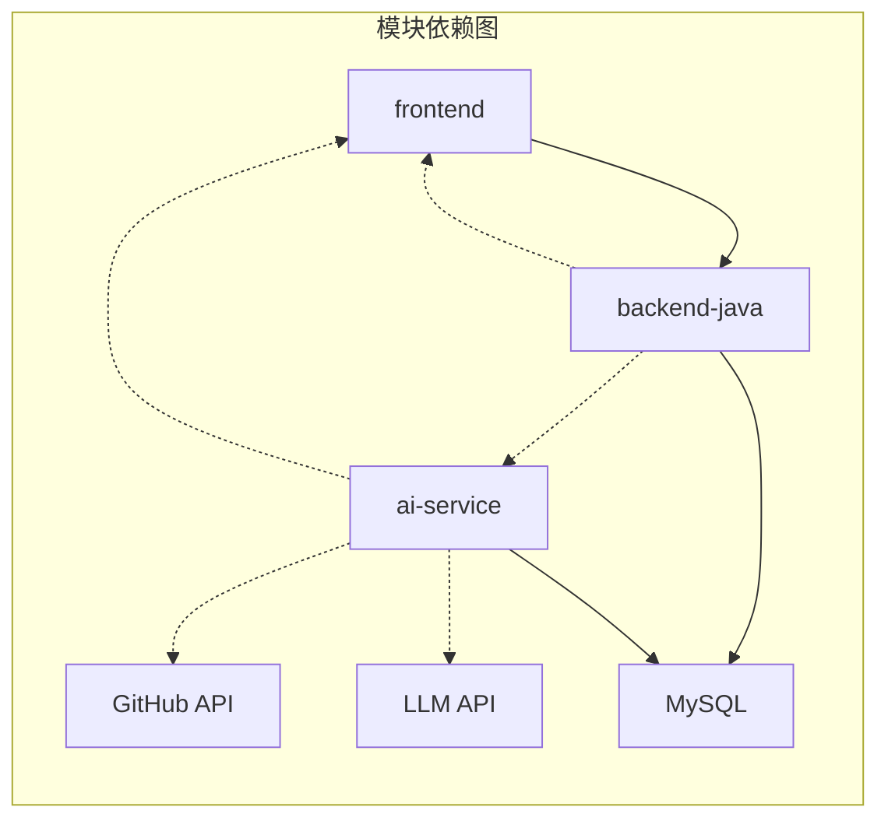
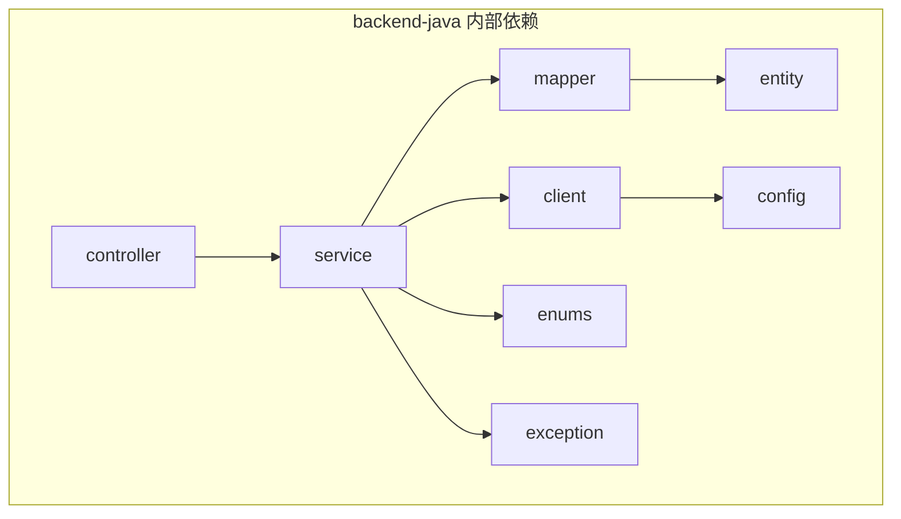
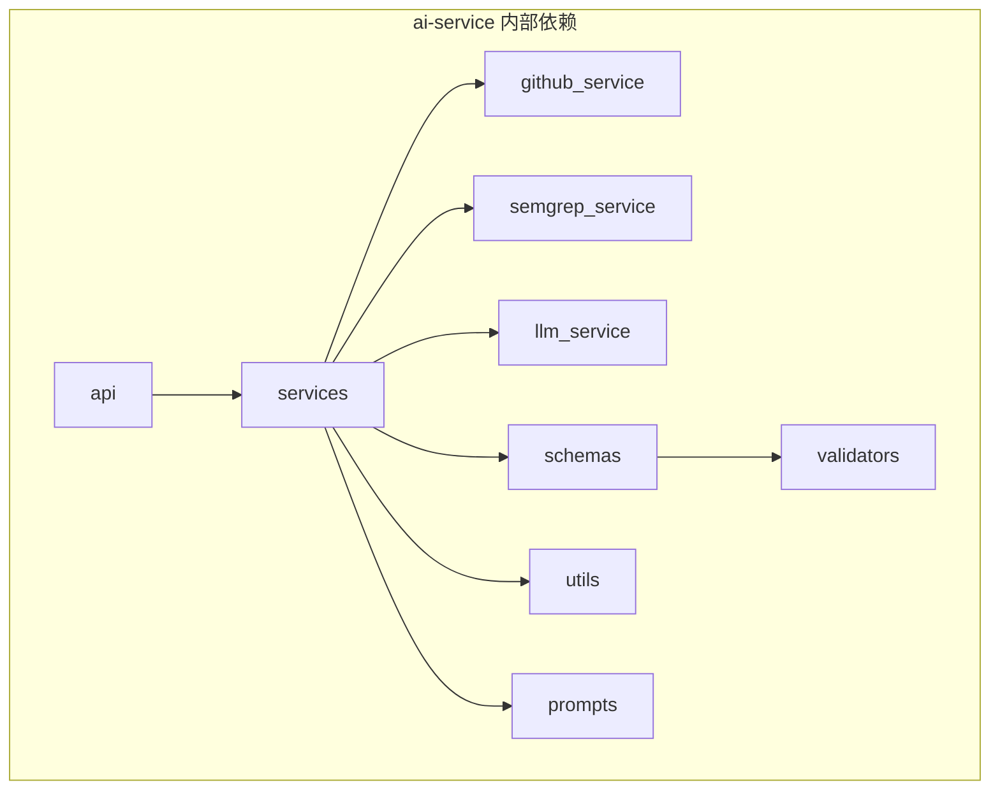
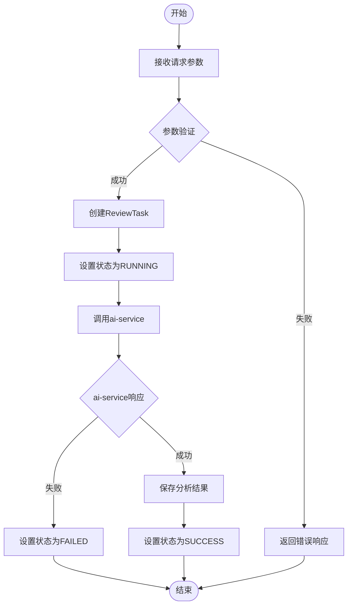
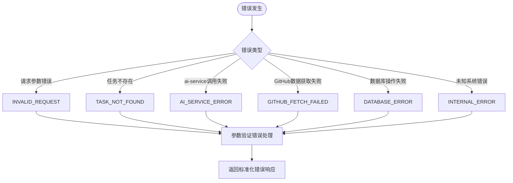

# 分层架构设计

<cite>
**本文档引用的文件**
- [README.md](file://README.md)
- [backend-java/README.md](file://backend-java/README.md)
- [ai-service/README.md](file://ai-service/README.md)
- [docs/ARCHITECTURE.md](file://docs/ARCHITECTURE.md)
- [docs/API.md](file://docs/API.md)
- [docs/DATABASE.md](file://docs/DATABASE.md)
- [docs/PRD.md](file://docs/PRD.md)
- [docker-compose.yml](file://docker-compose.yml)
</cite>

## 目录
1. [简介](#简介)
2. [项目结构](#项目结构)
3. [核心组件](#核心组件)
4. [架构总览](#架构总览)
5. [详细组件分析](#详细组件分析)
6. [依赖关系分析](#依赖关系分析)
7. [性能考量](#性能考量)
8. [故障排除指南](#故障排除指南)
9. [结论](#结论)

## 简介

CodeReviewX是一个面向GitHub Pull Request的智能代码审查系统。该项目采用分层架构设计，将复杂的代码审查流程分解为清晰的职责边界，确保系统的可维护性和可扩展性。

根据项目规划，CodeReviewX采用双模块架构：
- **backend-java**: Spring Boot 3 + Java 17后端服务，负责任务编排和数据持久化
- **ai-service**: Python + FastAPI AI审查服务，负责GitHub数据获取、静态分析和LLM分析

这种分层设计遵循"Java后端只做业务编排和数据持久化，Python AI服务只做分析逻辑"的核心原则。

## 项目结构

项目采用模块化目录结构，每个模块都有明确的职责边界：

**图表来源**
- [backend-java/README.md:49-71](file://backend-java/README.md#L49-L71)
- [ai-service/README.md:50-77](file://ai-service/README.md#L50-L77)

**章节来源**
- [README.md:58-82](file://README.md#L58-L82)
- [backend-java/README.md:49-71](file://backend-java/README.md#L49-L71)
- [ai-service/README.md:50-77](file://ai-service/README.md#L50-L77)

## 核心组件

### backend-java 分层架构

backend-java采用经典的三层架构模式，每层都有明确的职责边界：

**图表来源**
- [docs/ARCHITECTURE.md:183-231](file://docs/ARCHITECTURE.md#L183-L231)

### ai-service 分层架构

ai-service采用API-Service-Schema三层架构，专注于分析逻辑：

**图表来源**
- [docs/ARCHITECTURE.md:233-266](file://docs/ARCHITECTURE.md#L233-L266)

**章节来源**
- [docs/ARCHITECTURE.md:183-266](file://docs/ARCHITECTURE.md#L183-L266)

## 架构总览

### 整体架构设计

**图表来源**
- [docs/ARCHITECTURE.md:19-52](file://docs/ARCHITECTURE.md#L19-L52)

### 核心调用链路

**图表来源**
- [docs/ARCHITECTURE.md:137-181](file://docs/ARCHITECTURE.md#L137-L181)

**章节来源**
- [docs/ARCHITECTURE.md:7-16](file://docs/ARCHITECTURE.md#L7-L16)
- [docs/ARCHITECTURE.md:137-181](file://docs/ARCHITECTURE.md#L137-L181)

## 详细组件分析

### backend-java 分层详解

#### controller层（控制层）

controller层负责HTTP请求处理和响应返回，严格遵循"只处理参数接收和响应返回"的原则：

**职责边界**：
- 接收前端请求参数
- 调用service层处理业务逻辑
- 返回标准化响应格式
- 参数验证和错误处理

**关键组件**：
- `ReviewTaskController`: 处理ReviewTask相关的HTTP请求
- 统一异常处理：`GlobalExceptionHandler`
- 请求/响应DTO：`CreateReviewTaskRequest`、`ReviewTaskResponse`

#### service层（业务逻辑层）

service层负责核心业务流程和事务管理：

**职责边界**：
- ReviewTask生命周期管理
- 任务状态流转控制
- 调用AI服务获取分析结果
- 数据持久化协调

**关键组件**：
- `ReviewTaskService`: 定义业务接口
- `ReviewTaskServiceImpl`: 实现核心业务逻辑
- 业务异常处理：`BusinessException`

#### client层（外部服务调用层）

client层专门负责调用外部服务：

**职责边界**：
- 调用ai-service的内部API
- HTTP客户端配置
- 错误处理和重试机制
- 响应数据转换

**关键组件**：
- `AiServiceClient`: 封装ai-service调用逻辑

#### mapper层（数据访问层）

mapper层只负责数据库访问操作：

**职责边界**：
- MyBatis-Plus接口定义
- 数据库CRUD操作
- 不包含任何业务逻辑

**关键组件**：
- `ReviewTaskMapper`: 任务主表操作
- `ReviewFileChangeMapper`: 文件变更操作
- `ReviewIssueMapper`: 问题记录操作

#### entity层（数据模型层）

entity层对应数据库表结构：

**职责边界**：
- 数据库表的Java映射
- 字段注解配置
- 不包含业务方法

**关键组件**：
- `ReviewTask`: 任务主表实体
- `ReviewFileChange`: 文件变更实体
- `ReviewIssue`: 问题实体

#### dto层（数据传输对象层）

dto层定义API接口的数据结构：

**职责边界**：
- API请求参数封装
- API响应数据封装
- 数据格式转换

**关键组件**：
- 请求DTO：`CreateReviewTaskRequest`
- 响应DTO：`ReviewTaskResponse`、`ReviewTaskDetailResponse`

#### enums层（枚举定义层）

集中管理所有枚举类型：

**职责边界**：
- 任务状态枚举
- 风险等级枚举
- 问题类型枚举
- 严重程度枚举

**关键组件**：
- `TaskStatus`: 任务状态
- `RiskLevel`: 风险等级
- `IssueType`: 问题类型
- `IssueSeverity`: 严重程度

**章节来源**
- [docs/ARCHITECTURE.md:183-231](file://docs/ARCHITECTURE.md#L183-L231)
- [backend-java/README.md:19-46](file://backend-java/README.md#L19-L46)

### ai-service 分层详解

#### api层（API接口层）

api层只定义HTTP端点：

**职责边界**：
- 定义`/review`端点
- HTTP路由配置
- 不包含业务逻辑

**关键组件**：
- `review_api.py`: 定义分析API端点

#### services层（业务服务层）

services层实现完整的分析流程：

**职责边界**：
- 整体分析流程编排
- 各子服务协调
- 结果聚合和转换

**关键组件**：
- `review_analyzer.py`: 主要分析器
- `github_service.py`: GitHub数据获取
- `semgrep_service.py`: Semgrep分析服务
- `llm_service.py`: LLM调用服务

#### schemas层（数据模型层）

schemas层使用Pydantic定义数据模型：

**职责边界**：
- 请求参数验证
- 响应数据结构定义
- 数据类型约束

**关键组件**：
- `analyze_request.py`: 分析请求模型
- `analyze_response.py`: 分析响应模型

#### validators层（数据验证层）

validators层负责JSON Schema验证：

**职责边界**：
- LLM输出结构验证
- 数据完整性检查
- 错误报告生成

**关键组件**：
- `review_json_validator.py`: Review JSON验证器

#### utils层（工具函数层）

utils层提供辅助功能：

**职责边界**：
- 仓库URL解析
- 数据格式转换
- 工具函数封装

**关键组件**：
- `repo_parser.py`: 仓库URL解析器

**章节来源**
- [docs/ARCHITECTURE.md:233-266](file://docs/ARCHITECTURE.md#L233-L266)
- [ai-service/README.md:19-47](file://ai-service/README.md#L19-L47)

## 依赖关系分析

### 模块间依赖关系

**图表来源**
- [docs/ARCHITECTURE.md:19-52](file://docs/ARCHITECTURE.md#L19-L52)

### 分层内依赖关系

#### backend-java内部依赖

**图表来源**
- [docs/ARCHITECTURE.md:183-231](file://docs/ARCHITECTURE.md#L183-L231)

#### ai-service内部依赖

**图表来源**
- [docs/ARCHITECTURE.md:233-266](file://docs/ARCHITECTURE.md#L233-L266)

### 数据流设计

**图表来源**
- [docs/ARCHITECTURE.md:110-134](file://docs/ARCHITECTURE.md#L110-L134)

**章节来源**
- [docs/ARCHITECTURE.md:110-134](file://docs/ARCHITECTURE.md#L110-L134)

## 性能考量

### 架构性能特点

1. **同步调用设计**: MVP阶段采用同步HTTP调用，简化了架构复杂度
2. **Mock优先策略**: AI服务支持Mock模式，便于性能测试和调试
3. **最小化依赖**: 避免引入Redis、消息队列等复杂组件
4. **本地可运行**: 所有服务都支持Docker Compose本地部署

### 性能优化建议

1. **连接池配置**: 合理配置数据库连接池和HTTP客户端连接池
2. **超时设置**: 为外部服务调用设置合理的超时时间
3. **缓存策略**: 考虑对频繁访问的配置信息进行缓存
4. **异步处理**: 后续版本可考虑引入消息队列实现异步处理

## 故障排除指南

### 常见错误类型及处理

**图表来源**
- [docs/ARCHITECTURE.md:312-342](file://docs/ARCHITECTURE.md#L312-L342)

### 错误响应格式

| 错误码 | HTTP状态 | 场景 |
|---|---|---|
| `INVALID_REQUEST` | 400 | 请求参数错误或校验失败 |
| `TASK_NOT_FOUND` | 404 | 任务不存在 |
| `AI_SERVICE_ERROR` | 502 | ai-service调用失败 |
| `GITHUB_FETCH_FAILED` | 502 | GitHub数据获取失败 |
| `DATABASE_ERROR` | 500 | 数据库操作失败 |
| `INTERNAL_ERROR` | 500 | 未知系统错误 |

**章节来源**
- [docs/ARCHITECTURE.md:312-342](file://docs/ARCHITECTURE.md#L312-L342)

## 结论

CodeReviewX的分层架构设计体现了清晰的职责分离和良好的可维护性。通过严格的分层边界划分，项目实现了：

1. **职责清晰**: 每个模块和层次都有明确的职责边界
2. **易于维护**: 分层设计使得代码更容易理解和维护
3. **可扩展性强**: 新功能可以在现有架构基础上轻松添加
4. **测试友好**: 清晰的层次结构便于单元测试和集成测试

这种架构设计为后续的功能扩展奠定了坚实的基础，特别是在引入真实LLM、Semgrep集成和前端界面开发时，都能保持架构的一致性和稳定性。