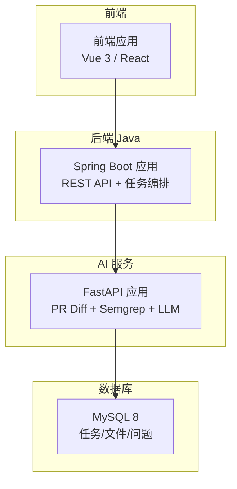
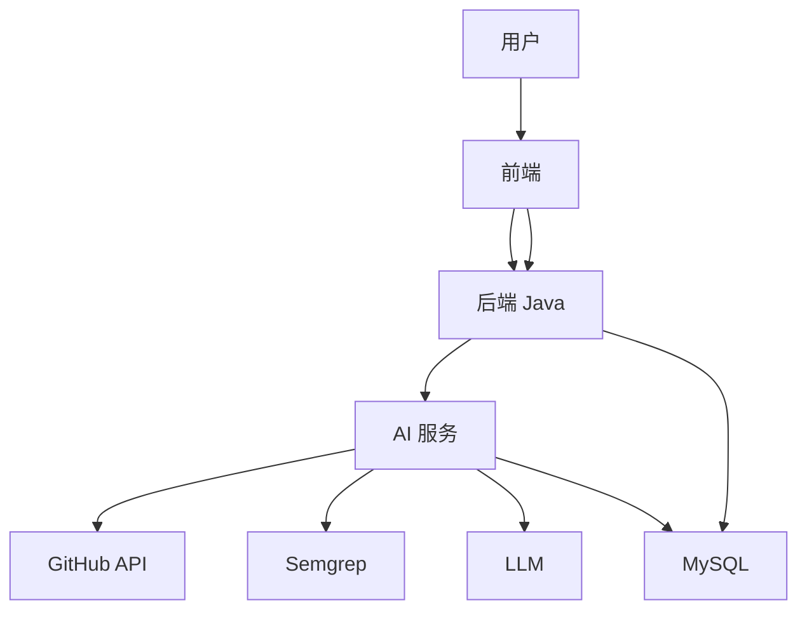
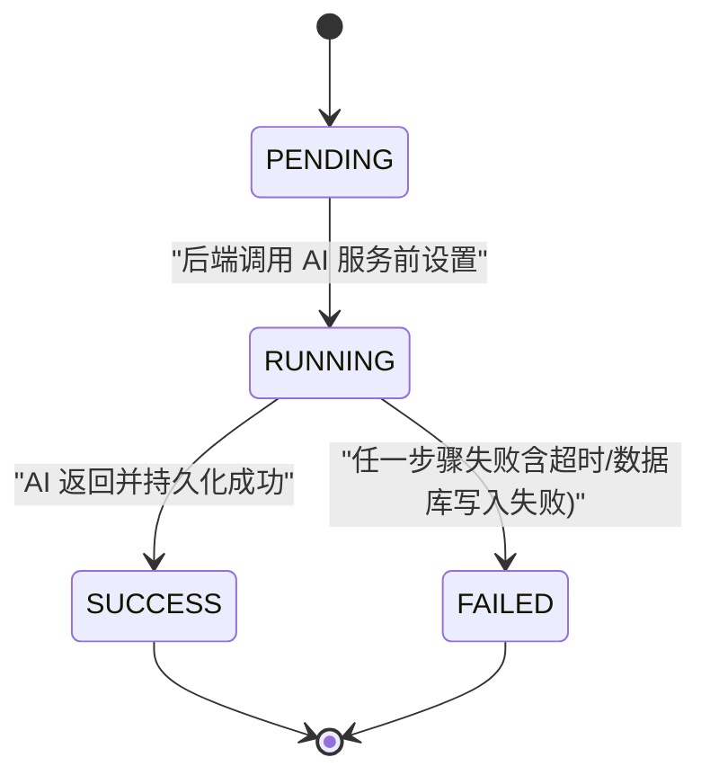
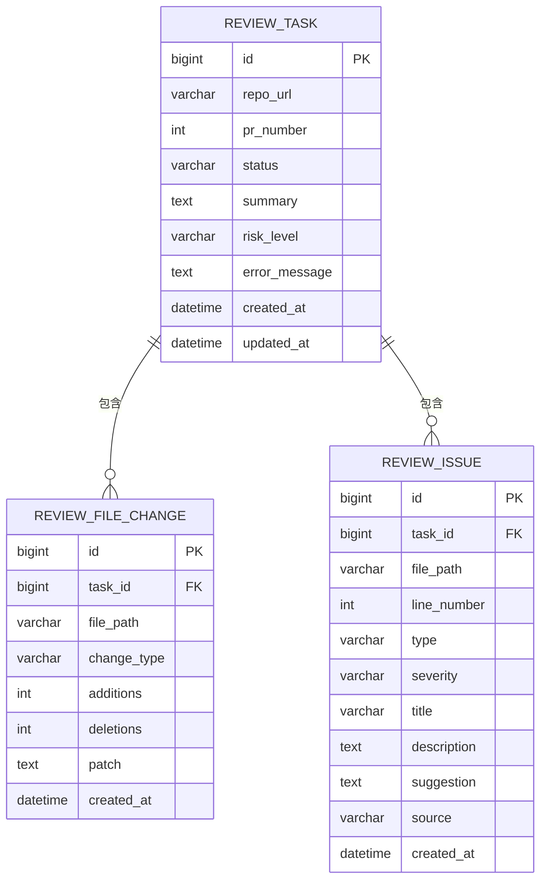
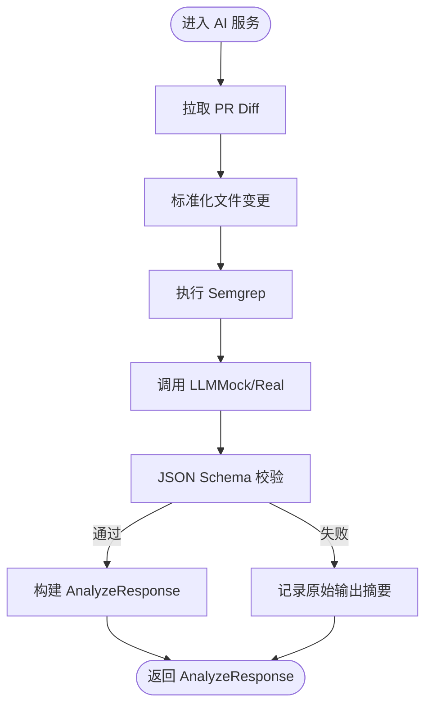
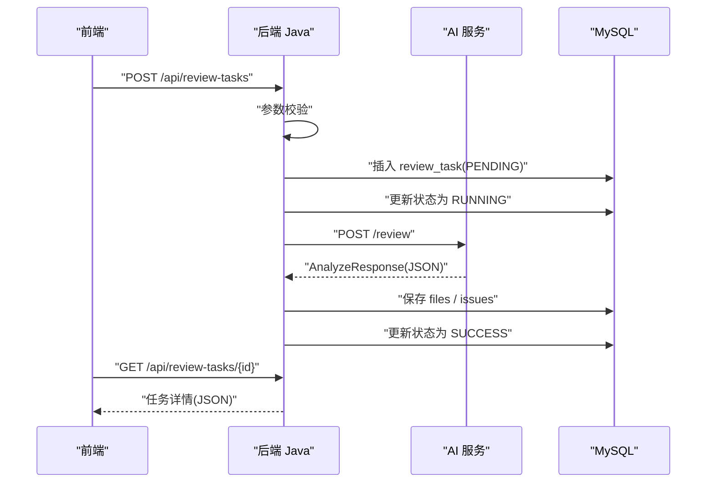
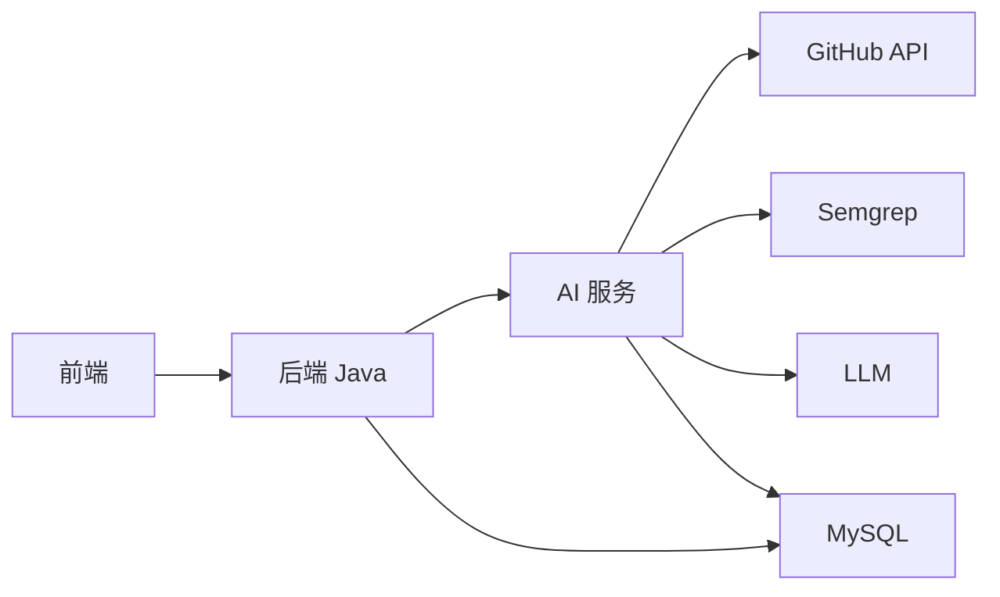

# 数据流设计

<cite>
**本文引用的文件**
- [README.md](file://README.md)
- [docker-compose.yml](file://docker-compose.yml)
- [docs/ARCHITECTURE.md](file://docs/ARCHITECTURE.md)
- [docs/API.md](file://docs/API.md)
- [docs/DATABASE.md](file://docs/DATABASE.md)
- [docs/AGENT_RULES.md](file://docs/AGENT_RULES.md)
- [.github/workflows/ci.yml](file://.github/workflows/ci.yml)
</cite>

## 目录
1. [简介](#简介)
2. [项目结构](#项目结构)
3. [核心组件](#核心组件)
4. [架构总览](#架构总览)
5. [详细组件分析](#详细组件分析)
6. [依赖关系分析](#依赖关系分析)
7. [性能考量](#性能考量)
8. [故障排查指南](#故障排查指南)
9. [结论](#结论)
10. [附录](#附录)

## 简介
本文件面向 CodeReviewX 的数据流设计，聚焦从用户输入到最终结果展示的完整数据路径，覆盖输入参数、中间处理步骤、输出格式、ReviewTask 生命周期与状态转换、数据持久化策略、ai-service 标准输出（AnalyzeResponse）结构设计、错误处理与数据验证规则，并提供数据流图与 JSON 示例，帮助开发者理解数据在系统中的流转过程。

## 项目结构
- 采用多模块分层：前端、后端 Java、AI 服务、数据库。
- Round 01 为“仓库基础”阶段，文档先行，暂未实现业务代码。
- 通过 Docker Compose 定义服务占位，后续轮次逐步完善。

图表来源
- [docs/ARCHITECTURE.md:19-52](file://docs/ARCHITECTURE.md#L19-L52)
- [docker-compose.yml:1-14](file://docker-compose.yml#L1-L14)

章节来源
- [README.md:58-82](file://README.md#L58-L82)
- [docs/ARCHITECTURE.md:19-52](file://docs/ARCHITECTURE.md#L19-L52)
- [docker-compose.yml:1-14](file://docker-compose.yml#L1-L14)

## 核心组件
- ReviewTask：任务主表，承载 repoUrl、prNumber、状态、风险等级、总结与失败原因等。
- ReviewFileChange：记录 PR 涉及的文件变更（路径、类型、增删行数、diff 片段）。
- ReviewIssue：记录 LLM 与 Semgrep 分析的问题（类型、严重程度、位置、标题、描述、建议、来源）。
- 后端 Java：负责参数校验、任务状态编排、调用 AI 服务、持久化结果、对外提供 REST API。
- AI 服务：负责拉取 PR diff、标准化文件变更、执行 Semgrep、组织 LLM prompt、校验 JSON、返回 AnalyzeResponse。
- 前端：调用后端 Java，展示任务列表、任务详情与 Review 报告。

章节来源
- [docs/DATABASE.md:22-134](file://docs/DATABASE.md#L22-L134)
- [docs/ARCHITECTURE.md:56-107](file://docs/ARCHITECTURE.md#L56-L107)
- [docs/API.md:54-241](file://docs/API.md#L54-L241)

## 架构总览
系统遵循“文档优先、MVP 优先、Mock 优先”的原则，后端 Java 仅做编排与持久化，AI 服务专注数据获取、静态分析与 LLM 分析，前端仅消费后端 API。

图表来源
- [docs/ARCHITECTURE.md:19-52](file://docs/ARCHITECTURE.md#L19-L52)
- [docs/ARCHITECTURE.md:233-266](file://docs/ARCHITECTURE.md#L233-L266)

## 详细组件分析

### ReviewTask 生命周期与状态转换
- 状态流：PENDING → RUNNING → SUCCESS 或 FAILED
- 规则要点：
  - FAILED 必须保存可读错误原因（error_message）。
  - Semgrep 失败不强制任务 FAILED，可降级为 warning 记录。
  - LLM 失败优先使用 mock fallback，fallback 失败后才置为 FAILED。
  - 状态单向流转，不可回退。

图表来源
- [docs/ARCHITECTURE.md:110-134](file://docs/ARCHITECTURE.md#L110-L134)

章节来源
- [docs/ARCHITECTURE.md:110-134](file://docs/ARCHITECTURE.md#L110-L134)
- [docs/DATABASE.md:22-56](file://docs/DATABASE.md#L22-L56)

### 数据持久化策略
- 表结构与字段：
  - review_task：任务元信息、状态、风险等级、总结、失败原因、时间戳。
  - review_file_change：文件变更明细（路径、类型、增删行数、diff 片段）。
  - review_issue：问题明细（类型、严重程度、位置、标题、描述、建议、来源）。
- 约束与索引：
  - review_file_change、review_issue 外键关联 review_task。
  - review_task 建有状态与创建时间索引；review_issue 建有严重程度与类型索引。
- 映射与命名：
  - 数据库 snake_case 与 Java camelCase 映射，使用注解显式映射。

图表来源
- [docs/DATABASE.md:22-134](file://docs/DATABASE.md#L22-L134)

章节来源
- [docs/DATABASE.md:22-134](file://docs/DATABASE.md#L22-L134)

### ai-service 标准输出（AnalyzeResponse）与数据结构
- 输入：repoUrl、prNumber
- 输出：summary、riskLevel、files（含 filePath、changeType、additions、deletions、patch）、issues（含 type、severity、filePath、line、title、description、suggestion、source）
- 校验：AI 服务需进行 JSON Schema 校验，未通过时记录摘要，不返回未校验结构。

图表来源
- [docs/ARCHITECTURE.md:269-308](file://docs/ARCHITECTURE.md#L269-L308)
- [docs/API.md:243-332](file://docs/API.md#L243-L332)

章节来源
- [docs/ARCHITECTURE.md:269-308](file://docs/ARCHITECTURE.md#L269-L308)
- [docs/API.md:243-332](file://docs/API.md#L243-L332)

### 后端 Java 数据处理与 API
- 输入参数：repoUrl（GitHub 仓库地址）、prNumber（正整数）。
- 处理流程：
  - 参数校验与入库（状态 PENDING）。
  - 更新状态为 RUNNING。
  - 调用 AI 服务执行分析。
  - 保存 files 与 issues，更新任务状态为 SUCCESS。
- 错误响应：统一错误码与可读消息，区分 INVALID_REQUEST、TASK_NOT_FOUND、AI_SERVICE_ERROR、GITHUB_FETCH_FAILED、DATABASE_ERROR、INTERNAL_ERROR。

图表来源
- [docs/ARCHITECTURE.md:137-168](file://docs/ARCHITECTURE.md#L137-L168)
- [docs/API.md:54-241](file://docs/API.md#L54-L241)

章节来源
- [docs/API.md:54-241](file://docs/API.md#L54-L241)
- [docs/ARCHITECTURE.md:137-168](file://docs/ARCHITECTURE.md#L137-L168)

### 失败链路与降级策略
- GitHub API 失败：任务 FAILED，保存 error_message。
- Semgrep 失败：降级为 warning，不导致任务失败。
- LLM 失败：优先使用 mock fallback；fallback 失败后任务 FAILED。
- LLM JSON 校验失败：记录原始输出摘要，不返回未校验结构。
- 后端数据库保存失败：任务 FAILED。
- AI 服务超时：任务 FAILED，保存超时原因。

章节来源
- [docs/ARCHITECTURE.md:170-179](file://docs/ARCHITECTURE.md#L170-L179)

### 数据验证规则
- 输入参数校验：
  - repoUrl 必填且为合法 GitHub URL。
  - prNumber 必须为正整数。
- 输出结构校验：
  - AnalyzeResponse 遵循 JSON Schema，缺失字段或类型不符视为校验失败。
- 枚举约束：
  - TaskStatus：PENDING、RUNNING、SUCCESS、FAILED。
  - RiskLevel：LOW、MEDIUM、HIGH。
  - IssueType：BUG、SECURITY、PERFORMANCE、TEST、STYLE。
  - IssueSeverity：LOW、MEDIUM、HIGH。
  - IssueSource：LLM、SEMGREP。

章节来源
- [docs/API.md:64-96](file://docs/API.md#L64-L96)
- [docs/API.md:335-378](file://docs/API.md#L335-L378)
- [docs/DATABASE.md:203-254](file://docs/DATABASE.md#L203-L254)

## 依赖关系分析
- 后端 Java 依赖：
  - AI 服务：内部 HTTP 调用 /review。
  - MySQL：MyBatis-Plus ORM 访问 review_task、review_file_change、review_issue。
- AI 服务依赖：
  - GitHub API：获取 PR 信息与 diff。
  - Semgrep：静态分析。
  - LLM：生成结构化 Review。
- 前端依赖：
  - 后端 Java：统一 REST API。

图表来源
- [docs/ARCHITECTURE.md:19-52](file://docs/ARCHITECTURE.md#L19-L52)
- [docs/API.md:54-241](file://docs/API.md#L54-L241)

章节来源
- [docs/ARCHITECTURE.md:19-52](file://docs/ARCHITECTURE.md#L19-L52)
- [docs/API.md:54-241](file://docs/API.md#L54-L241)

## 性能考量
- 同步调用为主：MVP 阶段优先使用同步调用，简化复杂度。
- 存储容量：patch 字段使用 TEXT，若 diff 过大可考虑改用 MEDIUMTEXT 并增加截断策略。
- 索引优化：review_task 的状态与创建时间索引，review_issue 的严重程度与类型索引，便于查询与统计。
- 超时控制：AI 服务超时需快速失败并标记 FAILED，避免阻塞后端。

## 故障排查指南
- 常见错误码与定位：
  - INVALID_REQUEST：检查 repoUrl 与 prNumber 格式。
  - TASK_NOT_FOUND：确认任务 ID 是否存在。
  - AI_SERVICE_ERROR：检查 AI 服务可达性与日志。
  - GITHUB_FETCH_FAILED：检查 GitHub Token 与仓库权限。
  - DATABASE_ERROR：检查连接、SQL 与外键约束。
  - INTERNAL_ERROR：查看系统日志与堆栈。
- 日志与安全：
  - 禁止在日志中输出完整密钥；.env 示例文件不得提交至仓库。
- CI 与结构校验：
  - CI 作业仅进行仓库结构与占位校验，确保 Round 01 不引入业务代码。

章节来源
- [docs/API.md:41-51](file://docs/API.md#L41-L51)
- [docs/ARCHITECTURE.md:170-179](file://docs/ARCHITECTURE.md#L170-L179)
- [docs/AGENT_RULES.md:152-160](file://docs/AGENT_RULES.md#L152-L160)
- [.github/workflows/ci.yml:1-40](file://.github/workflows/ci.yml#L1-L40)

## 结论
本数据流设计以文档为纲，明确了从用户输入到结果展示的完整路径、ReviewTask 生命周期与状态转换、数据持久化策略、AI 输出契约、错误处理与验证规则。在 Round 01 文档先行的前提下，后续轮次可按此契约逐步实现后端 Java 骨架、AI 服务管道与前端界面，确保模块边界清晰、职责单一、可演进。

## 附录

### JSON 示例

- 输入参数（后端 Java 接收）
  - [示例路径:66-71](file://docs/API.md#L66-L71)

- AnalyzeResponse（AI 服务标准输出）
  - [示例路径:282-308](file://docs/ARCHITECTURE.md#L282-L308)
  - [示例路径:266-302](file://docs/API.md#L266-L302)

- 统一错误响应（后端 Java）
  - [示例路径:316-322](file://docs/ARCHITECTURE.md#L316-L322)
  - [示例路径](file://docs/API.md:31-L39)

- ai-service 错误响应
  - [示例路径:335-341](file://docs/ARCHITECTURE.md#L335-L341)
  - [示例路径:313-321](file://docs/API.md#L313-L321)