# 整体架构设计

<cite>
**本文档引用的文件**
- [README.md](file://README.md)
- [docs/ARCHITECTURE.md](file://docs/ARCHITECTURE.md)
- [docs/PRD.md](file://docs/PRD.md)
- [docs/AGENT_RULES.md](file://docs/AGENT_RULES.md)
- [docker-compose.yml](file://docker-compose.yml)
- [backend-java/README.md](file://backend-java/README.md)
- [ai-service/README.md](file://ai-service/README.md)
- [frontend/README.md](file://frontend/README.md)
</cite>

## 目录
1. [引言](#引言)
2. [项目结构](#项目结构)
3. [核心组件](#核心组件)
4. [架构总览](#架构总览)
5. [详细组件分析](#详细组件分析)
6. [依赖关系分析](#依赖关系分析)
7. [性能考虑](#性能考虑)
8. [故障排除指南](#故障排除指南)
9. [结论](#结论)

## 引言

CodeReviewX是一个面向GitHub Pull Request的智能代码审查与修复建议Agent系统。该项目采用微服务架构模式，通过三个核心服务模块实现代码审查的自动化流程：前端界面模块(frontend)、Java后端服务模块(backend-java)和Python AI服务模块(ai-service)。

该系统的设计理念是"文档先行、MVP优先、模拟优先"，确保在第一阶段就能构建出可运行、可演示的最小可行产品。通过明确的服务边界划分和严格的职责分离，系统能够在保持简洁性的同时提供强大的代码审查能力。

## 项目结构

CodeReviewX采用模块化项目结构，每个核心服务都独立部署和管理：

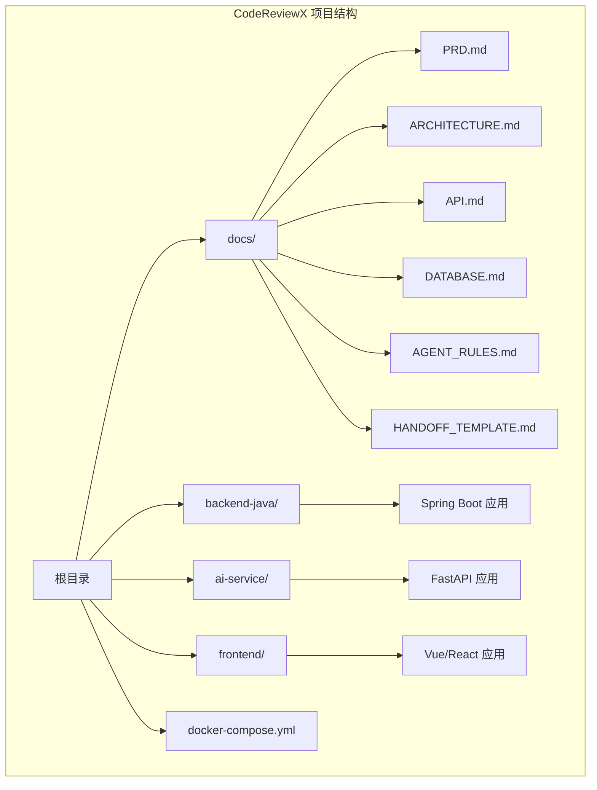

**图表来源**
- [README.md:58-82](file://README.md#L58-L82)
- [docs/ARCHITECTURE.md:19-52](file://docs/ARCHITECTURE.md#L19-L52)

**章节来源**
- [README.md:58-82](file://README.md#L58-L82)
- [docs/ARCHITECTURE.md:19-52](file://docs/ARCHITECTURE.md#L19-L52)

## 核心组件

### 1. 前端模块 (frontend)

前端模块采用Vue 3或React框架，负责用户界面展示和交互。其主要职责包括：
- 提供ReviewTask创建页面
- 显示任务列表和详情页面
- 展示代码审查报告
- 用户输入表单处理

前端严格遵循"不直接调用任何外部服务"的原则，所有数据交互都通过后端API进行。

### 2. Java后端模块 (backend-java)

Java后端模块基于Spring Boot 3 + Java 17构建，承担系统的主要业务编排职责：
- ReviewTask生命周期管理
- REST API对外服务
- MySQL数据持久化
- 调用AI服务进行代码分析

后端服务采用分层架构设计，确保业务逻辑与数据访问的清晰分离。

### 3. AI服务模块 (ai-service)

AI服务模块基于Python + FastAPI构建，专注于代码分析和智能处理：
- GitHub PR diff数据获取
- Semgrep静态分析执行
- LLM模型调用和结果处理
- 结构化审查报告生成

AI服务实现了"模拟优先"策略，支持mock模式下的完整流水线测试。

**章节来源**
- [docs/ARCHITECTURE.md:56-107](file://docs/ARCHITECTURE.md#L56-L107)
- [backend-java/README.md:19-25](file://backend-java/README.md#L19-L25)
- [ai-service/README.md:19-26](file://ai-service/README.md#L19-L26)
- [frontend/README.md:25-31](file://frontend/README.md#L25-L31)

## 架构总览

### 微服务架构模式

CodeReviewX采用典型的微服务架构模式，通过服务间的明确边界实现松耦合和高内聚：

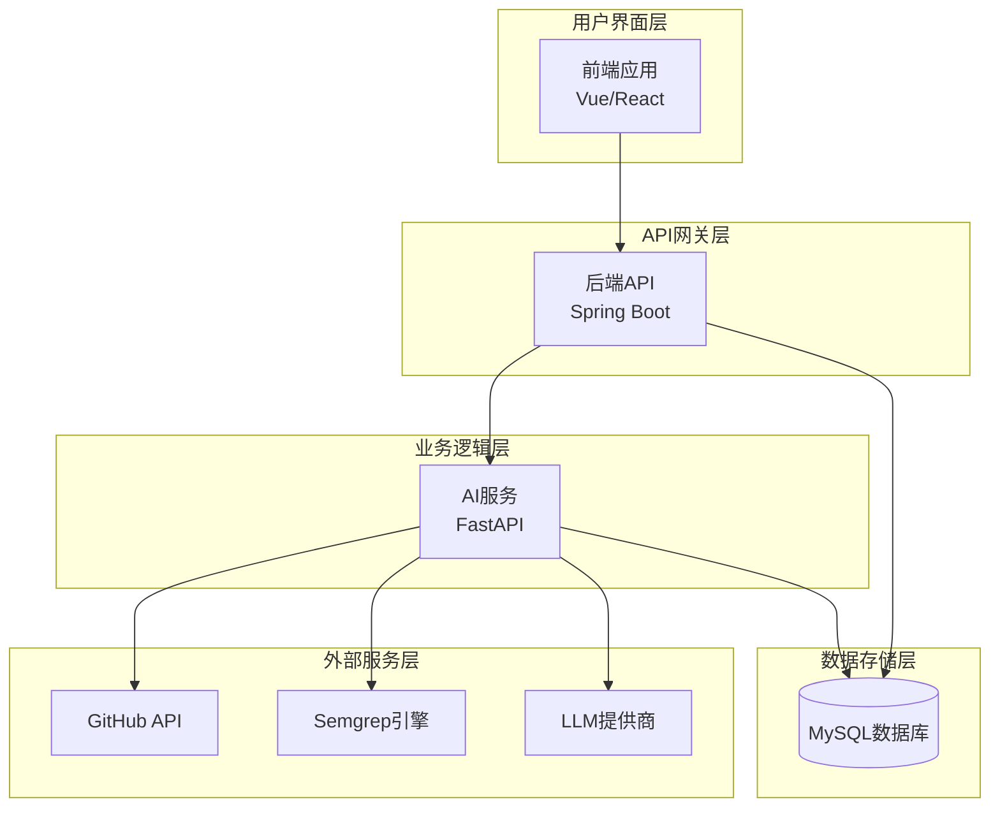

**图表来源**
- [docs/ARCHITECTURE.md:19-52](file://docs/ARCHITECTURE.md#L19-L52)
- [docs/PRD.md:32-52](file://docs/PRD.md#L32-L52)

### 架构设计原则

系统遵循以下核心设计原则：

1. **职责分离原则**：每个服务都有明确的职责边界，避免功能重叠
2. **单一职责原则**：Java后端专注业务编排，AI服务专注分析处理
3. **开放封闭原则**：对外部服务的调用通过标准化接口实现
4. **里氏替换原则**：服务间通过抽象接口通信，便于替换实现
5. **依赖倒置原则**：高层业务逻辑不依赖低层实现细节

### 服务交互流程

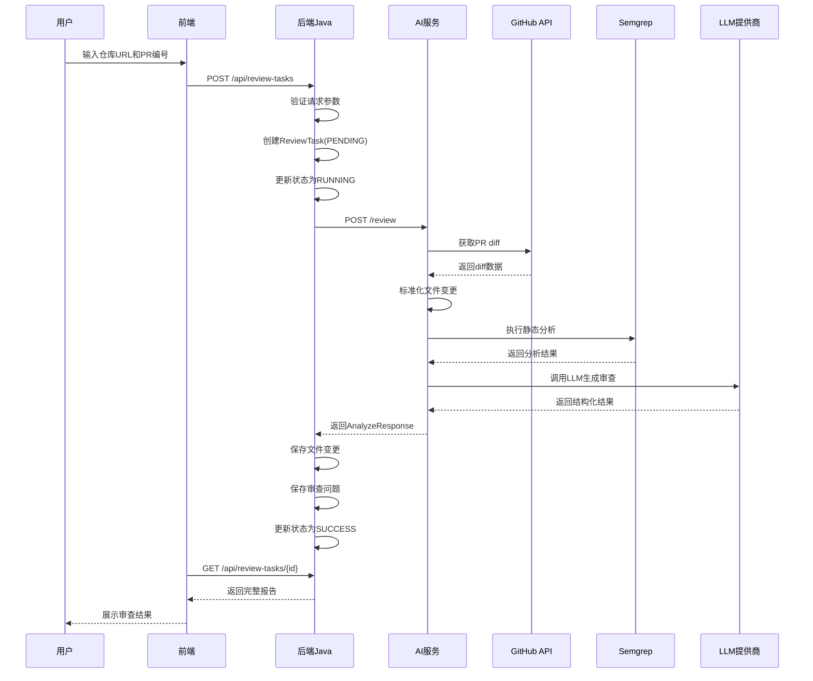

**图表来源**
- [docs/ARCHITECTURE.md:137-180](file://docs/ARCHITECTURE.md#L137-L180)
- [docs/PRD.md:32-52](file://docs/PRD.md#L32-L52)

**章节来源**
- [docs/ARCHITECTURE.md:7-16](file://docs/ARCHITECTURE.md#L7-L16)
- [docs/PRD.md:32-52](file://docs/PRD.md#L32-L52)

## 详细组件分析

### 前端组件分析

前端应用采用现代化的单页应用(SPA)架构，支持Vue 3或React框架选择：

#### 前端职责边界
- **允许**：用户输入表单、任务列表展示、任务详情渲染
- **禁止**：直接调用AI服务、GitHub API、LLM提供商

#### 前端数据流
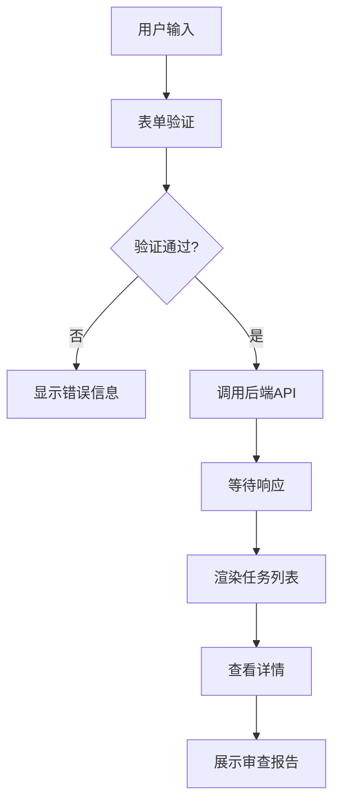

**图表来源**
- [frontend/README.md:25-31](file://frontend/README.md#L25-L31)
- [frontend/README.md:52-62](file://frontend/README.md#L52-L62)

**章节来源**
- [frontend/README.md:25-38](file://frontend/README.md#L25-L38)
- [frontend/README.md:52-62](file://frontend/README.md#L52-L62)

### Java后端组件分析

Java后端采用经典的三层架构模式，确保业务逻辑的清晰分离：

#### 后端分层架构
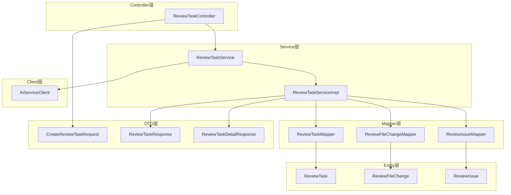

**图表来源**
- [docs/ARCHITECTURE.md:183-231](file://docs/ARCHITECTURE.md#L183-L231)

#### 业务流程控制
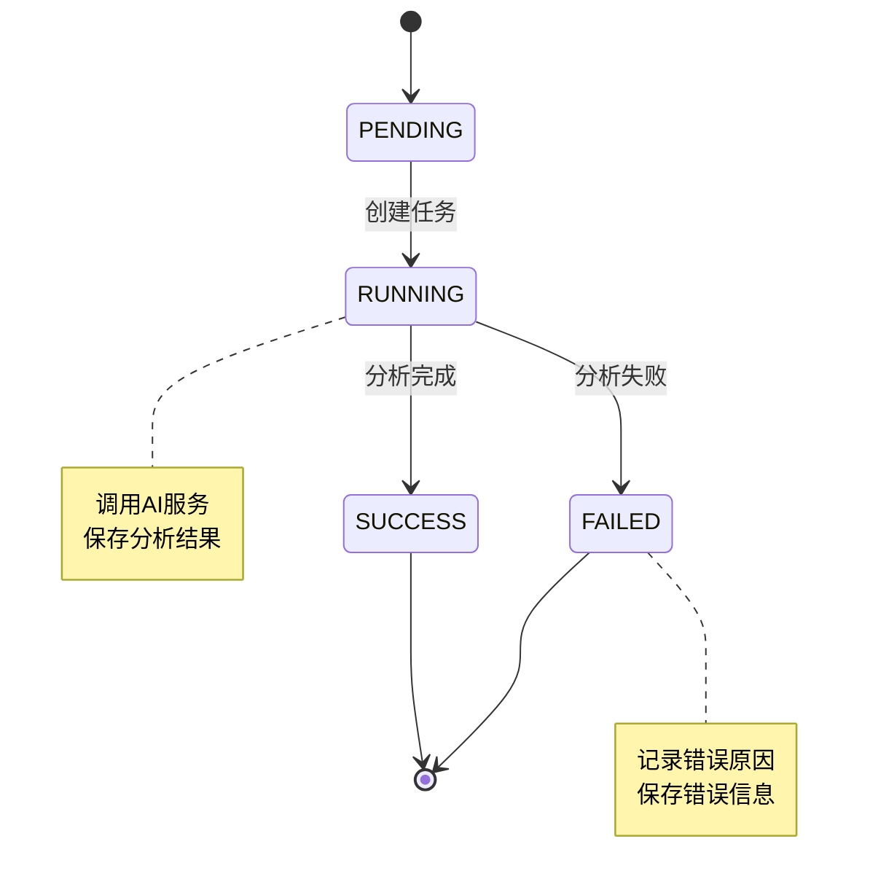

**图表来源**
- [docs/ARCHITECTURE.md:110-134](file://docs/ARCHITECTURE.md#L110-L134)

**章节来源**
- [docs/ARCHITECTURE.md:183-231](file://docs/ARCHITECTURE.md#L183-L231)
- [docs/ARCHITECTURE.md:110-134](file://docs/ARCHITECTURE.md#L110-L134)

### AI服务组件分析

AI服务模块采用功能导向的分层设计，专注于代码分析和智能处理：

#### AI服务分层设计
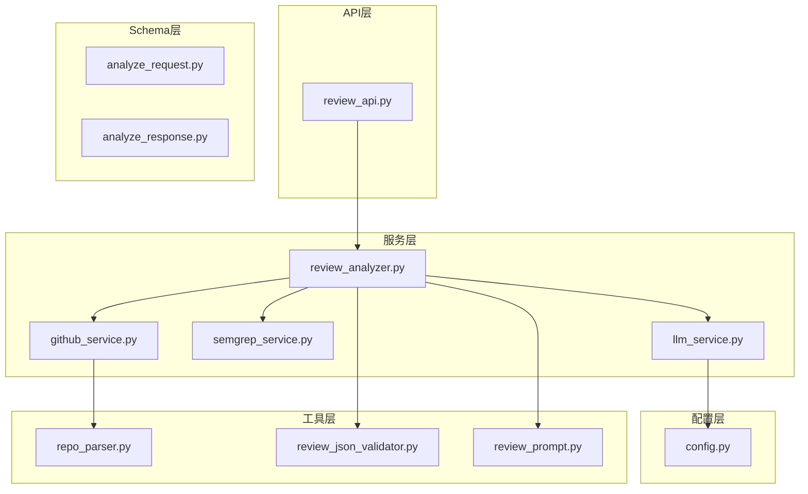

**图表来源**
- [docs/ARCHITECTURE.md:233-266](file://docs/ARCHITECTURE.md#L233-L266)

#### AI分析流程
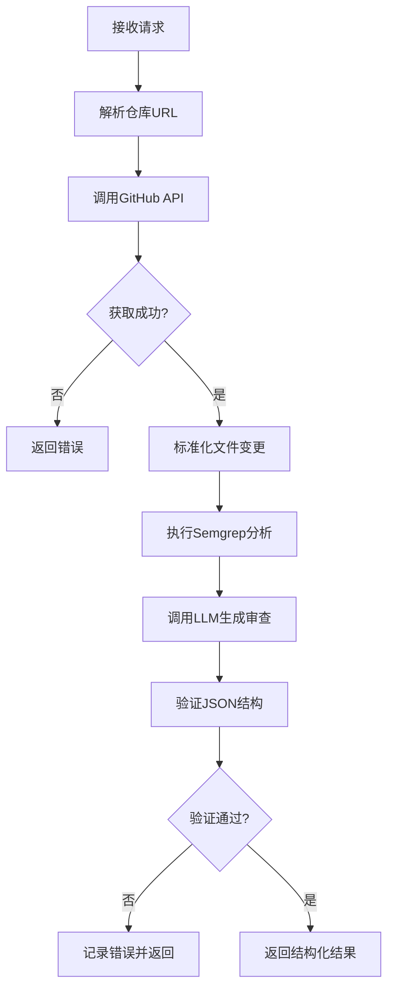

**图表来源**
- [docs/ARCHITECTURE.md:269-308](file://docs/ARCHITECTURE.md#L269-L308)

**章节来源**
- [docs/ARCHITECTURE.md:233-266](file://docs/ARCHITECTURE.md#L233-L266)
- [docs/ARCHITECTURE.md:269-308](file://docs/ARCHITECTURE.md#L269-L308)

## 依赖关系分析

### 外部依赖关系

系统与多个外部服务存在依赖关系，这些依赖通过标准化接口进行管理：

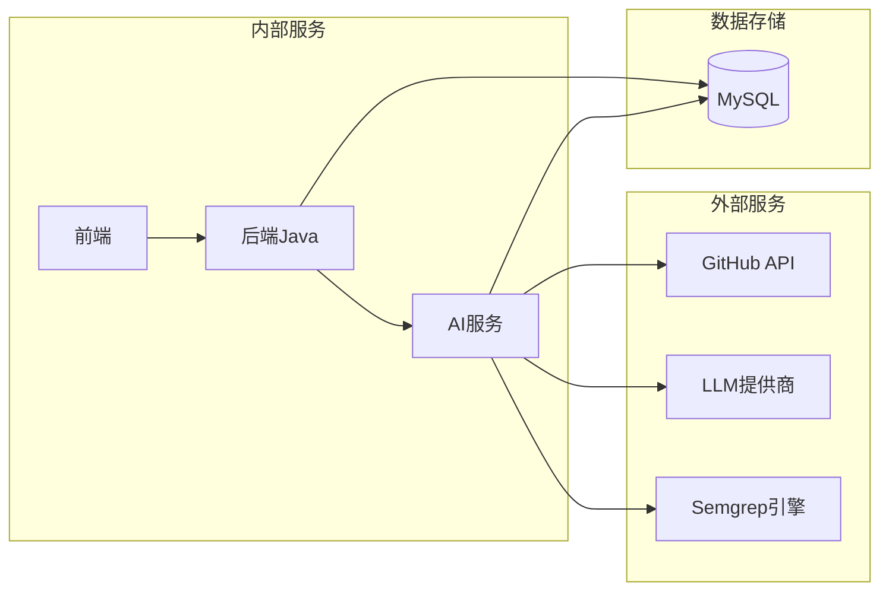

**图表来源**
- [docs/ARCHITECTURE.md:19-52](file://docs/ARCHITECTURE.md#L19-L52)

### 依赖管理策略

1. **GitHub API依赖**：通过认证令牌访问，支持私有仓库
2. **LLM提供商依赖**：支持多种模型提供商，具备mock替代方案
3. **Semgrep依赖**：本地安装，支持自定义规则集
4. **数据库依赖**：MySQL 8，支持事务和连接池

### 安全考虑

系统在设计时充分考虑了安全性：

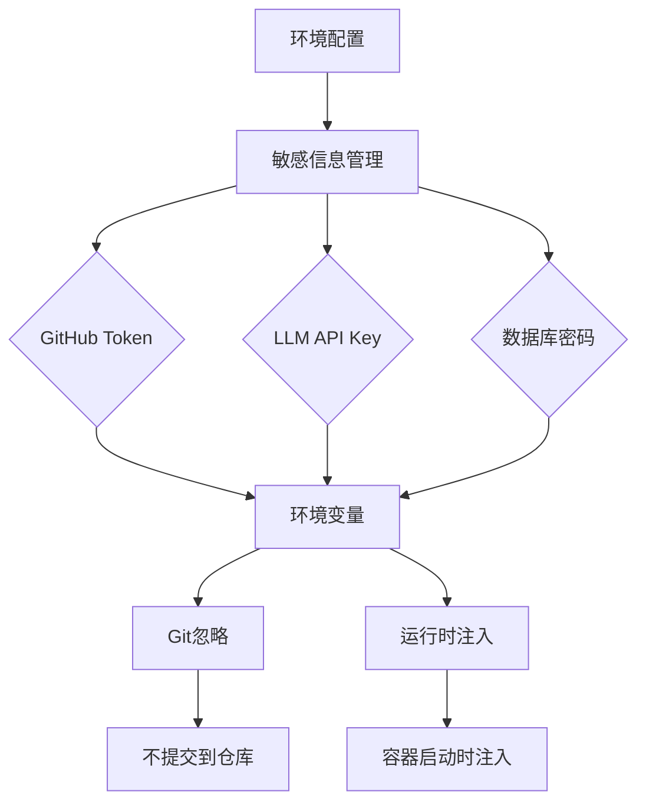

**图表来源**
- [docs/AGENT_RULES.md:152-160](file://docs/AGENT_RULES.md#L152-L160)

**章节来源**
- [docs/ARCHITECTURE.md:19-52](file://docs/ARCHITECTURE.md#L19-L52)
- [docs/AGENT_RULES.md:152-160](file://docs/AGENT_RULES.md#L152-L160)

## 性能考虑

### 架构性能特性

1. **同步调用模式**：第一阶段采用同步调用简化架构复杂度
2. **本地部署优化**：Docker Compose支持本地快速部署
3. **资源隔离**：各服务独立部署，避免资源争用
4. **缓存策略**：第一阶段不引入Redis等缓存组件

### 性能优化建议

1. **并发处理**：随着用户量增长，可考虑引入消息队列异步处理
2. **负载均衡**：多实例部署时使用反向代理实现负载均衡
3. **数据库优化**：合理设计索引，使用连接池管理数据库连接
4. **CDN加速**：静态资源可通过CDN加速加载

## 故障排除指南

### 常见问题及解决方案

#### 1. 服务启动失败
- 检查Docker Compose配置是否正确
- 验证端口占用情况
- 确认环境变量配置

#### 2. GitHub API调用失败
- 验证GitHub Token配置
- 检查网络连接
- 确认仓库访问权限

#### 3. AI服务分析失败
- 检查Semgrep安装和配置
- 验证LLM API Key
- 查看日志输出定位问题

#### 4. 数据库连接问题
- 验证MySQL服务状态
- 检查连接字符串配置
- 确认数据库权限设置

### 错误处理机制

系统采用统一的错误处理机制：

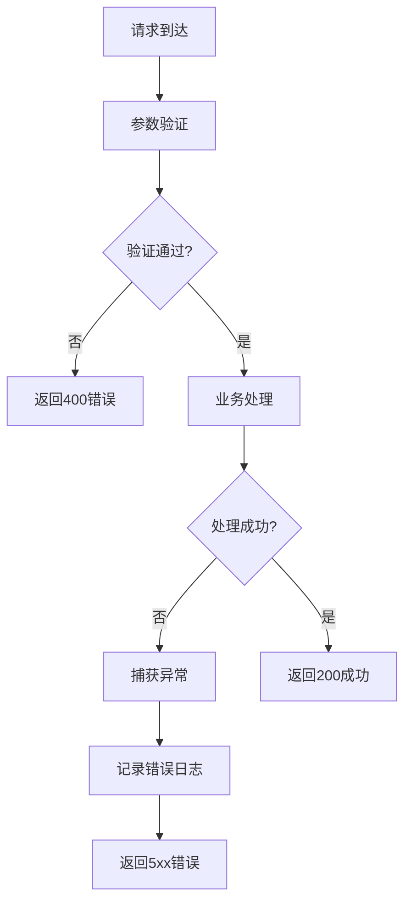

**图表来源**
- [docs/ARCHITECTURE.md:312-342](file://docs/ARCHITECTURE.md#L312-L342)

**章节来源**
- [docs/ARCHITECTURE.md:312-342](file://docs/ARCHITECTURE.md#L312-L342)

## 结论

CodeReviewX的整体架构设计体现了现代微服务架构的最佳实践，通过明确的服务边界、清晰的职责分离和严格的依赖管理，构建了一个可扩展、可维护的代码审查系统。

该架构的核心优势包括：

1. **清晰的职责分离**：前端、后端、AI服务各司其职，避免功能重叠
2. **简化的依赖关系**：第一阶段不引入复杂中间件，降低系统复杂度
3. **灵活的扩展性**：模块化设计便于后续功能扩展
4. **严格的安全控制**：通过环境变量和配置管理保护敏感信息

通过遵循"文档先行、MVP优先、模拟优先"的原则，CodeReviewX能够在保持简洁性的同时提供强大的代码审查能力，为后续的功能扩展奠定了坚实的基础。