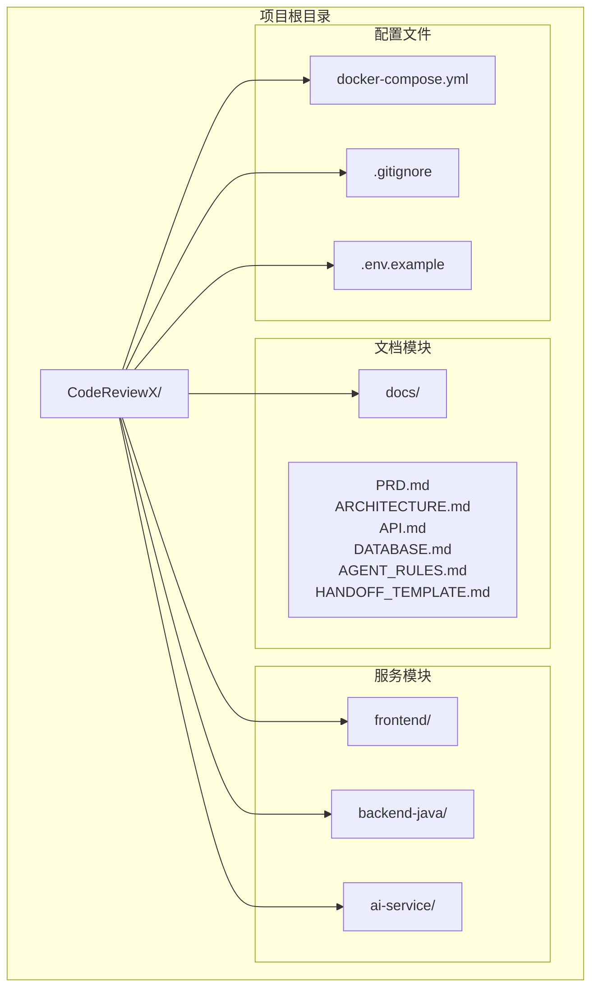
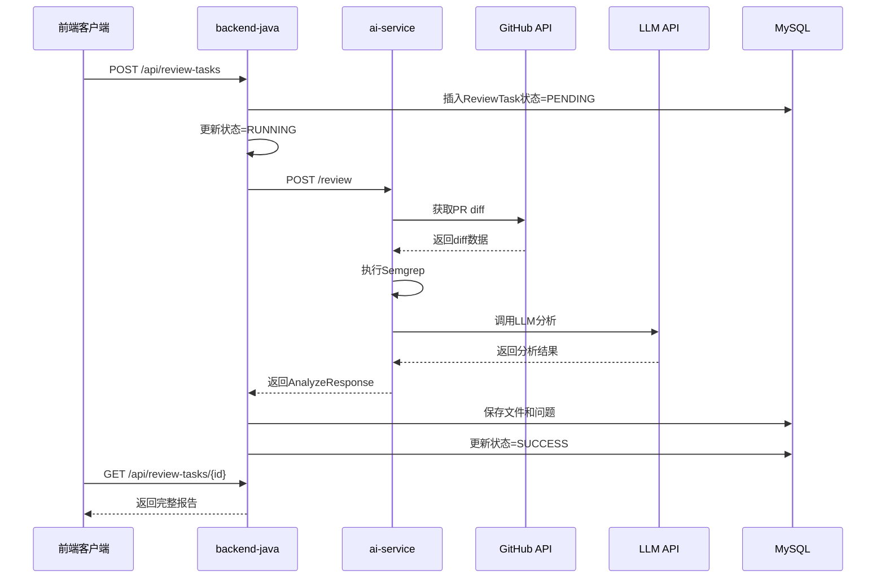
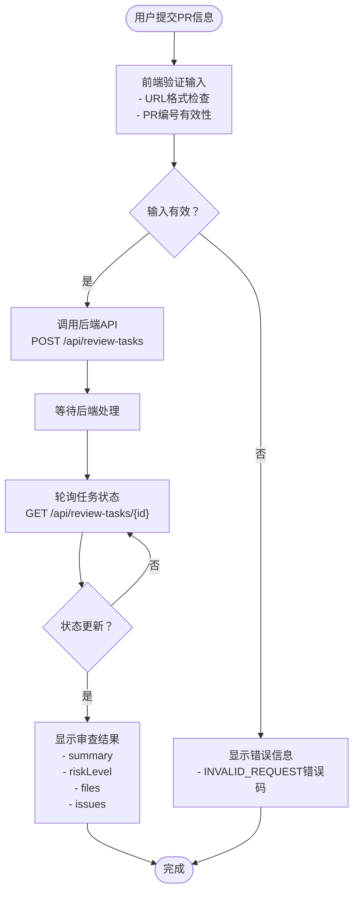
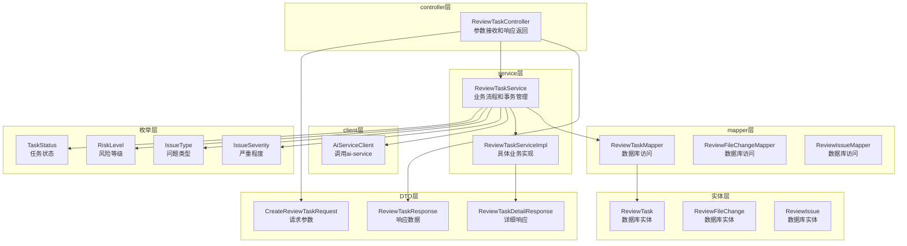
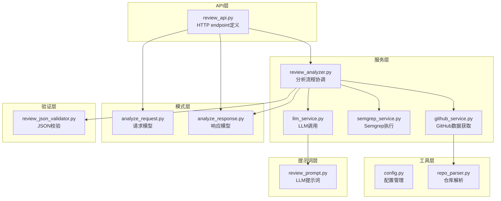
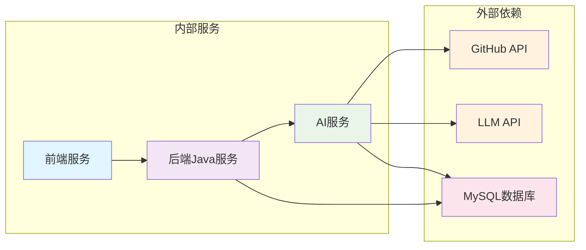
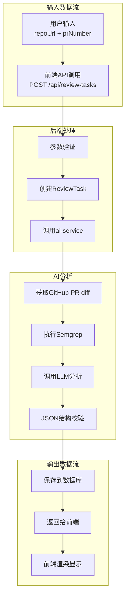
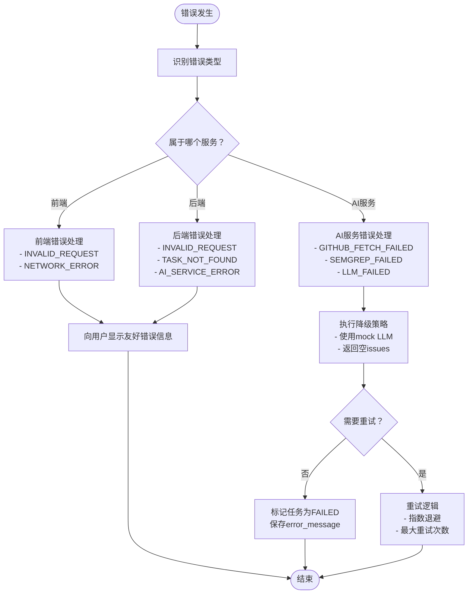
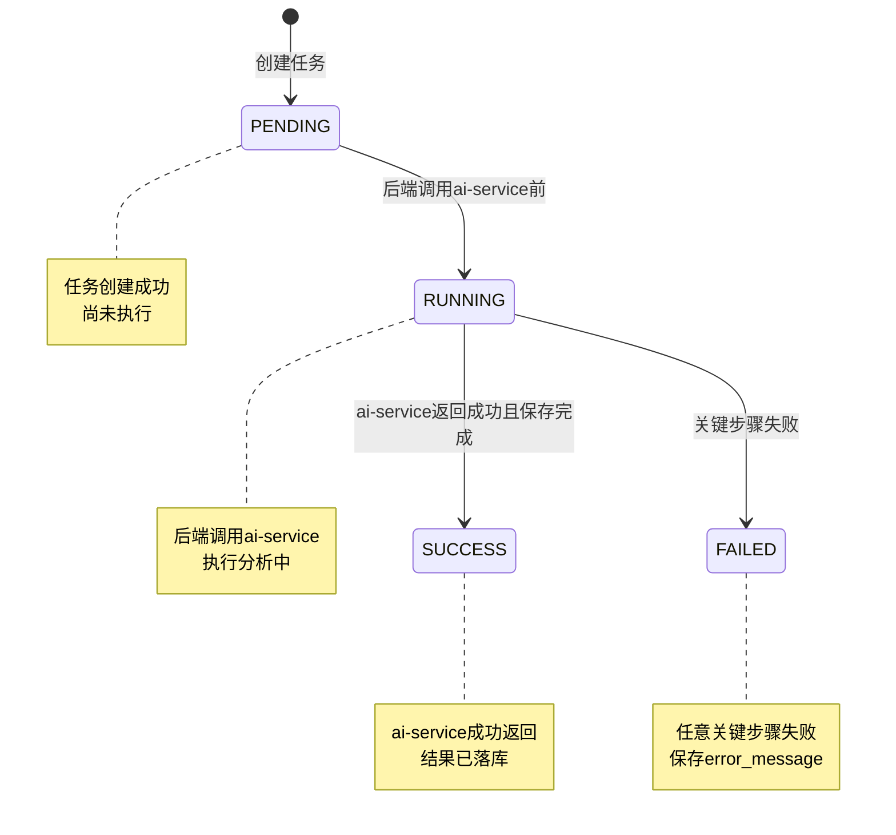

# 服务职责边界

<cite>
**本文档引用的文件**
- [README.md](file://README.md)
- [docs/ARCHITECTURE.md](file://docs/ARCHITECTURE.md)
- [docs/API.md](file://docs/API.md)
- [docs/AGENT_RULES.md](file://docs/AGENT_RULES.md)
- [docs/HANDOFF_TEMPLATE.md](file://docs/HANDOFF_TEMPLATE.md)
- [docker-compose.yml](file://docker-compose.yml)
- [frontend/README.md](file://frontend/README.md)
- [backend-java/README.md](file://backend-java/README.md)
- [ai-service/README.md](file://ai-service/README.md)
</cite>

## 目录
1. [引言](#引言)
2. [项目结构](#项目结构)
3. [核心组件](#核心组件)
4. [架构概览](#架构概览)
5. [详细组件分析](#详细组件分析)
6. [依赖关系分析](#依赖关系分析)
7. [性能考虑](#性能考虑)
8. [故障排除指南](#故障排除指南)
9. [结论](#结论)
10. [附录](#附录)

## 引言

CodeReviewX是一个智能代码审查和修复建议代理系统，专为GitHub Pull Requests设计。该项目采用多服务架构，通过明确的服务职责边界确保系统的可维护性、可扩展性和安全性。

在第一轮仓库基础建设阶段，项目已经建立了完整的职责边界设计，包括前端服务、后端Java服务和AI服务的明确分工。这些边界设计遵循了最小化职责、单一职责和边界清晰的原则。

## 项目结构

CodeReviewX项目采用模块化的目录结构，每个服务都有独立的模块：



**图表来源**
- [README.md:58-82](file://README.md#L58-L82)
- [docs/ARCHITECTURE.md:19-52](file://docs/ARCHITECTURE.md#L19-L52)

**章节来源**
- [README.md:58-82](file://README.md#L58-L82)
- [docker-compose.yml:1-14](file://docker-compose.yml#L1-L14)

## 核心组件

### 服务职责总原则

项目制定了七项核心架构原则，确保服务间的职责清晰分离：

1. **Java后端只做业务编排和数据持久化**
2. **Python ai-service只做GitHub数据获取、静态分析和LLM分析**
3. **前端只调用backend-java，不直接调用ai-service、GitHub API或LLM**
4. **MySQL只作为业务数据存储，不承担分析逻辑**
5. **第一阶段不引入Redis、消息队列、Kubernetes、向量数据库和复杂权限系统**
6. **所有服务优先保证本地可运行、可调试、可演示**
7. **所有AI能力必须先有mock fallback，再接入真实LLM**

**章节来源**
- [docs/ARCHITECTURE.md:7-16](file://docs/ARCHITECTURE.md#L7-L16)

### 服务角色矩阵

| 服务名称 | 技术栈 | 核心职责 | 禁止行为 |
|---------|--------|----------|----------|
| **frontend** | Vue 3 / React | 任务创建表单、任务列表、任务详情展示 | 直接调用ai-service、GitHub API；保存业务状态；处理LLM提示或Semgrep输出 |
| **backend-java** | Spring Boot 3 + Java 17 | REST API、任务生命周期管理、MySQL持久化、调用ai-service | 执行Semgrep；直接编写LLM提示；解析复杂diff；绕过ai-service调用LLM |
| **ai-service** | Python + FastAPI | GitHub diff获取、Semgrep执行、LLM分析、结构化JSON输出 | 直接写MySQL；管理ReviewTask状态；对前端暴露业务API；持有用户会话或权限体系 |

**章节来源**
- [docs/ARCHITECTURE.md:56-107](file://docs/ARCHITECTURE.md#L56-L107)
- [docs/PRD.md:49-54](file://docs/PRD.md#L49-L54)

## 架构概览

### 整体架构设计

```mermaid
graph TB
subgraph "前端层"
FrontendUI[前端应用<br/>Vue 3 / React]
end
subgraph "后端层"
BackendJava[backend-java<br/>Spring Boot 3 + Java 17<br/>ReviewTask编排]
end
subgraph "AI分析层"
AIService[ai-service<br/>Python + FastAPI<br/>GitHub diff / Semgrep / LLM]
end
subgraph "外部服务"
GitHubAPI[GitHub API]
LLMAPI[LLM API]
end
subgraph "数据存储"
MySQL[(MySQL)<br/>task / files / issues]
end
FrontendUI --> BackendJava
BackendJava --> AIService
AIService --> GitHubAPI
AIService --> LLMAPI
BackendJava --> MySQL
AIService --> MySQL
note1["前端仅通过<br/>backend-java访问<br/>AI能力"]
note2["ai-service仅通过<br/>内部API对外提供<br/>分析服务"]
FrontendUI -.-> note1
AIService -.-> note2
```

**图表来源**
- [docs/ARCHITECTURE.md:19-52](file://docs/ARCHITECTURE.md#L19-L52)
- [docs/ARCHITECTURE.md:233-266](file://docs/ARCHITECTURE.md#L233-L266)

### 服务间通信边界



**图表来源**
- [docs/ARCHITECTURE.md:137-181](file://docs/ARCHITECTURE.md#L137-L181)
- [docs/API.md:54-241](file://docs/API.md#L54-L241)

**章节来源**
- [docs/ARCHITECTURE.md:137-181](file://docs/ARCHITECTURE.md#L137-L181)
- [docs/API.md:54-241](file://docs/API.md#L54-L241)

## 详细组件分析

### 前端服务职责边界

#### 职责范围

前端服务被严格限定为用户界面层，主要职责包括：

**允许的操作：**
- 提供ReviewTask创建页面，收集GitHub仓库URL和PR编号
- 显示任务列表页面，展示任务状态、风险等级和创建时间
- 展示任务详情页面，显示完整的审查报告
- 渲染ReviewIssue列表，包括类型、严重程度、文件路径、行号、描述和建议
- 展示任务状态和失败原因

**限制条件：**
- 不得直接调用ai-service或GitHub API
- 不得保存业务状态到本地存储
- 不得处理LLM提示或Semgrep输出
- 不得对后端暴露为公共业务API

#### 最佳实践指导



**图表来源**
- [frontend/README.md:25-38](file://frontend/README.md#L25-L38)
- [docs/API.md:54-96](file://docs/API.md#L54-L96)

**章节来源**
- [frontend/README.md:25-38](file://frontend/README.md#L25-L38)
- [docs/API.md:54-96](file://docs/API.md#L54-L96)

### 后端Java服务职责边界

#### 职责范围

backend-java作为业务编排中心，承担以下核心职责：

**允许的操作：**
- 对前端提供统一REST API接口
- 创建ReviewTask并管理其生命周期
- 调用ai-service执行实际的代码分析
- 保存ReviewFileChange和ReviewIssue到数据库
- 提供查询接口供前端使用
- 统一处理业务异常和响应格式

**禁止的行为：**
- 不得执行Semgrep静态分析
- 不得直接编写LLM提示
- 不得解析复杂的diff内容
- 不得绕过ai-service直接调用LLM

#### 分层架构设计



**图表来源**
- [docs/ARCHITECTURE.md:183-230](file://docs/ARCHITECTURE.md#L183-L230)

**章节来源**
- [backend-java/README.md:19-25](file://backend-java/README.md#L19-L25)
- [docs/ARCHITECTURE.md:183-230](file://docs/ARCHITECTURE.md#L183-L230)

### AI服务职责边界

#### 职责范围

ai-service专注于代码分析的核心能力，职责包括：

**允许的操作：**
- 解析GitHub仓库URL并验证格式
- 调用GitHub API获取PR信息和diff
- 标准化文件变更信息
- 执行Semgrep静态分析
- 组织LLM提示词并调用LLM
- 校验LLM返回的JSON结构
- 合并Semgrep和LLM的问题
- 返回统一的AnalyzeResponse格式

**禁止的行为：**
- 不得直接写入MySQL数据库
- 不得管理ReviewTask状态
- 不得对前端暴露业务API
- 不得持有用户会话或权限状态

#### 服务分层设计



**图表来源**
- [docs/ARCHITECTURE.md:233-266](file://docs/ARCHITECTURE.md#L233-L266)

**章节来源**
- [ai-service/README.md:19-26](file://ai-service/README.md#L19-L26)
- [docs/ARCHITECTURE.md:233-266](file://docs/ARCHITECTURE.md#L233-L266)

## 依赖关系分析

### 服务依赖图



**图表来源**
- [docs/ARCHITECTURE.md:19-52](file://docs/ARCHITECTURE.md#L19-L52)

### 数据流向限制



**图表来源**
- [docs/ARCHITECTURE.md:269-308](file://docs/ARCHITECTURE.md#L269-L308)

**章节来源**
- [docs/ARCHITECTURE.md:269-308](file://docs/ARCHITECTURE.md#L269-L308)

## 性能考虑

### 架构简化原则

项目在第一阶段避免引入复杂架构组件，以确保性能和可维护性的平衡：

| 不引入的组件 | 设计理由 |
|-------------|----------|
| **Redis** | 当前任务量小，数据库状态足以表达任务进度 |
| **消息队列** | 异步复杂度高，MVP阶段可先使用同步调用或简单后台线程 |
| **Kubernetes** | 部署复杂，作品集阶段Docker Compose更便于演示 |
| **向量数据库** | 当前场景是PR diff分析，不需要RAG功能 |
| **多模型路由** | 增加配置和调试成本，mock + 单模型即可满足需求 |
| **用户系统** | 第一阶段聚焦主链路，不需要账号体系 |

**章节来源**
- [docs/ARCHITECTURE.md:407-417](file://docs/ARCHITECTURE.md#L407-L417)

### 通信优化策略

1. **同步调用优先**：在MVP阶段使用同步HTTP调用，避免消息队列的复杂性
2. **Mock先行**：先实现mock LLM，确保端到端流程可用后再集成真实LLM
3. **错误降级**：Semgrep失败时降级为warning，不影响整体任务状态
4. **超时控制**：合理设置ai-service调用超时，避免前端长时间等待

## 故障排除指南

### 错误处理机制



**图表来源**
- [docs/ARCHITECTURE.md:170-180](file://docs/ARCHITECTURE.md#L170-L180)
- [docs/ARCHITECTURE.md:312-342](file://docs/ARCHITECTURE.md#L312-L342)

### 状态管理规则



**图表来源**
- [docs/ARCHITECTURE.md:110-134](file://docs/ARCHITECTURE.md#L110-L134)

**章节来源**
- [docs/ARCHITECTURE.md:110-134](file://docs/ARCHITECTURE.md#L110-L134)
- [docs/ARCHITECTURE.md:170-180](file://docs/ARCHITECTURE.md#L170-L180)

## 结论

CodeReviewX项目通过明确的服务职责边界设计，建立了一个清晰、可维护且可扩展的微服务架构。这种设计确保了：

1. **职责清晰**：每个服务都有明确的边界和责任范围
2. **耦合度低**：服务间通过明确定义的API接口通信
3. **可维护性强**：单一职责原则使得代码更容易理解和修改
4. **可扩展性好**：模块化设计支持未来功能的增量添加
5. **安全性保障**：严格的边界控制防止了安全漏洞的产生

在第一轮的仓库基础建设阶段，项目已经建立了完整的职责边界框架，为后续的功能实现奠定了坚实的基础。开发者应该严格按照这些边界进行开发，确保系统的整体一致性和稳定性。

## 附录

### 开发者最佳实践清单

#### 前端开发注意事项
- 仅通过后端API获取数据，不直接调用外部服务
- 实现完善的输入验证和错误处理
- 使用统一的错误码和响应格式
- 避免在前端存储敏感信息

#### 后端Java开发注意事项
- 严格遵守分层架构，不要跨层调用
- 所有外部服务调用都要有超时和重试机制
- 实现统一的异常处理和错误响应
- 数据库操作要使用ORM框架，避免原生SQL注入

#### AI服务开发注意事项
- 保持纯函数特性，避免状态污染
- 实现完整的输入验证和输出校验
- 提供mock模式支持端到端测试
- 严格遵守JSON schema验证

#### 团队协作规范
- 遵循Agent协作规则，不得越权修改其他模块
- 所有变更必须先更新相关文档
- 严格遵守安全规则，保护敏感信息
- 使用标准的交接报告模板

**章节来源**
- [docs/AGENT_RULES.md:22-31](file://docs/AGENT_RULES.md#L22-L31)
- [docs/AGENT_RULES.md:152-160](file://docs/AGENT_RULES.md#L152-L160)