# 系统架构

<cite>
**本文引用的文件**
- [docker-compose.yml](file://docker-compose.yml)
- [README.md](file://README.md)
- [docs/ARCHITECTURE.md](file://docs/ARCHITECTURE.md)
- [docs/PRD.md](file://docs/PRD.md)
- [docs/API.md](file://docs/API.md)
- [docs/DATABASE.md](file://docs/DATABASE.md)
- [docs/AGENT_RULES.md](file://docs/AGENT_RULES.md)
- [backend-java/README.md](file://backend-java/README.md)
- [ai-service/README.md](file://ai-service/README.md)
- [frontend/README.md](file://frontend/README.md)
</cite>

## 目录
1. [简介](#简介)
2. [项目结构](#项目结构)
3. [核心组件](#核心组件)
4. [架构概览](#架构概览)
5. [详细组件分析](#详细组件分析)
6. [依赖关系分析](#依赖关系分析)
7. [性能考虑](#性能考虑)
8. [故障排除指南](#故障排除指南)
9. [结论](#结论)
10. [附录](#附录)

## 简介

CodeReviewX是一个面向GitHub Pull Request的智能代码审查与修复建议系统。该系统采用微服务架构设计，通过三个核心模块协同工作：Java后端服务负责业务编排和数据持久化，AI服务负责GitHub数据获取、静态分析和LLM分析，前端应用提供用户交互界面。

该项目遵循"文档优先、MVP优先、Mock优先"的设计原则，在第一阶段专注于核心功能的实现和验证。系统设计充分考虑了可扩展性、可维护性和安全性要求。

## 项目结构

CodeReviewX采用模块化的项目结构，每个核心模块都有独立的职责边界和开发周期：

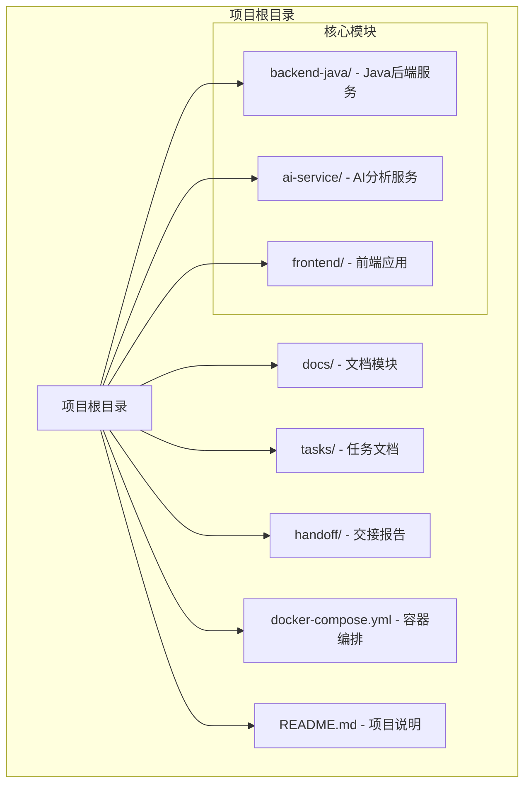

**图表来源**
- [README.md:58-82](file://README.md#L58-L82)
- [docker-compose.yml:1-14](file://docker-compose.yml#L1-L14)

**章节来源**
- [README.md:58-82](file://README.md#L58-L82)
- [docs/ARCHITECTURE.md:19-52](file://docs/ARCHITECTURE.md#L19-L52)

## 核心组件

### 后端Java服务 (backend-java)

后端Java服务是整个系统的核心协调者，采用Spring Boot 3 + Java 17技术栈构建。该服务负责：

- **REST API提供**：对外暴露统一的REST接口给前端应用
- **任务生命周期管理**：创建、监控和管理ReviewTask的完整生命周期
- **数据持久化**：通过MyBatis-Plus框架与MySQL数据库交互
- **AI服务编排**：调用AI分析服务执行具体的代码审查任务

**技术选型理由**：
- Spring Boot 3提供现代化的企业级开发体验
- Java 17确保长期支持和性能优化
- MyBatis-Plus简化数据库操作，提高开发效率

### AI分析服务 (ai-service)

AI分析服务采用Python + FastAPI架构，专门负责代码分析相关的技术实现：

- **GitHub数据获取**：解析仓库URL，调用GitHub API获取PR信息和diff
- **静态分析执行**：运行Semgrep进行代码静态分析
- **LLM集成**：调用语言模型生成结构化的代码审查报告
- **结果标准化**：将不同来源的分析结果整合为统一格式

**架构优势**：
- FastAPI提供高性能的异步处理能力
- Pydantic确保数据模型的严格验证
- 模块化设计便于功能扩展和维护

### 前端应用 (frontend)

前端应用提供用户友好的交互界面，支持Vue 3或React框架选择：

- **任务创建界面**：用户输入GitHub仓库URL和PR编号
- **任务列表展示**：显示所有提交的审查任务及其状态
- **详细报告展示**：渲染完整的代码审查报告
- **状态反馈**：展示任务执行状态和失败原因

**设计理念**：
- 严格的边界控制，仅通过后端API进行数据交互
- 清晰的页面路由设计，支持任务创建、列表和详情页面

**章节来源**
- [backend-java/README.md:19-46](file://backend-java/README.md#L19-L46)
- [ai-service/README.md:19-46](file://ai-service/README.md#L19-L46)
- [frontend/README.md:25-38](file://frontend/README.md#L25-L38)

## 架构概览

CodeReviewX采用分层微服务架构，通过清晰的服务边界和标准化的通信协议实现模块间的松耦合集成：

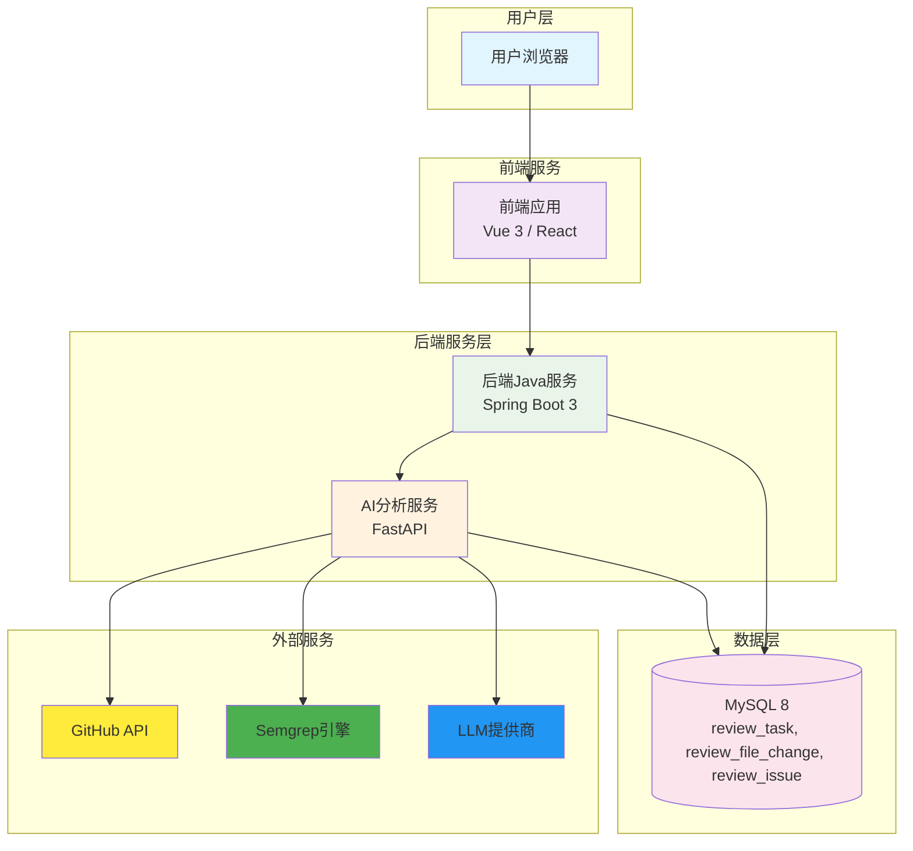

**图表来源**
- [docs/ARCHITECTURE.md:19-52](file://docs/ARCHITECTURE.md#L19-L52)
- [docs/PRD.md:37-57](file://docs/PRD.md#L37-L57)

### 系统边界定义

系统边界通过严格的职责分离确保各模块的专业化：

- **前端边界**：仅负责用户界面展示，不直接访问任何后端服务
- **后端边界**：协调业务流程，不直接执行分析逻辑
- **AI服务边界**：专注代码分析，不处理业务状态管理
- **数据库边界**：纯粹的数据存储，不承载业务逻辑

### 外部依赖关系

系统与多个外部服务建立集成关系：

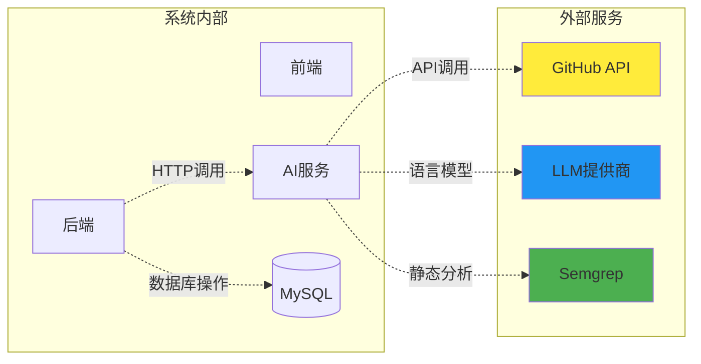

**图表来源**
- [docs/ARCHITECTURE.md:44-46](file://docs/ARCHITECTURE.md#L44-L46)
- [docs/API.md:13-16](file://docs/API.md#L13-L16)

**章节来源**
- [docs/ARCHITECTURE.md:44-46](file://docs/ARCHITECTURE.md#L44-L46)
- [docs/API.md:13-16](file://docs/API.md#L13-L16)

## 详细组件分析

### 后端Java服务架构

后端Java服务采用经典的三层架构设计，确保关注点分离和代码组织的清晰性：

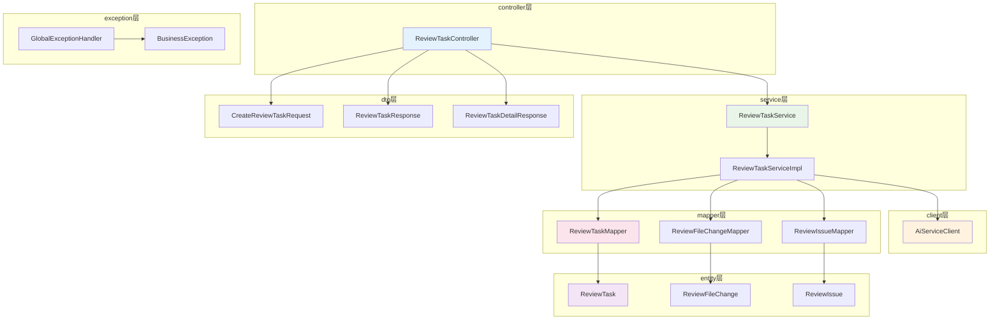

**图表来源**
- [docs/ARCHITECTURE.md:156-203](file://docs/ARCHITECTURE.md#L156-L203)

#### 数据模型设计

系统采用三张核心表支撑完整的代码审查流程：

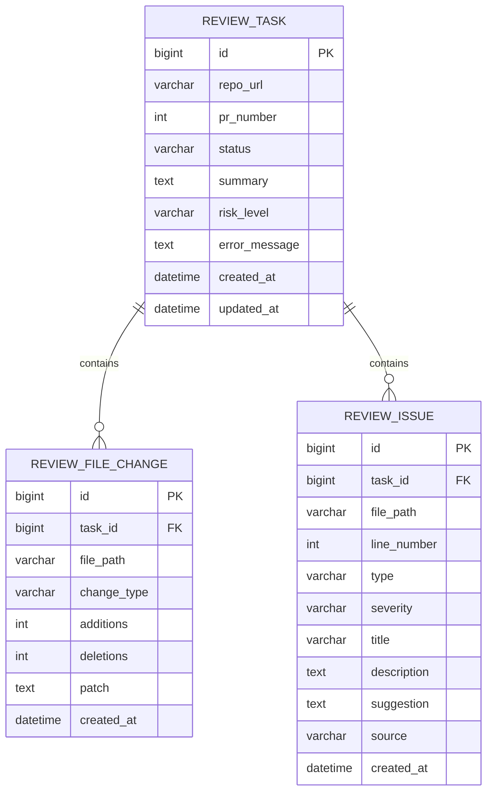

**图表来源**
- [docs/DATABASE.md:22-134](file://docs/DATABASE.md#L22-L134)

**章节来源**
- [docs/ARCHITECTURE.md:156-203](file://docs/ARCHITECTURE.md#L156-L203)
- [docs/DATABASE.md:22-134](file://docs/DATABASE.md#L22-L134)

### AI分析服务架构

AI分析服务采用功能导向的模块化设计，每个模块专注于特定的分析任务：

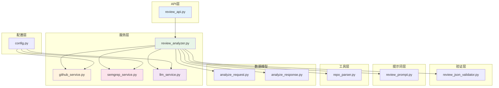

**图表来源**
- [docs/ARCHITECTURE.md:206-240](file://docs/ARCHITECTURE.md#L206-L240)

#### 核心调用流程

系统的核心工作流程遵循严格的顺序执行模式：

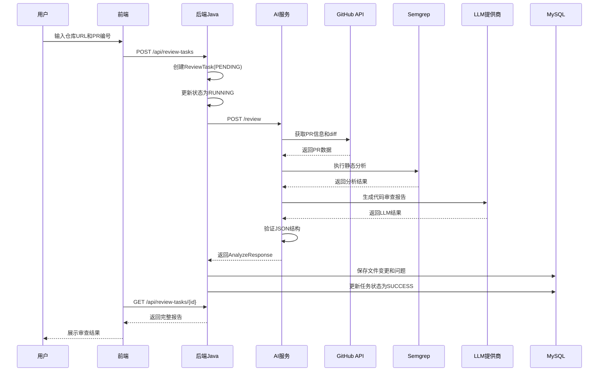

**图表来源**
- [docs/ARCHITECTURE.md:112-141](file://docs/ARCHITECTURE.md#L112-L141)
- [docs/PRD.md:37-57](file://docs/PRD.md#L37-L57)

**章节来源**
- [docs/ARCHITECTURE.md:112-141](file://docs/ARCHITECTURE.md#L112-L141)
- [docs/PRD.md:37-57](file://docs/PRD.md#L37-L57)

### 前端应用架构

前端应用采用组件化的架构设计，支持Vue 3或React框架的选择：

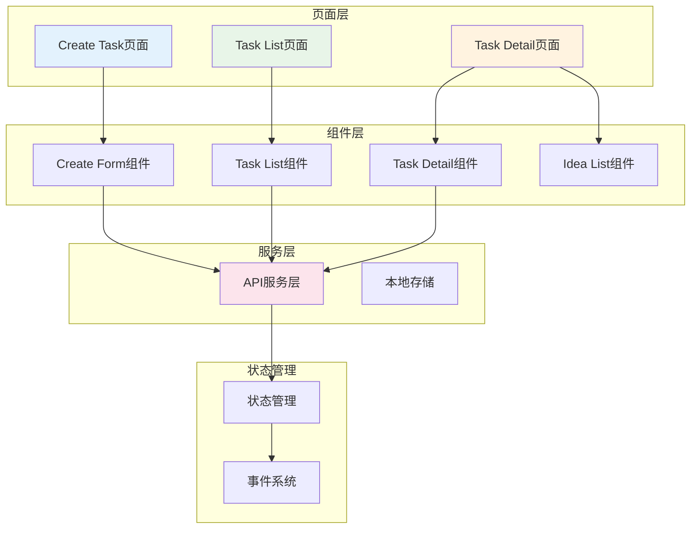

**图表来源**
- [frontend/README.md:42-49](file://frontend/README.md#L42-L49)

**章节来源**
- [frontend/README.md:42-49](file://frontend/README.md#L42-L49)

## 依赖关系分析

系统采用松耦合的设计原则，通过标准化的接口和协议实现模块间的通信：

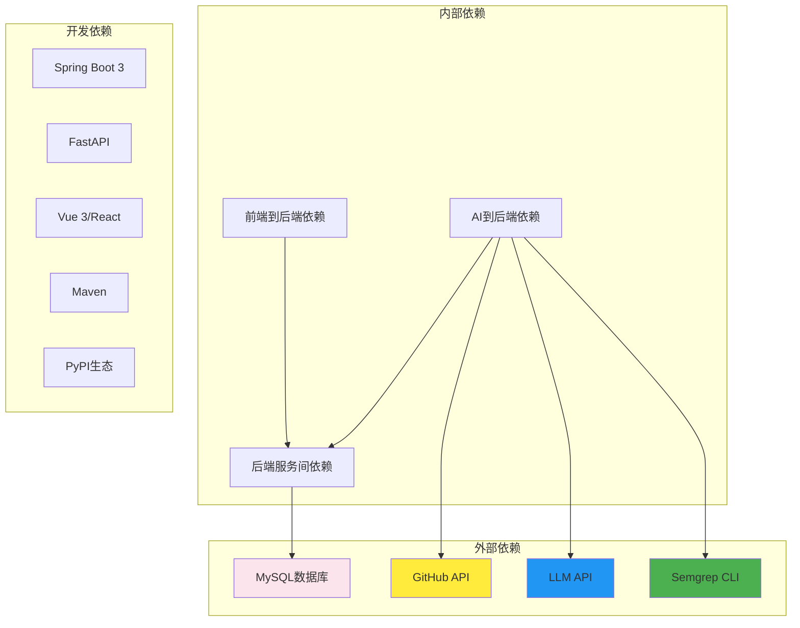

**图表来源**
- [docs/ARCHITECTURE.md:346-354](file://docs/ARCHITECTURE.md#L346-L354)
- [docs/API.md:13-16](file://docs/API.md#L13-L16)

### 配置与环境管理

系统采用环境变量驱动的配置管理方式：

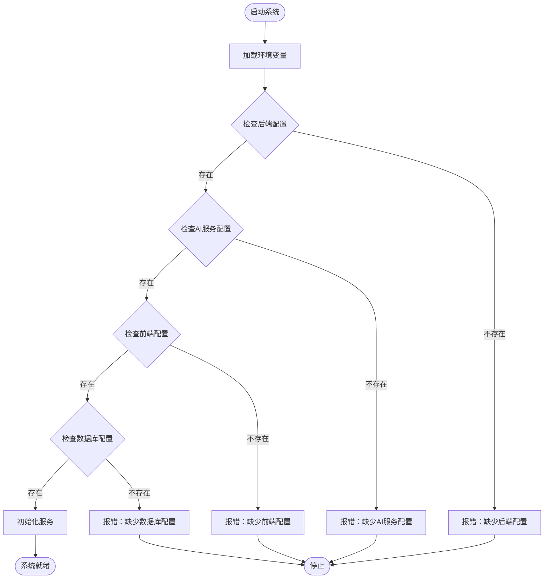

**图表来源**
- [docs/ARCHITECTURE.md:318-343](file://docs/ARCHITECTURE.md#L318-L343)

**章节来源**
- [docs/ARCHITECTURE.md:318-343](file://docs/ARCHITECTURE.md#L318-L343)

## 性能考虑

### 并发处理策略

系统采用同步调用为主的设计，避免复杂的异步处理开销：

- **后端到AI服务调用**：采用同步HTTP请求，简化错误处理
- **数据库操作**：使用连接池管理，避免频繁的连接创建销毁
- **前端响应**：采用轻量级的组件更新策略

### 缓存策略

第一阶段不引入缓存机制，通过合理的数据库设计和查询优化满足性能需求：

- **索引优化**：为常用查询字段建立合适的索引
- **查询优化**：避免N+1查询问题，使用批量操作
- **连接池**：合理配置数据库连接池大小

### 扩展性设计

系统预留了未来扩展的空间：

- **服务拆分**：可根据需要进一步拆分服务
- **负载均衡**：支持水平扩展以应对流量增长
- **异步处理**：可在不影响核心功能的前提下引入消息队列

## 故障排除指南

### 常见错误场景及处理

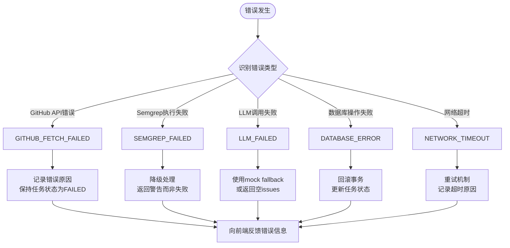

**图表来源**
- [docs/ARCHITECTURE.md:143-153](file://docs/ARCHITECTURE.md#L143-L153)

### 错误响应格式

系统采用统一的错误响应格式，便于前端处理和用户理解：

| 错误码 | HTTP状态 | 场景描述 |
|--------|----------|----------|
| INVALID_REQUEST | 400 | 请求参数错误或校验失败 |
| TASK_NOT_FOUND | 404 | 任务不存在 |
| AI_SERVICE_ERROR | 502 | AI服务调用失败 |
| GITHUB_FETCH_FAILED | 502 | GitHub数据获取失败 |
| DATABASE_ERROR | 500 | 数据库操作失败 |
| INTERNAL_ERROR | 500 | 未知系统错误 |

**章节来源**
- [docs/ARCHITECTURE.md:285-305](file://docs/ARCHITECTURE.md#L285-L305)
- [docs/API.md:41-51](file://docs/API.md#L41-L51)

## 结论

CodeReviewX系统架构体现了现代微服务设计的最佳实践，通过清晰的职责分离、标准化的接口设计和严格的边界控制，实现了高度模块化的系统结构。该架构在保证功能完整性的同时，充分考虑了可维护性、可扩展性和安全性要求。

系统采用渐进式的开发策略，通过多个Round的迭代逐步完善各个模块的功能实现。这种设计不仅降低了开发风险，也为后续的功能扩展和性能优化奠定了坚实的基础。

## 附录

### API设计规范

系统采用RESTful API设计，前后端分离的架构模式：

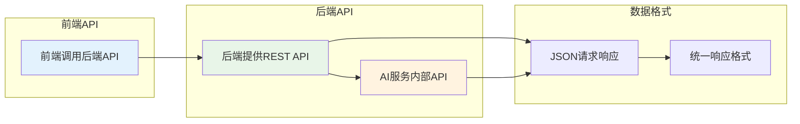

**图表来源**
- [docs/API.md:9-40](file://docs/API.md#L9-L40)

### 安全考虑

系统在设计阶段就充分考虑了安全因素：

- **凭据管理**：所有敏感信息通过环境变量管理，避免硬编码
- **访问控制**：前端仅通过后端API访问，不直接暴露内部服务
- **错误处理**：统一的错误响应格式，避免泄露系统内部信息
- **日志管理**：严格的日志输出规范，防止敏感信息泄露

**章节来源**
- [docs/AGENT_RULES.md:152-160](file://docs/AGENT_RULES.md#L152-L160)