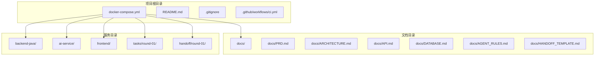
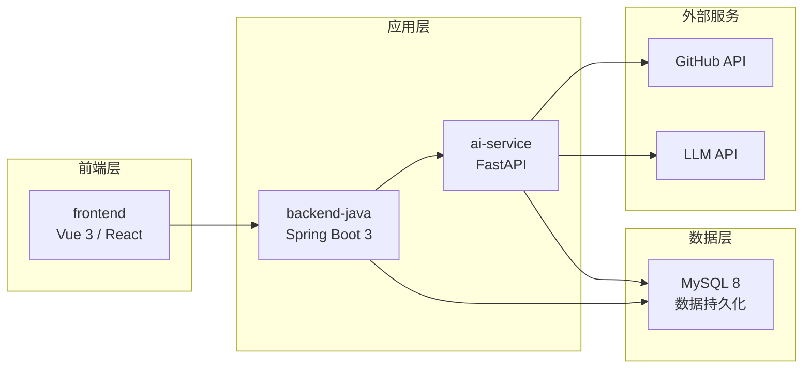
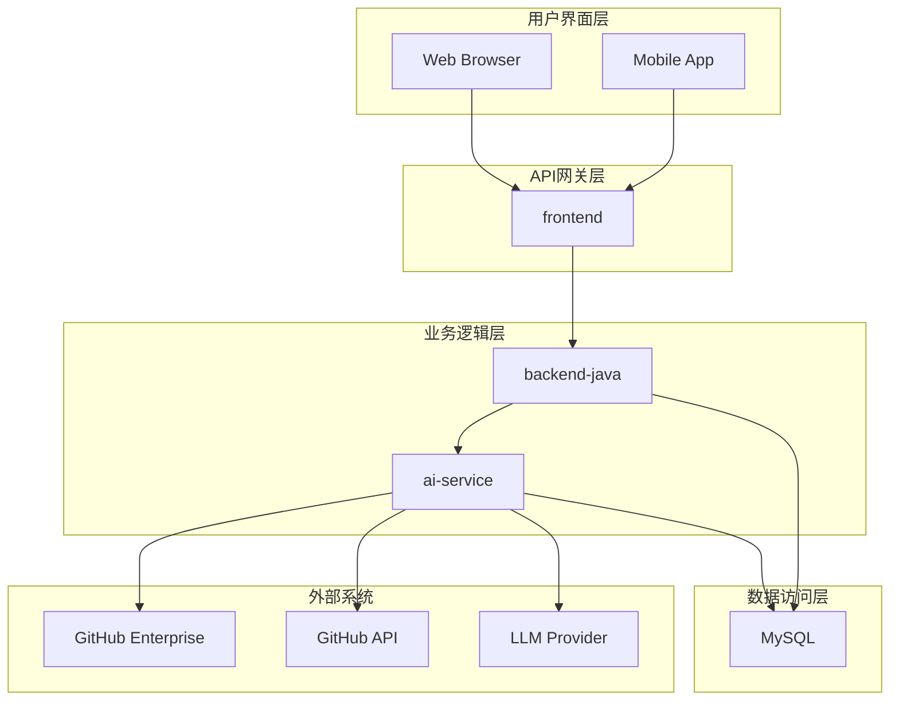
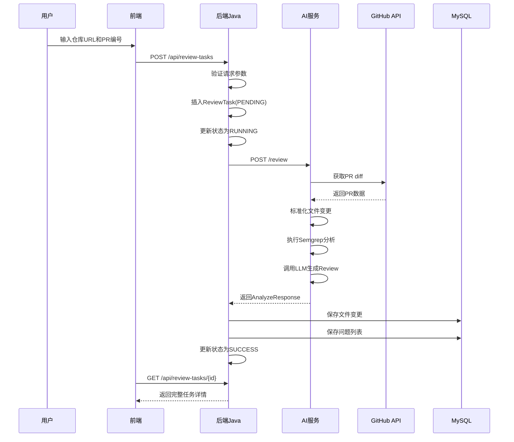
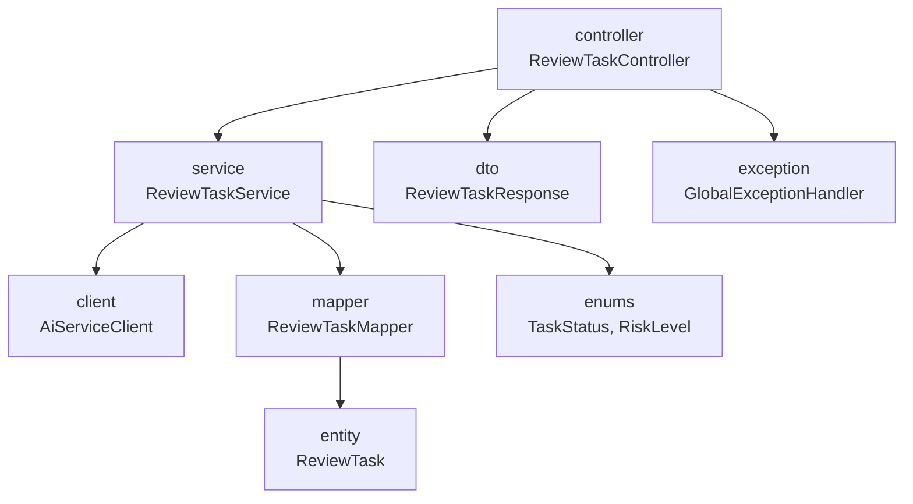
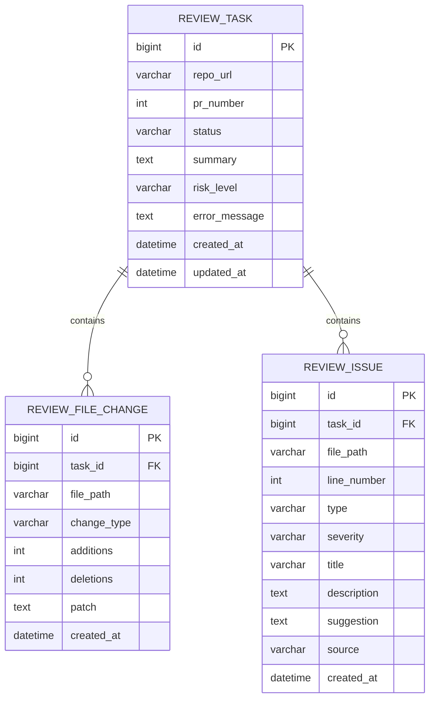
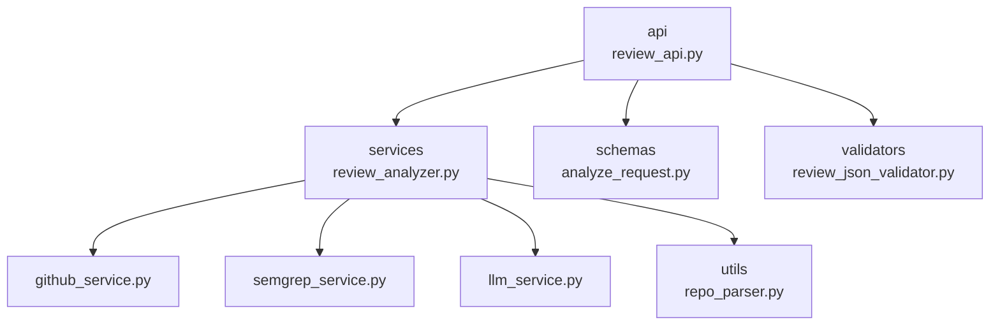
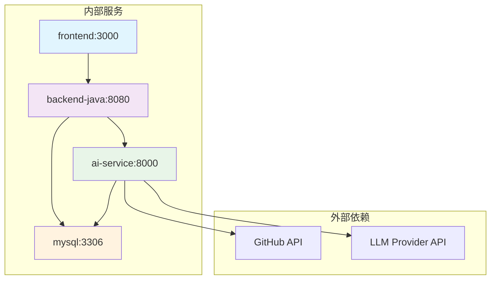
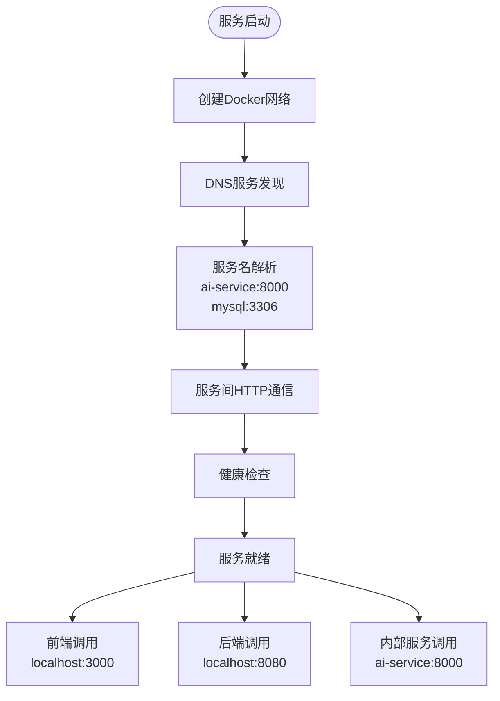

# 部署架构

<cite>
**本文档引用的文件**
- [docker-compose.yml](file://docker-compose.yml)
- [README.md](file://README.md)
- [docs/ARCHITECTURE.md](file://docs/ARCHITECTURE.md)
- [docs/DATABASE.md](file://docs/DATABASE.md)
- [docs/API.md](file://docs/API.md)
- [docs/PRD.md](file://docs/PRD.md)
</cite>

## 目录
1. [简介](#简介)
2. [项目结构](#项目结构)
3. [核心组件](#核心组件)
4. [架构总览](#架构总览)
5. [详细组件分析](#详细组件分析)
6. [依赖关系分析](#依赖关系分析)
7. [性能考虑](#性能考虑)
8. [故障排除指南](#故障排除指南)
9. [结论](#结论)

## 简介

CodeReviewX是一个面向GitHub Pull Request的智能代码审查系统。该项目采用微服务架构，通过Docker Compose进行容器编排，实现了四个核心服务的协同工作：前端界面、Java后端服务、AI分析服务和MySQL数据库。

**Section sources**
- [README.md:1-120](file://README.md#L1-L120)
- [docs/PRD.md:1-218](file://docs/PRD.md#L1-L218)

## 项目结构

当前项目处于Round 01阶段，主要包含以下目录结构：



**图表来源**
- [docker-compose.yml:1-14](file://docker-compose.yml#L1-L14)
- [README.md:58-82](file://README.md#L58-L82)

**Section sources**
- [README.md:58-82](file://README.md#L58-L82)
- [docker-compose.yml:1-14](file://docker-compose.yml#L1-L14)

## 核心组件

### 四个核心服务概述

根据项目规划，CodeReviewX包含四个核心服务，每个服务都有明确的职责边界：

| 服务名称 | 技术栈 | 端口 | 主要职责 |
|---------|--------|------|----------|
| **frontend** | Vue 3 / React | 3000 | 任务创建、任务列表、任务详情展示 |
| **backend-java** | Spring Boot 3 + Java 17 | 8080 | REST API、任务编排、MySQL持久化 |
| **ai-service** | Python + FastAPI | 8000 | GitHub数据获取、Semgrep分析、LLM处理 |
| **mysql** | MySQL 8 | 3306 | 任务、文件变更、问题数据持久化 |

**Section sources**
- [docs/ARCHITECTURE.md:48-54](file://docs/ARCHITECTURE.md#L48-L54)
- [docs/ARCHITECTURE.md:373-381](file://docs/ARCHITECTURE.md#L373-L381)

### 服务职责边界

每个服务都遵循严格的职责边界原则：



**图表来源**
- [docs/ARCHITECTURE.md:19-52](file://docs/ARCHITECTURE.md#L19-L52)

**Section sources**
- [docs/ARCHITECTURE.md:56-107](file://docs/ARCHITECTURE.md#L56-L107)

## 架构总览

### 系统总体架构

CodeReviewX采用分层架构设计，确保各组件职责清晰、耦合度低：



**图表来源**
- [docs/ARCHITECTURE.md:19-52](file://docs/ARCHITECTURE.md#L19-L52)

### 数据流设计

系统的核心数据流遵循以下模式：



**图表来源**
- [docs/ARCHITECTURE.md:137-180](file://docs/ARCHITECTURE.md#L137-L180)

**Section sources**
- [docs/ARCHITECTURE.md:137-180](file://docs/ARCHITECTURE.md#L137-L180)

## 详细组件分析

### 前端服务 (frontend)

前端服务采用现代化的Vue 3或React技术栈，提供用户友好的交互界面。

#### 核心功能
- ReviewTask创建页面
- 任务列表页面  
- 任务详情页面
- Review报告展示

#### 环境配置
- **端口**: 3000
- **API基础URL**: http://localhost:8080 (开发环境)

**Section sources**
- [docs/ARCHITECTURE.md:58-72](file://docs/ARCHITECTURE.md#L58-L72)
- [docs/ARCHITECTURE.md:365-369](file://docs/ARCHITECTURE.md#L365-L369)

### 后端Java服务 (backend-java)

后端Java服务基于Spring Boot 3构建，负责业务编排和数据持久化。

#### 核心职责
- 提供REST API给前端调用
- 创建和管理ReviewTask任务
- 调用ai-service执行分析
- 保存分析结果到数据库
- 统一处理业务异常

#### 分层架构


**图表来源**
- [docs/ARCHITECTURE.md:183-230](file://docs/ARCHITECTURE.md#L183-L230)

#### 数据模型
系统使用三个核心数据表：



**图表来源**
- [docs/DATABASE.md:22-134](file://docs/DATABASE.md#L22-L134)

**Section sources**
- [docs/ARCHITECTURE.md:73-89](file://docs/ARCHITECTURE.md#L73-L89)
- [docs/DATABASE.md:22-134](file://docs/DATABASE.md#L22-L134)

### AI服务 (ai-service)

AI服务专门负责GitHub数据获取、静态分析和LLM处理。

#### 核心职责
- 解析GitHub仓库URL
- 调用GitHub API获取PR信息和diff
- 标准化文件变更数据
- 执行Semgrep静态分析
- 组织LLM提示词
- 校验LLM JSON输出
- 合并Semgrep与LLM结果

#### 分层设计


**图表来源**
- [docs/ARCHITECTURE.md:233-266](file://docs/ARCHITECTURE.md#L233-L266)

**Section sources**
- [docs/ARCHITECTURE.md:90-107](file://docs/ARCHITECTURE.md#L90-L107)
- [docs/ARCHITECTURE.md:233-266](file://docs/ARCHITECTURE.md#L233-L266)

### MySQL数据库 (mysql)

MySQL 8作为数据持久化层，存储所有业务数据。

#### 数据库设计
- **数据库名**: codereviewx
- **字符集**: utf8mb4
- **排序规则**: utf8mb4_unicode_ci
- **存储引擎**: InnoDB

#### 核心表结构
1. **review_task**: 存储任务主信息和状态
2. **review_file_change**: 存储PR文件变更信息
3. **review_issue**: 存储分析出的问题

**Section sources**
- [docs/DATABASE.md:9-17](file://docs/DATABASE.md#L9-L17)
- [docs/DATABASE.md:22-134](file://docs/DATABASE.md#L22-L134)

## 依赖关系分析

### 服务间依赖图



**图表来源**
- [docs/ARCHITECTURE.md:19-52](file://docs/ARCHITECTURE.md#L19-L52)

### 环境变量配置

#### backend-java环境变量
- **SPRING_DATASOURCE_URL**: jdbc:mysql://mysql:3306/codereviewx
- **SPRING_DATASOURCE_USERNAME**: codereviewx
- **SPRING_DATASOURCE_PASSWORD**: codereviewx
- **AI_SERVICE_BASE_URL**: http://ai-service:8000

#### ai-service环境变量
- **GITHUB_TOKEN**: GitHub访问令牌
- **LLM_PROVIDER**: LLM提供商类型（默认mock）
- **LLM_API_KEY**: LLM API密钥
- **SEMGREP_TIMEOUT_SECONDS**: Semgrep超时时间（秒）

#### frontend环境变量
- **VITE_API_BASE_URL**: http://localhost:8080

**Section sources**
- [docs/ARCHITECTURE.md:345-370](file://docs/ARCHITECTURE.md#L345-L370)

### 网络通信机制

系统采用Docker Compose的内置网络功能实现服务发现：



**图表来源**
- [docs/ARCHITECTURE.md:345-370](file://docs/ARCHITECTURE.md#L345-L370)

**Section sources**
- [docs/ARCHITECTURE.md:345-370](file://docs/ARCHITECTURE.md#L345-L370)

## 性能考虑

### 端口映射策略

| 服务 | 开发端口 | 生产端口 | 用途 |
|------|----------|----------|------|
| frontend | 3000 | 80 | Web界面访问 |
| backend-java | 8080 | 8080 | REST API服务 |
| ai-service | 8000 | 8000 | 内部分析服务 |
| mysql | 3306 | 3306 | 数据库连接 |

### 性能优化建议

1. **数据库连接池**: 后端Java使用连接池管理数据库连接
2. **缓存策略**: AI服务对GitHub API响应进行缓存
3. **异步处理**: 大规模PR分析采用异步队列处理
4. **资源限制**: Docker Compose设置合理的CPU和内存限制

## 故障排除指南

### 常见启动问题

#### 1. 端口冲突
**症状**: 容器启动失败，显示端口占用
**解决方案**: 
- 检查宿主机端口占用情况
- 修改docker-compose.yml中的端口映射
- 使用`docker-compose down`清理现有容器

#### 2. 数据库连接失败
**症状**: 后端服务无法连接MySQL
**解决方案**:
- 确认MySQL服务已启动
- 检查数据库凭据配置
- 验证网络连通性

#### 3. 服务间通信失败
**症状**: 前端无法访问后端API
**解决方案**:
- 检查服务依赖关系
- 验证Docker网络配置
- 查看服务日志

### 日志分析

#### 查看服务日志
```bash
# 查看特定服务日志
docker-compose logs frontend
docker-compose logs backend-java
docker-compose logs ai-service
docker-compose logs mysql

# 实时查看日志
docker-compose logs -f backend-java
```

#### 健康检查
```bash
# 检查服务状态
docker-compose ps

# 重启失败的服务
docker-compose restart backend-java
```

**Section sources**
- [docs/ARCHITECTURE.md:312-341](file://docs/ARCHITECTURE.md#L312-L341)

## 结论

CodeReviewX项目展现了良好的微服务架构设计，通过Docker Compose实现了四个核心服务的有效编排。项目遵循了清晰的职责分离原则，每个服务都有明确的功能边界，确保了系统的可维护性和可扩展性。

### 项目优势

1. **架构清晰**: 四个服务职责分明，耦合度低
2. **易于部署**: Docker Compose简化了本地开发环境搭建
3. **可扩展性强**: 支持未来添加更多分析工具和服务
4. **文档完善**: 详细的架构设计和API文档

### 发展建议

1. **监控系统**: 添加Prometheus和Grafana监控
2. **日志聚合**: 集成ELK或类似日志收集系统
3. **负载均衡**: 生产环境考虑Nginx负载均衡
4. **安全加固**: 添加HTTPS和API认证机制

该部署架构为CodeReviewX的后续开发奠定了坚实的基础，支持从MVP到生产环境的平滑演进。