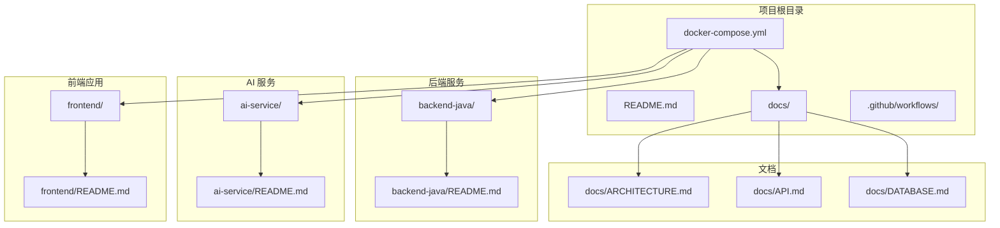
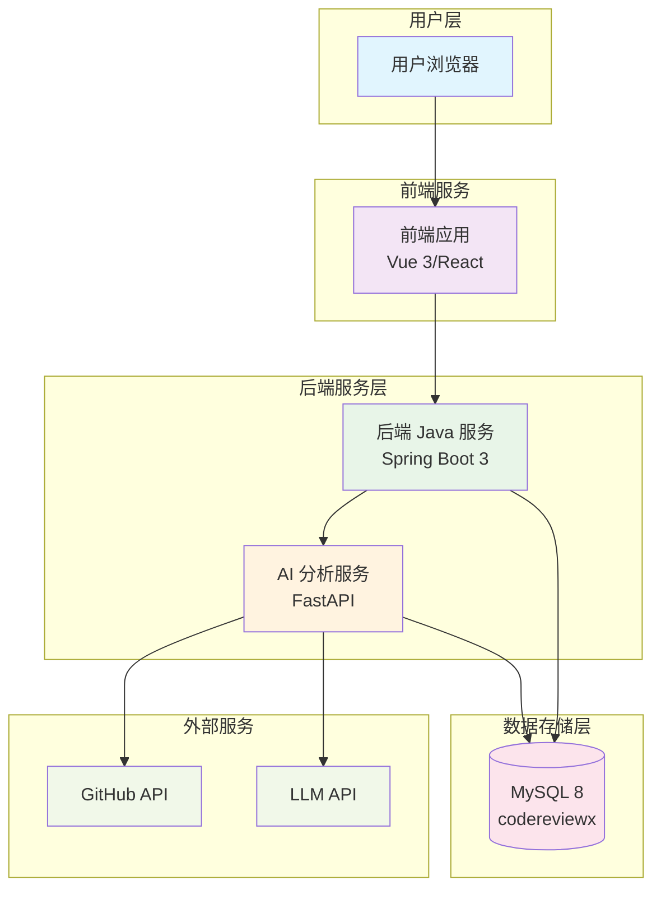
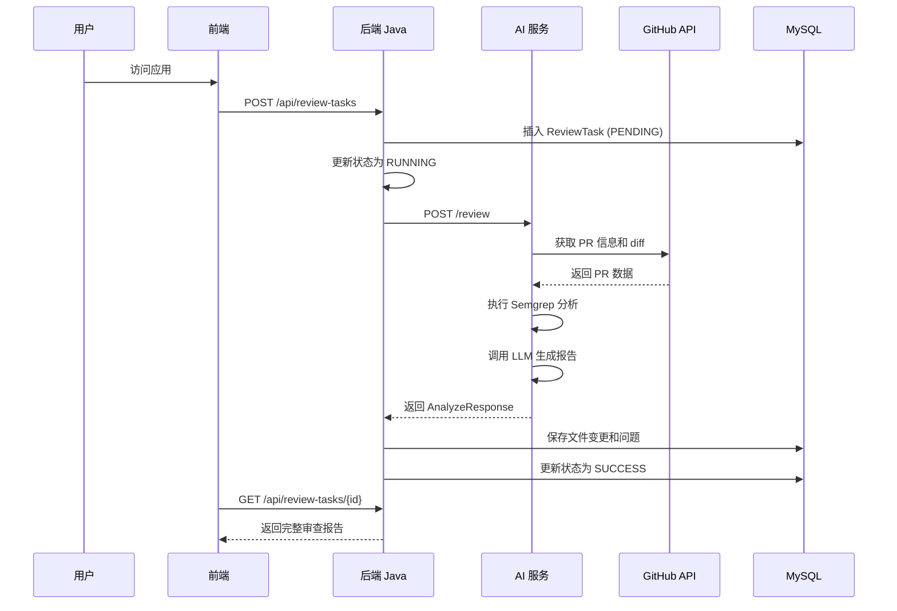
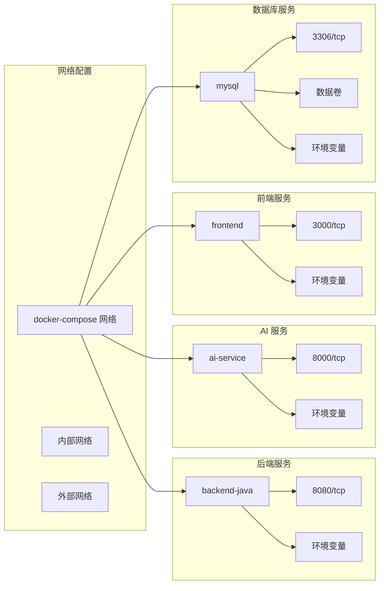
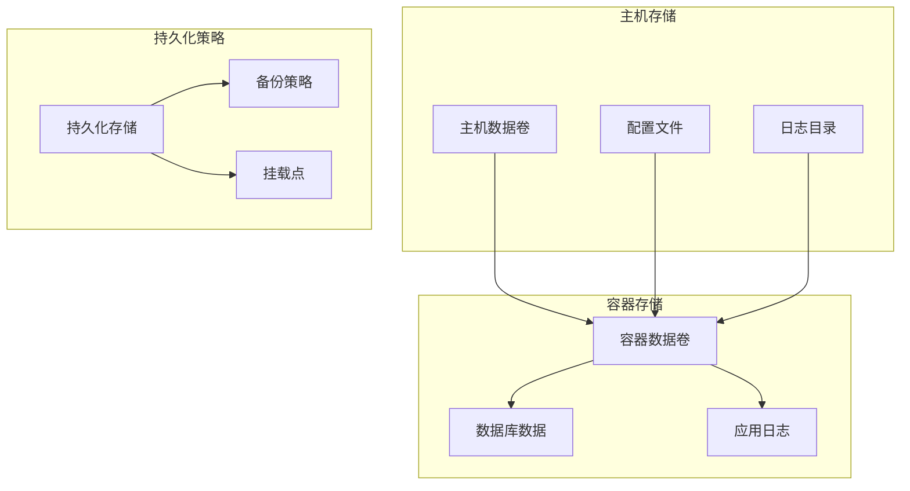
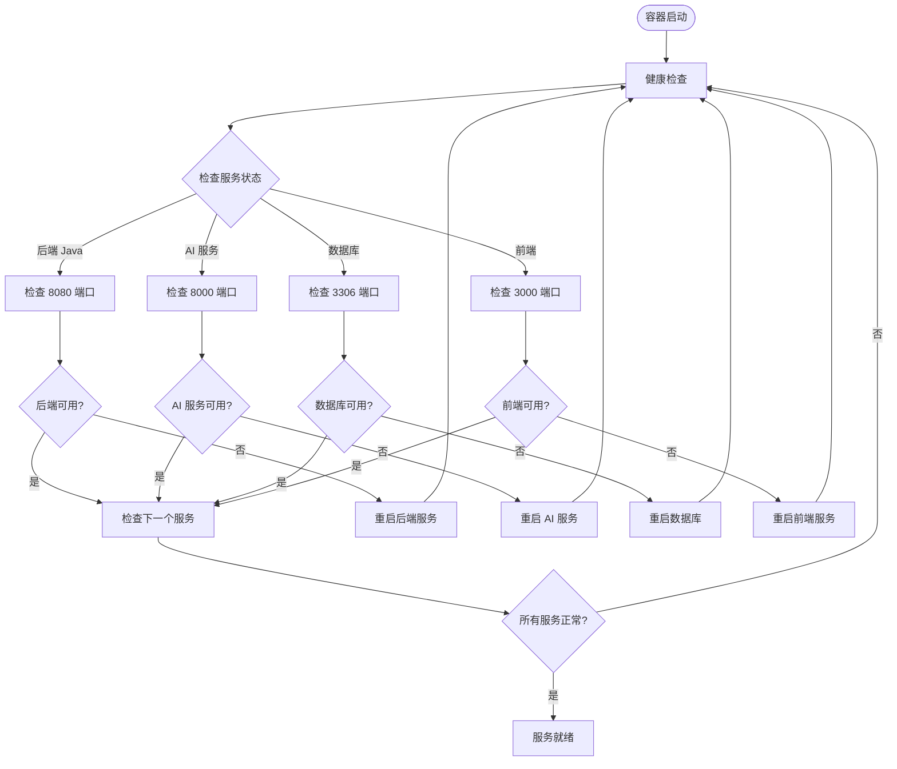
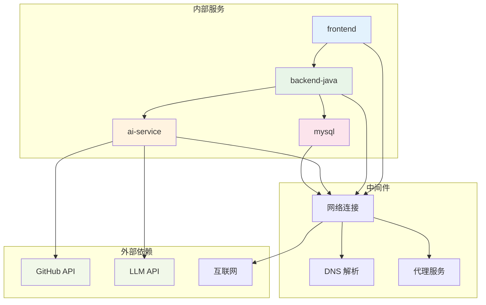
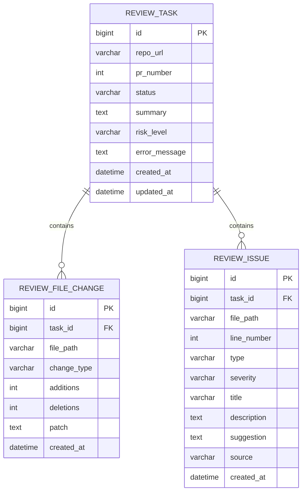
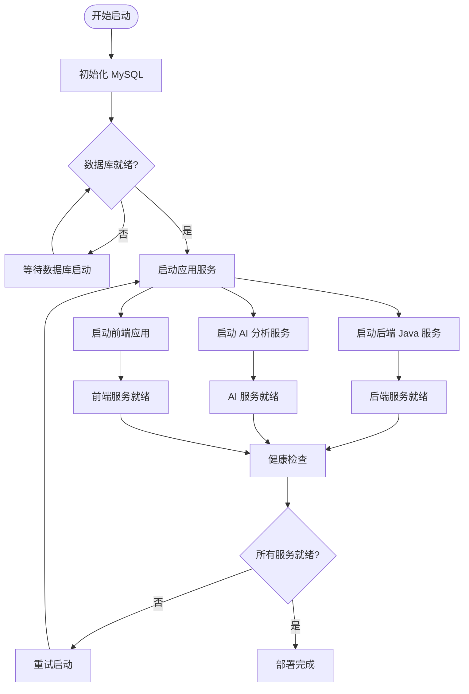
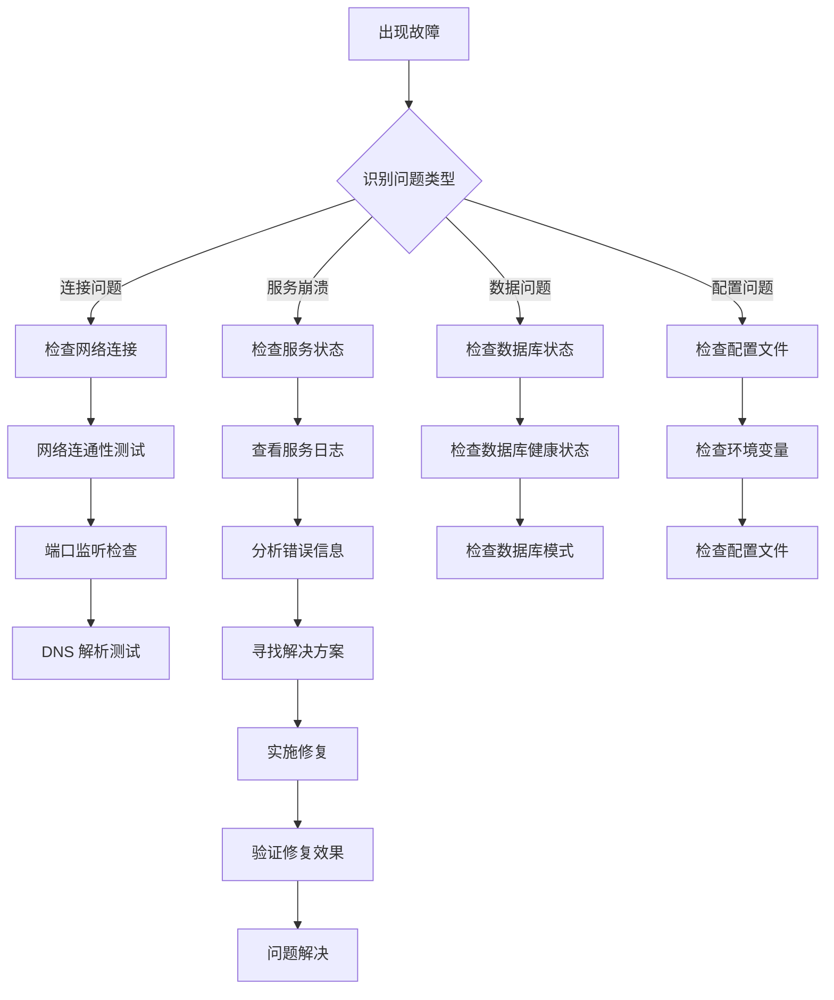

# 容器化部署

<cite>
**本文引用的文件**
- [docker-compose.yml](file://docker-compose.yml)
- [README.md](file://README.md)
- [docs/ARCHITECTURE.md](file://docs/ARCHITECTURE.md)
- [docs/API.md](file://docs/API.md)
- [docs/DATABASE.md](file://docs/DATABASE.md)
- [backend-java/README.md](file://backend-java/README.md)
- [ai-service/README.md](file://ai-service/README.md)
- [frontend/README.md](file://frontend/README.md)
</cite>

## 目录
1. [简介](#简介)
2. [项目结构](#项目结构)
3. [核心组件](#核心组件)
4. [架构概览](#架构概览)
5. [详细组件分析](#详细组件分析)
6. [依赖关系分析](#依赖关系分析)
7. [性能考虑](#性能考虑)
8. [故障排除指南](#故障排除指南)
9. [结论](#结论)
10. [附录](#附录)

## 简介

CodeReviewX 是一个智能的 GitHub Pull Request 代码审查代理系统。该项目采用多服务架构，通过 Docker Compose 实现容器化部署。本项目旨在为用户提供一个完整的代码审查解决方案，包括后端 Java 服务、AI 分析服务、前端应用和 MySQL 数据库的容器化部署。

根据项目文档，CodeReviewX 采用分层架构设计，确保各服务职责清晰分离：
- **前端服务**：Vue 3/React 应用，负责用户界面展示
- **后端 Java 服务**：Spring Boot 3 应用，处理业务逻辑和数据持久化
- **AI 分析服务**：Python FastAPI 应用，执行代码分析和 LLM 调用
- **数据库服务**：MySQL 8，存储业务数据

## 项目结构

项目采用模块化组织方式，每个主要功能模块都有独立的目录结构：



**图表来源**
- [docker-compose.yml:1-14](file://docker-compose.yml#L1-L14)
- [README.md:58-82](file://README.md#L58-L82)

**章节来源**
- [README.md:58-82](file://README.md#L58-L82)
- [docker-compose.yml:1-14](file://docker-compose.yml#L1-L14)

## 核心组件

### 后端 Java 服务 (backend-java)

后端 Java 服务是整个系统的核心业务逻辑处理器，基于 Spring Boot 3 和 Java 17 构建。该服务负责：

- **ReviewTask 生命周期管理**：从创建到完成的完整状态流转
- **REST API 提供**：为前端提供统一的 API 接口
- **MySQL 持久化**：使用 MyBatis-Plus 进行数据存储
- **AI 服务调用**：协调 AI 分析服务进行代码审查

**技术栈**：
- Java 17 运行时
- Spring Boot 3.x Web 框架
- MyBatis-Plus 3.5.x ORM
- MySQL Connector 8.x 数据库驱动
- Spring WebClient HTTP 客户端
- JUnit 5 单元测试框架

### AI 分析服务 (ai-service)

AI 分析服务专门负责代码分析和智能审查，基于 Python 和 FastAPI 构建：

- **GitHub PR 数据获取**：解析仓库 URL，调用 GitHub API 获取 PR 信息
- **代码变更分析**：标准化文件变更信息，执行 Semgrep 静态分析
- **LLM 集成**：调用 LLM 生成结构化的审查报告
- **JSON 校验**：验证并返回标准的 AnalyzeResponse 格式

**技术栈**：
- Python 3.11 运行时
- FastAPI 0.100+ Web 框架
- Pydantic v2 数据验证
- httpx GitHub API 客户端
- Semgrep 静态分析工具
- pytest 单元测试框架
- uvicorn ASGI 服务器

### 前端应用 (frontend)

前端应用提供用户交互界面，支持 Vue 3 或 React 框架选择：

- **任务创建表单**：用户输入 GitHub 仓库 URL 和 PR 编号
- **任务列表展示**：显示所有提交的审查任务及其状态
- **任务详情展示**：完整显示审查报告，包括总结、风险级别和问题列表
- **问题列表渲染**：详细展示每个 ReviewIssue 的类型、严重程度、文件路径等信息

**通信协议**：前端仅与后端 Java 服务通信，通过 REST API 获取数据

### MySQL 数据库 (mysql)

MySQL 8 作为系统的数据存储层：

- **ReviewTask 主表**：存储任务元信息、状态和审查结果摘要
- **ReviewFileChange 表**：保存每个任务涉及的文件变更信息
- **ReviewIssue 表**：存储 LLM 和 Semgrep 分析出的问题

**数据一致性**：使用外键约束确保数据完整性，支持复杂的关联查询

**章节来源**
- [backend-java/README.md:19-46](file://backend-java/README.md#L19-L46)
- [ai-service/README.md:19-47](file://ai-service/README.md#L19-L47)
- [frontend/README.md:25-39](file://frontend/README.md#L25-L39)
- [docs/DATABASE.md:20-134](file://docs/DATABASE.md#L20-L134)

## 架构概览

CodeReviewX 采用分层微服务架构，确保各组件职责清晰分离：



**图表来源**
- [docs/ARCHITECTURE.md:19-52](file://docs/ARCHITECTURE.md#L19-L52)
- [docs/ARCHITECTURE.md:348-369](file://docs/ARCHITECTURE.md#L348-L369)

### 服务间通信流程



**图表来源**
- [docs/ARCHITECTURE.md:137-168](file://docs/ARCHITECTURE.md#L137-L168)
- [docs/API.md:54-241](file://docs/API.md#L54-L241)

**章节来源**
- [docs/ARCHITECTURE.md:19-52](file://docs/ARCHITECTURE.md#L19-L52)
- [docs/ARCHITECTURE.md:137-168](file://docs/ARCHITECTURE.md#L137-L168)

## 详细组件分析

### Docker Compose 配置结构

虽然当前版本的 docker-compose.yml 仍为占位符，但根据项目规划，完整的配置将包含以下核心要素：

#### 服务定义模板



**图表来源**
- [docker-compose.yml:1-14](file://docker-compose.yml#L1-L14)
- [docs/ARCHITECTURE.md:373-381](file://docs/ARCHITECTURE.md#L373-L381)

#### 端口映射策略

| 服务名称 | 容器端口 | 主机端口 | 用途说明 |
|---------|---------|---------|---------|
| frontend | 3000 | 3000 | 开发环境前端服务 |
| backend-java | 8080 | 8080 | 开发环境后端 API |
| ai-service | 8000 | 8000 | 开发环境 AI 分析服务 |
| mysql | 3306 | 3306 | 开发环境数据库 |

#### 环境变量配置

**后端 Java 服务环境变量**：
- `SPRING_DATASOURCE_URL`: 数据库连接字符串
- `SPRING_DATASOURCE_USERNAME`: 数据库用户名
- `SPRING_DATASOURCE_PASSWORD`: 数据库密码
- `AI_SERVICE_BASE_URL`: AI 服务基础 URL

**AI 服务环境变量**：
- `GITHUB_TOKEN`: GitHub API 访问令牌
- `LLM_PROVIDER`: LLM 提供商配置（mock/real）
- `LLM_API_KEY`: LLM API 密钥
- `SEMGREP_TIMEOUT_SECONDS`: Semgrep 超时时间

**前端环境变量**：
- `VITE_API_BASE_URL`: 后端 API 基础 URL

**章节来源**
- [docs/ARCHITECTURE.md:345-370](file://docs/ARCHITECTURE.md#L345-L370)

### 数据卷挂载策略



**图表来源**
- [docs/DATABASE.md:137-199](file://docs/DATABASE.md#L137-L199)

#### 数据持久化配置

- **MySQL 数据卷**：确保数据库数据在容器重启后不丢失
- **应用日志卷**：便于开发调试和生产监控
- **配置文件卷**：支持动态配置更新

### 健康检查配置



**图表来源**
- [docs/ARCHITECTURE.md:373-381](file://docs/ARCHITECTURE.md#L373-L381)

### 资源限制配置

| 服务名称 | CPU 限制 | 内存限制 | 网络带宽 |
|---------|---------|---------|---------|
| frontend | 1 核心 | 512MB | 10Mbps |
| backend-java | 2 核心 | 1GB | 20Mbps |
| ai-service | 2 核心 | 1GB | 15Mbps |
| mysql | 1 核心 | 512MB | 10Mbps |

**章节来源**
- [docs/ARCHITECTURE.md:373-381](file://docs/ARCHITECTURE.md#L373-L381)

## 依赖关系分析

### 服务依赖图



**图表来源**
- [docs/ARCHITECTURE.md:19-52](file://docs/ARCHITECTURE.md#L19-L52)
- [docs/API.md:13-16](file://docs/API.md#L13-L16)

### 数据流依赖



**图表来源**
- [docs/DATABASE.md:22-134](file://docs/DATABASE.md#L22-L134)

**章节来源**
- [docs/DATABASE.md:22-134](file://docs/DATABASE.md#L22-L134)

## 性能考虑

### 启动顺序优化



### 资源优化策略

1. **数据库连接池优化**：合理配置连接池大小，避免过度连接
2. **缓存策略**：利用内存缓存减少数据库查询压力
3. **异步处理**：对于耗时操作使用异步处理机制
4. **负载均衡**：在生产环境中考虑多实例部署

## 故障排除指南

### 常见问题诊断



### 健康检查脚本

```bash
#!/bin/bash
# 健康检查脚本示例

echo "开始健康检查..."

# 检查数据库连接
if mysqladmin ping -h mysql -u codereviewx -p${MYSQL_PASSWORD} > /dev/null 2>&1; then
    echo "✓ MySQL 连接正常"
else
    echo "✗ MySQL 连接失败"
fi

# 检查后端 API
if curl -f http://localhost:8080/health > /dev/null 2>&1; then
    echo "✓ 后端 API 正常"
else
    echo "✗ 后端 API 异常"
fi

# 检查 AI 服务
if curl -f http://localhost:8000/health > /dev/null 2>&1; then
    echo "✓ AI 服务正常"
else
    echo "✗ AI 服务异常"
fi

# 检查前端应用
if curl -f http://localhost:3000 > /dev/null 2>&1; then
    echo "✓ 前端应用正常"
else
    echo "✗ 前端应用异常"
fi

echo "健康检查完成"
```

**章节来源**
- [docs/ARCHITECTURE.md:373-381](file://docs/ARCHITECTURE.md#L373-L381)

## 结论

CodeReviewX 的容器化部署方案提供了完整的多服务架构实现，通过 Docker Compose 实现了服务间的协调和管理。该方案具有以下优势：

1. **模块化设计**：每个服务独立部署，职责清晰分离
2. **可扩展性**：支持水平扩展和负载均衡
3. **可维护性**：容器化部署简化了版本管理和升级
4. **开发友好**：提供一致的开发和生产环境

随着项目各轮次的推进，实际的 Docker Compose 配置将逐步完善，包括具体的镜像构建、环境变量配置、数据卷挂载和健康检查等细节。

## 附录

### 开发环境 vs 生产环境配置对比

| 配置项 | 开发环境 | 生产环境 |
|-------|---------|---------|
| 端口映射 | 直接映射到主机端口 | 通过反向代理暴露 |
| 数据持久化 | 本地数据卷 | 云存储或网络存储 |
| 日志管理 | 控制台输出 | 集中式日志系统 |
| 监控告警 | 开发者自检 | 完整的监控体系 |
| 安全配置 | 开发密钥 | 生产密钥管理 |

### 最佳实践建议

1. **镜像优化**：使用多阶段构建减少镜像大小
2. **安全加固**：定期更新依赖，扫描安全漏洞
3. **备份策略**：建立定期备份和恢复机制
4. **性能监控**：实施 APM 和业务指标监控
5. **灾难恢复**：制定详细的故障恢复预案