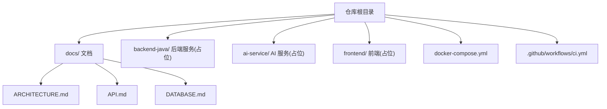
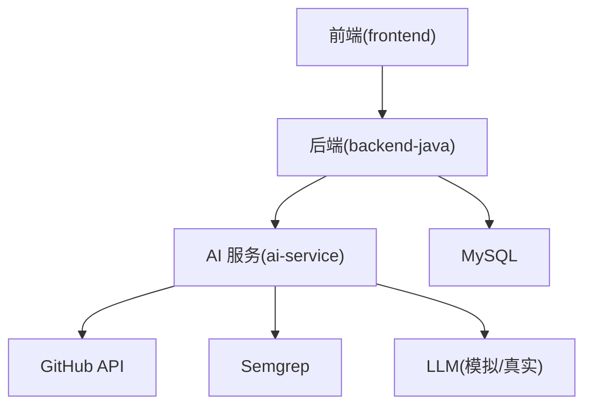
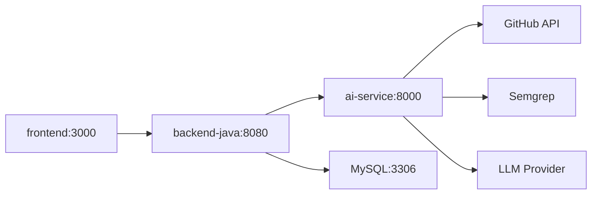

# 故障排查与运维

<cite>
**本文引用的文件**
- [docker-compose.yml](file://docker-compose.yml)
- [README.md](file://README.md)
- [docs/ARCHITECTURE.md](file://docs/ARCHITECTURE.md)
- [docs/API.md](file://docs/API.md)
- [docs/DATABASE.md](file://docs/DATABASE.md)
- [.github/workflows/ci.yml](file://.github/workflows/ci.yml)
- [backend-java/README.md](file://backend-java/README.md)
- [ai-service/README.md](file://ai-service/README.md)
- [frontend/README.md](file://frontend/README.md)
- [docs/PRD.md](file://docs/PRD.md)
- [docs/AGENT_RULES.md](file://docs/AGENT_RULES.md)
</cite>

## 目录
1. [简介](#简介)
2. [项目结构](#项目结构)
3. [核心组件](#核心组件)
4. [架构总览](#架构总览)
5. [详细组件分析](#详细组件分析)
6. [依赖关系分析](#依赖关系分析)
7. [性能考量](#性能考量)
8. [故障排查指南](#故障排查指南)
9. [结论](#结论)
10. [附录](#附录)

## 简介
本文件面向 CodeReviewX 项目在 Round 01 阶段的故障排查与运维实践，基于当前仓库中的架构设计、API 规范、数据库设计与部署结构说明，提供系统启动失败、服务连接异常、性能问题的诊断步骤与根因分析流程；并给出日志分析技巧、错误定位方法、系统重启与配置更新的操作指南，以及紧急修复与自动化运维脚本的使用建议。

## 项目结构
- 仓库采用按模块划分的目录结构，包含后端、AI 服务、前端、文档与 CI 工作流等。
- Round 01 为“工程骨架”阶段，未包含业务代码，但已规划了服务职责、调用链路、API 与数据库设计，便于在后续轮次中快速落地与排障。

图表来源
- [README.md:58-82](file://README.md#L58-L82)
- [docker-compose.yml:1-14](file://docker-compose.yml#L1-L14)
- [.github/workflows/ci.yml:1-58](file://.github/workflows/ci.yml#L1-L58)

章节来源
- [README.md:58-82](file://README.md#L58-L82)
- [docker-compose.yml:1-14](file://docker-compose.yml#L1-L14)
- [.github/workflows/ci.yml:1-58](file://.github/workflows/ci.yml#L1-L58)

## 核心组件
- 后端服务（backend-java）
  - 职责：对外提供 REST API、编排任务生命周期、调用 ai-service、持久化结果。
  - 端口：8080（按部署规划）。
- AI 服务（ai-service）
  - 职责：拉取 GitHub PR diff、执行 Semgrep、调用 LLM（mock/真实）、返回结构化 Review。
  - 端口：8000（按部署规划）。
- 前端（frontend）
  - 职责：任务创建、列表与详情展示，仅调用后端 API。
  - 端口：3000（按部署规划）。
- 数据库（MySQL 8）
  - 职责：存储 ReviewTask、ReviewFileChange、ReviewIssue 等业务数据。
  - 端口：3306（按部署规划）。

章节来源
- [docs/ARCHITECTURE.md:19-52](file://docs/ARCHITECTURE.md#L19-L52)
- [docs/ARCHITECTURE.md:373-381](file://docs/ARCHITECTURE.md#L373-L381)
- [docs/DATABASE.md:22-134](file://docs/DATABASE.md#L22-L134)
- [backend-java/README.md:19-25](file://backend-java/README.md#L19-L25)
- [ai-service/README.md:19-26](file://ai-service/README.md#L19-L26)
- [frontend/README.md:25-31](file://frontend/README.md#L25-L31)

## 架构总览
下图展示了 Round 01 阶段的服务交互与数据流向，便于在排障时快速定位问题环节。

图表来源
- [docs/ARCHITECTURE.md:19-52](file://docs/ARCHITECTURE.md#L19-L52)
- [docs/ARCHITECTURE.md:137-180](file://docs/ARCHITECTURE.md#L137-L180)

## 详细组件分析

### 后端服务（backend-java）
- 分层设计：controller/service/client/mapper/entity/dto/enum/exception/config。
- 职责边界：仅编排任务与调用 ai-service，不直接执行 Semgrep、编写 LLM prompt、解析复杂 diff 或直接暴露业务 API。
- 关键点：统一错误响应格式、TaskStatus 状态机、WebClient 调用 ai-service。

章节来源
- [docs/ARCHITECTURE.md:183-230](file://docs/ARCHITECTURE.md#L183-L230)
- [docs/API.md:31-51](file://docs/API.md#L31-L51)
- [docs/ARCHITECTURE.md:110-134](file://docs/ARCHITECTURE.md#L110-L134)

### AI 服务（ai-service）
- 分层设计：api/services/github_service/semgrep_service/llm_service/schemas/validators/utils。
- 职责边界：仅负责 GitHub 数据获取、Semgrep 执行、LLM 分析与 JSON 校验，不直接写库、不管理任务状态。
- 关键点：mock 模式、JSON Schema 校验、错误码 recoverable 标记。

章节来源
- [docs/ARCHITECTURE.md:233-266](file://docs/ARCHITECTURE.md#L233-L266)
- [docs/API.md:243-332](file://docs/API.md#L243-L332)
- [ai-service/README.md:83-86](file://ai-service/README.md#L83-L86)

### 前端（frontend）
- 职责边界：仅与后端交互，不直接调用 ai-service、GitHub API 或 LLM。
- 关键点：VITE_API_BASE_URL 控制后端基地址，页面路由与 API 调用清单。

章节来源
- [frontend/README.md:25-63](file://frontend/README.md#L25-L63)
- [docs/API.md:54-241](file://docs/API.md#L54-L241)

### 数据库（MySQL 8）
- 表结构：review_task、review_file_change、review_issue。
- 索引与约束：状态与时间索引、外键约束、枚举值约束。
- 关键点：MVP 阶段字段长度与 TEXT 存储限制。

章节来源
- [docs/DATABASE.md:22-134](file://docs/DATABASE.md#L22-L134)
- [docs/DATABASE.md:257-284](file://docs/DATABASE.md#L257-L284)

## 依赖关系分析
- 服务依赖
  - frontend 仅依赖 backend-java。
  - backend-java 依赖 ai-service 与 MySQL。
  - ai-service 依赖 GitHub API、Semgrep 与 LLM。
- 部署依赖
  - docker-compose.yml 规划了各服务端口与网络，当前 Round 01 为占位文件，实际服务定义将在后续轮次完善。

图表来源
- [docs/ARCHITECTURE.md:373-381](file://docs/ARCHITECTURE.md#L373-L381)
- [docker-compose.yml:7-12](file://docker-compose.yml#L7-L12)

章节来源
- [docker-compose.yml:1-14](file://docker-compose.yml#L1-L14)
- [docs/ARCHITECTURE.md:373-381](file://docs/ARCHITECTURE.md#L373-L381)

## 性能考量
- Round 01 不引入复杂中间件与分布式组件，MVP 阶段优先保证本地可运行与演示。
- 性能优化建议（概念性）
  - 降低跨服务调用延迟：合理设置超时与重试。
  - 数据库层面：遵循现有索引与枚举约束，避免大字段 TEXT 超限。
  - AI 分析：控制 Semgrep 与 LLM 调用频率与并发，必要时引入本地缓存或降级策略。

章节来源
- [docs/ARCHITECTURE.md:407-417](file://docs/ARCHITECTURE.md#L407-L417)
- [docs/DATABASE.md:288-294](file://docs/DATABASE.md#L288-L294)

## 故障排查指南

### 一、容器启动失败
- 常见症状
  - docker-compose up 启动报错、部分服务无法启动或立即退出。
- 诊断步骤
  1) 检查 docker-compose.yml 是否存在服务定义（当前 Round 01 为占位，无实际服务）。
  2) 检查各服务镜像与端口占用情况，确认端口冲突。
  3) 查看容器日志，定位启动异常原因（如依赖未就绪、环境变量缺失）。
  4) 若为后续轮次，请核对服务 Dockerfile 与构建产物是否可用。
- 根因分析
  - 服务未实现：Round 01 无业务镜像，属预期占位。
  - 网络/端口：端口冲突或容器网络未正确连接。
  - 环境变量：缺少必要的 .env 或环境变量未生效。
- 解决方案
  - 在后续轮次完善服务镜像与 compose 定义后再启动。
  - 使用 docker-compose logs <service> 定位具体错误。
  - 确保 .env 示例文件已复制为 .env 并正确填写。

章节来源
- [docker-compose.yml:1-14](file://docker-compose.yml#L1-L14)
- [backend-java/README.md:13](file://backend-java/README.md#L13)
- [ai-service/README.md:13](file://ai-service/README.md#L13)
- [frontend/README.md:13](file://frontend/README.md#L13)

### 二、服务连接异常
- 常见症状
  - 前端无法加载后端接口；后端调用 AI 服务超时或返回错误。
- 诊断步骤
  1) 检查后端到 AI 服务的内部域名与端口（按部署规划）。
  2) 使用 curl 或浏览器检查 AI 服务 /review 接口可达性。
  3) 检查后端日志中 ai-service 调用链路与错误码。
  4) 核对 GitHub Token、LLM API Key 等敏感配置是否正确。
- 根因分析
  - 网络隔离：容器网络未互通或 DNS 解析失败。
  - 超时与重试：AI 服务处理慢或外部 API（GitHub/LLM）不稳定。
  - 配置错误：AI 服务环境变量未生效或后端 BASE_URL 配置错误。
- 解决方案
  - 在同一 docker network 下确保服务连通。
  - 为 ai-service 调用增加超时与重试策略。
  - 使用 .env.example 填充 .env，避免硬编码凭据。

章节来源
- [docs/ARCHITECTURE.md:345-370](file://docs/ARCHITECTURE.md#L345-L370)
- [docs/API.md:13-17](file://docs/API.md#L13-L17)
- [docs/API.md:243-332](file://docs/API.md#L243-L332)

### 三、性能问题
- 常见症状
  - 任务执行耗时长、数据库写入慢、AI 分析卡顿。
- 诊断步骤
  1) 分析后端日志中的状态流转与耗时节点（PENDING→RUNNING→SUCCESS/FAILED）。
  2) 检查数据库慢查询与索引使用情况。
  3) 评估 Semgrep 执行时间与 LLM 调用耗时。
- 根因分析
  - 数据库未命中索引或存在大字段 TEXT 截断风险。
  - AI 服务外部 API 响应慢或限流。
  - 任务状态机未正确推进导致重复尝试。
- 解决方案
  - 优化数据库查询与索引，必要时调整字段类型。
  - 为外部调用增加异步化与缓存策略（MVP 阶段谨慎引入）。
  - 严格遵循状态机规则，避免回退与重复执行。

章节来源
- [docs/ARCHITECTURE.md:110-134](file://docs/ARCHITECTURE.md#L110-L134)
- [docs/DATABASE.md:288-294](file://docs/DATABASE.md#L288-L294)

### 四、日志分析技巧与错误定位
- 日志采集
  - 使用 docker-compose logs <service> 或容器内日志目录收集。
  - 后端统一错误响应格式，便于检索与聚合。
- 错误码定位
  - 后端错误码：INVALID_REQUEST/TASK_NOT_FOUND/AI_SERVICE_ERROR/GITHUB_FETCH_FAILED/DATABASE_ERROR/INTERNAL_ERROR。
  - AI 服务错误码：GITHUB_FETCH_FAILED/PR_NOT_FOUND/SEMGREP_FAILED/LLM_FAILED/INVALID_REQUEST。
- 根因分析流程
  1) 识别错误码与 HTTP 状态。
  2) 追踪调用链路（frontend→backend-java→ai-service）。
  3) 定位失败阶段（GitHub 拉取、Semgrep、LLM、数据库写入）。
  4) 检查环境变量与外部 API 凭据。
  5) 依据降级策略判断是否为可恢复错误。

章节来源
- [docs/API.md:31-51](file://docs/API.md#L31-L51)
- [docs/API.md:313-332](file://docs/API.md#L313-L332)
- [docs/ARCHITECTURE.md:170-180](file://docs/ARCHITECTURE.md#L170-L180)

### 五、系统重启与配置更新
- 系统重启
  - docker-compose down 后再 up，确保网络与卷重建。
  - 重启后优先验证数据库连通性与 ai-service 健康检查。
- 配置更新
  - .env 示例文件仅提供占位，实际运行需复制为 .env 并填写真实值。
  - 更新后重新构建镜像并重启对应服务。
- 紧急修复
  - 临时关闭或降级 AI 服务中的 LLM/外部 API，使用 mock 模式维持主链路。
  - 通过数据库回滚或状态重置恢复任务一致性。

章节来源
- [docs/ARCHITECTURE.md:345-370](file://docs/ARCHITECTURE.md#L345-L370)
- [ai-service/README.md:83-86](file://ai-service/README.md#L83-L86)
- [docs/ARCHITECTURE.md:130-133](file://docs/ARCHITECTURE.md#L130-L133)

### 六、运维工具与自动化脚本
- 运维工具
  - docker-compose：编排与日志查看。
  - curl/wget：服务健康检查与接口验证。
  - 数据库客户端：连接 MySQL 验证表结构与数据。
- 自动化脚本建议
  - 启动脚本：一键 down/up、检查依赖、打印服务状态。
  - 健康检查：定时探测 /review 与数据库连通性。
  - 备份脚本：定期导出数据库快照（按生产规范扩展）。
- 注意事项
  - 严格遵守凭据安全规则，避免提交 .env 与密钥。
  - CI 仅进行结构检查，业务代码在后续轮次实现。

章节来源
- [.github/workflows/ci.yml:1-58](file://.github/workflows/ci.yml#L1-L58)
- [docs/AGENT_RULES.md:152-160](file://docs/AGENT_RULES.md#L152-L160)

## 结论
- Round 01 为工程骨架阶段，未包含业务代码，因此容器启动失败多为预期占位；后续轮次完善服务与镜像后，再按本文提供的诊断流程与工具进行排障。
- 建议在后续轮次尽早建立完善的日志规范、错误码体系与自动化健康检查，以提升排障效率与系统稳定性。

## 附录

### A. API 与错误码速查
- 后端统一错误响应字段：code/message/details。
- AI 服务错误响应字段：errorCode/message/recoverable。
- 常用错误码
  - 后端：INVALID_REQUEST、TASK_NOT_FOUND、AI_SERVICE_ERROR、GITHUB_FETCH_FAILED、DATABASE_ERROR、INTERNAL_ERROR。
  - AI：GITHUB_FETCH_FAILED、PR_NOT_FOUND、SEMGREP_FAILED、LLM_FAILED、INVALID_REQUEST。

章节来源
- [docs/API.md:31-51](file://docs/API.md#L31-L51)
- [docs/API.md:313-332](file://docs/API.md#L313-L332)

### B. 数据库表结构速查
- review_task：任务主表，含状态、风险等级、失败原因等。
- review_file_change：文件变更明细，含变更类型、增删行数、patch。
- review_issue：问题明细，含类型、严重程度、来源、建议等。

章节来源
- [docs/DATABASE.md:22-134](file://docs/DATABASE.md#L22-L134)

### C. Round 01 任务与职责边界
- Cursor/Codex/Qoder 的角色与协作规则，确保变更与实现均符合 PRD 与架构文档。

章节来源
- [docs/PRD.md:104-122](file://docs/PRD.md#L104-L122)
- [docs/AGENT_RULES.md:9-18](file://docs/AGENT_RULES.md#L9-L18)