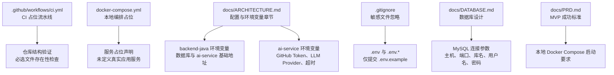
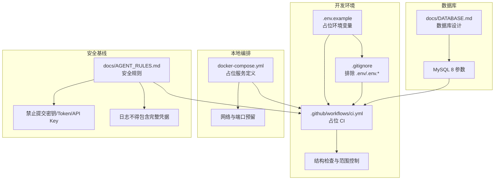
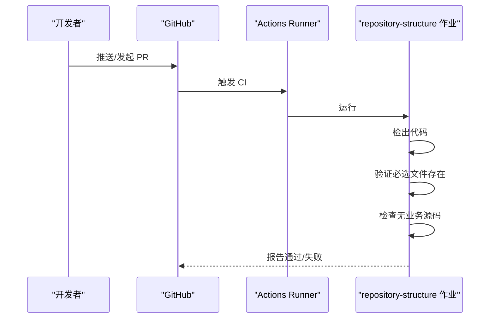
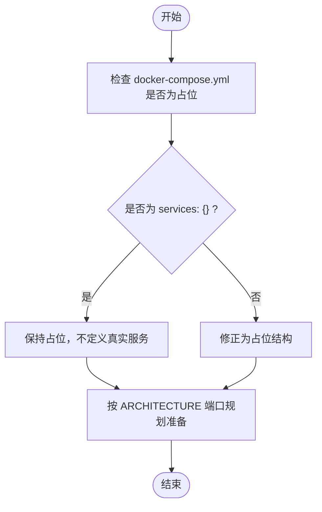
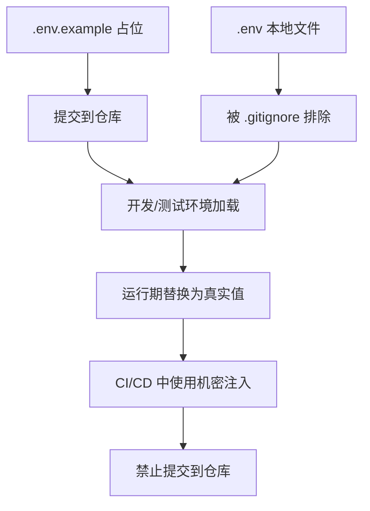
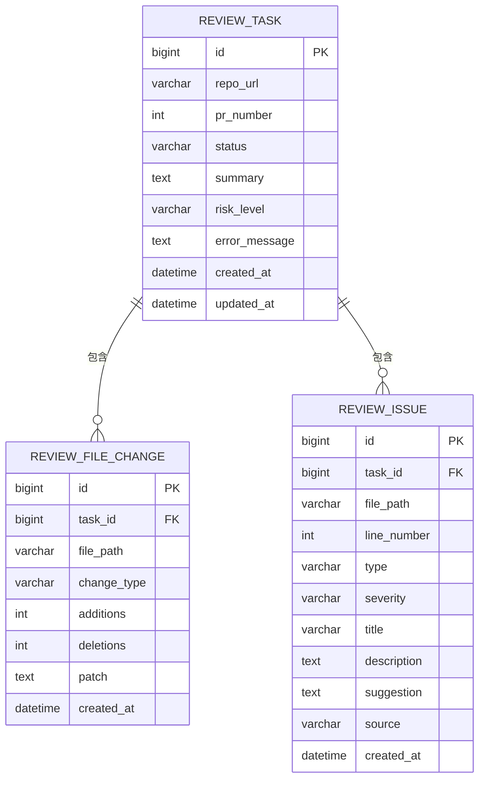
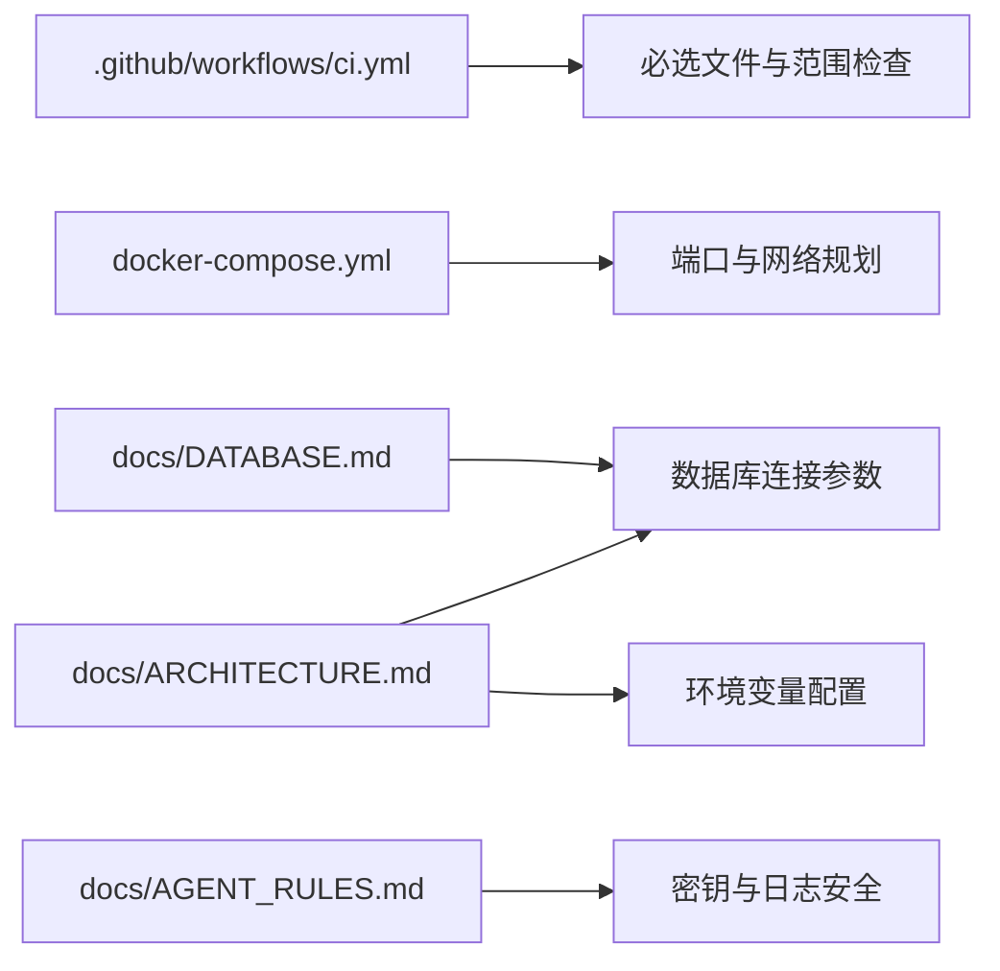

# 环境配置

<cite>
**本文档引用的文件**
- [.github/workflows/ci.yml](file://.github/workflows/ci.yml)
- [docker-compose.yml](file://docker-compose.yml)
- [README.md](file://README.md)
- [docs/PRD.md](file://docs/PRD.md)
- [docs/ARCHITECTURE.md](file://docs/ARCHITECTURE.md)
- [docs/DATABASE.md](file://docs/DATABASE.md)
- [docs/AGENT_RULES.md](file://docs/AGENT_RULES.md)
- [.gitignore](file://.gitignore)
- [tasks/round-01/01-cursor-repository-foundation.md](file://tasks/round-01/01-cursor-repository-foundation.md)
- [tasks/round-01/02-codex-repository-validation.md](file://tasks/round-01/02-codex-repository-validation.md)
</cite>

## 目录
1. [简介](#简介)
2. [项目结构](#项目结构)
3. [核心组件](#核心组件)
4. [架构总览](#架构总览)
5. [详细组件分析](#详细组件分析)
6. [依赖关系分析](#依赖关系分析)
7. [性能考量](#性能考量)
8. [故障排查指南](#故障排查指南)
9. [结论](#结论)
10. [附录](#附录)

## 简介
本文件为 CodeReviewX 项目提供环境配置与 CI/CD 流水线的权威说明，覆盖开发、测试与生产环境的配置差异，环境变量与密钥管理的安全规范，数据库连接与第三方 API 密钥配置，以及域名与网络配置要点。由于当前处于 Round 01（仓库基础 v1），大部分业务代码与真实部署尚未实现，因此本文重点阐述占位配置、安全基线与验证方法，为后续 Round 逐步落地真实服务与部署奠定一致的配置与安全基础。

## 项目结构
围绕环境配置与 CI/CD 的关键文件分布如下：
- GitHub Actions CI：.github/workflows/ci.yml
- 本地编排占位：docker-compose.yml
- 顶层说明与状态：README.md
- 安全与协作规则：docs/AGENT_RULES.md
- 环境变量占位与忽略：.env.example（由任务文档定义）、.gitignore
- 架构与数据库设计：docs/ARCHITECTURE.md、docs/DATABASE.md
- Round 01 任务与验收：tasks/round-01/* 与 handoff/round-01/*

**图表来源**
- [.github/workflows/ci.yml:1-58](file://.github/workflows/ci.yml#L1-L58)
- [docker-compose.yml:1-14](file://docker-compose.yml#L1-L14)
- [docs/ARCHITECTURE.md:345-370](file://docs/ARCHITECTURE.md#L345-L370)
- [.gitignore:1-36](file://.gitignore#L1-L36)
- [docs/DATABASE.md:9-16](file://docs/DATABASE.md#L9-L16)

**章节来源**
- [README.md:1-120](file://README.md#L1-L120)
- [.github/workflows/ci.yml:1-58](file://.github/workflows/ci.yml#L1-L58)
- [docker-compose.yml:1-14](file://docker-compose.yml#L1-L14)
- [docs/ARCHITECTURE.md:345-370](file://docs/ARCHITECTURE.md#L345-L370)
- [.gitignore:1-36](file://.gitignore#L1-L36)
- [docs/DATABASE.md:9-16](file://docs/DATABASE.md#L9-L16)

## 核心组件
- CI/CD 流水线（占位）
  - 触发条件：push 到 main、pull_request
  - 作业：repository-structure（仓库结构检查）
  - 步骤：检出代码、验证必选文件存在、确认无业务源码
- 本地编排（占位）
  - 使用 Compose 占位文件，未定义真实服务，仅注释说明后续轮次添加
- 环境变量与密钥管理
  - .env 与 .env.* 由 .gitignore 排除，仅提交 .env.example 占位
  - 安全规则禁止提交密钥、Token、API Key 等
- 数据库连接
  - MySQL 8，字符集 utf8mb4，InnoDB 引擎
  - 连接参数在 ARCHITECTURE 与 DATABASE 文档中定义
- 第三方 API 密钥
  - GitHub Token（ai-service）
  - LLM Provider 与 API Key（ai-service）
- 域名与网络
  - 本地默认 http://localhost:端口
  - Docker 网络与端口映射在占位文件中预留

**章节来源**
- [.github/workflows/ci.yml:8-58](file://.github/workflows/ci.yml#L8-L58)
- [docker-compose.yml:1-14](file://docker-compose.yml#L1-L14)
- [.gitignore:1-5](file://.gitignore#L1-L5)
- [docs/ARCHITECTURE.md:347-369](file://docs/ARCHITECTURE.md#L347-L369)
- [docs/DATABASE.md:9-16](file://docs/DATABASE.md#L9-L16)
- [docs/AGENT_RULES.md:152-160](file://docs/AGENT_RULES.md#L152-L160)

## 架构总览
下图展示 Round 01 环境配置与 CI/CD 的整体关系，强调占位与安全基线：

**图表来源**
- [.github/workflows/ci.yml:1-58](file://.github/workflows/ci.yml#L1-L58)
- [docker-compose.yml:1-14](file://docker-compose.yml#L1-L14)
- [.gitignore:1-5](file://.gitignore#L1-L5)
- [docs/AGENT_RULES.md:152-160](file://docs/AGENT_RULES.md#L152-L160)
- [docs/DATABASE.md:9-16](file://docs/DATABASE.md#L9-L16)

## 详细组件分析

### CI/CD 流水线（占位）
- 触发器：push 到 main、pull_request
- 作业：repository-structure
  - 步骤：检出代码、验证必选文件存在、确认无业务源码
- 目的：确保 Round 01 仓库结构与占位配置符合要求，不进行真实构建、测试或部署

**图表来源**
- [.github/workflows/ci.yml:8-58](file://.github/workflows/ci.yml#L8-L58)

**章节来源**
- [.github/workflows/ci.yml:1-58](file://.github/workflows/ci.yml#L1-L58)
- [tasks/round-01/02-codex-repository-validation.md:418-426](file://tasks/round-01/02-codex-repository-validation.md#L418-L426)

### 本地编排（占位）
- docker-compose.yml 为占位文件，未定义真实应用服务
- 保留注释说明后续轮次添加 backend-java、ai-service、frontend、mysql
- 本地启动需遵循 ARCHITECTURE 与 DATABASE 文档中的端口与连接参数

**图表来源**
- [docker-compose.yml:1-14](file://docker-compose.yml#L1-L14)
- [docs/ARCHITECTURE.md:373-381](file://docs/ARCHITECTURE.md#L373-L381)

**章节来源**
- [docker-compose.yml:1-14](file://docker-compose.yml#L1-L14)
- [tasks/round-01/01-cursor-repository-foundation.md:496-516](file://tasks/round-01/01-cursor-repository-foundation.md#L496-L516)
- [tasks/round-01/02-codex-repository-validation.md:407-417](file://tasks/round-01/02-codex-repository-validation.md#L407-L417)

### 环境变量与密钥管理
- .env 与 .env.* 由 .gitignore 排除，仅提交 .env.example
- .env.example 包含占位字段：APP_ENV、BACKEND_PORT、AI_SERVICE_PORT、AI_SERVICE_BASE_URL、MYSQL_*、GITHUB_TOKEN、LLM_PROVIDER、LLM_API_KEY
- 安全规则：禁止在源码中硬编码 Token、API Key；日志不得包含完整凭据；代码注释不得出现凭据

**图表来源**
- [.gitignore:1-5](file://.gitignore#L1-L5)
- [tasks/round-01/01-cursor-repository-foundation.md:428-454](file://tasks/round-01/01-cursor-repository-foundation.md#L428-L454)
- [docs/AGENT_RULES.md:152-160](file://docs/AGENT_RULES.md#L152-L160)

**章节来源**
- [.gitignore:1-5](file://.gitignore#L1-L5)
- [tasks/round-01/01-cursor-repository-foundation.md:428-454](file://tasks/round-01/01-cursor-repository-foundation.md#L428-L454)
- [tasks/round-01/02-codex-repository-validation.md:372-391](file://tasks/round-01/02-codex-repository-validation.md#L372-L391)
- [docs/AGENT_RULES.md:152-160](file://docs/AGENT_RULES.md#L152-L160)

### 数据库连接配置
- 数据库：MySQL 8，字符集 utf8mb4，InnoDB 引擎
- 连接参数：主机、端口、库名、用户名、密码
- 连接字符串示例与参数在 ARCHITECTURE 文档中给出，DATABASE 文档提供表结构与索引设计

**图表来源**
- [docs/DATABASE.md:22-134](file://docs/DATABASE.md#L22-L134)

**章节来源**
- [docs/DATABASE.md:9-16](file://docs/DATABASE.md#L9-L16)
- [docs/DATABASE.md:203-254](file://docs/DATABASE.md#L203-L254)
- [docs/ARCHITECTURE.md:347-354](file://docs/ARCHITECTURE.md#L347-L354)

### 第三方 API 密钥与域名配置
- GitHub API 密钥（ai-service）：GITHUB_TOKEN
- LLM Provider 与 API Key（ai-service）：LLM_PROVIDER、LLM_API_KEY
- 域名与基础地址：AI_SERVICE_BASE_URL（backend-java 调用 ai-service 的基础地址）
- 本地默认使用 http://localhost:端口，Docker 网络与端口在 ARCHITECTURE 中预留

**章节来源**
- [docs/ARCHITECTURE.md:356-369](file://docs/ARCHITECTURE.md#L356-L369)
- [docs/ARCHITECTURE.md:373-381](file://docs/ARCHITECTURE.md#L373-L381)

### 环境切换指南
- 开发环境
  - 使用 .env.example 作为模板，本地创建 .env 并注入真实值
  - 通过 docker-compose 占位文件启动服务占位，待后续轮次完善真实服务定义
- 测试环境
  - 通过 CI 占位流水线验证仓库结构与占位配置
  - 使用 .env.test 或其他环境文件（仅占位，不提交）
- 生产环境
  - 通过机密注入（如 CI/CD 平台机密、平台 Secrets）提供真实密钥
  - 禁止在仓库中提交任何真实密钥或 Token

**章节来源**
- [.github/workflows/ci.yml:1-58](file://.github/workflows/ci.yml#L1-L58)
- [docs/AGENT_RULES.md:152-160](file://docs/AGENT_RULES.md#L152-L160)

### 配置验证方法
- 必选文件存在性检查：README.md、docs/*、backend-java/README.md、ai-service/README.md、frontend/README.md、.env.example、.gitignore、docker-compose.yml、.github/workflows/ci.yml
- 业务源码扫描：确保 Round 01 无业务源码（Java、Python、JS/TS、Vue/React）
- 密钥扫描：禁止出现真实密钥、Token、API Key
- CI 占位验证：确认 CI 不执行真实构建、测试或部署步骤
- Docker 占位验证：确认 docker-compose.yml 未定义真实服务

**章节来源**
- [tasks/round-01/02-codex-repository-validation.md:433-450](file://tasks/round-01/02-codex-repository-validation.md#L433-L450)
- [tasks/round-01/02-codex-repository-validation.md:460-471](file://tasks/round-01/02-codex-repository-validation.md#L460-L471)
- [tasks/round-01/02-codex-repository-validation.md:478-483](file://tasks/round-01/02-codex-repository-validation.md#L478-L483)

## 依赖关系分析
- CI 依赖于仓库结构与占位配置
- 本地编排依赖于占位 Compose 文件与 ARCHITECTURE 端口规划
- 数据库连接依赖于 DATABASE 文档中的参数与引擎设定
- 安全规则贯穿环境变量管理与 CI/CD 流程

**图表来源**
- [.github/workflows/ci.yml:1-58](file://.github/workflows/ci.yml#L1-L58)
- [docker-compose.yml:1-14](file://docker-compose.yml#L1-L14)
- [docs/ARCHITECTURE.md:345-370](file://docs/ARCHITECTURE.md#L345-L370)
- [docs/DATABASE.md:9-16](file://docs/DATABASE.md#L9-L16)
- [docs/AGENT_RULES.md:152-160](file://docs/AGENT_RULES.md#L152-L160)

**章节来源**
- [.github/workflows/ci.yml:1-58](file://.github/workflows/ci.yml#L1-L58)
- [docker-compose.yml:1-14](file://docker-compose.yml#L1-L14)
- [docs/ARCHITECTURE.md:345-370](file://docs/ARCHITECTURE.md#L345-L370)
- [docs/DATABASE.md:9-16](file://docs/DATABASE.md#L9-L16)
- [docs/AGENT_RULES.md:152-160](file://docs/AGENT_RULES.md#L152-L160)

## 性能考量
- Round 01 为占位阶段，暂无真实业务负载，性能优化主要体现在：
  - CI 占位作业尽量轻量化，避免真实构建与测试
  - docker-compose 占位不引入实际服务，减少资源占用
  - 环境变量与密钥管理采用占位与忽略策略，降低配置复杂度

## 故障排查指南
- CI 验证失败
  - 检查必选文件是否存在
  - 确认无业务源码误入
  - 确认 CI 未执行真实构建/测试/部署
- 密钥相关问题
  - 确认 .env 未提交，仅提交 .env.example
  - 确认日志中未输出完整密钥
- Docker 启动问题
  - 确认 docker-compose.yml 为占位结构
  - 按 ARCHITECTURE 端口规划准备网络与端口

**章节来源**
- [tasks/round-01/02-codex-repository-validation.md:433-483](file://tasks/round-01/02-codex-repository-validation.md#L433-L483)
- [docs/AGENT_RULES.md:152-160](file://docs/AGENT_RULES.md#L152-L160)

## 结论
CodeReviewX Round 01 通过占位配置与安全基线，为后续各轮的真实服务与部署打下一致的环境与流程基础。CI 占位流水线、docker-compose 占位文件、.env.example 与 .gitignore、以及 AGENT_RULES 的安全规则共同构成环境配置的核心框架。建议在后续轮次逐步完善真实服务定义与部署流程，同时严格遵守密钥与日志安全规则。

## 附录
- Round 01 任务与验收清单
  - 必选文件齐全
  - 无业务源码
  - 无真实密钥
  - CI 为占位
  - docker-compose 为占位
- 环境变量占位字段清单
  - APP_ENV、BACKEND_PORT、AI_SERVICE_PORT、AI_SERVICE_BASE_URL、MYSQL_*、GITHUB_TOKEN、LLM_PROVIDER、LLM_API_KEY

**章节来源**
- [tasks/round-01/01-cursor-repository-foundation.md:428-454](file://tasks/round-01/01-cursor-repository-foundation.md#L428-L454)
- [tasks/round-01/02-codex-repository-validation.md:372-391](file://tasks/round-01/02-codex-repository-validation.md#L372-L391)