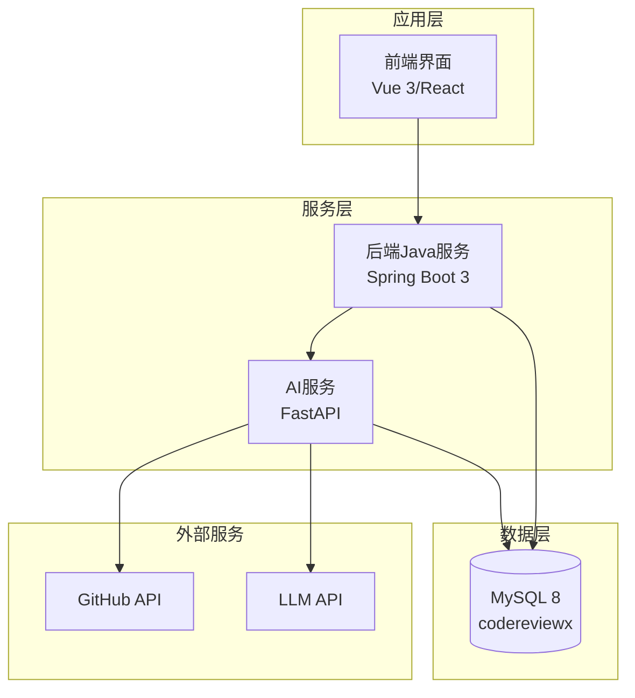
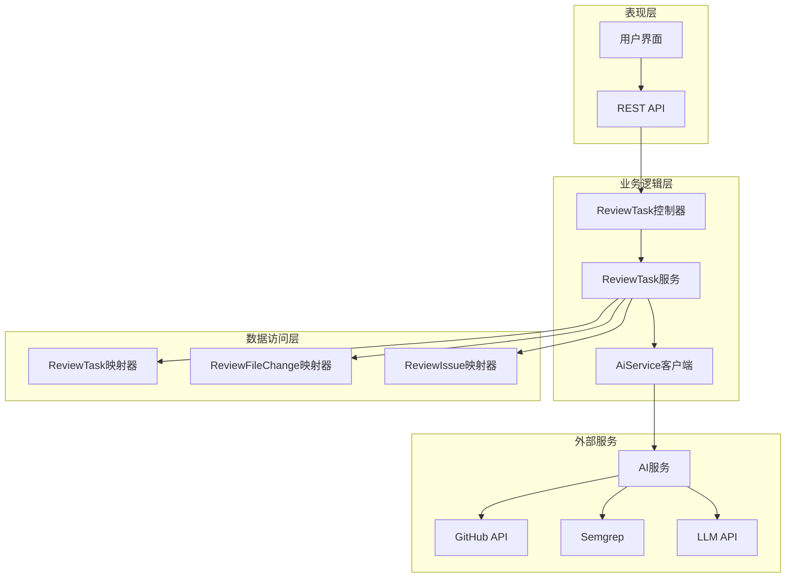
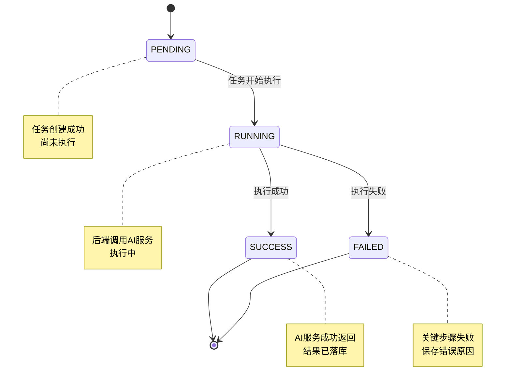
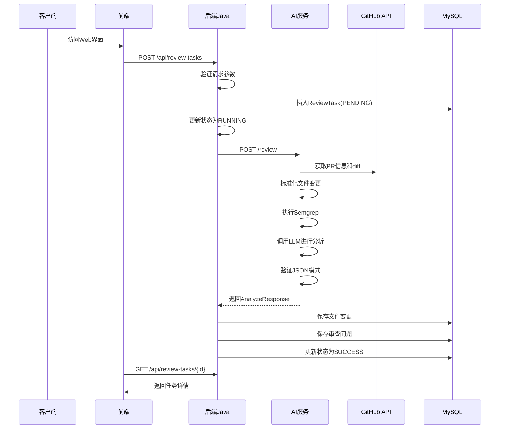
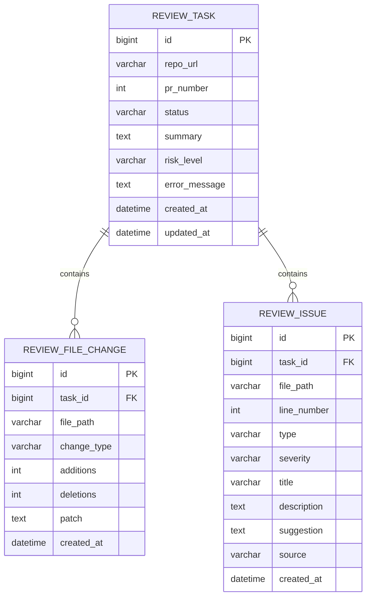
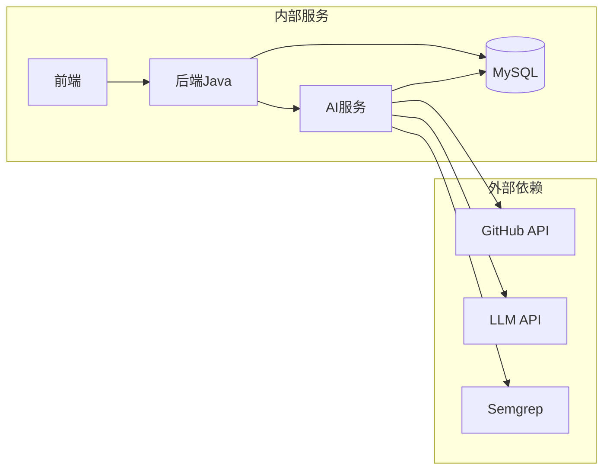
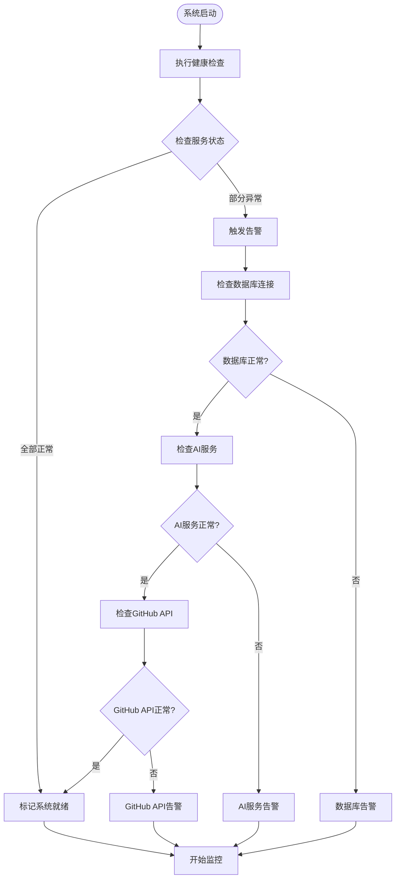
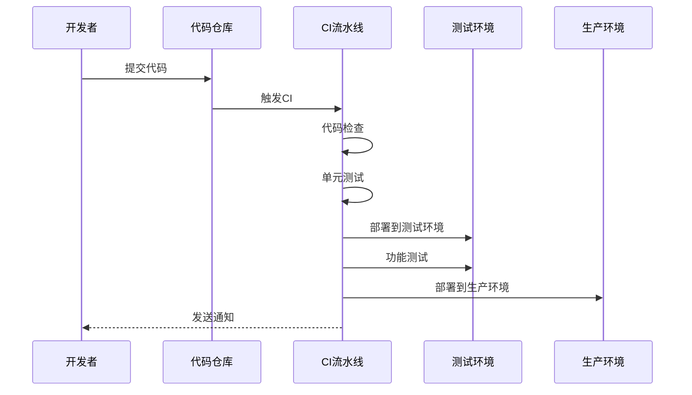

# 监控与维护

<cite>
**本文引用的文件**
- [README.md](file://README.md)
- [docker-compose.yml](file://docker-compose.yml)
- [docs/ARCHITECTURE.md](file://docs/ARCHITECTURE.md)
- [docs/DATABASE.md](file://docs/DATABASE.md)
- [docs/API.md](file://docs/API.md)
- [.github/workflows/ci.yml](file://.github/workflows/ci.yml)
- [docs/PRD.md](file://docs/PRD.md)
- [docs/AGENT_RULES.md](file://docs/AGENT_RULES.md)
</cite>

## 目录
1. [简介](#简介)
2. [项目结构](#项目结构)
3. [核心组件](#核心组件)
4. [架构概览](#架构概览)
5. [详细组件分析](#详细组件分析)
6. [依赖关系分析](#依赖关系分析)
7. [性能考量](#性能考量)
8. [故障排查指南](#故障排查指南)
9. [结论](#结论)
10. [附录](#附录)

## 简介

CodeReviewX是一个面向GitHub Pull Request的智能代码审查与修复建议Agent系统。该项目采用多服务架构，包括Java后端服务、Python AI服务、前端界面和MySQL数据库。本监控与维护文档旨在为系统建立完善的监控指标收集、告警配置、日志管理策略以及维护流程。

## 项目结构

CodeReviewX项目采用模块化架构设计，各组件职责明确，遵循"文档优先"的开发原则。

**图表来源**
- [docs/ARCHITECTURE.md:19-52](file://docs/ARCHITECTURE.md#L19-L52)
- [docs/ARCHITECTURE.md:373-381](file://docs/ARCHITECTURE.md#L373-L381)

**章节来源**
- [README.md:58-82](file://README.md#L58-L82)
- [docs/ARCHITECTURE.md:19-52](file://docs/ARCHITECTURE.md#L19-L52)

## 核心组件

### 后端Java服务 (backend-java)
- **技术栈**: Spring Boot 3 + Java 17
- **职责**: REST API提供、任务生命周期管理、MySQL持久化、调用AI服务
- **部署端口**: 8080

### AI服务 (ai-service)
- **技术栈**: Python + FastAPI
- **职责**: GitHub数据获取、Semgrep执行、LLM分析、结构化JSON输出
- **部署端口**: 8000

### 前端服务 (frontend)
- **技术栈**: Vue 3或React
- **职责**: 任务创建表单、任务列表、任务详情和审查报告展示
- **部署端口**: 3000

### 数据库 (MySQL)
- **版本**: MySQL 8
- **职责**: 任务、文件变更和审查问题的持久化存储

**章节来源**
- [docs/ARCHITECTURE.md:48-54](file://docs/ARCHITECTURE.md#L48-L54)
- [docs/ARCHITECTURE.md:373-381](file://docs/ARCHITECTURE.md#L373-L381)

## 架构概览

系统采用分层架构设计，确保各组件职责清晰分离。

**图表来源**
- [docs/ARCHITECTURE.md:183-230](file://docs/ARCHITECTURE.md#L183-L230)
- [docs/ARCHITECTURE.md:233-266](file://docs/ARCHITECTURE.md#L233-L266)

## 详细组件分析

### 任务状态管理

ReviewTask在生命周期内经过明确的状态转换：

**图表来源**
- [docs/ARCHITECTURE.md:110-134](file://docs/ARCHITECTURE.md#L110-L134)

### API调用链路

系统的核心调用流程包括任务创建、执行和结果查询：

**图表来源**
- [docs/ARCHITECTURE.md:137-180](file://docs/ARCHITECTURE.md#L137-L180)
- [docs/API.md:54-241](file://docs/API.md#L54-L241)

### 数据模型设计

系统采用三张核心表来存储审查任务相关信息：

**图表来源**
- [docs/DATABASE.md:22-134](file://docs/DATABASE.md#L22-L134)

**章节来源**
- [docs/DATABASE.md:22-134](file://docs/DATABASE.md#L22-L134)
- [docs/ARCHITECTURE.md:110-134](file://docs/ARCHITECTURE.md#L110-L134)

## 依赖关系分析

### 服务依赖图

**图表来源**
- [docs/ARCHITECTURE.md:19-52](file://docs/ARCHITECTURE.md#L19-L52)

### 环境变量配置

系统采用环境变量进行配置管理：

| 服务 | 关键配置项 | 默认值 | 用途 |
|------|------------|--------|------|
| 后端Java | SPRING_DATASOURCE_URL | jdbc:mysql://mysql:3306/codereviewx | 数据库连接 |
| 后端Java | SPRING_DATASOURCE_USERNAME | codereviewx | 数据库用户名 |
| 后端Java | SPRING_DATASOURCE_PASSWORD | codereviewx | 数据库密码 |
| 后端Java | AI_SERVICE_BASE_URL | http://ai-service:8000 | AI服务地址 |
| AI服务 | GITHUB_TOKEN | 空 | GitHub访问令牌 |
| AI服务 | LLM_PROVIDER | mock | LLM提供商选择 |
| AI服务 | LLM_API_KEY | 空 | LLM API密钥 |
| AI服务 | SEMGREP_TIMEOUT_SECONDS | 30 | Semgrep超时时间 |

**章节来源**
- [docs/ARCHITECTURE.md:345-370](file://docs/ARCHITECTURE.md#L345-L370)

## 性能考量

### 监控指标设计

基于系统架构，建议建立以下监控指标：

#### 服务级别指标
- **响应时间**: 后端API平均响应时间、AI服务处理时间
- **吞吐量**: 每秒请求数、任务执行速率
- **错误率**: HTTP 5xx错误率、AI服务调用失败率
- **资源使用**: CPU利用率、内存使用量、磁盘I/O

#### 业务级别指标
- **任务成功率**: 成功完成的任务占总任务的比例
- **任务处理时间**: 从创建到完成的平均耗时
- **审查质量**: 平均问题检测数量、不同类型问题分布
- **用户满意度**: 响应时间分布、错误恢复时间

#### 数据库性能指标
- **查询性能**: SQL执行时间、慢查询数量
- **连接池**: 活跃连接数、等待连接数
- **存储使用**: 表大小增长、索引使用率

### 性能优化建议

1. **缓存策略**: 对频繁查询的数据建立适当的缓存
2. **异步处理**: 将耗时操作异步化，提升用户体验
3. **数据库优化**: 合理使用索引，避免N+1查询
4. **资源限制**: 设置合理的超时和重试机制

## 故障排查指南

### 常见故障类型及处理

| 故障类型 | 触发条件 | 处理策略 | 影响范围 |
|----------|----------|----------|----------|
| GitHub API失败 | 访问令牌无效、网络超时 | 检查令牌配置、网络连通性 | 任务创建失败 |
| AI服务超时 | Semgrep执行时间过长、LLM响应慢 | 增加超时时间、优化算法 | 任务长时间卡住 |
| 数据库连接失败 | 连接池耗尽、网络中断 | 检查连接池配置、网络状况 | 所有数据操作失败 |
| 前端无法访问 | 服务未启动、端口冲突 | 检查服务状态、端口占用 | 用户界面不可用 |

### 日志管理策略

#### 日志级别划分
- **ERROR**: 严重错误、系统异常
- **WARN**: 警告信息、潜在问题
- **INFO**: 一般信息、正常流程
- **DEBUG**: 详细调试信息

#### 日志内容规范
- **敏感信息保护**: 避免记录完整的API密钥和令牌
- **结构化日志**: 使用JSON格式便于机器解析
- **上下文信息**: 包含请求ID、用户ID、时间戳

#### 日志存储策略
- **短期存储**: 本地磁盘，保留7天
- **长期存储**: 远程存储，保留30天
- **轮转策略**: 按大小和时间轮转

### 健康检查机制

**图表来源**
- [docs/ARCHITECTURE.md:170-180](file://docs/ARCHITECTURE.md#L170-L180)

**章节来源**
- [docs/AGENT_RULES.md:152-160](file://docs/AGENT_RULES.md#L152-L160)

## 结论

CodeReviewX项目在Round 01阶段建立了完整的监控与维护框架基础。通过明确的服务职责划分、标准化的API设计和严格的文档管理，为后续的功能实现和运维保障奠定了坚实基础。

建议在后续Round中逐步完善监控系统的具体实现，包括：
1. 部署Prometheus + Grafana监控系统
2. 实现分布式追踪系统
3. 建立完善的日志聚合平台
4. 制定详细的备份和灾难恢复策略
5. 建立自动化运维流程

## 附录

### CI/CD流程

**图表来源**
- [.github/workflows/ci.yml:14-58](file://.github/workflows/ci.yml#L14-L58)

### 安全配置要点

1. **凭据管理**: 使用环境变量而非硬编码
2. **日志安全**: 避免记录敏感信息
3. **网络隔离**: 合理的防火墙和网络策略
4. **访问控制**: 最小权限原则

**章节来源**
- [.github/workflows/ci.yml:14-58](file://.github/workflows/ci.yml#L14-L58)
- [docs/AGENT_RULES.md:152-160](file://docs/AGENT_RULES.md#L152-L160)