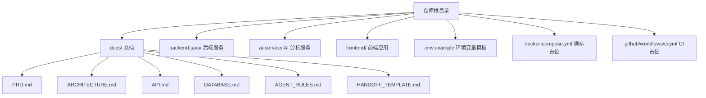
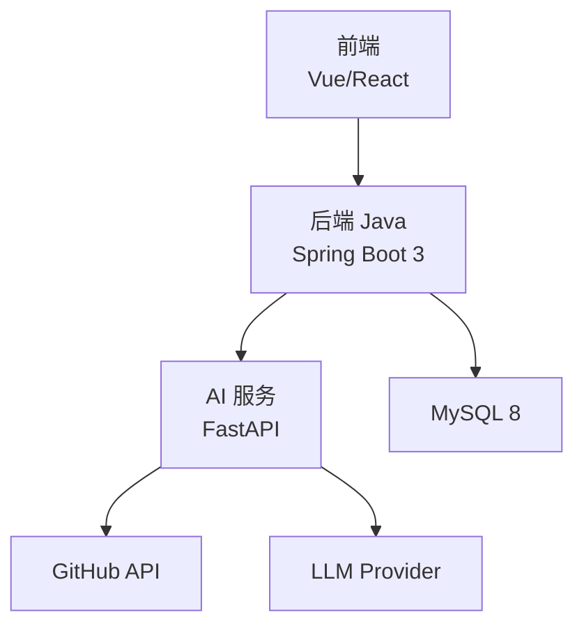
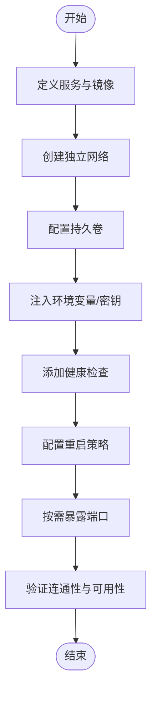
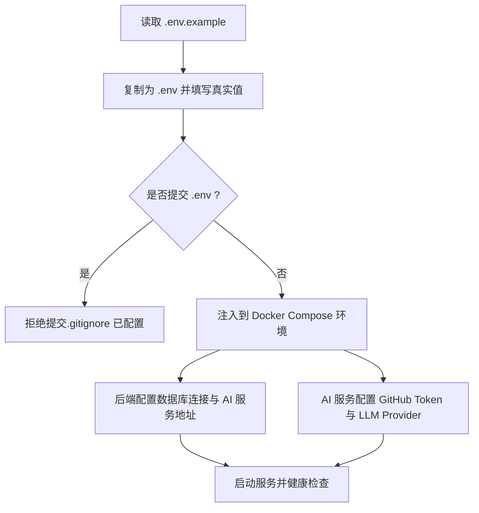
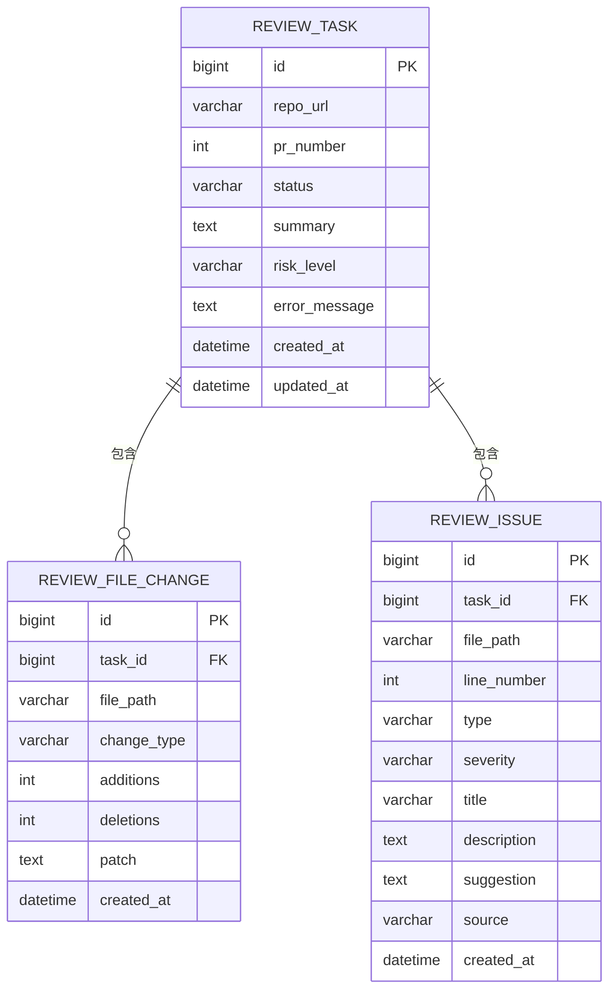
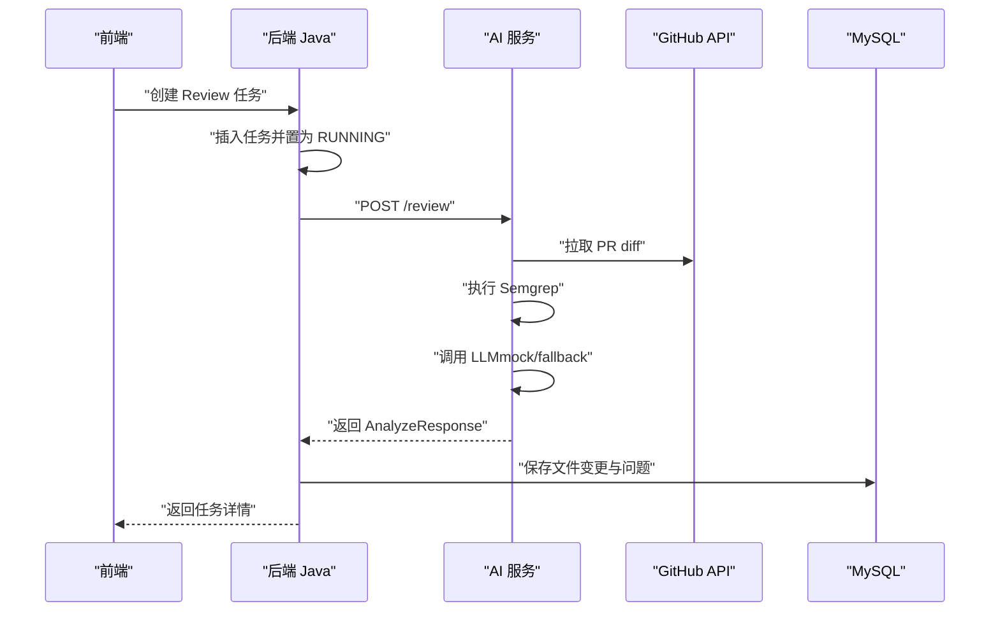
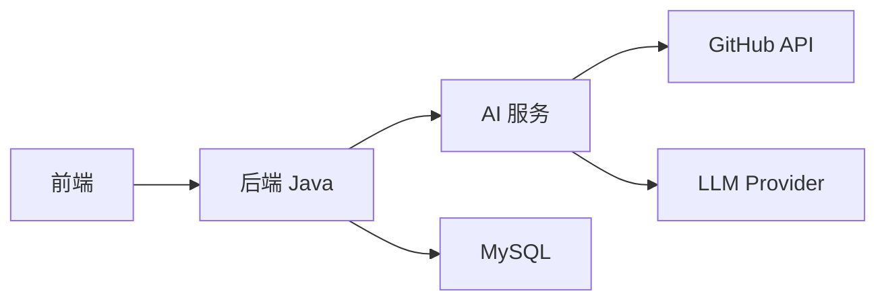

# 部署与运维

<cite>
**本文引用的文件**
- [docker-compose.yml](file://docker-compose.yml)
- [.env.example](file://.env.example)
- [README.md](file://README.md)
- [.github/workflows/ci.yml](file://.github/workflows/ci.yml)
- [docs/PRD.md](file://docs/PRD.md)
- [docs/ARCHITECTURE.md](file://docs/ARCHITECTURE.md)
- [docs/API.md](file://docs/API.md)
- [docs/DATABASE.md](file://docs/DATABASE.md)
- [docs/AGENT_RULES.md](file://docs/AGENT_RULES.md)
- [docs/HANDOFF_TEMPLATE.md](file://docs/HANDOFF_TEMPLATE.md)
</cite>

## 目录
1. [简介](#简介)
2. [项目结构](#项目结构)
3. [核心组件](#核心组件)
4. [架构总览](#架构总览)
5. [详细组件分析](#详细组件分析)
6. [依赖关系分析](#依赖关系分析)
7. [性能与容量规划](#性能与容量规划)
8. [日志与监控](#日志与监控)
9. [备份与灾难恢复](#备份与灾难恢复)
10. [运维工具与脚本](#运维工具与脚本)
11. [常见问题诊断](#常见问题诊断)
12. [结论](#结论)

## 简介
本文件面向 CodeReviewX 项目的部署与运维，基于 Round 01 的仓库现状与后续演进规划，提供可落地的 Docker Compose 部署策略、环境变量配置、安全基线、日志与监控、性能优化、备份与灾备、扩展性考虑以及运维工具与脚本使用指南。由于 Round 01 未包含业务代码与镜像构建文件，本文以“占位”形态梳理未来服务编排与运维实践，确保后续 Round 实现时具备一致的部署与运维基线。

## 项目结构
- 顶层采用多模块分层：前端、后端 Java、AI 服务、文档与 CI。
- 本地开发与演示优先，Docker Compose 作为默认编排方式。
- 环境变量集中于 .env.example，CI 仅进行结构校验，不包含构建与测试。

图表来源
- [README.md:58-82](file://README.md#L58-L82)
- [docker-compose.yml:1-14](file://docker-compose.yml#L1-L14)
- [.env.example:1-29](file://.env.example#L1-L29)
- [.github/workflows/ci.yml:1-58](file://.github/workflows/ci.yml#L1-L58)

章节来源
- [README.md:58-82](file://README.md#L58-L82)
- [docker-compose.yml:1-14](file://docker-compose.yml#L1-L14)
- [.env.example:1-29](file://.env.example#L1-L29)
- [.github/workflows/ci.yml:1-58](file://.github/workflows/ci.yml#L1-L58)

## 核心组件
- 后端 Java 服务：Spring Boot 3 + Java 17，提供 REST API、任务编排与 MySQL 持久化。
- AI 服务：Python + FastAPI，负责 GitHub PR diff 拉取、Semgrep 执行、LLM 结构化输出。
- 前端：Vue 3 或 React，调用后端 API 展示任务与报告。
- MySQL 8：持久化任务、文件变更与问题记录。
- 环境变量：集中于 .env.example，包含应用环境、端口、数据库、GitHub Token、LLM Provider 等。
- CI：GitHub Actions 占位，仅校验仓库结构与无业务代码。

章节来源
- [docs/PRD.md:47-54](file://docs/PRD.md#L47-L54)
- [docs/ARCHITECTURE.md:373-381](file://docs/ARCHITECTURE.md#L373-L381)
- [.env.example:6-29](file://.env.example#L6-L29)
- [.github/workflows/ci.yml:14-58](file://.github/workflows/ci.yml#L14-L58)

## 架构总览
系统采用“前端 -> 后端 -> AI 服务 -> GitHub API/LLM”的调用链，MySQL 作为统一数据存储。各服务通过 Docker Compose 在本地网络互通，后端通过环境变量配置 AI 服务地址。

图表来源
- [docs/ARCHITECTURE.md:19-52](file://docs/ARCHITECTURE.md#L19-L52)
- [docs/ARCHITECTURE.md:373-381](file://docs/ARCHITECTURE.md#L373-L381)

章节来源
- [docs/ARCHITECTURE.md:19-52](file://docs/ARCHITECTURE.md#L19-L52)
- [docs/ARCHITECTURE.md:373-381](file://docs/ARCHITECTURE.md#L373-L381)

## 详细组件分析

### Docker Compose 部署与编排
- 当前 docker-compose.yml 为占位文件，未定义服务，仅列出计划服务与端口。
- 生产部署建议：
  - 为每个服务定义独立镜像、健康检查、资源限制与重启策略。
  - 使用独立网络隔离服务，避免端口冲突。
  - 将敏感配置通过环境变量或外部挂载注入，不硬编码到 compose 文件。
  - 为数据库与 AI 服务分别配置持久卷，确保数据与缓存持久化。
  - 为前端与后端暴露必要端口，后端与 AI 服务在内部网络通信。

图表来源
- [docker-compose.yml:1-14](file://docker-compose.yml#L1-L14)
- [docs/ARCHITECTURE.md:373-381](file://docs/ARCHITECTURE.md#L373-L381)

章节来源
- [docker-compose.yml:1-14](file://docker-compose.yml#L1-L14)
- [docs/ARCHITECTURE.md:373-381](file://docs/ARCHITECTURE.md#L373-L381)

### 环境变量与安全基线
- 应用环境与端口：APP_ENV、BACKEND_PORT、AI_SERVICE_PORT。
- 数据库连接：MYSQL_HOST、MYSQL_PORT、MYSQL_DATABASE、MYSQL_USER、MYSQL_PASSWORD。
- GitHub 令牌：GITHUB_TOKEN。
- LLM Provider 与密钥：LLM_PROVIDER、LLM_API_KEY。
- 安全要求：
  - .env 不提交到仓库，仅保留 .env.example。
  - 日志不输出完整 Token/Key。
  - 严禁在代码注释中出现凭据。
  - CI 仅进行结构校验，不包含构建与测试。

图表来源
- [.env.example:1-29](file://.env.example#L1-L29)
- [.github/workflows/ci.yml:42-58](file://.github/workflows/ci.yml#L42-L58)

章节来源
- [.env.example:1-29](file://.env.example#L1-L29)
- [.github/workflows/ci.yml:42-58](file://.github/workflows/ci.yml#L42-L58)
- [docs/AGENT_RULES.md:152-160](file://docs/AGENT_RULES.md#L152-L160)

### 数据库与持久化
- 数据库：MySQL 8，字符集 utf8mb4，InnoDB 引擎。
- 表结构：review_task、review_file_change、review_issue，支持状态、风险等级、问题类型与来源枚举。
- 索引与外键：为状态、创建时间、任务 ID、严重程度、类型建立索引；外键约束用于完整性。
- 运维要点：使用独立卷持久化数据；备份策略见“备份与灾难恢复”。

图表来源
- [docs/DATABASE.md:22-134](file://docs/DATABASE.md#L22-L134)

章节来源
- [docs/DATABASE.md:9-17](file://docs/DATABASE.md#L9-L17)
- [docs/DATABASE.md:22-134](file://docs/DATABASE.md#L22-L134)

### API 与调用链
- 前端调用后端：创建任务、查询列表、查询详情。
- 后端调用 AI 服务：执行 PR 分析，返回结构化 Review。
- 错误码与统一响应格式：前后端均定义统一错误码与响应结构。
- 调用链路：前端 -> 后端 -> AI 服务 -> GitHub API/LLM -> 后端落库 -> 前端展示。

图表来源
- [docs/API.md:54-241](file://docs/API.md#L54-L241)
- [docs/API.md:243-332](file://docs/API.md#L243-L332)
- [docs/ARCHITECTURE.md:137-180](file://docs/ARCHITECTURE.md#L137-L180)

章节来源
- [docs/API.md:54-241](file://docs/API.md#L54-L241)
- [docs/API.md:243-332](file://docs/API.md#L243-L332)
- [docs/ARCHITECTURE.md:137-180](file://docs/ARCHITECTURE.md#L137-L180)

## 依赖关系分析
- 组件耦合：前端仅依赖后端；后端依赖 AI 服务与数据库；AI 服务依赖 GitHub API 与 LLM Provider。
- 外部依赖：GitHub API、LLM Provider（可为 mock）、Semgrep（在 AI 服务内部执行）。
- 网络依赖：Docker 网络隔离服务，后端与 AI 服务通过服务名通信。

图表来源
- [docs/ARCHITECTURE.md:19-52](file://docs/ARCHITECTURE.md#L19-L52)

章节来源
- [docs/ARCHITECTURE.md:19-52](file://docs/ARCHITECTURE.md#L19-L52)

## 性能与容量规划
- 本地开发优先：Docker Compose 默认资源限制宽松，便于调试与演示。
- 生产建议：
  - 为后端与 AI 服务设置 CPU/内存限额与并发上限，避免资源争抢。
  - 数据库连接池参数根据并发与慢查询日志调整。
  - AI 服务执行 Semgrep 与 LLM 调用应设置超时与重试策略，避免阻塞后端。
  - 前端静态资源可由反向代理缓存，减少后端压力。
  - 定期清理日志与临时文件，控制磁盘占用。

[本节为通用指导，无需特定文件来源]

## 日志与监控
- 日志采集：后端、AI 服务、数据库分别输出结构化日志；建议集中到日志收集系统（如 ELK/Fluentd）。
- 监控指标：
  - 服务可用性：健康检查端点与容器存活状态。
  - 性能指标：请求延迟、吞吐、错误率、数据库连接数、AI 服务执行耗时。
  - 资源指标：CPU、内存、磁盘、网络。
- 告警策略：针对健康检查失败、错误率突增、数据库连接池耗尽、AI 服务超时等阈值触发告警。

[本节为通用指导，无需特定文件来源]

## 备份与灾难恢复
- 备份策略：
  - 数据库：定时快照与增量备份，保留至少 7 天滚动备份。
  - 配置与日志：定期归档至对象存储，保留 30 天。
- 灾难恢复：
  - 快速恢复：优先恢复数据库，再恢复服务；确保 .env 与密钥安全恢复。
  - 验证恢复：恢复后执行健康检查与关键路径测试（创建任务 -> AI 分析 -> 落库 -> 前端展示）。
- 一致性：备份期间尽量避免写操作，或使用只读副本进行备份。

[本节为通用指导，无需特定文件来源]

## 运维工具与脚本
- 本地开发：
  - 使用 Docker Compose 启停服务，配合 .env 注入配置。
  - 通过 CI 作业验证仓库结构与无业务代码。
- 常用命令：
  - 启动/停止：compose up/down
  - 查看日志：compose logs -f
  - 进入容器：compose exec <service> sh
- 安全扫描：
  - CI 中包含敏感信息排查命令，可在本地复用以防止凭据泄漏。

章节来源
- [.github/workflows/ci.yml:42-58](file://.github/workflows/ci.yml#L42-L58)

## 常见问题诊断
- 服务无法启动：
  - 检查 .env 是否正确，端口是否被占用，网络是否连通。
  - 查看 compose 日志，确认健康检查与依赖服务状态。
- 数据库连接失败：
  - 校验 MYSQL_HOST/PORT/USER/PASSWORD，确认数据库已就绪。
  - 检查网络隔离与防火墙策略。
- AI 服务调用失败：
  - 校验 GITHUB_TOKEN 与 LLM Provider 配置。
  - 检查 AI 服务超时与重试策略，确认 Semgrep 与 LLM 可达性。
- 前端无法访问后端：
  - 校验前端 API 基础地址与后端端口映射。
  - 确认跨域与反向代理配置（如使用 Nginx）。

章节来源
- [docs/API.md:9-51](file://docs/API.md#L9-L51)
- [docs/ARCHITECTURE.md:345-370](file://docs/ARCHITECTURE.md#L345-L370)

## 结论
本文件基于 Round 01 的仓库现状，给出了面向生产的部署与运维实践框架：以 Docker Compose 为编排基座，以 .env 为配置入口，以 CI 为质量门禁，以文档为协作契约。随着后续 Round 的推进，建议逐步完善镜像构建、健康检查、资源配额、监控告警与备份恢复策略，确保系统在开发、测试与生产环境中的一致性与可靠性。