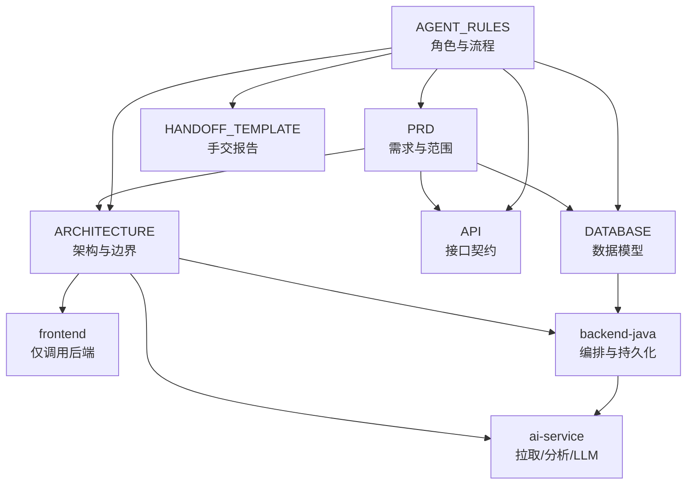
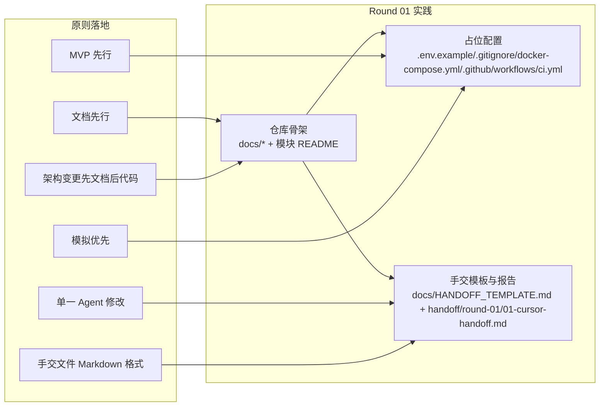
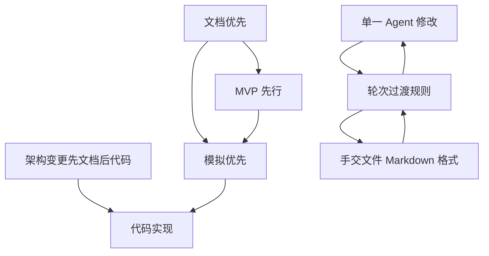

# 开发原则

<cite>
**本文引用的文件**
- [README.md](file://README.md)
- [docs/PRD.md](file://docs/PRD.md)
- [docs/ARCHITECTURE.md](file://docs/ARCHITECTURE.md)
- [docs/AGENT_RULES.md](file://docs/AGENT_RULES.md)
- [docs/API.md](file://docs/API.md)
- [docs/DATABASE.md](file://docs/DATABASE.md)
- [docs/HANDOFF_TEMPLATE.md](file://docs/HANDOFF_TEMPLATE.md)
- [tasks/round-01/01-cursor-repository-foundation.md](file://tasks/round-01/01-cursor-repository-foundation.md)
- [handoff/round-01/01-cursor-handoff.md](file://handoff/round-01/01-cursor-handoff.md)
</cite>

## 目录
1. [简介](#简介)
2. [项目结构](#项目结构)
3. [核心组件](#核心组件)
4. [架构总览](#架构总览)
5. [详细组件分析](#详细组件分析)
6. [依赖关系分析](#依赖关系分析)
7. [性能考量](#性能考量)
8. [故障排查指南](#故障排查指南)
9. [结论](#结论)
10. [附录](#附录)

## 简介
本文件系统化阐述 CodeReviewX 的六大开发原则及其落地方式，结合项目 Round 01 的仓库基础建设实践，说明每个原则的实施意义、具体要求、质量保障与效率提升价值，并提供可复用的最佳实践与应用场景，帮助团队成员在不同 Round 中高效协同、降低风险、保持一致性。

## 项目结构
围绕六大开发原则，项目采用“文档驱动 + 分层职责 + 严格边界”的组织方式：
- 文档先行：PRD、架构、API、数据库、Agent 规则、手交模板构成统一的知识基座
- MVP 先行：所有 Round 限定在 MVP 范围内，避免功能膨胀
- 模拟优先：AI 服务先 mock，再接入真实 LLM
- 单一 Agent 修改：同一模块同一轮次仅允许一个 Agent 修改
- 架构变更先文档后代码：任何边界或契约变化必须先更新文档
- 手交文件 Markdown 格式：Agent 间交付物统一为 Markdown

图表来源
- [docs/PRD.md](file://docs/PRD.md)
- [docs/ARCHITECTURE.md](file://docs/ARCHITECTURE.md)
- [docs/API.md](file://docs/API.md)
- [docs/DATABASE.md](file://docs/DATABASE.md)
- [docs/AGENT_RULES.md](file://docs/AGENT_RULES.md)
- [docs/HANDOFF_TEMPLATE.md](file://docs/HANDOFF_TEMPLATE.md)

章节来源
- [README.md](file://README.md)
- [docs/PRD.md](file://docs/PRD.md)
- [docs/ARCHITECTURE.md](file://docs/ARCHITECTURE.md)
- [docs/AGENT_RULES.md](file://docs/AGENT_RULES.md)

## 核心组件
- 文档基座：PRD、ARCHITECTURE、API、DATABASE、AGENT_RULES、HANDOFF_TEMPLATE
- 任务与手交：tasks/round-01、handoff/round-01
- Round 01 实践：仓库骨架、占位配置、CI/GitHub Actions、模块 README、环境示例与忽略规则

章节来源
- [tasks/round-01/01-cursor-repository-foundation.md](file://tasks/round-01/01-cursor-repository-foundation.md)
- [handoff/round-01/01-cursor-handoff.md](file://handoff/round-01/01-cursor-handoff.md)

## 架构总览
六大原则在架构层面的具体体现：
- 文档先行：PRD 明确 MVP 范围；ARCHITECTURE 定义模块边界；API/DATABASE 明确契约与数据模型
- MVP 先行：第一阶段不引入 Redis/Kafka/K8s/向量库/多模型路由/用户体系
- 模拟优先：AI 服务先 mock fallback，再接入真实 LLM
- 单一 Agent 修改：同一模块同一轮次仅允许一个 Agent 修改
- 架构变更先文档后代码：任何边界或契约变化必须先更新文档
- 手交文件 Markdown 格式：Agent 间交付物统一为 Markdown

图表来源
- [README.md](file://README.md)
- [docs/PRD.md](file://docs/PRD.md)
- [docs/ARCHITECTURE.md](file://docs/ARCHITECTURE.md)
- [docs/HANDOFF_TEMPLATE.md](file://docs/HANDOFF_TEMPLATE.md)
- [handoff/round-01/01-cursor-handoff.md](file://handoff/round-01/01-cursor-handoff.md)

## 详细组件分析

### 原则一：文档优先
- 实施意义
  - 保证所有业务代码在 PRD、API 设计、数据库设计经评审后再写入，避免返工与边界模糊
  - 为后续 Round 的任务分配与评审提供统一依据
- 具体要求
  - PRD 明确 MVP 范围与出范围项
  - ARCHITECTURE 明确模块职责与边界
  - API/DATABASE 作为契约文档，标注“计划中”而非已实现
  - Agent 角色与流程在 AGENT_RULES 中固化
- 质量保障
  - Round 01 中所有文档均为“计划中”，未引入业务代码
  - 所有占位配置与 CI/Compose 均为“占位”，避免误导实现
- 效率提升
  - 统一的文档基座减少沟通成本，加速任务评审与分配
  - 任务文档与手交报告模板标准化，便于复用与审计
- 应用场景与最佳实践
  - Round 01：创建 PRD、ARCHITECTURE、API、DATABASE、AGENT_RULES、HANDOFF_TEMPLATE
  - Round 02+：基于 PRD 更新 ARCHITECTURE/API/DATABASE，再进行实现
  - 评审前：必须先评审文档，再讨论实现细节

章节来源
- [docs/PRD.md](file://docs/PRD.md)
- [docs/ARCHITECTURE.md](file://docs/ARCHITECTURE.md)
- [docs/API.md](file://docs/API.md)
- [docs/DATABASE.md](file://docs/DATABASE.md)
- [docs/AGENT_RULES.md](file://docs/AGENT_RULES.md)
- [tasks/round-01/01-cursor-repository-foundation.md](file://tasks/round-01/01-cursor-repository-foundation.md)
- [handoff/round-01/01-cursor-handoff.md](file://handoff/round-01/01-cursor-handoff.md)

### 原则二：MVP 先行
- 实施意义
  - 限定第一阶段复杂度，聚焦核心链路，快速交付可用产物
  - 避免引入 Redis/Kafka/K8s/向量库/多模型路由等非必要技术栈
- 具体要求
  - Round 01 不实现 Spring Boot/FastAPI/前端页面/数据库迁移/GitHub API/Semgrep/LLM
  - CI/Compose 仅占位，不执行真实构建
- 质量保障
  - 任务文档与手交报告中明确“未实现”与“占位”
  - Round 01 结束即进入架构评审，评审通过后方可进入下一 Round
- 效率提升
  - 以最小可行产品为目标，缩短反馈周期
  - 降低技术债与架构漂移风险
- 应用场景与最佳实践
  - Round 01：创建占位文件与文档，不写业务代码
  - Round 02：在 PRD 更新后，开始 backend-java 骨架
  - 评审通过后，再逐步引入 ai-service、前端、数据库与集成

章节来源
- [README.md](file://README.md)
- [docs/PRD.md](file://docs/PRD.md)
- [docs/ARCHITECTURE.md](file://docs/ARCHITECTURE.md)
- [tasks/round-01/01-cursor-repository-foundation.md](file://tasks/round-01/01-cursor-repository-foundation.md)
- [handoff/round-01/01-cursor-handoff.md](file://handoff/round-01/01-cursor-handoff.md)

### 原则三：模拟优先
- 实施意义
  - 先以 mock 替代真实 LLM，确保链路可跑通、可调试、可演示
  - 降低外部依赖波动对开发的影响
- 具体要求
  - ai-service 先 mock fallback，再接入真实 LLM
  - mock 输出符合统一 Review JSON 标准
- 质量保障
  - ARCHITECTURE 明确“所有 AI 能力必须先有 mock fallback，再接入真实 LLM”
  - API 文档中明确 Review JSON 结构与来源字段
- 效率提升
  - 快速验证调用链路与数据结构，提前暴露问题
  - 便于前端联调与 UI 原型验证
- 应用场景与最佳实践
  - Round 01：占位配置中设置 LLM_PROVIDER=mock
  - Round 03：实现 ai-service mock 管道，输出 Review JSON
  - Round 05：替换为真实 LLM 并保留 mock 降级

章节来源
- [docs/ARCHITECTURE.md](file://docs/ARCHITECTURE.md)
- [docs/API.md](file://docs/API.md)
- [docs/DATABASE.md](file://docs/DATABASE.md)
- [tasks/round-01/01-cursor-repository-foundation.md](file://tasks/round-01/01-cursor-repository-foundation.md)

### 原则四：单一 Agent 修改
- 实施意义
  - 避免并发修改导致的冲突与重复劳动
  - 明确责任边界，减少跨 Agent 的耦合
- 具体要求
  - 同一轮次内，同一模块仅允许一个 Agent 修改
  - 任务文档明确 Cursor 的 per-task scope
- 质量保障
  - AGENT_RULES 明确 Cursor/Codex/Qoder 的职责与限制
  - Round 01 中 Cursor 仅负责仓库骨架与文档，不引入业务代码
- 效率提升
  - 减少合并冲突与反复修改
  - 明确的轮次过渡规则，便于评审与推进
- 应用场景与最佳实践
  - Round 01：Cursor 完成仓库骨架与文档
  - 评审通过后，按规则移交至 Codex 或 Qoder
  - 任何跨 Agent 的修改必须经 ChatGPT Architect 决策

章节来源
- [docs/AGENT_RULES.md](file://docs/AGENT_RULES.md)
- [tasks/round-01/01-cursor-repository-foundation.md](file://tasks/round-01/01-cursor-repository-foundation.md)
- [handoff/round-01/01-cursor-handoff.md](file://handoff/round-01/01-cursor-handoff.md)

### 原则五：架构变更先文档后代码
- 实施意义
  - 任何模块边界或 API 契约的变化必须先更新文档，再进行代码改动
  - 避免“先改代码后补文档”的技术债
- 具体要求
  - 变更需要 PRD 更新或 ARCHITECTURE/API/DATABASE 文档修订
  - 代码改动前必须完成文档更新
- 质量保障
  - AGENT_RULES 明确“架构变更更新文档优先”的流程
  - 所有变更均需 ChatGPT Architect 评估与批准
- 效率提升
  - 降低因边界不清导致的返工
  - 便于评审与追溯
- 应用场景与最佳实践
  - Round 01：PRD、ARCHITECTURE、API、DATABASE 均为“计划中”，未实现
  - 如需调整边界或契约，先在文档中修订，再进行实现

章节来源
- [docs/AGENT_RULES.md](file://docs/AGENT_RULES.md)
- [docs/PRD.md](file://docs/PRD.md)
- [docs/ARCHITECTURE.md](file://docs/ARCHITECTURE.md)
- [docs/API.md](file://docs/API.md)
- [docs/DATABASE.md](file://docs/DATABASE.md)

### 原则六：手交文件 Markdown 格式
- 实施意义
  - 统一 Agent 间交付物格式，便于评审、归档与复用
  - 保证手交报告结构化、可追踪
- 具体要求
  - 所有 Agent 间文件使用 Markdown 格式
  - 手交报告必须遵循 HANDOFF_TEMPLATE 的 10 节结构
- 质量保障
  - HANDOFF_TEMPLATE 明确 10 节内容与检查清单
  - Round 01 的手交报告严格遵循模板，包含“范围合规”“验收清单”“检查命令”等
- 效率提升
  - 标准化模板减少沟通成本，便于自动化检查
  - 便于后续 Round 的复用与对比
- 应用场景与最佳实践
  - Round 01：Cursor 输出 01-cursor-handoff.md，严格遵循模板
  - 评审通过后，按规则移交至下一位 Agent

章节来源
- [docs/HANDOFF_TEMPLATE.md](file://docs/HANDOFF_TEMPLATE.md)
- [handoff/round-01/01-cursor-handoff.md](file://handoff/round-01/01-cursor-handoff.md)
- [docs/AGENT_RULES.md](file://docs/AGENT_RULES.md)

## 依赖关系分析
六大原则之间的相互作用与依赖：
- 文档优先是前提，MVP 先行是边界，模拟优先是手段，单一 Agent 修改是过程控制，架构变更先文档后代码是变更治理，手交文件 Markdown 格式是交付标准
- Round 01 的仓库骨架与占位配置体现了“文档优先 + MVP 先行 + 模拟优先 + 手交文件 Markdown 格式”的协同

图表来源
- [docs/PRD.md](file://docs/PRD.md)
- [docs/ARCHITECTURE.md](file://docs/ARCHITECTURE.md)
- [docs/AGENT_RULES.md](file://docs/AGENT_RULES.md)
- [docs/HANDOFF_TEMPLATE.md](file://docs/HANDOFF_TEMPLATE.md)

章节来源
- [docs/PRD.md](file://docs/PRD.md)
- [docs/ARCHITECTURE.md](file://docs/ARCHITECTURE.md)
- [docs/AGENT_RULES.md](file://docs/AGENT_RULES.md)
- [docs/HANDOFF_TEMPLATE.md](file://docs/HANDOFF_TEMPLATE.md)

## 性能考量
- 文档先行与 MVP 先行降低开发与评审成本，减少无效迭代
- 模拟优先确保链路稳定，便于并行开发与联调
- 单一 Agent 修改与轮次过渡规则减少冲突与返工
- 手交报告模板化便于自动化检查与持续改进

## 故障排查指南
- 未遵循“文档优先”：若出现“先改代码后补文档”的情况，立即回滚并补齐文档，再进行评审
- 未遵循“MVP 先行”：若引入了 Redis/Kafka/K8s/向量库等，立即移除并退回上一 Round
- 未遵循“模拟优先”：若直接接入真实 LLM 导致链路不稳定，退回 mock 管道并补充降级策略
- 未遵循“单一 Agent 修改”：若出现并发修改冲突，暂停修改并协调轮次顺序
- 未遵循“架构变更先文档后代码”：若边界或契约已变更但文档未更新，暂停代码改动直至文档修订完成
- 未遵循“手交文件 Markdown 格式”：若手交报告不符合模板，退回重新填写

章节来源
- [docs/AGENT_RULES.md](file://docs/AGENT_RULES.md)
- [docs/HANDOFF_TEMPLATE.md](file://docs/HANDOFF_TEMPLATE.md)

## 结论
六大开发原则共同构成了 CodeReviewX 的工程基线：以文档为纲、以 MVP 为界、以模拟为径、以单一修改为序、以先文后码为规、以 Markdown 为范。它们在 Round 01 的实践中得到验证，并将在后续 Round 中持续指导高质量、高效率的开发与评审。

## 附录
- Round 01 实践要点
  - 仓库骨架与文档齐全，无业务代码
  - 占位配置与 CI/Compose 仅作存在性验证
  - 手交报告严格遵循模板，包含范围合规与验收清单
- 下一步建议
  - 评审通过后，按轮次规则移交至 Codex 或 Qoder
  - 在 PRD 更新后，开始 backend-java 骨架与 ai-service mock 管道
  - 逐步引入 GitHub API/Semgrep/LLM，始终遵循“先文档后代码”

章节来源
- [README.md](file://README.md)
- [tasks/round-01/01-cursor-repository-foundation.md](file://tasks/round-01/01-cursor-repository-foundation.md)
- [handoff/round-01/01-cursor-handoff.md](file://handoff/round-01/01-cursor-handoff.md)