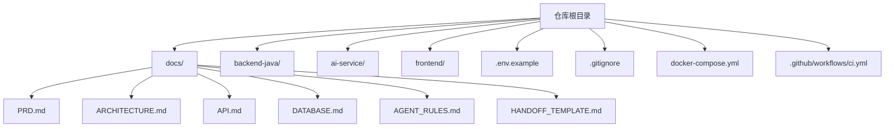
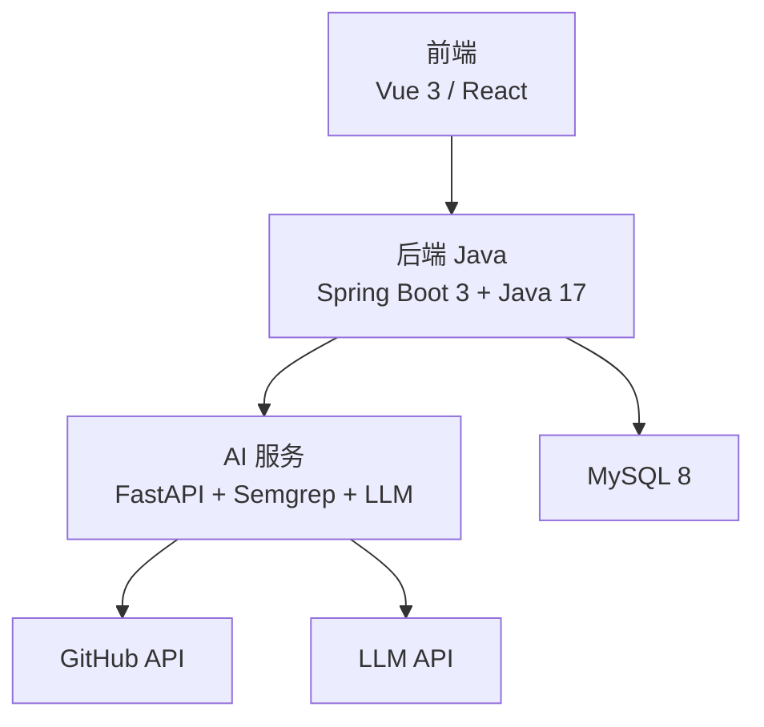
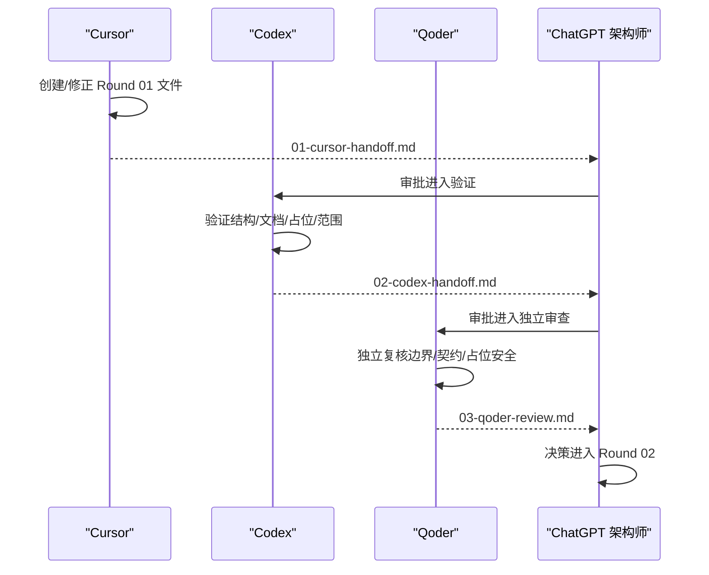
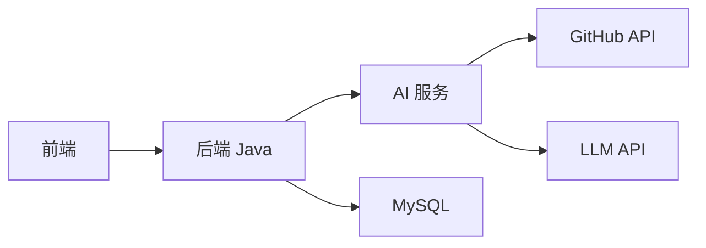
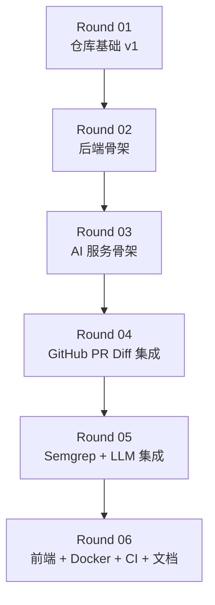

# 开发路线图

<cite>
**本文引用的文件**
- [README.md](file://README.md)
- [docs/PRD.md](file://docs/PRD.md)
- [docs/ARCHITECTURE.md](file://docs/ARCHITECTURE.md)
- [docs/API.md](file://docs/API.md)
- [docs/DATABASE.md](file://docs/DATABASE.md)
- [docs/AGENT_RULES.md](file://docs/AGENT_RULES.md)
- [docs/HANDOFF_TEMPLATE.md](file://docs/HANDOFF_TEMPLATE.md)
- [docker-compose.yml](file://docker-compose.yml)
- [handoff/round-01/01-cursor-handoff.md](file://handoff/round-01/01-cursor-handoff.md)
- [handoff/round-01/02-codex-handoff.md](file://handoff/round-01/02-codex-handoff.md)
- [handoff/round-01/03-qoder-review.md](file://handoff/round-01/03-qoder-review.md)
- [tasks/round-01/01-cursor-repository-foundation.md](file://tasks/round-01/01-cursor-repository-foundation.md)
- [tasks/round-01/02-codex-repository-validation.md](file://tasks/round-01/02-codex-repository-validation.md)
- [tasks/round-01/03-qoder-independent-review.md](file://tasks/round-01/03-qoder-independent-review.md)
</cite>

## 目录
1. [简介](#简介)
2. [项目结构](#项目结构)
3. [核心组件](#核心组件)
4. [架构总览](#架构总览)
5. [详细组件分析](#详细组件分析)
6. [依赖分析](#依赖分析)
7. [性能考虑](#性能考虑)
8. [故障排查指南](#故障排查指南)
9. [结论](#结论)
10. [附录](#附录)

## 简介
本开发路线图为 CodeReviewX 项目提供系统性的分轮次开发策略与实施蓝图，围绕 MVP 方法论，采用“文档先行、MVP 优先、Mock 先行、逐步集成”的原则，确保每一轮次的目标清晰、交付物可验证、风险可控。当前 Round 01 已完成仓库基础与文档体系搭建，进入下一阶段 Round 02 的准备窗口。

## 项目结构
仓库采用多模块分层与文档驱动的组织方式，核心结构如下：
- 顶层文档：PRD、ARCHITECTURE、API、DATABASE、AGENT_RULES、HANDOFF_TEMPLATE
- 模块目录：backend-java、ai-service、frontend
- 基础设施：.env.example、.gitignore、docker-compose.yml、.github/workflows/ci.yml
- 协作产物：tasks/round-01、handoff/round-01

图表来源
- [README.md:58-82](file://README.md#L58-L82)
- [docs/PRD.md:1-218](file://docs/PRD.md#L1-L218)
- [docs/ARCHITECTURE.md:1-417](file://docs/ARCHITECTURE.md#L1-L417)
- [docker-compose.yml:1-14](file://docker-compose.yml#L1-L14)

章节来源
- [README.md:58-82](file://README.md#L58-L82)
- [docs/PRD.md:1-218](file://docs/PRD.md#L1-L218)
- [docs/ARCHITECTURE.md:1-417](file://docs/ARCHITECTURE.md#L1-L417)
- [docker-compose.yml:1-14](file://docker-compose.yml#L1-L14)

## 核心组件
- 后端 Java（backend-java）：Spring Boot 3 + Java 17，负责任务生命周期编排、REST API、MySQL 持久化、调用 ai-service。
- AI 服务（ai-service）：Python + FastAPI，负责 GitHub PR diff 拉取、Semgrep 执行、LLM 分析、结构化 Review JSON 输出。
- 前端（frontend）：Vue 3 或 React，负责任务创建、列表、详情与报告展示。
- 数据库（MySQL 8）：持久化任务、文件变更与问题条目。
- CI/CD（GitHub Actions）：占位工作流，验证仓库结构与范围合规。
- Docker Compose：占位编排，定义服务占位与端口约定。

章节来源
- [README.md:47-56](file://README.md#L47-L56)
- [docs/ARCHITECTURE.md:19-52](file://docs/ARCHITECTURE.md#L19-L52)
- [docs/API.md:54-241](file://docs/API.md#L54-L241)
- [docs/DATABASE.md:20-134](file://docs/DATABASE.md#L20-L134)

## 架构总览
系统采用“前端 -> 后端 -> AI 服务 -> GitHub API/LLM”的分层调用链，边界清晰、职责分离，且第一阶段不引入复杂中间件与分布式组件，确保本地可运行、可调试、可演示。

图表来源
- [docs/ARCHITECTURE.md:19-52](file://docs/ARCHITECTURE.md#L19-L52)
- [docs/API.md:243-333](file://docs/API.md#L243-L333)

章节来源
- [docs/ARCHITECTURE.md:19-52](file://docs/ARCHITECTURE.md#L19-L52)
- [docs/API.md:243-333](file://docs/API.md#L243-L333)

## 详细组件分析

### Round 01：仓库基础 v1（已完成）
- 目标：建立仓库骨架、文档系统、Agent 协作规则、占位配置与 CI。
- 交付物：14 个必需文件、模块 README、占位 docker-compose.yml、占位 CI、Agent 规则与手稿模板。
- 质量保障：Cursor 完成 -> Codex 验证 -> Qoder 独立审查，三轮协作确保范围合规与文档质量。

图表来源
- [tasks/round-01/01-cursor-repository-foundation.md:1-712](file://tasks/round-01/01-cursor-repository-foundation.md#L1-L712)
- [tasks/round-01/02-codex-repository-validation.md:1-649](file://tasks/round-01/02-codex-repository-validation.md#L1-L649)
- [tasks/round-01/03-qoder-independent-review.md:1-667](file://tasks/round-01/03-qoder-independent-review.md#L1-L667)
- [handoff/round-01/01-cursor-handoff.md:1-202](file://handoff/round-01/01-cursor-handoff.md#L1-L202)
- [handoff/round-01/02-codex-handoff.md:1-138](file://handoff/round-01/02-codex-handoff.md#L1-L138)
- [handoff/round-01/03-qoder-review.md:1-229](file://handoff/round-01/03-qoder-review.md#L1-L229)

章节来源
- [README.md:7-25](file://README.md#L7-L25)
- [handoff/round-01/01-cursor-handoff.md:14-78](file://handoff/round-01/01-cursor-handoff.md#L14-L78)
- [handoff/round-01/02-codex-handoff.md:13-75](file://handoff/round-01/02-codex-handoff.md#L13-L75)
- [handoff/round-01/03-qoder-review.md:15-22](file://handoff/round-01/03-qoder-review.md#L15-L22)

### Round 02：后端骨架（建议）
- 目标：完成 backend-java 骨架实现，包括 REST API、分层结构、DTO/Entity/Enum、WebClient 配置、基础异常处理。
- 关键任务：
  - 后端分层目录与命名规范落地（controller/service/client/mapper/entity/dto/enum/exception/config）。
  - 实现 ReviewTask 控制器与服务，支持创建、查询列表、查询详情。
  - 定义统一错误响应格式与错误码。
  - 配置 ai-service 客户端（WebClient）与基础超时重试策略。
  - 数据库连接配置与基础表结构映射说明。
- 技术挑战：
  - 分层职责与边界的一致性，避免业务逻辑侵入 controller。
  - 错误码与响应格式的统一，便于前端与 ai-service 的契约稳定。
  - 与 Round 01 文档的契约一致性（API、数据库、架构）。
- 交付成果：
  - 可编译的后端骨架工程（无业务逻辑）。
  - 完整的 API 文档与契约示例。
  - 数据库逻辑设计文档与 MyBatis-Plus 映射说明。
  - 占位 Docker Compose 服务定义（仅占位）。

章节来源
- [docs/ARCHITECTURE.md:183-230](file://docs/ARCHITECTURE.md#L183-L230)
- [docs/API.md:54-241](file://docs/API.md#L54-L241)
- [docs/DATABASE.md:257-284](file://docs/DATABASE.md#L257-L284)
- [docker-compose.yml:1-14](file://docker-compose.yml#L1-L14)

### Round 03：AI 服务骨架（建议）
- 目标：完成 ai-service 骨架实现，包括 FastAPI 路由、Pydantic 模型、服务层划分、GitHub/LLM/JSON 校验占位。
- 关键任务：
  - 定义 review_api.py 与 analyze_request/analyze_response 模型。
  - 实现 review_analyzer.py 的核心流程占位（拉取 diff -> 标准化 -> 调用 Semgrep -> 调用 LLM -> 校验 JSON -> 返回 AnalyzeResponse）。
  - 实现 github_service.py、semgrep_service.py、llm_service.py 的占位客户端。
  - 实现 review_json_validator.py 的 JSON Schema 校验占位。
  - 配置环境变量与超时策略。
- 技术挑战：
  - Mock/真实 LLM 的切换策略与降级处理。
  - Semgrep 执行的超时与失败降级。
  - JSON 校验失败的错误返回与日志记录。
- 交付成果：
  - 可编译的 ai-service 骨架工程（无真实 GitHub/LLM/数据库）。
  - POST /review 的占位实现与错误响应示例。
  - 占位 Docker Compose 服务定义（仅占位）。

章节来源
- [docs/ARCHITECTURE.md:233-266](file://docs/ARCHITECTURE.md#L233-L266)
- [docs/API.md:243-333](file://docs/API.md#L243-L333)
- [docker-compose.yml:1-14](file://docker-compose.yml#L1-L14)

### Round 04：GitHub PR Diff 集成（建议）
- 目标：实现 GitHub PR diff 拉取与文件变更标准化，支持公开仓库与私有仓库的基本鉴权。
- 关键任务：
  - 实现 GitHub API 调用与鉴权（GITHUB_TOKEN）。
  - 解析 PR 文件变更，生成标准化的文件列表与 patch。
  - 处理 PR 不存在、仓库无权限、API 限流等错误场景。
- 技术挑战：
  - GitHub API 速率限制与重试策略。
  - 私有仓库鉴权与权限控制。
  - 大 PR diff 的分页与性能优化。
- 交付成果：
  - GitHub diff 拉取与标准化的完整流程。
  - 错误码与降级策略文档。

章节来源
- [docs/ARCHITECTURE.md:170-180](file://docs/ARCHITECTURE.md#L170-L180)
- [docs/API.md:243-333](file://docs/API.md#L243-L333)

### Round 05：Semgrep + LLM 集成（建议）
- 目标：完成 Semgrep 执行与 LLM 结构化 Review 生成，统一 AnalyzeResponse。
- 关键任务：
  - 集成 Semgrep 执行与输出解析，支持失败降级。
  - 集成 LLM（Mock/真实）生成 Review JSON，进行 JSON Schema 校验。
  - 合并 Semgrep 与 LLM 的问题，去重与排序。
- 技术挑战：
  - LLM 输出的稳定性与 JSON 校验。
  - Semgrep 规则集与输出格式的兼容性。
  - 大规模 PR 的并发与资源控制。
- 交付成果：
  - POST /review 的完整实现与测试用例。
  - AnalyzeResponse 的统一契约与示例。

章节来源
- [docs/ARCHITECTURE.md:137-180](file://docs/ARCHITECTURE.md#L137-L180)
- [docs/API.md:243-333](file://docs/API.md#L243-L333)

### Round 06：前端 + Docker + CI + 文档（建议）
- 目标：完成前端页面、Docker Compose 完整服务定义、CI 基础流水线与文档完善。
- 关键任务：
  - 前端页面：任务创建、任务列表、任务详情、报告展示。
  - Docker Compose：定义 backend-java、ai-service、frontend、mysql 的完整服务与网络。
  - CI：基于占位工作流，增加基础构建与测试步骤。
  - 文档：补全 PRD 的目标用户、MVP 问题陈述、成功标准章节；完善 ARCHITECTURE 的状态流小节。
- 技术挑战：
  - 前端与后端的跨域与代理配置。
  - Docker 服务间的依赖与健康检查。
  - CI 的可重复性与缓存策略。
- 交付成果：
  - 可本地一键启动的完整系统。
  - 前端可交互的演示界面。
  - 完整的文档与演示材料。

章节来源
- [README.md:110-120](file://README.md#L110-L120)
- [docs/PRD.md:192-206](file://docs/PRD.md#L192-L206)
- [docs/ARCHITECTURE.md:110-134](file://docs/ARCHITECTURE.md#L110-L134)
- [docker-compose.yml:1-14](file://docker-compose.yml#L1-L14)

## 依赖分析
- 模块耦合与内聚：
  - 前端仅与后端交互，后端仅调用 ai-service，ai-service 仅负责 GitHub/LLM/静态分析，数据库仅承载业务数据。
- 直接与间接依赖：
  - 后端依赖 ai-service 的内部 API；ai-service 依赖 GitHub API 与 LLM API；数据库为后端提供持久化。
- 循环依赖：
  - 无循环依赖，职责边界清晰。
- 外部依赖与集成点：
  - GitHub API、LLM API、Semgrep CLI、MySQL。
- 接口契约与实现细节：
  - API 文档与数据库设计为契约，确保实现一致性。

图表来源
- [docs/ARCHITECTURE.md:19-52](file://docs/ARCHITECTURE.md#L19-L52)
- [docs/API.md:54-241](file://docs/API.md#L54-L241)
- [docs/DATABASE.md:20-134](file://docs/DATABASE.md#L20-L134)

章节来源
- [docs/ARCHITECTURE.md:56-107](file://docs/ARCHITECTURE.md#L56-L107)
- [docs/API.md:54-333](file://docs/API.md#L54-L333)
- [docs/DATABASE.md:20-134](file://docs/DATABASE.md#L20-L134)

## 性能考虑
- Round 01：占位配置与占位 CI，不引入真实负载。
- Round 02/03：骨架实现阶段，关注编译与启动时间，避免引入重型依赖。
- Round 04/05：关注 GitHub API 速率限制、Semgrep 执行时间与 LLM 调用延迟，设计降级与重试策略。
- Round 06：Docker 服务的资源分配与健康检查，确保本地演示流畅。

## 故障排查指南
- 范围违规：
  - 若发现业务源码、依赖文件、真实密钥、真实 Docker 服务或真实 CI 构建，请立即停止并退回上一轮。
- 文档不一致：
  - API、数据库、架构文档中的契约不一致时，以 ARCHITECTURE 为准，修正其余文档。
- 占位文件问题：
  - docker-compose.yml 与 .github/workflows/ci.yml 仅用于占位，若被误改为真实服务/构建，请恢复为占位。
- 错误响应：
  - 后端统一错误响应格式与错误码，前端据此提示用户或重试。

章节来源
- [docs/ARCHITECTURE.md:312-342](file://docs/ARCHITECTURE.md#L312-L342)
- [docs/API.md:31-51](file://docs/API.md#L31-L51)

## 结论
CodeReviewX 采用“文档驱动 + Agent 协作 + 分轮次迭代”的开发模式，确保每一步都可验证、可回溯、可演进。Round 01 已完成仓库基础与文档体系，为后续 Round 02-06 的实现奠定坚实基础。建议在进入 Round 02 前，明确 Round 02 的执行 Agent（Cursor 或 Codex），并对 PRD 的缺失章节进行补全，以提升后续实现的一致性与可验收性。

## 附录

### MVP 开发方法论在项目中的应用
- 文档先行：PRD、ARCHITECTURE、API、DATABASE 在实现前完成并评审。
- MVP 先行：仅实现 MVP 功能，拒绝范围蔓延。
- Mock 先行：ai-service 先以 mock LLM 实现，再替换为真实 LLM。
- 串行执行：同一轮次内，同一模块仅由一个 Agent 修改文件。
- 架构变更先文档：任何架构调整需先更新文档，再进行代码变更。
- 手稿模板：所有 Agent 产出均使用 Markdown 手稿模板，确保可追溯。

章节来源
- [README.md:99-107](file://README.md#L99-L107)
- [docs/PRD.md:209-218](file://docs/PRD.md#L209-L218)
- [docs/ARCHITECTURE.md:7-16](file://docs/ARCHITECTURE.md#L7-L16)

### 各轮次之间的依赖关系与时间规划
- Round 01 完成后，进入 Round 02（后端骨架）。
- Round 02 完成后，进入 Round 03（AI 服务骨架）。
- Round 03 完成后，进入 Round 04（GitHub PR Diff 集成）。
- Round 04 完成后，进入 Round 05（Semgrep + LLM 集成）。
- Round 05 完成后，进入 Round 06（前端 + Docker + CI + 文档）。

图表来源
- [README.md:110-120](file://README.md#L110-L120)

章节来源
- [README.md:110-120](file://README.md#L110-L120)