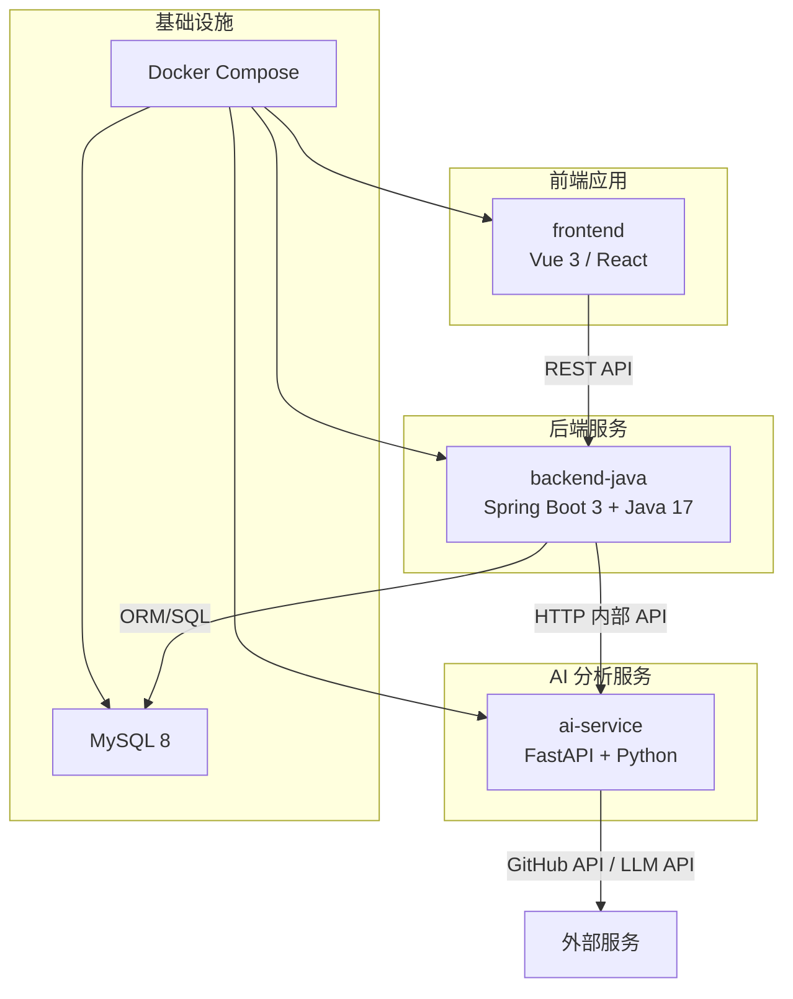
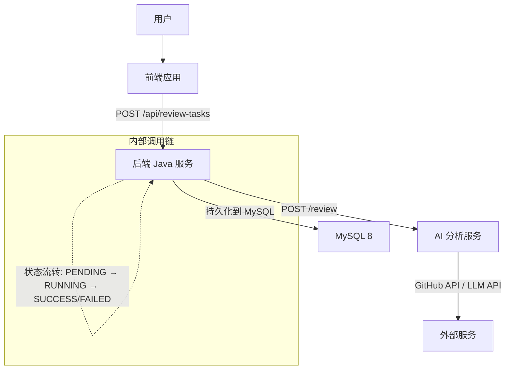
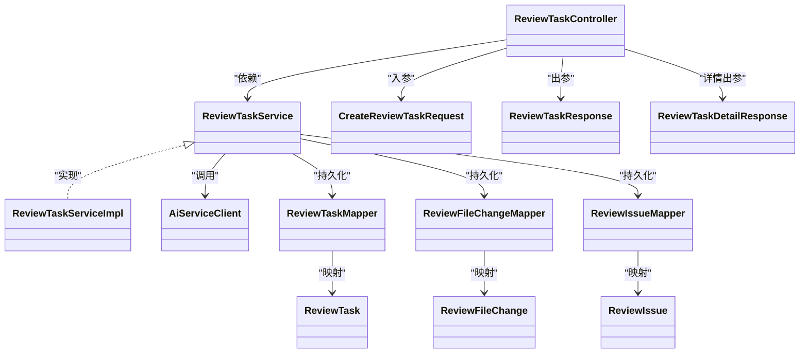
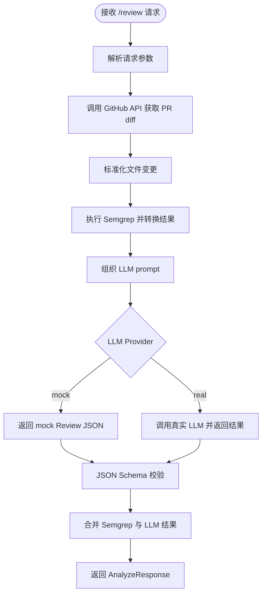
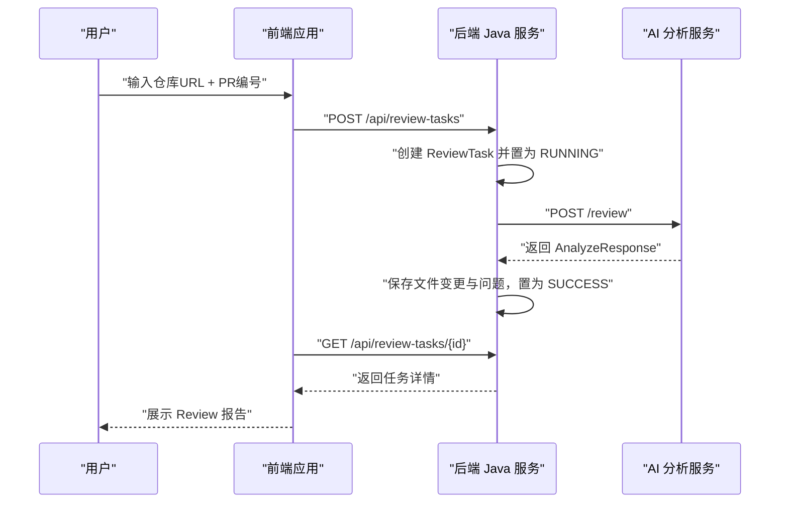
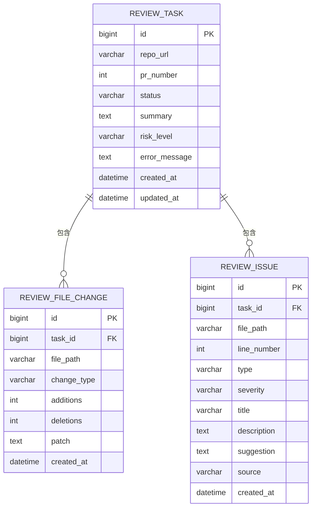
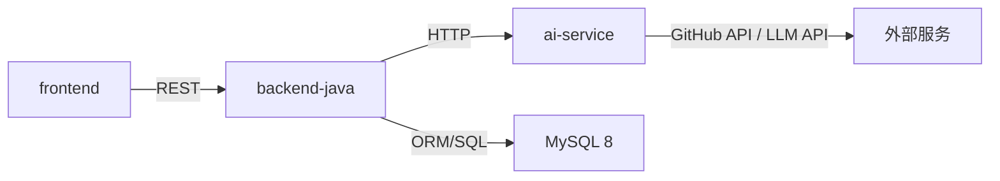

# 技术架构概览

<cite>
**本文引用的文件**
- [README.md](file://README.md)
- [docs/ARCHITECTURE.md](file://docs/ARCHITECTURE.md)
- [docs/PRD.md](file://docs/PRD.md)
- [docs/API.md](file://docs/API.md)
- [docs/DATABASE.md](file://docs/DATABASE.md)
- [backend-java/README.md](file://backend-java/README.md)
- [ai-service/README.md](file://ai-service/README.md)
- [frontend/README.md](file://frontend/README.md)
- [docker-compose.yml](file://docker-compose.yml)
</cite>

## 目录
1. [简介](#简介)
2. [项目结构](#项目结构)
3. [核心组件](#核心组件)
4. [架构总览](#架构总览)
5. [详细组件分析](#详细组件分析)
6. [依赖关系分析](#依赖关系分析)
7. [性能考量](#性能考量)
8. [故障排查指南](#故障排查指南)
9. [结论](#结论)
10. [附录](#附录)

## 简介
本文件为 CodeReviewX 的技术架构概览，基于 Round 01 的规划文档与模块职责边界，系统性阐述微服务架构设计、技术栈选型、模块间通信机制与数据流向，并提供部署拓扑图与组件交互关系图，帮助后续开发遵循一致的设计原则与权衡考虑。

## 项目结构
项目采用按模块划分的多仓库结构，围绕“前端应用 + 后端 Java 服务 + AI 分析服务 + 数据库”四层展开，配合文档驱动的 Agent 协作模式推进开发。

图表来源
- [docs/ARCHITECTURE.md:19-52](file://docs/ARCHITECTURE.md#L19-L52)
- [docker-compose.yml:1-14](file://docker-compose.yml#L1-L14)

章节来源
- [README.md:58-82](file://README.md#L58-L82)
- [docs/ARCHITECTURE.md:19-52](file://docs/ARCHITECTURE.md#L19-L52)
- [docker-compose.yml:1-14](file://docker-compose.yml#L1-L14)

## 核心组件
- 前端应用（frontend）
  - 职责：提供任务创建表单、任务列表与任务详情页，渲染 Review 报告（summary、riskLevel、files、issues）。
  - 限制：仅通过 backend-java 对外暴露 API，不得直接调用 ai-service、GitHub API 或 LLM。
- 后端 Java 服务（backend-java）
  - 职责：对外提供 REST API、编排 ReviewTask 生命周期、调用 ai-service、持久化数据。
  - 限制：不执行 Semgrep、不直接编写 LLM prompt、不解析复杂 diff、不绕过 ai-service 直接调用 LLM。
- AI 分析服务（ai-service）
  - 职责：拉取 GitHub PR diff、标准化文件变更、执行 Semgrep、组织 LLM prompt、校验 JSON、返回统一 AnalyzeResponse。
  - 限制：不直接写 MySQL、不管理 ReviewTask 状态、不向公网暴露业务 API。
- 数据库（MySQL 8）
  - 职责：持久化 ReviewTask、ReviewFileChange、ReviewIssue 等业务数据。
  - 限制：不承担分析逻辑，仅作为数据存储层。

章节来源
- [docs/ARCHITECTURE.md:56-107](file://docs/ARCHITECTURE.md#L56-L107)
- [backend-java/README.md:19-46](file://backend-java/README.md#L19-L46)
- [ai-service/README.md:19-46](file://ai-service/README.md#L19-L46)
- [docs/DATABASE.md:20-134](file://docs/DATABASE.md#L20-L134)

## 架构总览
整体采用“前端 → 后端 → AI → 外部服务”的分层调用链，后端负责编排与持久化，AI 负责分析与聚合，前端仅消费后端提供的统一数据。

图表来源
- [docs/ARCHITECTURE.md:137-181](file://docs/ARCHITECTURE.md#L137-L181)
- [docs/API.md:54-241](file://docs/API.md#L54-L241)

章节来源
- [docs/ARCHITECTURE.md:19-52](file://docs/ARCHITECTURE.md#L19-L52)
- [docs/API.md:1-51](file://docs/API.md#L1-L51)

## 详细组件分析

### 后端 Java 服务（backend-java）
- 技术栈与优势
  - Spring Boot 3 + Java 17：现代化框架生态、强类型与并发支持、良好的可观测性与扩展性。
  - MyBatis-Plus：简化 CRUD、注解映射、分页与条件构造器，降低样板代码。
  - Spring WebClient：声明式 HTTP 客户端，便于与 ai-service 通信。
  - Maven + JUnit 5：构建与测试体系完善。
- 分层设计
  - controller：参数接收与响应封装
  - service：业务流程与事务控制
  - client：调用 ai-service
  - mapper：数据库访问
  - entity/dto/enums/exception/config：数据模型、异常处理与配置
- 数据模型与持久化
  - 使用 MyBatis-Plus 映射 review_task、review_file_change、review_issue，遵循 snake_case → camelCase 的命名映射规则。

图表来源
- [docs/ARCHITECTURE.md:183-230](file://docs/ARCHITECTURE.md#L183-L230)

章节来源
- [backend-java/README.md:28-39](file://backend-java/README.md#L28-L39)
- [docs/ARCHITECTURE.md:183-230](file://docs/ARCHITECTURE.md#L183-L230)
- [docs/DATABASE.md:257-284](file://docs/DATABASE.md#L257-L284)

### AI 分析服务（ai-service）
- 技术栈与优势
  - FastAPI：高性能异步框架、自动生成 OpenAPI 文档、Pydantic 校验。
  - Pydantic v2：强类型请求/响应模型与 JSON Schema 校验。
  - httpx：简洁的 HTTP 客户端，适配 GitHub API。
  - Semgrep：静态分析工具，快速识别常见问题。
  - pytest + uvicorn：测试与 ASGI 服务器。
- 分层设计
  - api：定义 /review 端点
  - services：review_analyzer、github_service、semgrep_service、llm_service
  - schemas：analyze_request、analyze_response
  - validators：JSON 校验
  - utils：repo_parser
- Mock 模式
  - LLM_PROVIDER=mock 返回固定 Review JSON，确保端到端可测试性。

图表来源
- [ai-service/README.md:19-26](file://ai-service/README.md#L19-L26)
- [docs/ARCHITECTURE.md:233-266](file://docs/ARCHITECTURE.md#L233-L266)

章节来源
- [ai-service/README.md:29-40](file://ai-service/README.md#L29-L40)
- [docs/ARCHITECTURE.md:233-266](file://docs/ARCHITECTURE.md#L233-L266)

### 前端应用（frontend）
- 技术栈与优势
  - Vue 3 或 React（TS）：组件化开发、类型安全、生态成熟。
  - Vite：快速冷启动与热更新，提升开发体验。
- 页面与职责
  - 创建任务页：输入 repoUrl + prNumber
  - 任务列表页：展示状态、风险等级、创建时间
  - 任务详情页：展示 summary、riskLevel、files、issues
- 通信边界
  - 仅与 backend-java 通信，不直接访问 ai-service、GitHub API 或 LLM。

图表来源
- [docs/ARCHITECTURE.md:137-181](file://docs/ARCHITECTURE.md#L137-L181)
- [docs/API.md:54-241](file://docs/API.md#L54-L241)

章节来源
- [frontend/README.md:19-39](file://frontend/README.md#L19-L39)
- [docs/API.md:54-241](file://docs/API.md#L54-L241)

### 数据模型与持久化
- 表结构概览
  - review_task：任务主表，包含状态、摘要、风险等级、错误信息等。
  - review_file_change：文件变更表，记录每个任务涉及的文件变更。
  - review_issue：问题表，记录 LLM 与 Semgrep 的问题。
- 枚举与约束
  - TaskStatus、RiskLevel、IssueType、IssueSeverity、ChangeType、IssueSource 等枚举值。
  - 外键约束与索引设计，MyBatis-Plus 注解映射。
- 注意事项
  - patch 字段在 MVP 阶段使用 TEXT，注意超大 diff 的处理策略。

图表来源
- [docs/DATABASE.md:20-134](file://docs/DATABASE.md#L20-L134)

章节来源
- [docs/DATABASE.md:20-134](file://docs/DATABASE.md#L20-L134)
- [docs/DATABASE.md:203-254](file://docs/DATABASE.md#L203-L254)

## 依赖关系分析
- 模块耦合与边界
  - 前端仅依赖后端 API，不直接依赖 AI 服务或外部 API。
  - 后端仅依赖 AI 服务的内部 API，不直接依赖前端或外部 AI/LLM。
  - AI 服务独立于后端与前端，仅依赖 GitHub API 与 LLM API。
- 外部依赖
  - GitHub API：用于获取 PR diff 与变更文件。
  - LLM API：用于生成结构化 Review JSON（支持 mock fallback）。
  - MySQL：持久化业务数据。
- 部署与网络
  - Docker Compose 提供服务编排，各服务通过容器网络互通。

图表来源
- [docs/ARCHITECTURE.md:19-52](file://docs/ARCHITECTURE.md#L19-L52)
- [docker-compose.yml:1-14](file://docker-compose.yml#L1-L14)

章节来源
- [docs/ARCHITECTURE.md:19-52](file://docs/ARCHITECTURE.md#L19-L52)
- [docker-compose.yml:1-14](file://docker-compose.yml#L1-L14)

## 性能考量
- 同步调用优先：MVP 阶段采用同步调用，简化复杂度，便于本地调试与演示。
- Mock fallback：AI 服务优先使用 mock LLM，降低外部依赖带来的延迟与失败率。
- 数据库优化：合理索引（状态、创建时间、严重程度、类型）与字段类型选择，避免超大 diff 导致 TEXT 截断。
- 资源隔离：Docker Compose 下各服务独立容器，便于资源分配与监控。

## 故障排查指南
- 统一错误响应
  - 后端 Java：INVALID_REQUEST、TASK_NOT_FOUND、AI_SERVICE_ERROR、GITHUB_FETCH_FAILED、DATABASE_ERROR、INTERNAL_ERROR。
  - AI 服务：errorCode、message、recoverable。
- 常见失败场景与策略
  - GitHub API 失败：任务置 FAILED，保存 error_message。
  - Semgrep 失败：降级为 warning，不导致任务失败。
  - LLM 失败：使用 mock fallback 或返回空 issues。
  - JSON 校验失败：记录原始输出摘要，不返回未校验结构。
  - 数据库保存失败：任务置 FAILED。
  - ai-service 超时：任务置 FAILED，保存超时原因。

章节来源
- [docs/ARCHITECTURE.md:170-180](file://docs/ARCHITECTURE.md#L170-L180)
- [docs/ARCHITECTURE.md:312-342](file://docs/ARCHITECTURE.md#L312-L342)

## 结论
CodeReviewX 采用“前端 → 后端 → AI → 外部服务”的清晰分层架构，严格模块边界与职责分离，确保 MVP 阶段的可运行性、可演示性与可维护性。通过文档驱动的 Agent 协作与 Docker Compose 部署，为后续 Round 的功能迭代与集成打下坚实基础。

## 附录
- 部署拓扑与端口
  - frontend：3000
  - backend-java：8080
  - ai-service：8000
  - mysql：3306
- 环境变量与配置
  - backend-java：数据源、AI 服务基础地址
  - ai-service：GitHub Token、LLM Provider、Semgrep 超时
  - frontend：VITE_API_BASE_URL

章节来源
- [docs/ARCHITECTURE.md:373-381](file://docs/ARCHITECTURE.md#L373-L381)
- [docs/ARCHITECTURE.md:345-370](file://docs/ARCHITECTURE.md#L345-L370)