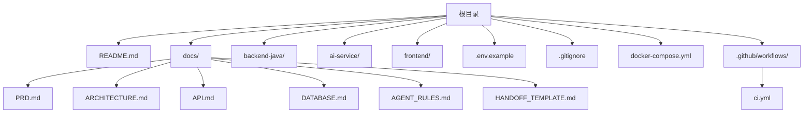
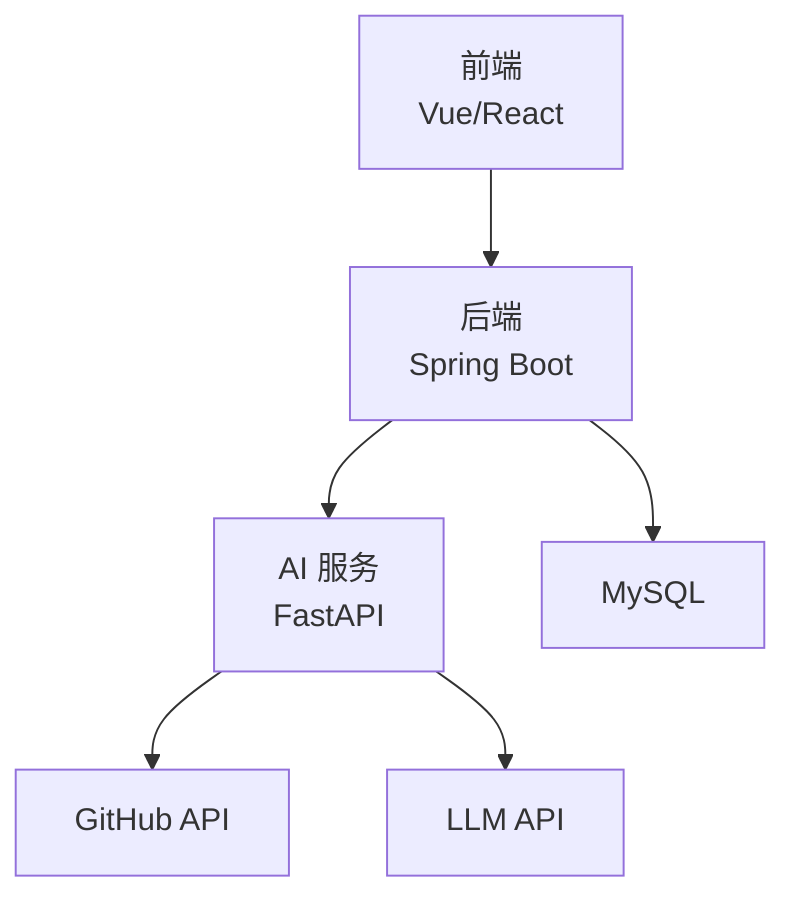
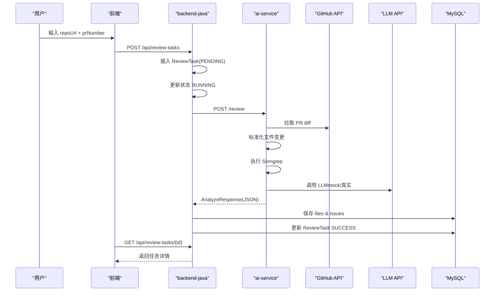
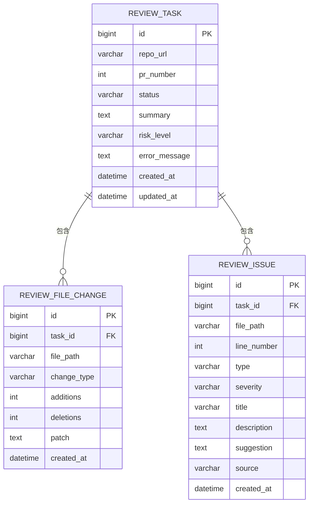
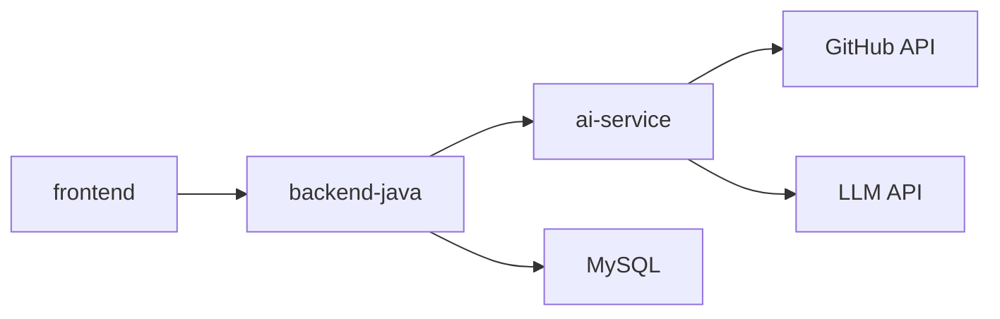
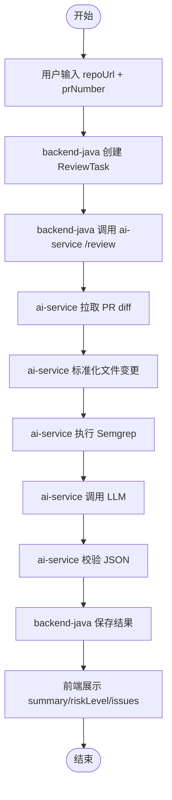

# 核心功能特性

<cite>
**本文引用的文件**
- [README.md](file://README.md)
- [docs/PRD.md](file://docs/PRD.md)
- [docs/ARCHITECTURE.md](file://docs/ARCHITECTURE.md)
- [docs/API.md](file://docs/API.md)
- [docs/DATABASE.md](file://docs/DATABASE.md)
- [docs/AGENT_RULES.md](file://docs/AGENT_RULES.md)
- [docker-compose.yml](file://docker-compose.yml)
- [tasks/round-01/01-cursor-repository-foundation.md](file://tasks/round-01/01-cursor-repository-foundation.md)
- [handoff/round-01/01-cursor-handoff.md](file://handoff/round-01/01-cursor-handoff.md)
</cite>

## 目录
1. [简介](#简介)
2. [项目结构](#项目结构)
3. [核心组件](#核心组件)
4. [架构总览](#架构总览)
5. [详细组件分析](#详细组件分析)
6. [依赖关系分析](#依赖关系分析)
7. [性能考量](#性能考量)
8. [故障排查指南](#故障排查指南)
9. [结论](#结论)
10. [附录](#附录)

## 简介
CodeReviewX 是面向 GitHub Pull Request 的智能代码审查与修复建议系统。其目标是在用户输入仓库地址与 PR 编号后，自动获取 PR diff，结合 Semgrep 静态分析与 LLM 生成结构化 Review 报告，并通过 Web 界面进行展示。本仓库为第一轮工程骨架与文档准备阶段，明确了模块边界、调用链路、数据模型与 API 设计，为后续各轮迭代实现打下基础。

## 项目结构
仓库采用按模块划分的目录结构，配合完善的文档体系与协作规则，确保各 Agent 在受控范围内推进开发。

图表来源
- [README.md:58-82](file://README.md#L58-L82)
- [docs/PRD.md:1-218](file://docs/PRD.md#L1-L218)
- [docs/ARCHITECTURE.md:19-52](file://docs/ARCHITECTURE.md#L19-L52)
- [docker-compose.yml:1-14](file://docker-compose.yml#L1-L14)

章节来源
- [README.md:58-82](file://README.md#L58-L82)
- [docs/PRD.md:1-218](file://docs/PRD.md#L1-L218)
- [docs/ARCHITECTURE.md:19-52](file://docs/ARCHITECTURE.md#L19-L52)
- [docker-compose.yml:1-14](file://docker-compose.yml#L1-L14)

## 核心组件
- backend-java：Spring Boot 3 + Java 17，负责 REST API、任务生命周期编排、MySQL 持久化、调用 ai-service。
- ai-service：Python + FastAPI，负责拉取 GitHub PR diff、标准化文件变更、执行 Semgrep、组织 LLM prompt、校验 JSON 并返回统一 AnalyzeResponse。
- frontend：Vue 3 或 React，负责任务创建表单、任务列表、任务详情与报告展示。
- MySQL：持久化任务、文件变更与问题条目。

章节来源
- [docs/PRD.md:47-54](file://docs/PRD.md#L47-L54)
- [docs/ARCHITECTURE.md:56-107](file://docs/ARCHITECTURE.md#L56-L107)

## 架构总览
系统采用“前端 -> 后端 -> AI 服务 -> GitHub API/LLM”的分层调用链路，严格限制模块职责边界，确保第一阶段不引入复杂中间件与分布式组件。

图表来源
- [docs/ARCHITECTURE.md:19-52](file://docs/ARCHITECTURE.md#L19-L52)
- [docs/ARCHITECTURE.md:345-370](file://docs/ARCHITECTURE.md#L345-L370)

章节来源
- [docs/ARCHITECTURE.md:7-16](file://docs/ARCHITECTURE.md#L7-L16)
- [docs/ARCHITECTURE.md:19-52](file://docs/ARCHITECTURE.md#L19-L52)

## 详细组件分析

### 智能代码审查流程（MVP）
- 用户输入仓库地址与 PR 编号。
- backend-java 创建 ReviewTask，状态从 PENDING 切换到 RUNNING。
- backend-java 调用 ai-service 的 /review 接口。
- ai-service 拉取 GitHub PR diff，标准化文件变更，执行 Semgrep，调用 mock/真实 LLM，校验 JSON，返回 AnalyzeResponse。
- backend-java 保存文件变更与问题条目，更新 ReviewTask 状态为 SUCCESS。
- 用户通过前端查看 summary、riskLevel 与 issues 列表。

图表来源
- [docs/PRD.md:32-52](file://docs/PRD.md#L32-L52)
- [docs/ARCHITECTURE.md:137-180](file://docs/ARCHITECTURE.md#L137-L180)
- [docs/API.md:54-241](file://docs/API.md#L54-L241)
- [docs/API.md:243-332](file://docs/API.md#L243-L332)

章节来源
- [docs/PRD.md:32-52](file://docs/PRD.md#L32-L52)
- [docs/ARCHITECTURE.md:137-180](file://docs/ARCHITECTURE.md#L137-L180)
- [docs/API.md:54-241](file://docs/API.md#L54-L241)
- [docs/API.md:243-332](file://docs/API.md#L243-L332)

### GitHub PR diff 获取
- ai-service 解析 repoUrl，调用 GitHub API 获取 PR 信息与 diff。
- 标准化文件变更，记录 filePath、changeType、additions、deletions、patch。
- 若 GitHub API 失败，任务标记 FAILED 并保存 error_message。

章节来源
- [docs/ARCHITECTURE.md:90-107](file://docs/ARCHITECTURE.md#L90-L107)
- [docs/API.md:243-332](file://docs/API.md#L243-L332)

### Semgrep 静态分析
- ai-service 调用 Semgrep 执行静态分析，将结果转换为统一的 ReviewIssue。
- Semgrep 失败通常降级为 warning，不强制导致任务 FAILED。

章节来源
- [docs/ARCHITECTURE.md:90-107](file://docs/ARCHITECTURE.md#L90-L107)
- [docs/ARCHITECTURE.md:170-179](file://docs/ARCHITECTURE.md#L170-L179)

### LLM 结构化审查报告生成
- ai-service 组织 prompt，调用 mock 或真实 LLM，校验 JSON schema，返回 AnalyzeResponse。
- LLM 失败优先使用 mock fallback，fallback 失败后任务标记 FAILED。

章节来源
- [docs/ARCHITECTURE.md:90-107](file://docs/ARCHITECTURE.md#L90-L107)
- [docs/ARCHITECTURE.md:170-179](file://docs/ARCHITECTURE.md#L170-L179)

### Web 界面展示
- 前端提供任务创建、列表与详情页面，展示 summary、riskLevel、files 与 issues。
- 前端仅调用 backend-java，不直接访问 ai-service、GitHub API 或 LLM。

章节来源
- [docs/ARCHITECTURE.md:56-72](file://docs/ARCHITECTURE.md#L56-L72)
- [docs/API.md:54-241](file://docs/API.md#L54-L241)

### 数据模型与持久化
- review_task：任务元信息、状态与摘要。
- review_file_change：PR 文件变更明细。
- review_issue：问题条目，包含类型、严重程度、来源等。

图表来源
- [docs/DATABASE.md:22-134](file://docs/DATABASE.md#L22-L134)

章节来源
- [docs/DATABASE.md:22-134](file://docs/DATABASE.md#L22-L134)

### API 设计与错误处理
- backend-java 对外提供 REST API：创建任务、查询列表、查询详情。
- ai-service 对内提供 /review 接口，返回 AnalyzeResponse。
- 统一错误响应格式，包含错误码与人类可读信息。

章节来源
- [docs/API.md:9-51](file://docs/API.md#L9-L51)
- [docs/API.md:54-241](file://docs/API.md#L54-L241)
- [docs/API.md:243-332](file://docs/API.md#L243-L332)

## 依赖关系分析
- 模块耦合与边界
  - frontend 仅依赖 backend-java，不直接访问 ai-service、GitHub API 或 LLM。
  - backend-java 仅负责编排与持久化，不执行 Semgrep、不直接编写 LLM prompt。
  - ai-service 仅负责 GitHub 数据获取、Semgrep 与 LLM 分析，不直接写数据库。
- 外部依赖
  - GitHub API：用于获取 PR 信息与 diff。
  - LLM API：用于生成结构化 Review JSON。
  - MySQL：用于持久化任务与结果。

图表来源
- [docs/ARCHITECTURE.md:56-107](file://docs/ARCHITECTURE.md#L56-L107)

章节来源
- [docs/ARCHITECTURE.md:56-107](file://docs/ARCHITECTURE.md#L56-L107)

## 性能考量
- 本地可运行优先：所有服务优先保证本地可运行、可调试、可演示。
- 同步调用为主：MVP 阶段采用同步调用，避免引入消息队列与异步复杂度。
- 降级策略：Semgrep 与 LLM 失败时采用降级处理，确保任务不阻塞。

章节来源
- [docs/ARCHITECTURE.md:7-16](file://docs/ARCHITECTURE.md#L7-L16)
- [docs/ARCHITECTURE.md:170-179](file://docs/ARCHITECTURE.md#L170-L179)

## 故障排查指南
- 常见失败场景与处理策略
  - GitHub API 失败：任务状态 FAILED，保存 error_message。
  - Semgrep 失败：降级为 warning，不导致任务失败。
  - LLM 失败：使用 mock fallback 或返回空 issues。
  - LLM JSON schema 校验失败：记录原始输出摘要，不返回未校验结构。
  - backend 数据库保存失败：任务状态 FAILED。
  - ai-service 超时：任务状态 FAILED，保存超时原因。
- 统一错误响应
  - backend-java：INVALID_REQUEST、TASK_NOT_FOUND、AI_SERVICE_ERROR、GITHUB_FETCH_FAILED、DATABASE_ERROR、INTERNAL_ERROR。
  - ai-service：GITHUB_FETCH_FAILED、PR_NOT_FOUND、SEMGREP_FAILED、LLM_FAILED、INVALID_REQUEST。

章节来源
- [docs/ARCHITECTURE.md:170-180](file://docs/ARCHITECTURE.md#L170-L180)
- [docs/ARCHITECTURE.md:312-342](file://docs/ARCHITECTURE.md#L312-L342)
- [docs/API.md:41-51](file://docs/API.md#L41-L51)
- [docs/API.md:323-332](file://docs/API.md#L323-L332)

## 结论
本仓库完成了 CodeReviewX 的工程骨架与文档体系搭建，明确了模块边界、调用链路、数据模型与 API 设计。MVP 阶段强调“文档先行、MVP 优先、Mock 先行”，为后续各轮实现打下坚实基础。下一阶段将围绕 Round 02~06 的迭代计划逐步落地业务逻辑。

## 附录

### MVP 功能清单
- F1：ReviewTask 创建
- F2：ReviewTask 查询
- F3：GitHub PR diff 拉取
- F4：PR 文件变更保存
- F5：ai-service mock review result
- F6：Semgrep 静态分析集成
- F7：LLM 结构化 Review JSON
- F8：前端 Review 报告展示
- F9：Docker Compose 本地启动
- F10：GitHub Actions 基础 CI
- F11：文档与演示材料

章节来源
- [docs/PRD.md:56-71](file://docs/PRD.md#L56-L71)

### 后续迭代计划（基于 Round 进度）
- Round 02：backend-java 骨架
- Round 03：ai-service mock 流水线
- Round 04：GitHub PR diff 集成
- Round 05：Semgrep + LLM 集成
- Round 06：前端 + Docker + CI + 文档

章节来源
- [README.md:110-120](file://README.md#L110-L120)

### 使用流程图（概念示意）

图表来源
- [docs/PRD.md:32-52](file://docs/PRD.md#L32-L52)
- [docs/ARCHITECTURE.md:137-180](file://docs/ARCHITECTURE.md#L137-L180)