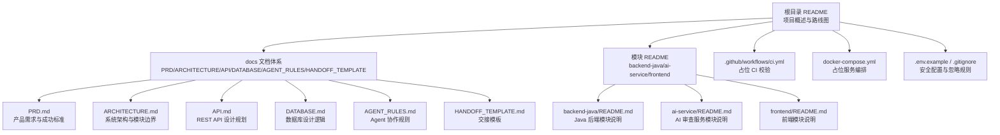
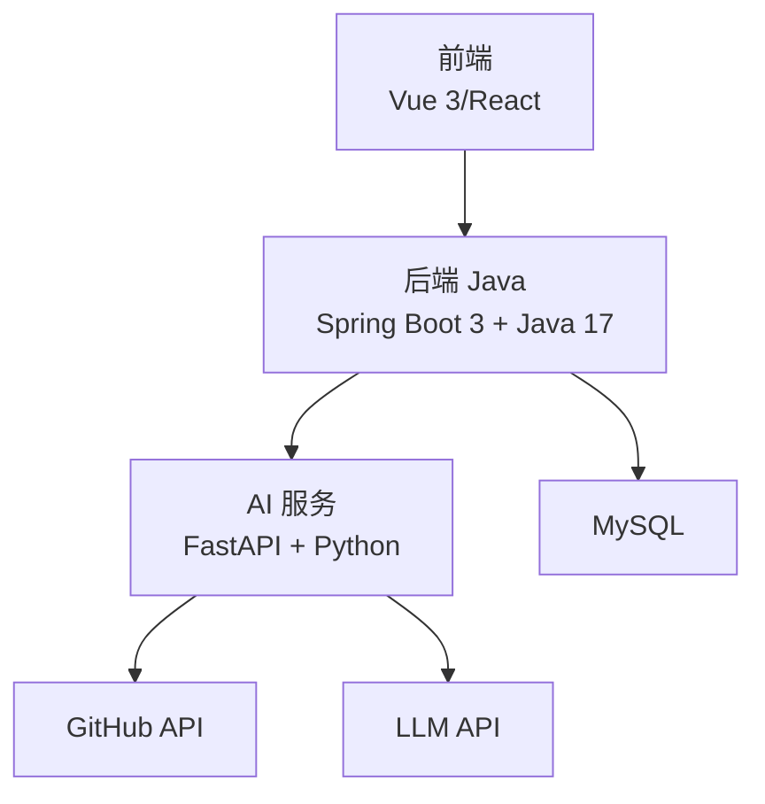
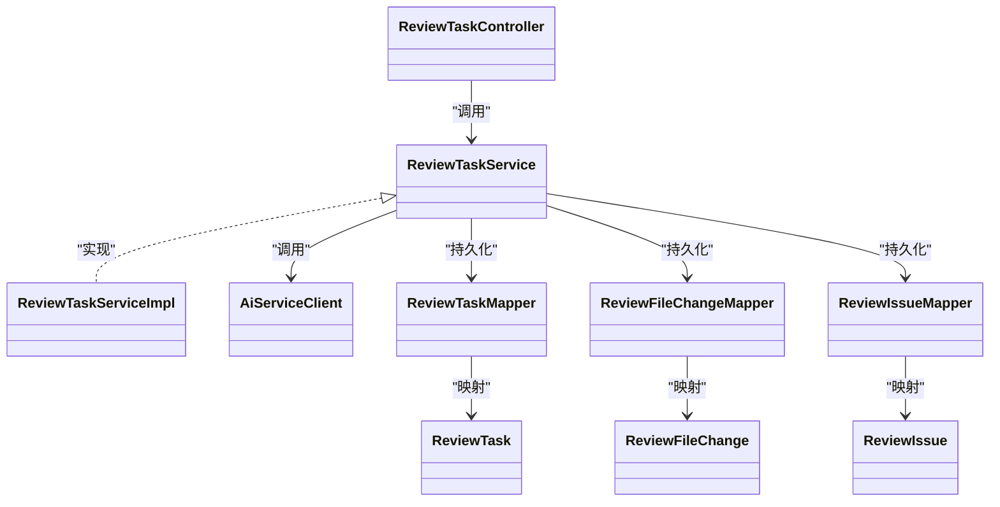
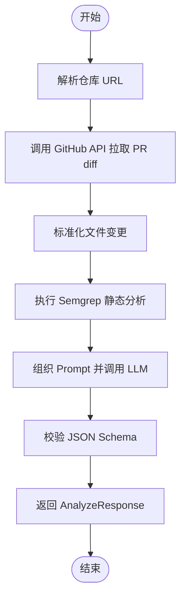
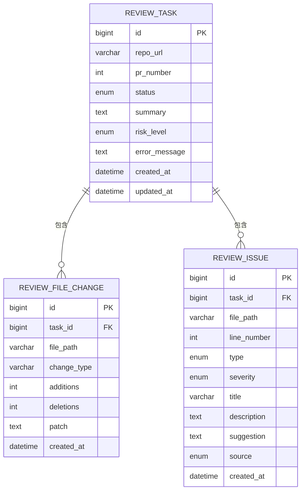
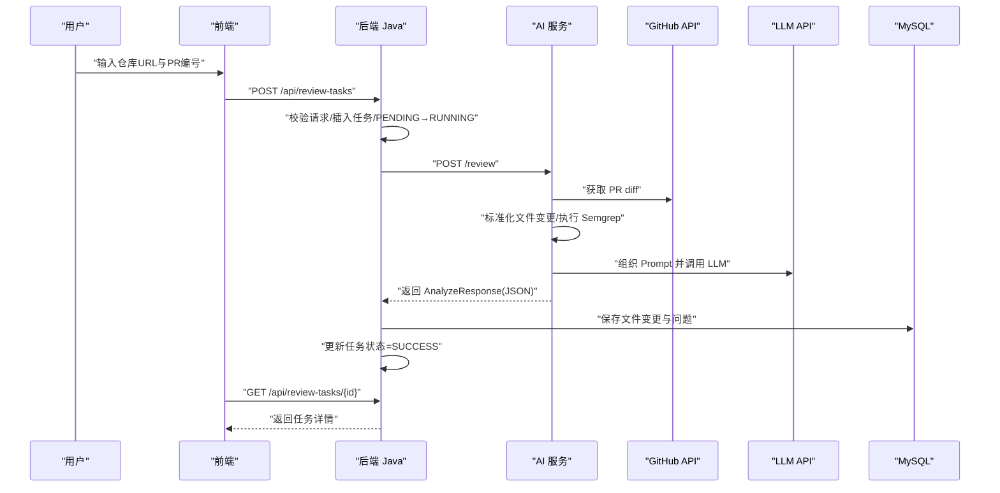
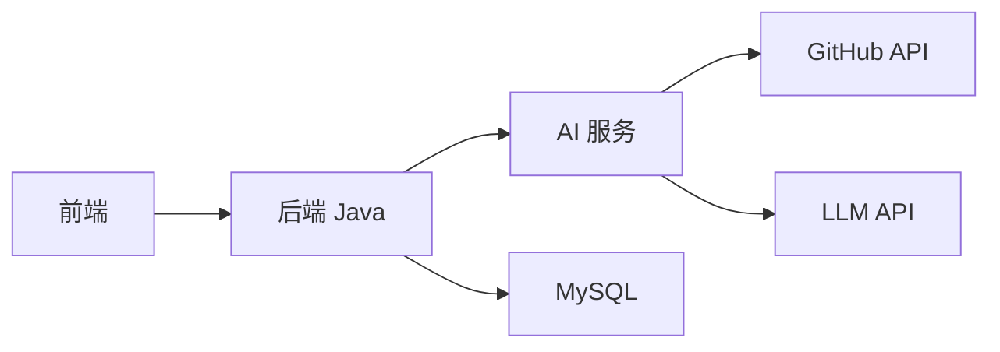

# 项目介绍

<cite>
**本文引用的文件**
- [README.md](file://README.md)
- [docs/PRD.md](file://docs/PRD.md)
- [docs/ARCHITECTURE.md](file://docs/ARCHITECTURE.md)
- [docs/AGENT_RULES.md](file://docs/AGENT_RULES.md)
- [.github/workflows/ci.yml](file://.github/workflows/ci.yml)
- [docker-compose.yml](file://docker-compose.yml)
- [ai-service/README.md](file://ai-service/README.md)
- [backend-java/README.md](file://backend-java/README.md)
- [tasks/round-01/01-cursor-repository-foundation.md](file://tasks/round-01/01-cursor-repository-foundation.md)
- [handoff/round-01/01-cursor-handoff.md](file://handoff/round-01/01-cursor-handoff.md)
</cite>

## 目录
1. [引言](#引言)
2. [项目结构](#项目结构)
3. [核心组件](#核心组件)
4. [架构总览](#架构总览)
5. [详细组件分析](#详细组件分析)
6. [依赖关系分析](#依赖关系分析)
7. [性能考量](#性能考量)
8. [故障排查指南](#故障排查指南)
9. [结论](#结论)
10. [附录](#附录)

## 引言
CodeReviewX 是一个面向 GitHub Pull Request 的智能代码审查与修复建议 Agent 系统。其核心价值在于：将“PR diff + 静态分析 + 大模型”三者有机结合，形成可重复、可演示、可落地的自动化审查流水线，帮助开发者在提交 PR 后快速获得结构化 Review 报告，显著降低人工审查成本、提升代码质量与开发效率。

在当前实践中，开发者在代码评审阶段普遍面临如下痛点：
- 手工逐行审阅耗时长，易遗漏潜在 Bug、安全风险与性能问题；
- 缺乏系统化、可复现的静态分析与 LLM 结合的自动化流程；
- PR diff 信息量大，人工分析效率低。

CodeReviewX 的 MVP 目标是：用户输入 GitHub 仓库地址与 PR 编号，系统自动拉取 PR diff、执行 Semgrep 静态分析、调用 LLM 生成结构化 Review JSON，并在前端展示 summary、风险等级与问题清单，从而将“发现问题—给出建议—可视化呈现”的闭环能力前置到 PR 提交阶段。

## 项目结构
项目采用多模块分层与文档驱动的工程化方式，围绕“文档先行、MVP 优先、Mock 先行、边界清晰”的原则构建。当前 Round 01 为“工程骨架与文档系统”，未包含任何业务代码，确保后续各轮次的实现严格受控。

图表来源
- [README.md:1-120](file://README.md#L1-L120)
- [docs/PRD.md:1-218](file://docs/PRD.md#L1-L218)
- [docs/ARCHITECTURE.md:1-417](file://docs/ARCHITECTURE.md#L1-L417)
- [.github/workflows/ci.yml:1-58](file://.github/workflows/ci.yml#L1-L58)
- [docker-compose.yml:1-14](file://docker-compose.yml#L1-L14)

章节来源
- [README.md:58-82](file://README.md#L58-L82)
- [docs/PRD.md:11-23](file://docs/PRD.md#L11-L23)
- [docs/ARCHITECTURE.md:19-52](file://docs/ARCHITECTURE.md#L19-L52)

## 核心组件
- 后端服务（backend-java）
  - 角色：业务编排与数据持久化，提供 REST API，调用 AI 服务，管理 ReviewTask 生命周期。
  - 职责边界：不直接执行 Semgrep、不编写 LLM Prompt、不解析复杂 diff、不绕过 AI 服务直连 LLM。
- AI 审查服务（ai-service）
  - 角色：拉取 GitHub PR diff、标准化文件变更、执行 Semgrep、组织 LLM Prompt、校验 JSON、合并结果。
  - 职责边界：不直接写数据库、不管理任务状态、不对前端暴露业务 API、不持有用户会话。
- 前端（frontend）
  - 角色：任务创建、任务列表、任务详情与报告展示，仅调用后端 API。
  - 职责边界：不直接调用 AI 服务、GitHub API 或 LLM。
- 数据库（MySQL）
  - 角色：存储 ReviewTask、文件变更与问题记录，不承担分析逻辑。
- CI/部署（CI、Docker Compose）
  - 角色：占位 CI 校验与服务编排，后续轮次逐步完善。

章节来源
- [docs/ARCHITECTURE.md:73-107](file://docs/ARCHITECTURE.md#L73-L107)
- [docs/ARCHITECTURE.md:183-266](file://docs/ARCHITECTURE.md#L183-L266)
- [backend-java/README.md:19-46](file://backend-java/README.md#L19-L46)
- [ai-service/README.md:19-47](file://ai-service/README.md#L19-L47)

## 架构总览
系统采用“前端 → 后端 → AI 服务 → GitHub API/LLM”的分层调用链，强调职责分离与边界清晰。第一阶段不引入 Redis、消息队列、Kubernetes、向量数据库等复杂组件，确保本地可运行、可调试、可演示。

图表来源
- [docs/ARCHITECTURE.md:19-52](file://docs/ARCHITECTURE.md#L19-L52)
- [docs/ARCHITECTURE.md:345-370](file://docs/ARCHITECTURE.md#L345-L370)

章节来源
- [docs/ARCHITECTURE.md:7-16](file://docs/ARCHITECTURE.md#L7-L16)
- [docs/ARCHITECTURE.md:137-181](file://docs/ARCHITECTURE.md#L137-L181)

## 详细组件分析

### 后端 Java（backend-java）
- 分层设计：controller/service/client/mapper/entity/dto/enums/exception/config，职责清晰、边界明确。
- 核心职责：任务创建与状态管理、调用 AI 服务、持久化文件变更与问题、对外提供 REST API。
- 错误处理：统一错误响应格式，涵盖无效请求、任务不存在、AI 服务错误、GitHub 获取失败、数据库错误、内部错误等。

图表来源
- [docs/ARCHITECTURE.md:183-230](file://docs/ARCHITECTURE.md#L183-L230)

章节来源
- [docs/ARCHITECTURE.md:183-230](file://docs/ARCHITECTURE.md#L183-L230)
- [backend-java/README.md:19-46](file://backend-java/README.md#L19-L46)

### AI 审查服务（ai-service）
- 职责边界：仅负责 GitHub 数据获取、Semgrep 执行、LLM 分析与 JSON 校验，不直接写数据库或管理任务状态。
- 技术栈：Python 3.11、FastAPI、Pydantic、httpx、Semgrep、pytest、uvicorn。
- Mock 模式：在 Round 03 引入 mock LLM，确保端到端链路可测试，无需真实 API Key。

图表来源
- [ai-service/README.md:19-26](file://ai-service/README.md#L19-L26)
- [docs/ARCHITECTURE.md:233-266](file://docs/ARCHITECTURE.md#L233-L266)

章节来源
- [ai-service/README.md:19-47](file://ai-service/README.md#L19-L47)
- [docs/ARCHITECTURE.md:233-266](file://docs/ARCHITECTURE.md#L233-L266)

### 前端（frontend）
- 职责边界：仅调用后端 API，不直接对接 GitHub API 或 LLM。
- 计划能力：任务创建表单、任务列表、任务详情与报告展示（summary、riskLevel、files、issues）。

章节来源
- [docs/ARCHITECTURE.md:58-72](file://docs/ARCHITECTURE.md#L58-L72)
- [frontend/README.md:19-425](file://frontend/README.md#L19-L425)

### 数据模型（ReviewTask/ReviewFileChange/ReviewIssue）
- ReviewTask：任务元数据、状态、风险等级、摘要与错误信息。
- ReviewFileChange：文件变更详情（路径、变更类型、增删行数、diff 片段）。
- ReviewIssue：问题条目（类型、严重程度、标题、描述、修复建议、来源）。

图表来源
- [docs/PRD.md:127-169](file://docs/PRD.md#L127-L169)

章节来源
- [docs/PRD.md:125-169](file://docs/PRD.md#L125-L169)

### 调用链路与状态流转
- 创建并执行任务：前端 → 后端 → AI 服务 → GitHub API/LLM → 后端落库 → 前端展示。
- 失败链路：GitHub API 失败、Semgrep 失败、LLM 失败、JSON 校验失败、数据库保存失败、AI 服务超时等均有明确处理策略。
- 状态流转：PENDING → RUNNING → SUCCESS 或 FAILED，状态单向流转，失败需记录可读错误原因。

图表来源
- [docs/ARCHITECTURE.md:139-169](file://docs/ARCHITECTURE.md#L139-L169)
- [docs/ARCHITECTURE.md:170-180](file://docs/ARCHITECTURE.md#L170-L180)
- [docs/PRD.md:32-52](file://docs/PRD.md#L32-L52)

章节来源
- [docs/ARCHITECTURE.md:110-134](file://docs/ARCHITECTURE.md#L110-L134)
- [docs/PRD.md:172-178](file://docs/PRD.md#L172-L178)

## 依赖关系分析
- 模块耦合与内聚
  - 后端与 AI 服务通过 REST API 耦合，职责清晰：后端负责编排与持久化，AI 服务负责数据获取与分析。
  - 前端仅依赖后端 API，避免直接耦合底层分析能力。
- 外部依赖与集成点
  - GitHub API：用于获取 PR diff 与变更文件列表。
  - LLM API：用于生成结构化 Review JSON（当前 Round 03 引入 mock）。
  - Semgrep：用于静态分析，输出可被标准化的问题集合。
- 循环依赖
  - 无直接循环依赖，调用方向单一：前端 → 后端 → AI 服务 → 外部服务。
- 接口契约
  - AnalyzeResponse 标准 JSON 结构在架构文档中明确定义，确保前后端契约稳定。

图表来源
- [docs/ARCHITECTURE.md:19-52](file://docs/ARCHITECTURE.md#L19-L52)
- [docs/ARCHITECTURE.md:269-309](file://docs/ARCHITECTURE.md#L269-L309)

章节来源
- [docs/ARCHITECTURE.md:269-309](file://docs/ARCHITECTURE.md#L269-L309)

## 性能考量
- 同步调用优先：MVP 阶段采用同步调用，简化复杂度，便于本地演示与调试。
- Mock 先行：在 Round 03 引入 mock LLM，避免真实 LLM 的网络与延迟开销，确保端到端链路稳定。
- 降级策略：Semgrep 失败不导致任务失败，记录 warning；LLM 失败优先使用 mock fallback。
- 资源占用：第一阶段不引入 Redis、消息队列、Kubernetes 等，降低资源与运维复杂度。

章节来源
- [docs/ARCHITECTURE.md:131-133](file://docs/ARCHITECTURE.md#L131-L133)
- [docs/ARCHITECTURE.md:407-417](file://docs/ARCHITECTURE.md#L407-L417)

## 故障排查指南
- 常见错误与处理
  - 任务不存在：检查任务 ID 是否正确，确认后端 API 路径。
  - 请求参数错误：核对仓库 URL 与 PR 编号格式。
  - AI 服务调用失败：检查 AI 服务健康状态与网络连通性。
  - GitHub 数据获取失败：检查 GITHUB_TOKEN 与仓库可见性。
  - 数据库操作失败：检查连接字符串与数据库可用性。
  - 未知系统错误：查看后端日志与统一错误响应。
- CI 校验
  - Round 01 CI 仅进行仓库结构检查与“无业务源码”校验，确保 Scope 控制到位。

章节来源
- [docs/ARCHITECTURE.md:312-342](file://docs/ARCHITECTURE.md#L312-L342)
- [.github/workflows/ci.yml:14-58](file://.github/workflows/ci.yml#L14-L58)

## 结论
CodeReviewX 通过“文档驱动 + Agent 协作 + 清晰边界”的方式，在 Round 01 建立了可演示、可扩展的工程骨架。其核心价值在于：将 PR diff、Semgrep 静态分析与 LLM 结合，形成结构化 Review 报告，显著降低人工审阅成本、提升代码质量与开发效率。随着后续轮次逐步完善后端、AI 服务、前端与部署，CodeReviewX 将成为一套可落地、可展示、可写入简历的 MVP 作品集系统。

## 附录

### 目标用户群体
- MVP 阶段目标用户
  - 项目展示者：计算机专业学生，用于作品集、简历、面试和技术讲解。
  - 开发者用户：输入 GitHub 仓库地址与 PR 编号，查看系统生成的代码审查报告。
- 非目标用户（MVP 阶段）
  - 企业管理员、多团队组织、需要复杂权限管理的企业用户、需要自动修复合并能力的高级用户。

章节来源
- [docs/PRD.md:74-89](file://docs/PRD.md#L74-L89)

### 使用场景与预期收益
- 使用场景
  - 开发者在提交 PR 后，通过系统自动生成结构化 Review 报告，快速定位潜在问题。
  - 技术负责人在团队评审前，预览风险等级与问题清单，优化评审效率。
  - 代码审查团队在批量审阅时，借助系统提供的统一格式与建议，提升一致性与覆盖面。
- 预期收益
  - 提高代码质量：通过静态分析与 LLM 建议，提前发现 Bug、安全与性能问题。
  - 减少人工审查成本：自动化流程替代部分手工审阅，缩短评审周期。
  - 提升开发效率：结构化报告与修复建议帮助开发者快速定位与修复问题。

章节来源
- [docs/PRD.md:26-31](file://docs/PRD.md#L26-L31)
- [docs/PRD.md:92-101](file://docs/PRD.md#L92-L101)

### 技术创新点与竞争优势
- 创新点
  - PR 场景专用：聚焦 GitHub PR，将 diff、Semgrep 与 LLM 一体化，形成可复现的自动化审查流水线。
  - 文档驱动工程：以 PRD、架构、API、数据库、Agent 规则与交接模板为核心，确保实现可控、可审计。
  - Mock 先行策略：在 Round 03 引入 mock LLM，确保端到端链路可测试，降低真实 LLM 的接入门槛。
- 竞争优势
  - MVP 快速交付：6 周内完成可运行、可展示、可写入简历的 MVP，适合作品集与面试场景。
  - 边界清晰：模块职责明确，避免过度设计，便于演示与维护。
  - 安全与合规：严格的 Agent 协作规则与配置规范，防止敏感信息泄露与越权行为。

章节来源
- [docs/PRD.md:192-206](file://docs/PRD.md#L192-L206)
- [docs/AGENT_RULES.md:22-32](file://docs/AGENT_RULES.md#L22-L32)
- [docs/ARCHITECTURE.md:13-16](file://docs/ARCHITECTURE.md#L13-L16)

### Round 进度与里程碑
- Round 01：工程骨架与文档系统（已完成）
- Round 02：后端骨架（待定）
- Round 03：AI 服务 Mock 管线（待定）
- Round 04：GitHub PR diff 集成（待定）
- Round 05：Semgrep + LLM 集成（待定）
- Round 06：前端 + Docker + CI + 文档（待定）

章节来源
- [README.md:110-120](file://README.md#L110-L120)
- [tasks/round-01/01-cursor-repository-foundation.md:64-84](file://tasks/round-01/01-cursor-repository-foundation.md#L64-L84)