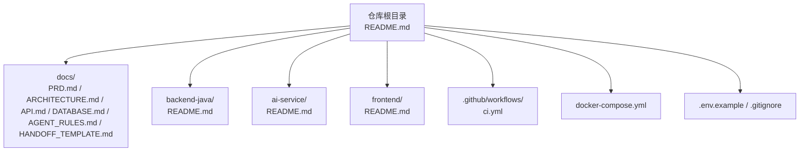
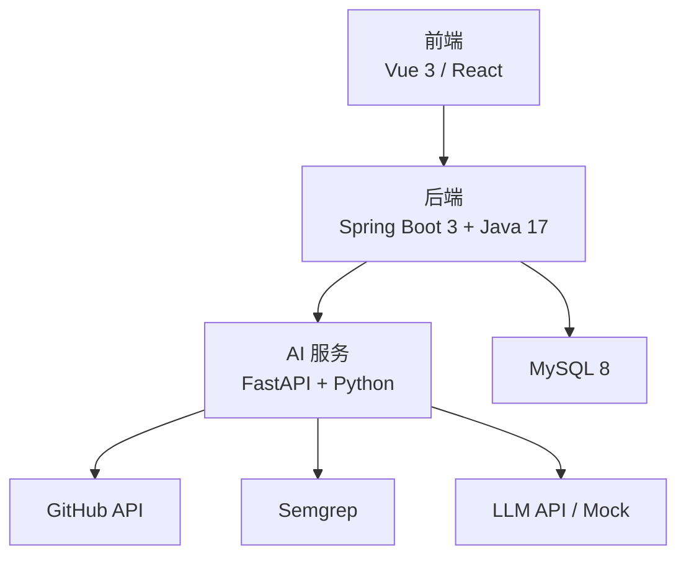
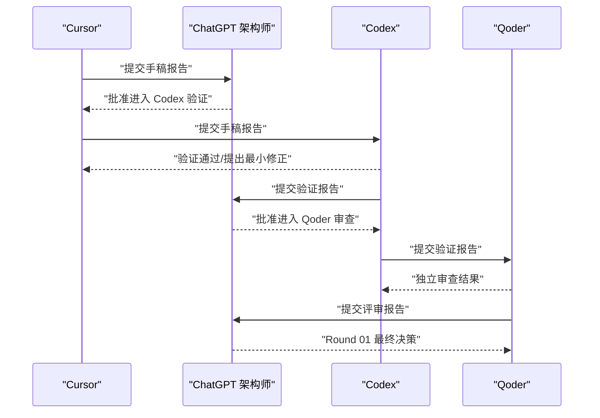
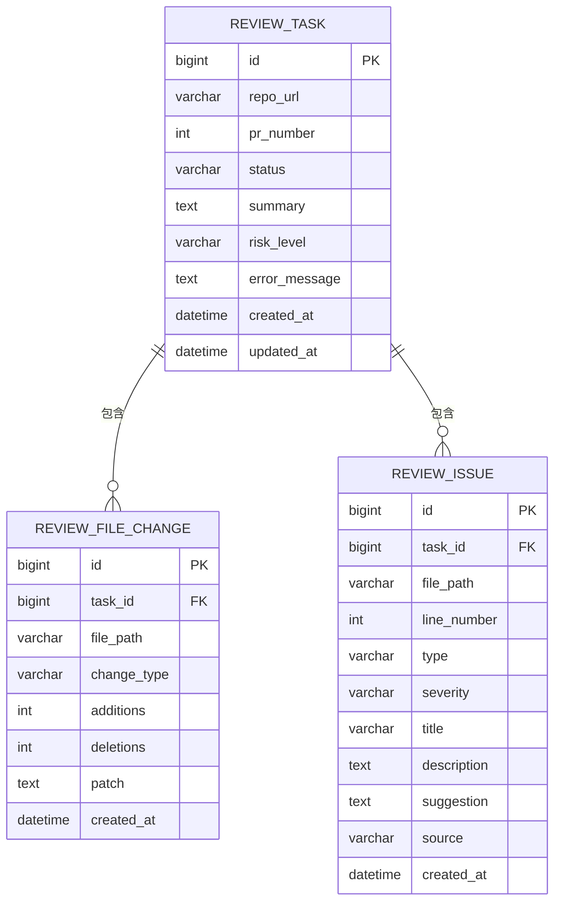
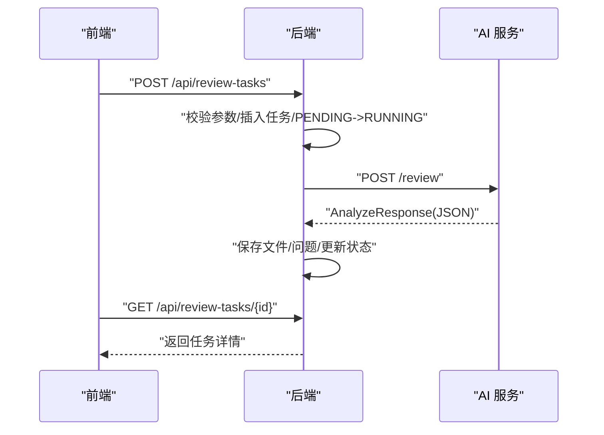
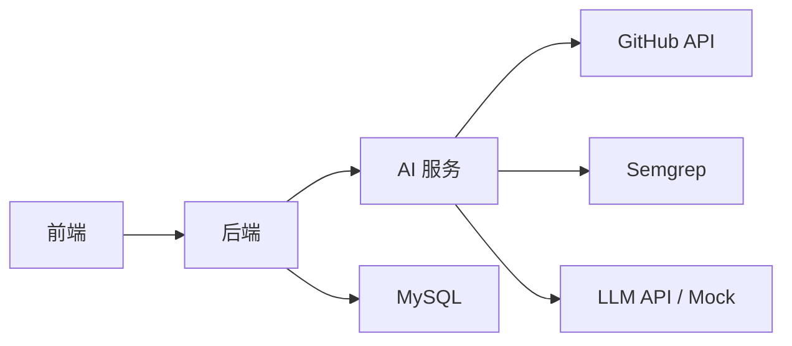

# 项目概述

<cite>
**本文引用的文件**
- [README.md](file://README.md)
- [docs/PRD.md](file://docs/PRD.md)
- [docs/ARCHITECTURE.md](file://docs/ARCHITECTURE.md)
- [docs/API.md](file://docs/API.md)
- [docs/DATABASE.md](file://docs/DATABASE.md)
- [docs/AGENT_RULES.md](file://docs/AGENT_RULES.md)
- [docs/HANDOFF_TEMPLATE.md](file://docs/HANDOFF_TEMPLATE.md)
- [backend-java/README.md](file://backend-java/README.md)
- [ai-service/README.md](file://ai-service/README.md)
- [frontend/README.md](file://frontend/README.md)
- [docker-compose.yml](file://docker-compose.yml)
- [tasks/round-01/01-cursor-repository-foundation.md](file://tasks/round-01/01-cursor-repository-foundation.md)
- [tasks/round-01/02-codex-repository-validation.md](file://tasks/round-01/02-codex-repository-validation.md)
- [tasks/round-01/03-qoder-independent-review.md](file://tasks/round-01/03-qoder-independent-review.md)
</cite>

## 目录
1. [简介](#简介)
2. [项目结构](#项目结构)
3. [核心组件](#核心组件)
4. [架构总览](#架构总览)
5. [详细组件分析](#详细组件分析)
6. [依赖关系分析](#依赖关系分析)
7. [性能考量](#性能考量)
8. [故障排查指南](#故障排查指南)
9. [结论](#结论)
10. [附录](#附录)

## 简介
CodeReviewX 是一个面向 GitHub Pull Request 的智能代码审查与修复建议 Agent 平台。其核心价值在于通过“文档驱动 + 多 Agent 协作”的方式，在 MVP 阶段快速构建可演示、可扩展的审查流水线：用户输入仓库地址与 PR 编号，系统自动拉取 PR diff、执行静态分析（Semgrep）、调用 LLM 生成结构化 Review 报告，并在前端以摘要、风险等级与问题清单的形式呈现结果。项目采用 Round-Round 的迭代推进模式，确保每一轮都严格遵循“文档先行、MVP 优先、Mock 先行、架构变更先更新文档”的原则，降低实现风险并提升交付质量。

## 项目结构
当前仓库处于 Round 01：Repository Foundation v1，主要完成工程骨架、文档体系与协作规则的搭建，尚未包含任何业务代码。推荐的模块化组织如下：
- docs/：产品与架构文档、API 设计、数据库设计、Agent 规则与交接模板
- backend-java/：Spring Boot 后端服务（计划模块）
- ai-service/：Python + FastAPI 的 AI 审查服务（计划模块）
- frontend/：前端应用（计划模块）
- .github/workflows/：基础 CI 流水线占位
- docker-compose.yml：Docker Compose 占位文件

图表来源
- [README.md:58-82](file://README.md#L58-L82)
- [docs/PRD.md:1-157](file://docs/PRD.md#L1-L157)
- [backend-java/README.md:1-74](file://backend-java/README.md#L1-L74)
- [ai-service/README.md:1-86](file://ai-service/README.md#L1-L86)
- [frontend/README.md](file://frontend/README.md)

章节来源
- [README.md:58-82](file://README.md#L58-L82)
- [docs/PRD.md:16-27](file://docs/PRD.md#L16-L27)

## 核心组件
- 后端服务（backend-java）
  - 职责：对外提供 REST API、管理 ReviewTask 生命周期、调用 ai-service、持久化结果
  - 技术栈：Spring Boot 3 + Java 17 + MyBatis-Plus + MySQL
  - 当前状态：Round 01 为占位，无业务代码
- AI 审查服务（ai-service）
  - 职责：拉取 GitHub PR diff、标准化文件变更、执行 Semgrep、调用 mock/真实 LLM、输出结构化 Review JSON
  - 技术栈：FastAPI + Pydantic + httpx + Semgrep + pytest
  - 当前状态：Round 01 为占位，无业务代码
- 前端（frontend）
  - 职责：任务创建、任务列表、任务详情与报告展示
  - 技术栈：Vue 3 或 React（未最终确定）
  - 当前状态：Round 01 为占位，无页面代码
- 数据库（MySQL 8）
  - 职责：持久化 ReviewTask、文件变更与问题记录
  - 当前状态：Round 01 为逻辑 Schema 设计，无迁移脚本

章节来源
- [README.md:49-54](file://README.md#L49-L54)
- [backend-java/README.md:19-46](file://backend-java/README.md#L19-L46)
- [ai-service/README.md:19-46](file://ai-service/README.md#L19-L46)
- [docs/DATABASE.md:20-134](file://docs/DATABASE.md#L20-L134)

## 架构总览
系统采用“前后端分离 + 微服务边界清晰”的理念：前端仅调用后端 API；后端负责编排与持久化；AI 服务专注数据获取、静态分析与 LLM 生成；数据库仅承载业务数据。第一阶段不引入消息队列、缓存、K8s、向量库等复杂组件，确保本地可运行、可调试、可演示。

图表来源
- [docs/ARCHITECTURE.md:19-52](file://docs/ARCHITECTURE.md#L19-L52)
- [docs/ARCHITECTURE.md:73-107](file://docs/ARCHITECTURE.md#L73-L107)
- [docs/ARCHITECTURE.md:206-239](file://docs/ARCHITECTURE.md#L206-L239)

章节来源
- [docs/ARCHITECTURE.md:7-16](file://docs/ARCHITECTURE.md#L7-L16)
- [docs/ARCHITECTURE.md:19-52](file://docs/ARCHITECTURE.md#L19-L52)

## 详细组件分析

### 多 Agent 协作机制
- ChatGPT 架构师：需求边界、架构规则与交接标准的最终决策者
- Cursor：主执行 Agent，负责单模块/单文件的代码生成与小范围修复
- Codex：仓库级验证 Agent，负责最小化修正与 CI/Compose 占位验证
- Qoder：独立评审 Agent，负责架构与仓库健康度的独立审查

协作流程（Round 01）
- Cursor 完成 Repository Foundation v1，提交手稿报告
- ChatGPT 审核并决定是否进入 Codex 验证
- Codex 验证仓库结构与占位文件，必要时最小化修正，提交验证报告
- ChatGPT 决定是否进入 Qoder 独立审查
- Qoder 独立审查架构边界、文档质量与仓库健康度，提交评审报告
- ChatGPT 做出 Round 01 最终决策

图表来源
- [docs/AGENT_RULES.md:35-57](file://docs/AGENT_RULES.md#L35-L57)
- [tasks/round-01/01-cursor-repository-foundation.md:666-712](file://tasks/round-01/01-cursor-repository-foundation.md#L666-L712)
- [tasks/round-01/02-codex-repository-validation.md:563-649](file://tasks/round-01/02-codex-repository-validation.md#L563-L649)
- [tasks/round-01/03-qoder-independent-review.md:540-667](file://tasks/round-01/03-qoder-independent-review.md#L540-L667)

章节来源
- [docs/AGENT_RULES.md:9-31](file://docs/AGENT_RULES.md#L9-L31)
- [tasks/round-01/01-cursor-repository-foundation.md:29-41](file://tasks/round-01/01-cursor-repository-foundation.md#L29-L41)
- [tasks/round-01/02-codex-repository-validation.md:30-42](file://tasks/round-01/02-codex-repository-validation.md#L30-L42)
- [tasks/round-01/03-qoder-independent-review.md:32-44](file://tasks/round-01/03-qoder-independent-review.md#L32-L44)

### 核心数据模型
- ReviewTask：任务元信息、状态与风险摘要
- ReviewFileChange：PR 文件变更记录（路径、变更类型、增删行数、diff 片段）
- ReviewIssue：问题记录（类型、严重程度、位置、标题、描述、建议、来源）

图表来源
- [docs/DATABASE.md:22-134](file://docs/DATABASE.md#L22-L134)

章节来源
- [docs/DATABASE.md:20-134](file://docs/DATABASE.md#L20-L134)

### API 设计（MVP 计划）
- 后端对外 API（供前端调用）
  - POST /api/review-tasks：创建任务
  - GET /api/review-tasks：查询任务列表
  - GET /api/review-tasks/{id}：查询任务详情
- 后端内部 API（供 ai-service 调用）
  - POST /review：执行 PR 分析，返回结构化 Review JSON

图表来源
- [docs/API.md:54-241](file://docs/API.md#L54-L241)
- [docs/API.md:243-333](file://docs/API.md#L243-L333)
- [docs/ARCHITECTURE.md:112-142](file://docs/ARCHITECTURE.md#L112-L142)

章节来源
- [docs/API.md:9-51](file://docs/API.md#L9-L51)
- [docs/API.md:54-241](file://docs/API.md#L54-L241)
- [docs/API.md:243-333](file://docs/API.md#L243-L333)

### 配置与部署（占位）
- .env.example：包含占位的环境变量（应用环境、端口、数据库、GitHub Token、LLM Provider 等）
- docker-compose.yml：占位 Compose 文件，注释说明后续轮次添加服务
- .github/workflows/ci.yml：占位 CI，仅执行仓库结构校验

章节来源
- [docs/ARCHITECTURE.md:318-343](file://docs/ARCHITECTURE.md#L318-L343)
- [docker-compose.yml:1-14](file://docker-compose.yml#L1-L14)

## 依赖关系分析
- 模块耦合
  - 前端仅依赖后端 API，不直接访问 ai-service、GitHub API 或 LLM
  - 后端仅依赖 ai-service 的内部 API，不直接处理 Semgrep 或 LLM
  - ai-service 仅负责 GitHub 数据获取、Semgrep 与 LLM，不直接写数据库
- 外部依赖
  - GitHub API：用于获取 PR 信息与 diff
  - Semgrep：静态分析工具
  - LLM API：可替换为 mock
- 风险控制
  - 所有服务优先保证本地可运行、可调试、可演示
  - 第一阶段不引入 Redis、消息队列、K8s、向量库等复杂组件

图表来源
- [docs/ARCHITECTURE.md:7-16](file://docs/ARCHITECTURE.md#L7-L16)
- [docs/ARCHITECTURE.md:318-343](file://docs/ARCHITECTURE.md#L318-L343)

章节来源
- [docs/ARCHITECTURE.md:7-16](file://docs/ARCHITECTURE.md#L7-L16)
- [docs/ARCHITECTURE.md:318-343](file://docs/ARCHITECTURE.md#L318-L343)

## 性能考量
- Round 01 不涉及运行时性能优化，重点在于文档与协作流程的可维护性
- 后续轮次可基于实际负载评估是否引入异步处理、缓存与数据库索引优化
- 当前架构以“同步调用 + 简单后台线程”为主，避免引入不必要的复杂度

## 故障排查指南
- 常见错误与处理策略
  - GitHub API 失败：任务标记 FAILED，记录错误信息
  - Semgrep 失败：降级为 warning，不影响任务整体成功
  - LLM 失败：使用 mock fallback 或返回空 issues
  - LLM JSON 校验失败：记录原始输出摘要，不返回未校验结构
  - 后端数据库保存失败：任务标记 FAILED
  - ai-service 超时：任务标记 FAILED，保存超时原因
- 统一错误响应格式
  - 后端统一错误码与人类可读消息
  - ai-service 错误响应包含错误码、消息与可恢复性标识

章节来源
- [docs/ARCHITECTURE.md:143-153](file://docs/ARCHITECTURE.md#L143-L153)
- [docs/ARCHITECTURE.md:285-305](file://docs/ARCHITECTURE.md#L285-L305)
- [docs/ARCHITECTURE.md:306-314](file://docs/ARCHITECTURE.md#L306-L314)

## 结论
CodeReviewX 在 Round 01 成功建立了清晰的工程骨架、完备的文档体系与严格的多 Agent 协作流程。通过“文档先行 + MVP 优先 + Mock 先行”的方法论，项目在不引入复杂架构的前提下，为后续轮次的后端、AI 服务与前端实现打下了坚实基础。建议在进入 Round 02 前，确保 Round 01 的文档与占位文件满足验收标准，并由 ChatGPT 架构师做出最终决策。

## 附录
- 实际使用场景与价值体现
  - 场景：开发者在 GitHub 上提交 PR 后，通过前端输入仓库地址与 PR 编号，触发自动化审查
  - 价值：快速识别潜在 Bug、安全风险、性能问题与测试缺失，提供修复建议，缩短反馈周期
- 技术栈概览
  - 后端：Spring Boot 3 + Java 17 + MyBatis-Plus + MySQL
  - AI 服务：FastAPI + Python + Pydantic + httpx + Semgrep + pytest
  - 前端：Vue 3 / React（未最终确定）
  - 部署：Docker Compose 占位（后续轮次完善）

章节来源
- [README.md:29-44](file://README.md#L29-L44)
- [README.md:49-54](file://README.md#L49-L54)
- [docs/PRD.md:31-37](file://docs/PRD.md#L31-L37)