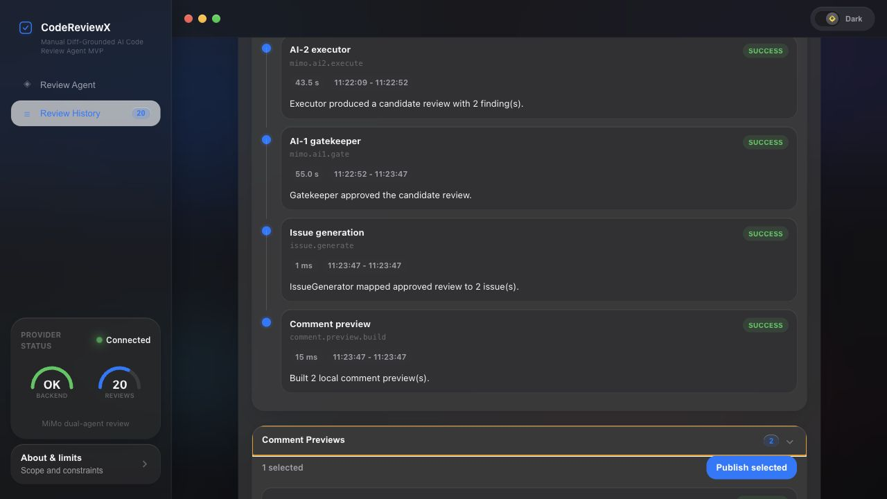

# CodeReviewX

[](https://github.com/alexbyte1334/CodeReviewX/actions/workflows/ci.yml)
[](LICENSE)
[](backend-java)
[](frontend)

面向 Java / Python 等项目的 **AI 辅助代码审查 Agent**。在本地创建审查任务，粘贴 PR 信息或直接提交 GitHub PR，获取结构化的风险等级、问题摘要与修复建议。

> 当前版本为可本地运行的 MVP：支持手动 diff 上下文、GitHub PR diff 自动拉取、小米 MiMo 双 AI agent、本地 comment preview 与人工确认后发布 GitHub PR 评论。



---

## 功能特性

- **审查任务管理** — 创建、列表、详情查询，任务与问题持久化到本地 H2 数据库
- **Diff 上下文** — 可选粘贴 unified diff（最大 20,000 字符），为 AI 审查提供代码变更依据
- **GitHub PR Diff Loader** — `GITHUB_PR` 模式自动拉取 PR files patch，按文件数和 diff 大小做安全限制
- **MiMo 双 AI agent** — AI-1 负责 task plan 与质量 gate，AI-2 负责执行审查，获批 JSON 由 IssueGenerator 生成 issues
- **Human-in-the-loop 评论发布** — 前端选择 comment preview，确认后调用 GitHub PR review comment API
- **Provider 命中反馈** — 每次审查返回 `requestedProvider`、`providerUsed`、`providerHit`
- **Fail fast** — 缺少 MiMo role key、模型 JSON 非法或 gate 拒绝时任务失败，不回退到 Mock
- **结构化输出** — 每条 issue 含 severity、category、文件路径、行号、标题、描述与建议
- **Web 界面** — React 前端展示审查摘要、风险等级、Provider 来源与 issue 卡片

---

## 技术栈

| 模块 | 技术 |
|---|---|
| 后端 | Spring Boot 3、Java 17、Maven、Spring Data JPA |
| 前端 | React 18、TypeScript、Vite |
| 数据库 | H2（本地文件模式，重启后数据保留） |
| AI Provider | 小米 MiMo OpenAI 兼容 API |

---

## 快速开始

### 环境要求

- Java 17（macOS 示例：`/opt/homebrew/opt/openjdk@17`）
- Node.js 18+
- Maven 3.8+

### 1. 启动后端

```bash
cd backend-java
JAVA_HOME=/opt/homebrew/opt/openjdk@17 mvn spring-boot:run
```

默认 Provider 为 **MiMo**。必须配置 `MIMO_PLANNER_API_KEY` 与 `MIMO_EXECUTOR_API_KEY`；缺少任一 key 时任务会 fail fast 并返回 `MIMO_AUTH_MISSING`。

服务地址：`http://localhost:8080`

健康检查：

```bash
curl http://localhost:8080/api/health
```

### 2. 启动前端

```bash
cd frontend
npm install
npm run dev -- --host 127.0.0.1
```

浏览器打开 [http://localhost:5173](http://localhost:5173)。

### 3. 启用小米 MiMo（推荐）

```bash
export MIMO_PLANNER_API_KEY="<your-planner-key>"
export MIMO_EXECUTOR_API_KEY="<your-executor-key>"

cd backend-java
JAVA_HOME=/opt/homebrew/opt/openjdk@17 mvn spring-boot:run
```

可复制根目录 `.env.example` 为本地 `.env` 参考变量名；`.env` 已被 `.gitignore` 排除，**请勿将真实 Key 写入仓库**。

| 环境变量 | 说明 | 默认值 |
|---|---|---|
| `MIMO_PLANNER_API_KEY` | AI-1 Planner/Gatekeeper MiMo API Key | — |
| `MIMO_EXECUTOR_API_KEY` | AI-2 Executor MiMo API Key | — |
| `MIMO_BASE_URL` | API 地址 | `https://api.xiaomimimo.com/v1` |
| `MIMO_MODEL` | 模型名称 | `mimo-v2.5-pro` |
| `MIMO_TIMEOUT_SECONDS` | 请求超时（秒） | `60` |
| `GITHUB_TOKEN` | GitHub PR metadata/diff 读取和 PR 评论发布 token | — |
| `GITHUB_MAX_CHANGED_FILES` | GitHub PR diff 最大变更文件数 | `50` |
| `GITHUB_MAX_DIFF_BYTES` | GitHub PR diff 最大输入大小 | `512000` |
| `GITHUB_PER_FILE_PATCH_MAX_BYTES` | 单文件 patch 截断阈值 | `20000` |
| `BACKEND_PORT` | 后端端口 | `8080` |

---

## API 概览

| 方法 | 路径 | 说明 |
|---|---|---|
| `GET` | `/api/health` | 健康检查 |
| `POST` | `/api/review-tasks` | 创建审查任务 |
| `GET` | `/api/review-tasks` | 任务列表 |
| `GET` | `/api/review-tasks/{id}` | 任务详情 |

**创建任务请求示例：**

```bash
curl -X POST http://localhost:8080/api/review-tasks \
  -H "Content-Type: application/json" \
  -d '{
    "repoUrl": "https://github.com/example/repo",
    "prNumber": 42,
    "diffText": "diff --git a/src/App.tsx b/src/App.tsx\n+const x = unsafe();\n"
  }'
```

不传 `diffText` 时默认进入 `GITHUB_PR` 模式：后端会使用 `GITHUB_TOKEN` 拉取 PR metadata 与 files patch，保存 sanitized snapshot summary，并把受限 diff 输入 MiMo 双 AI agent。

**响应要点：**

- 包含 `issueSummary`（总数、各级别计数、`riskLevel`）
- 含 `requestedProvider`、`providerUsed`、`providerHit`（Provider 是否命中）
- 每条 `issues[]` 含 `source`（新任务为 `MIMO`）、`severity`、`category`、`title` 等
- **不返回** 原始 `diffText`、GitHub token、完整 PR diff、prompt 或模型原始输出

更多接口细节见 [backend-java/README.md](backend-java/README.md)。

---

## Evals

```bash
node scripts/run-evals.mjs
```

默认离线跑 `evals/cases/` 的 baseline findings，并输出：

```text
evals/reports/latest.json
evals/reports/latest.md
```

当前评测覆盖 null pointer、secret-like config、SQL injection 三类小样本，指标包含 schema pass rate、expected finding hit rate、severity/category match、false positives 和 gate rejections。

---

## Security Checks

```bash
node scripts/static-scan.mjs
```

发布或演示前按 [docs/SECURITY_CHECKLIST.md](docs/SECURITY_CHECKLIST.md) 检查：本地 key 只放环境变量，GitHub token 使用 Contents read + Pull requests read/write + Metadata read 的最小权限，禁止提交 `.env`、本地 key 草稿、本地 H2 数据和构建产物。

静态分析说明见 [docs/STATIC_ANALYSIS.md](docs/STATIC_ANALYSIS.md)。本地统一入口会执行 secret scan、dependency hygiene scan，并在安装 Semgrep 时执行 `.semgrep.yml` 规则。

本机安装 Semgrep：

```bash
brew install semgrep
REQUIRE_SEMGREP=1 node scripts/static-scan.mjs
```

---

## 审查流程

```text
用户提交 repoUrl + prNumber [+ diffText]
        ↓
GITHUB_PR: github.pr.metadata.load → github.pr.diff.load
        ↓
ReviewPipelineService
        ↓
ConfigurableReviewProvider
        ↓
XiaomiMiMoReviewProvider
   ├─ AI-1 Planner: TaskPlan JSON
   ├─ AI-2 Executor: CandidateReview JSON
   └─ AI-1 Gatekeeper: GateDecision JSON
        ↓
IssueGenerator → 结构化 findings → comment preview → trace timeline → 返回 ReviewTaskResponse
```

---

## 对外展示重点

这个项目重点展示的是一个可解释、可验证、带人工确认动作的 AI Agent 工程闭环：

- **真实输入**：支持手动 diff，也支持通过 GitHub API 拉取 PR metadata 和 files patch。
- **双 Agent 审查**：AI-1 做 task plan 和 gate，AI-2 执行审查，避免单次模型输出直接落库。
- **结构化落库**：将获批 JSON 转换为 issue、summary、trace 和 comment preview。
- **可观测性**：保留 `github.pr.metadata.load -> github.pr.diff.load -> mimo.ai1.plan -> mimo.ai2.execute -> mimo.ai1.gate -> issue.generate -> comment.preview.build` 的安全摘要。
- **Human-in-the-loop**：只发布用户选择并确认过的 comment preview。
- **安全边界**：API 不返回 GitHub token、MiMo key、raw prompt、raw model output 或 raw full diff。

本地验收覆盖后端测试、前端类型检查/构建/测试、离线 eval、secret scan、dependency scan 和 Semgrep 静态分析。GitHub PR 模式需要有效 `GITHUB_TOKEN`；缺少 token 时会按设计返回 `GITHUB_AUTH_MISSING`，不会静默降级。

---

## 项目结构

```text
CodeReviewX/
├── backend-java/          # Spring Boot 后端
├── frontend/              # React 前端
├── docs/                  # 产品设计、架构与 API 文档
├── .env.example           # 环境变量模板
├── docker-compose.yml
└── .github/workflows/     # CI
```

---

## 运行测试

```bash
# 后端（129 tests）
cd backend-java
JAVA_HOME=/opt/homebrew/opt/openjdk@17 mvn test

# 前端（62 tests）
cd frontend
npm run typecheck
npm run build
npm test -- --run
```

---

## 当前限制

以下能力**尚未实现**，请勿在产品中误称已支持：

- OAuth / GitHub App
- 仓库 clone 与全量代码分析
- 将 Semgrep / dependency scan 结果自动并入 review task
- RAG、MCP、Function Calling
- 生产级认证与团队协作
- MySQL / PostgreSQL 生产数据库

GitHub PR 模式当前只读取 PR metadata 和 files patch，不 clone 仓库、不读取完整 repository context；超大 PR 会按安全限制截断或失败。

---

## 文档

| 文档 | 说明 |
|---|---|
| [backend-java/README.md](backend-java/README.md) | 后端 API、Provider 配置与持久化 |
| [frontend/README.md](frontend/README.md) | 前端开发与测试 |
| [docs/ARCHITECTURE.md](docs/ARCHITECTURE.md) | 系统架构 |
| [docs/PRD.md](docs/PRD.md) | 产品需求 |
| [docs/API.md](docs/API.md) | 当前 REST API |

---

## 许可证

本项目使用 [MIT License](LICENSE)。
