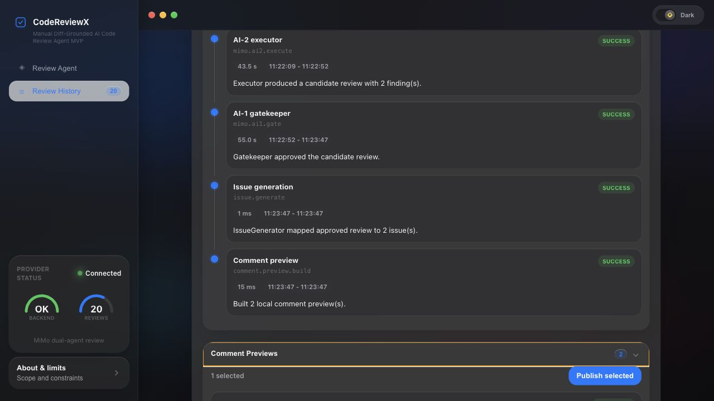
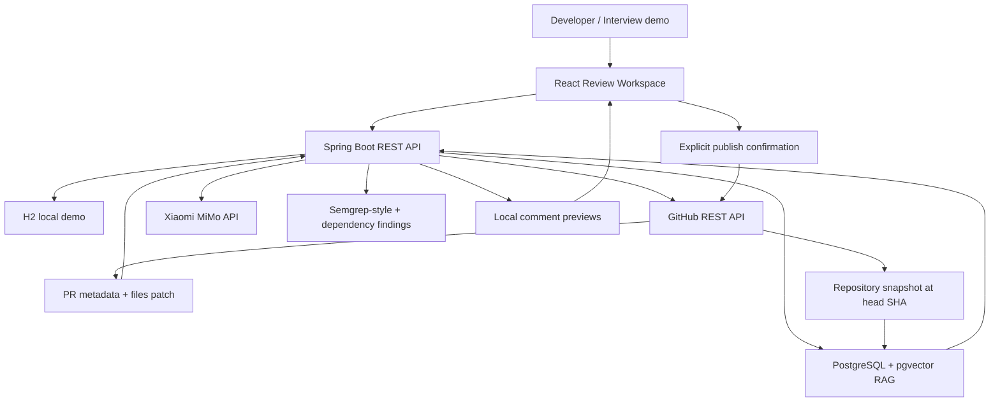
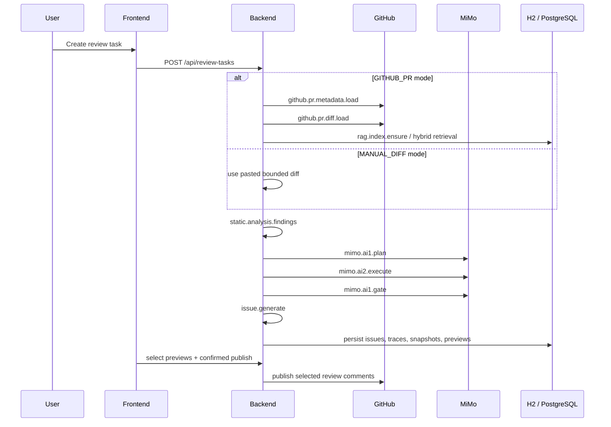

# CodeReviewX

[](https://github.com/alexbyte1334/CodeReviewX/actions/workflows/ci.yml)
[](LICENSE)
[](backend-java)
[](frontend)

## [▶ Open the Live Interview Demo](https://alexbyte1334.github.io/CodeReviewX/)

The interactive Story Mode is offline-safe: click **Start live demo** to walk through PR ingestion, hybrid RAG, dual-agent review, evidence gating, and human-approved GitHub comments without backend credentials.

面向 Java / Python 等项目的 **AI 辅助代码审查 Agent**。在本地创建审查任务，粘贴 PR 信息或直接提交 GitHub PR，获取结构化的风险等级、问题摘要与修复建议。Production profile 提供 PostgreSQL/pgvector full-repository hybrid RAG；默认 H2 demo profile 禁用 RAG，legacy bounded context 仅作为显式 fallback。

> 当前版本为可本地运行的 MVP：支持手动 diff、GitHub PR metadata/diff 自动拉取、commit-scoped full-repository hybrid RAG、小米 MiMo 双 AI agent、证据校验、Semgrep-style/dependency finding 合并、本地 comment preview 与人工确认后发布 GitHub PR 评论。

## 项目概览

| 维度 | 当前状态 |
|---|---|
| 本地体验 | H2 持久化的 React + Spring Boot 可运行 demo |
| AI 审查 | MiMo planner → executor → gatekeeper；gate 拒绝会 fail fast，不静默回退 |
| 生产 RAG | PostgreSQL/pgvector 混合检索、RRF、rerank、证据预算与 commit 隔离 |
| GitHub 集成 | PR metadata/diff 拉取、comment preview、人工确认后发布 |
| 工程门禁 | 后端/前端测试、离线 eval、Semgrep、secret/dependency scan、Docker build |
| 项目阶段 | 工程化 MVP；生产部署仍需外部 embedding/rerank、认证与托管密钥能力 |

**核心差异**：审查结论不是一次 LLM 调用直接落库，而是经过双 Agent 质量门禁、确定性 issue 转换、证据校验和人工发布确认；每一步都保留安全的 trace 摘要。

[快速开始](#快速开始) · [架构与工作逻辑](#架构与工作逻辑) · [运行测试](#运行测试) · [当前限制](#当前限制) · [完整文档](#文档)



生产 RAG 的索引、检索、rerank、证据门禁、灰度与回滚见 [`docs/RAG_OPERATIONS.md`](docs/RAG_OPERATIONS.md)；离线质量门禁见 [`docs/RAG_EVALUATION.md`](docs/RAG_EVALUATION.md)。

---

## 功能特性

- **审查任务管理** — 创建、列表、详情查询；默认 demo 持久化到本地 H2，production profile 持久化到 PostgreSQL
- **Diff 上下文** — 可选粘贴 unified diff（最大 20,000 字符），为 AI 审查提供代码变更依据
- **GitHub PR Diff Loader** — `GITHUB_PR` 模式自动拉取 PR files patch，按文件数和 diff 大小做安全限制
- **Full-repository Hybrid RAG** — production profile 按 PR head SHA 建立不可变全仓库快照，通过 pgvector + PostgreSQL FTS、RRF、rerank 和 evidence budget 为 MiMo 提供可验证上下文；bounded changed-file context 只用于禁用/降级路径
- **MiMo 双 AI agent** — AI-1 负责 task plan 与质量 gate，AI-2 负责执行审查，获批 JSON 由 IssueGenerator 生成 issues
- **Static Finding 合并** — 手动 diff 与 GitHub PR 变更会生成 Semgrep-style finding；GitHub PR changed-file context 会补充 dependency hygiene finding
- **Human-in-the-loop 评论发布** — 前端选择 comment preview，确认后调用 GitHub PR review comment API
- **Provider 命中反馈** — 每次审查返回 `requestedProvider`、`providerUsed`、`providerHit`
- **Fail fast** — 缺少 MiMo role key、模型 JSON 非法或 gate 拒绝时任务失败，不回退到 Mock
- **结构化输出** — 每条 issue 含 severity、category、文件路径、行号、标题、描述与建议
- **Web 界面** — React 前端展示审查摘要、风险等级、Provider 来源与 issue 卡片

---

## 技术栈

| 模块 | 技术 |
|---|---|
| 后端 | Spring Boot 3、Java 17、Maven、Spring Data JPA |
| 前端 | React 18、TypeScript、Vite |
| 数据库 | H2（本地 demo）；PostgreSQL + pgvector（production RAG profile） |
| AI Provider | 小米 MiMo OpenAI 兼容 API |

启用 production RAG 还需要 PostgreSQL/pgvector 与 embedding/rerank 供应商；完整环境变量、限制和降级语义见运行手册。

---

## 快速开始

### 环境要求

- Java 17（macOS 示例：`/opt/homebrew/opt/openjdk@17`）
- Node.js 18+
- Maven 3.8+

### 1. 启动后端

```bash
cd backend-java
JAVA_HOME=/opt/homebrew/opt/openjdk@17 mvn spring-boot:run
```

默认 Provider 为 **MiMo**。必须配置 `MIMO_PLANNER_API_KEY` 与 `MIMO_EXECUTOR_API_KEY`；缺少任一 key 时任务会 fail fast 并返回 `MIMO_AUTH_MISSING`。

服务地址：`http://localhost:8080`

健康检查：

```bash
curl http://localhost:8080/api/health
```

### Production-like RAG delivery stack

The repository includes reproducible backend/frontend images and a pgvector
compose stack. Configure `RAG_ENABLED=true`, `RAG_EMBEDDING_BASE_URL`,
`RAG_EMBEDDING_API_KEY`, `RAG_RERANK_BASE_URL`, and `RAG_RERANK_API_KEY` in a
local `.env` file, then run:

```bash
docker compose build
docker compose up -d postgres backend frontend
docker compose ps
bash scripts/rag-smoke.sh
```

`/actuator/health/liveness` only reports process liveness. Readiness checks
database, GitHub, embedding, and rerank independently; unavailable external
models leave the app running but keep readiness DOWN and `/api/health` reports
`ragReady=false`. The smoke script prints only opaque IDs and counts, never
keys or source excerpts. Install `jq` before running the smoke script; set
`RAG_SMOKE_REPO_URL`, `RAG_SMOKE_REF` (the PR head ref/SHA), and
`RAG_SMOKE_PR_NUMBER` for a real GitHub PR fixture. Read-only GET requests use
up to three shell-managed retries; index and review POST requests are never retried because
they create records. The review POST timeout defaults to 180 seconds for the
MiMo planner/executor path and can be overridden independently:

| Smoke variable | Purpose | Default |
|---|---|---|
| `RAG_SMOKE_CONNECT_TIMEOUT_SECONDS` | Connection timeout for all requests (1-60) | `5` |
| `RAG_SMOKE_GET_TIMEOUT_SECONDS` | GET and index-status request timeout (1-300) | `30` |
| `RAG_SMOKE_POST_TIMEOUT_SECONDS` | Index and publish POST request timeout (1-300) | `30` |
| `RAG_SMOKE_REVIEW_TIMEOUT_SECONDS` | Non-retried review POST timeout (1-1800) | `180` |
| `RAG_SMOKE_REQUEST_TIMEOUT_SECONDS` | Legacy fallback for GET/POST timeouts (1-300) | `30` |

Timeouts must be positive decimal integers. Leading zeroes are normalized before
use; zero, negative, non-numeric, and over-limit values fail before any request.

### 2. 启动前端

```bash
cd frontend
npm install
npm run dev -- --host 127.0.0.1
```

浏览器打开 [http://localhost:5173](http://localhost:5173)。

### 3. 启用小米 MiMo（推荐）

```bash
export MIMO_PLANNER_API_KEY="<your-planner-key>"
export MIMO_EXECUTOR_API_KEY="<your-executor-key>"

cd backend-java
JAVA_HOME=/opt/homebrew/opt/openjdk@17 mvn spring-boot:run
```

可复制根目录 `.env.example` 为本地 `.env` 参考变量名；`.env` 已被 `.gitignore` 排除，**请勿将真实 Key 写入仓库**。

| 环境变量 | 说明 | 默认值 |
|---|---|---|
| `MIMO_PLANNER_API_KEY` | AI-1 Planner/Gatekeeper MiMo API Key | — |
| `MIMO_EXECUTOR_API_KEY` | AI-2 Executor MiMo API Key | — |
| `MIMO_BASE_URL` | API 地址 | `https://api.xiaomimimo.com/v1` |
| `MIMO_MODEL` | 模型名称 | `mimo-v2.5-pro` |
| `MIMO_TIMEOUT_SECONDS` | 请求超时（秒） | `60` |
| `GITHUB_TOKEN` | GitHub PR metadata/diff 读取和 PR 评论发布 token | — |
| `GITHUB_MAX_CHANGED_FILES` | GitHub PR diff 最大变更文件数 | `50` |
| `GITHUB_MAX_DIFF_BYTES` | GitHub PR diff 最大输入大小 | `512000` |
| `GITHUB_PER_FILE_PATCH_MAX_BYTES` | 单文件 patch 截断阈值 | `20000` |
| `GITHUB_MAX_CONTEXT_FILES` | repository context index 最大文件数 | `8` |
| `GITHUB_PER_FILE_CONTEXT_MAX_BYTES` | 单文件 context 内容截断阈值 | `12000` |
| `GITHUB_MAX_CONTEXT_BYTES` | 单次 review context 总字节上限 | `48000` |
| `BACKEND_PORT` | 后端端口 | `8080` |

---

## API 概览

| 方法 | 路径 | 说明 |
|---|---|---|
| `GET` | `/api/health` | 健康检查 |
| `POST` | `/api/review-tasks` | 创建审查任务 |
| `GET` | `/api/review-tasks` | 任务列表 |
| `GET` | `/api/review-tasks/{id}` | 任务详情 |

**创建任务请求示例：**

```bash
curl -X POST http://localhost:8080/api/review-tasks \
  -H "Content-Type: application/json" \
  -d '{
    "repoUrl": "https://github.com/example/repo",
    "prNumber": 42,
    "diffText": "diff --git a/src/App.tsx b/src/App.tsx\n+const x = unsafe();\n"
  }'
```

不传 `diffText` 时默认进入 `GITHUB_PR` 模式：后端会使用 `GITHUB_TOKEN` 拉取 PR metadata 和 files patch，并保存 sanitized snapshot summary。Production profile 按 PR head SHA 使用 full-repository hybrid RAG 生成 evidence bundle；RAG 禁用或显式降级时才使用受限 changed-file context。MiMo 双 AI agent 始终接收 bounded diff 与当前路径对应的受控上下文。

**响应要点：**

- 包含 `issueSummary`（总数、各级别计数、`riskLevel`）
- 含 `requestedProvider`、`providerUsed`、`providerHit`（Provider 是否命中）
- 每条 `issues[]` 含 `source`（`MIMO`、`SEMGREP`、`DEPENDENCY`）、`severity`、`category`、`title` 等
- **不返回** 原始 `diffText`、GitHub token、完整 PR diff、prompt 或模型原始输出

更多接口细节见 [backend-java/README.md](backend-java/README.md)。

---

## 架构与工作逻辑


```mermaid
flowchart TD
    User["Developer / Interview demo"] --> Frontend["React Review Workspace"]
    Frontend --> Backend["Spring Boot REST API"]
    Backend --> H2["H2 local demo"]
    Backend --> PG["PostgreSQL + pgvector RAG"]
    Backend --> GitHub["GitHub REST API"]
    Backend --> MiMo["Xiaomi MiMo API"]
    GitHub --> Metadata["PR metadata + files patch"]
    GitHub --> Snapshot["Repository snapshot at head SHA"]
    Metadata --> Backend
    Snapshot --> PG
    PG --> Backend
    Backend --> Static["Semgrep-style + dependency findings"]
    Backend --> Preview["Local comment previews"]
    Preview --> Frontend
    Frontend --> Publish["Explicit publish confirmation"]
    Publish --> GitHub
```

核心边界：

- `MANUAL_DIFF`：只使用用户粘贴的 bounded unified diff，额外跑 Semgrep-style 启发式规则。
- `GITHUB_PR`：H2/local 模式保留 bounded changed-file fallback；production profile 按 head SHA 建立不可变全仓库快照，使用 pgvector + PostgreSQL FTS 混合召回、重排和 evidence gate。
- `MiMo`：AI-1 生成 plan 和 gate，AI-2 执行审查；只有 gate 通过的 JSON 会被 deterministic IssueGenerator 转为 issue。
- `Static Analysis`：当前请求链路内置轻量规则，生成 `SEMGREP` / `DEPENDENCY` source 的 persisted issue；项目级 `.semgrep.yml` 仍由本地/CI 静态扫描脚本执行。

## Review Pipeline


```mermaid
sequenceDiagram
    participant U as User
    participant FE as Frontend
    participant BE as Backend
    participant GH as GitHub
    participant MM as MiMo
    participant DB as H2 / PostgreSQL

    U->>FE: Create review task
    FE->>BE: POST /api/review-tasks
    alt GITHUB_PR mode
        BE->>GH: github.pr.metadata.load
        BE->>GH: github.pr.diff.load
        BE->>DB: rag.index.ensure / hybrid retrieval
    else MANUAL_DIFF mode
        BE->>BE: use pasted bounded diff
    end
    BE->>BE: static.analysis.findings
    BE->>MM: mimo.ai1.plan
    BE->>MM: mimo.ai2.execute
    BE->>MM: mimo.ai1.gate
    BE->>BE: issue.generate
    BE->>DB: persist issues, traces, snapshots, previews
    FE->>BE: select previews + confirmed publish
    BE->>GH: publish selected review comments
```

## 功能展示


- **Review Workspace**：左侧任务历史，右侧展示风险摘要、issue 列表、agent trace 和 comment preview。
- **Trace Timeline**：PostgreSQL RAG 成功路径记录 `github.pr.metadata.load -> github.pr.diff.load -> rag.index.ensure -> rag.query.build -> rag.retrieve.hybrid -> rag.rerank -> rag.context.assemble -> static.analysis.findings -> mimo.ai1.plan -> mimo.ai2.execute -> mimo.ai1.gate -> issue.generate -> evidence.validate -> comment.preview.build`；禁用或降级时会明确记录 bounded-context fallback。
- **Comment Preview**：所有建议先作为本地 draft 保存，只有用户选择并确认后才发布到 GitHub。
- **Source Provenance**：issue 来源可区分 `MIMO`、`SEMGREP` 和 `DEPENDENCY`，方便面试时解释 AI finding 与静态规则 finding 的边界。

---

## Evals

```bash
node scripts/run-evals.mjs
node scripts/run-rag-evals.mjs --self-test
node scripts/run-rag-evals.mjs
```

默认离线跑 `evals/cases/` 的 baseline findings，并输出：

```text
evals/reports/latest.json
evals/reports/latest.md
```

当前评测覆盖 null pointer、secret-like config、SQL injection 三类小样本，指标包含 schema pass rate、expected finding hit rate、severity/category match、false positives 和 gate rejections。

RAG 评测另外覆盖 vector + PostgreSQL FTS 等价双路召回、RRF、重排候选边界、commit 隔离、证据引用、上下文预算和降级 mutation gates。生产路径的数据库与容器验收必须再运行完整 Maven/Testcontainers、Compose build 和 `scripts/rag-smoke.sh`，离线报告不能替代真实 smoke。

---

## Security Checks

```bash
node scripts/static-scan.mjs
```

发布或演示前按 [docs/SECURITY_CHECKLIST.md](docs/SECURITY_CHECKLIST.md) 检查：本地 key 只放环境变量，GitHub token 使用 Contents read + Pull requests read/write + Metadata read 的最小权限，禁止提交 `.env`、本地 key 草稿、本地 H2 数据和构建产物。

静态分析说明见 [docs/STATIC_ANALYSIS.md](docs/STATIC_ANALYSIS.md)。本地统一入口会执行 secret scan、dependency hygiene scan，并在安装 Semgrep 时执行 `.semgrep.yml` 规则。

本机安装 Semgrep：

```bash
brew install semgrep
REQUIRE_SEMGREP=1 node scripts/static-scan.mjs
```

---

## 审查流程

```text
用户提交 repoUrl + prNumber [+ diffText]
        ↓
GITHUB_PR production: metadata/diff → rag.index.ensure → hybrid retrieval → rerank → evidence
GITHUB_PR disabled/degraded: metadata/diff → bounded repository.context.index fallback
MANUAL_DIFF: 使用 pasted bounded diff
        ↓
static.analysis.findings
        ↓
MiMo dual-agent: AI-1 plan → AI-2 execute → AI-1 gate
        ↓
IssueGenerator + static findings → evidence.validate → 结构化 issues → comment preview → trace timeline → 返回 ReviewTaskResponse
```

---

## 对外展示重点

这个项目重点展示的是一个可解释、可验证、带人工确认动作的 AI Agent 工程闭环：

- **真实输入**：支持手动 diff，也支持通过 GitHub API 拉取 PR metadata 和 files patch。
- **双 Agent 审查**：AI-1 做 task plan 和 gate，AI-2 执行审查，避免单次模型输出直接落库。
- **结构化落库**：将获批 JSON 转换为 issue、summary、trace 和 comment preview。
- **可复现仓库证据**：production profile 在受控工作区 shallow fetch/checkout 精确 commit，持久化 immutable chunks，并以 pgvector + FTS + RRF + rerank 生成带 path/line/chunkId 的 evidence；禁用或故障时才回退 bounded changed-file context。
- **多来源 finding**：MiMo finding 与 Semgrep-style/dependency finding 统一落库，保留 `source` 以解释来源。
- **可观测性**：production 路径保留 `github.pr.metadata.load -> github.pr.diff.load -> rag.index.ensure -> rag.query.build -> rag.retrieve.hybrid -> rag.rerank -> rag.context.assemble -> static.analysis.findings -> mimo.ai1.plan -> mimo.ai2.execute -> mimo.ai1.gate -> issue.generate -> evidence.validate -> comment.preview.build` 的安全摘要；fallback 另行标记。
- **Human-in-the-loop**：只发布用户选择并确认过的 comment preview。
- **安全边界**：API 不返回 GitHub token、MiMo key、raw prompt、raw model output 或 raw full diff。

本地验收覆盖后端测试、前端类型检查/构建/测试、离线 eval、secret scan、dependency scan 和 Semgrep 静态分析。GitHub PR 模式需要有效 `GITHUB_TOKEN`；缺少 token 时会按设计返回 `GITHUB_AUTH_MISSING`，不会静默降级。

---

## 项目结构

```text
CodeReviewX/
├── backend-java/          # Spring Boot 后端
├── frontend/              # React 前端
├── docs/                  # 产品设计、架构与 API 文档
├── .env.example           # 环境变量模板
├── docker-compose.yml
└── .github/workflows/     # CI
```

---

## 运行测试

```bash
# 后端（完整测试包含 PostgreSQL/pgvector Testcontainers，需要 Docker）
cd backend-java
JAVA_HOME=/opt/homebrew/opt/openjdk@17 mvn test

# 前端（当前 85 tests）
cd frontend
npm run typecheck
npm run build
npm test -- --run
```

---

## 当前限制

以下能力**尚未实现**，请勿在产品中误称已支持：

- OAuth / GitHub App
- 跨仓库知识图谱与历史 review memory
- MCP、Function Calling
- 生产级认证与团队协作
- 多租户生产认证、托管密钥与 GitHub App 安装

GitHub PR 的 production RAG profile 会安全 clone 指定 commit 并建立有界全仓库索引；它不会执行仓库代码。H2 profile 继续使用 changed-file fallback。超大仓库或 PR 会按文件、字节、chunk 和上下文预算截断或失败。

---

## 文档

| 文档 | 说明 |
|---|---|
| [backend-java/README.md](backend-java/README.md) | 后端 API、Provider 配置与持久化 |
| [frontend/README.md](frontend/README.md) | 前端开发与测试 |
| [docs/ARCHITECTURE.md](docs/ARCHITECTURE.md) | 系统架构 |
| [docs/PRD.md](docs/PRD.md) | 产品需求 |
| [docs/API.md](docs/API.md) | 当前 REST API |

---

## 许可证

本项目使用 [MIT License](LICENSE)。
