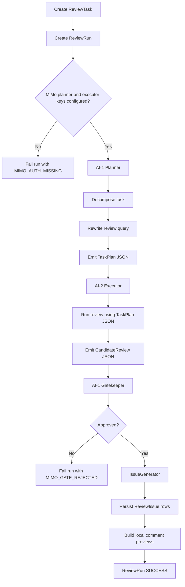

# MiMo Dual-AI Agent Update Guide

> 本文档是本次 agent 架构更新的权威目标文档。它覆盖旧文档中的
> "Mock first / mock fallback" 规则：本轮开始，CodeReviewX review agent
> 锁定使用 Xiaomi MiMo，不再提供 mock review 模式或 mock fallback。

## 1. 更新目标

1. 移除 review 主链路中的 mock 模式。
2. 使用用户本地提供的两个 MiMo API key 分别驱动两个 AI 角色。
3. ReviewTask 创建后进入双 AI 工作流：
   - AI-1: Planner + Gatekeeper。
   - AI-2: Executor。
   - IssueGenerator: 根据获批 JSON 生成最终 ReviewIssue。
4. AI-2 不能直接落库 issue；只有 AI-1 批准后的 JSON 才能进入 IssueGenerator。
5. API key 不进入源码、Git、日志、trace、数据库或 API 响应。

## 2. Key 配置约定

本地开发可从 `docs/mimo_api_key.md` 临时读取两个 key，但该文件必须保持未跟踪并被
`.gitignore` 忽略。

运行时环境变量如下：

| 环境变量 | 用途 |
|---|---|
| `MIMO_PLANNER_API_KEY` | AI-1 Planner + Gatekeeper |
| `MIMO_EXECUTOR_API_KEY` | AI-2 Executor |
| `MIMO_BASE_URL` | MiMo API base URL，默认使用现有配置 |
| `MIMO_MODEL` | MiMo 模型名，默认使用现有配置 |
| `MIMO_TIMEOUT_SECONDS` | MiMo 请求超时时间 |

兼容规则：

- 本轮目标要求两个角色都配置独立 key。
- 缺少任一 key 时，review run 必须 fail fast，不能 fallback 到 mock。
- `MIMO_API_KEY` 不再作为 review agent 配置入口；本轮必须使用两个 role key。

## 3. 工作流



## 4. JSON 合同

### 4.1 TaskPlan JSON

AI-1 Planner 必须返回严格 JSON object：

```json
{
  "taskId": 1,
  "repoUrl": "https://github.com/owner/repo",
  "prNumber": 12,
  "reviewMode": "MANUAL_DIFF",
  "query": "Review this PR for security, reliability, and maintainability risks.",
  "focusAreas": ["SECURITY", "BUG", "MAINTAINABILITY"],
  "constraints": [
    "Use only provided diff or bounded PR metadata.",
    "Do not invent files outside the available context.",
    "Return strict JSON only."
  ]
}
```

### 4.2 CandidateReview JSON

AI-2 Executor 必须返回严格 JSON object：

```json
{
  "summary": "Short review summary.",
  "findings": [
    {
      "severity": "HIGH",
      "category": "BUG",
      "filePath": "src/main/java/example/UserService.java",
      "startLine": 42,
      "endLine": 42,
      "title": "Potential null dereference",
      "description": "The value can be null before use.",
      "recommendation": "Add a null check or validate the input earlier."
    }
  ]
}
```

### 4.3 GateDecision JSON

AI-1 Gatekeeper 必须返回严格 JSON object：

```json
{
  "approved": true,
  "reason": "Candidate review follows the task plan and schema.",
  "requiredChanges": []
}
```

## 5. IssueGenerator 边界

IssueGenerator 是普通后端组件，不调用 LLM。它只负责：

1. 校验已获批 CandidateReview JSON。
2. 为 finding 生成稳定 `issueKey`，如 `MIMO-ISSUE-1`。
3. 填充 `IssueSource.MIMO`、`IssueStatus.OPEN`、severity、category、文件和行号。
4. 返回 `ReviewFinding` 或 `ReviewIssueEntity` 的内部结构供 service 落库。

IssueGenerator 不负责：

- 调用 MiMo。
- 修改 AI-1 / AI-2 输出。
- 接受未获批 JSON。
- 写入 API key、raw prompt 或 raw model output。

## 6. 错误策略

| 场景 | 结果 |
|---|---|
| 缺少 planner key | run/task failed, `MIMO_AUTH_MISSING` |
| 缺少 executor key | run/task failed, `MIMO_AUTH_MISSING` |
| AI-1 TaskPlan JSON 非法 | run/task failed, `MIMO_PLAN_INVALID` |
| AI-2 CandidateReview JSON 非法 | run/task failed, `MIMO_REVIEW_INVALID` |
| AI-1 GateDecision JSON 非法 | run/task failed, `MIMO_GATE_INVALID` |
| AI-1 不批准 AI-2 输出 | run/task failed, `MIMO_GATE_REJECTED` |
| MiMo 网络或服务错误 | run/task failed, `MIMO_PROVIDER_ERROR` |

本轮不做自动 mock fallback，不做无限重试。后续可增加一次修正重试，但必须另行更新文档。

## 7. Cursor / Qoder 分工

### Cursor 执行任务

Cursor 负责实现代码变更：

1. 移除 review 主链路 mock fallback。
2. 增加双 MiMo key 配置。
3. 增加 AI-1 Planner、AI-2 Executor、AI-1 Gatekeeper 组件。
4. 增加 IssueGenerator，并让 ReviewTaskService 只持久化获批结果。
5. 更新前端文案，移除 mock 模式提示。
6. 更新单元测试和必要的集成测试。

### Qoder 审查任务

Qoder 负责只读审查：

1. 确认 AI-2 不能绕过 AI-1 gate 直接生成 issue。
2. 确认缺 key、非法 JSON、gate 拒绝都 fail fast。
3. 确认没有 key 泄露到源码、日志、trace、数据库或 API。
4. 确认旧 mock provider 不再处于可达 review 主链路。
5. 确认测试覆盖新增架构边界。

### Codex 验收任务

Codex 负责仓库级验证：

1. 检查文档、代码、测试是否与本指南一致。
2. 分别使用两个本地 MiMo key 进行配置验证。
3. 运行后端测试、前端测试和必要 runtime smoke。
4. 输出最终 handoff，包含命令、结果、风险和未解决项。

## 8. 验收标准

1. `docs/mimo_api_key.md` 被 `.gitignore` 忽略，且不进入 Git。
2. 代码中不存在可配置切换到 mock 的 review 主链路。
3. 缺少任一 MiMo role key 时，创建 ReviewTask 返回 failed 状态和明确错误码。
4. 正常配置两个 key 后，ReviewTask 经过 AI-1 plan、AI-2 execute、AI-1 gate、IssueGenerator。
5. 持久化 issue 的 `source` 为 `MIMO`。
6. provider trace / tool trace / API response 不包含 API key、raw prompt 或 raw output。
7. 后端和前端测试通过。
8. runtime smoke 能证明新 agent 落地到应用创建任务链路。
